# Icon buttons

Icon buttons help people take actions with a single tap

Icon buttons can be a wide variety of sizes, shapes, and colors. When placed in a button group, adjacent icon buttons respond to one another when pressed.

## Usage

Use icon buttons to display common actions. There are two variants: **default** and **toggle**. 

- Default icon buttons can open other elements, such as a Menus display a list of choices on a temporary surface. More on menus [More on menus](/m3/pages/menus/overview) or Search lets people enter a keyword or phrase to get relevant information. More on search [More on search](/m3/pages/search/overview).
- Toggle icon buttons can represent binary actions that can be toggled on and off, such as **favorite** or **bookmark**. Icon buttons can be placed directly on the background or in most container components, such as cards [More on cards](/m3/pages/cards/overview), app bars [More on app bars](/m3/pages/app-bars/overview), and toolbars [More on toolbars](/m3/pages/toolbars/overview). Multiple icon buttons can be placed in a standard button group to add interaction and motion between the buttons when pressed. [More about standard button groups](/m3/pages/button-groups/overview)

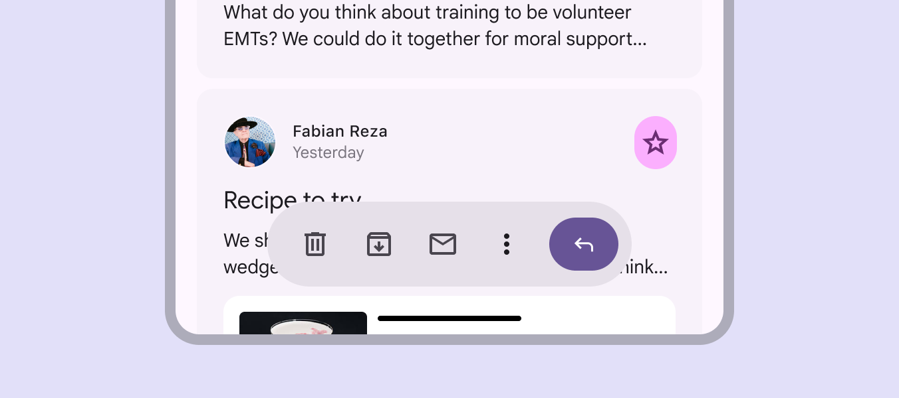

Icon buttons can be used within other components, such as in a toolbar or card

### Color

There are four icon button color styles, in order of emphasis:

1. Filled
2. Tonal
3. Outlined
4. Standard

For the highest emphasis, use the filled style. For the lowest emphasis, use standard.

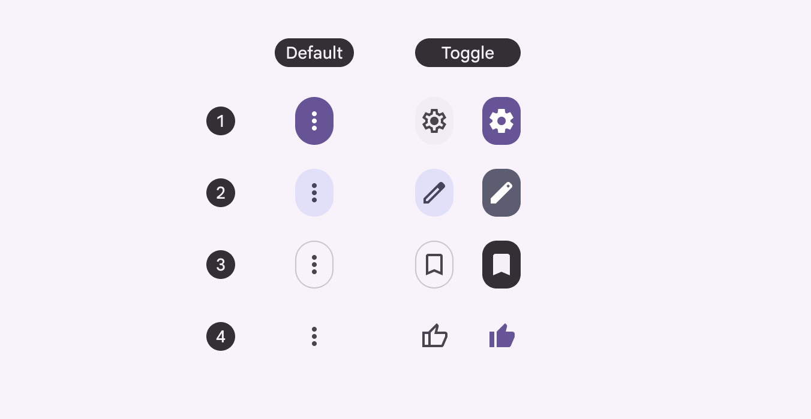

The default (left) and toggle (right) icon buttons are available in all four color styles

Use a filled, tonal, or outlined icon button when the button needs more visual separation from the background. Choose the right style and emphasis for the situation.

check Do

Use icons with a background to make them easy to see on any surface

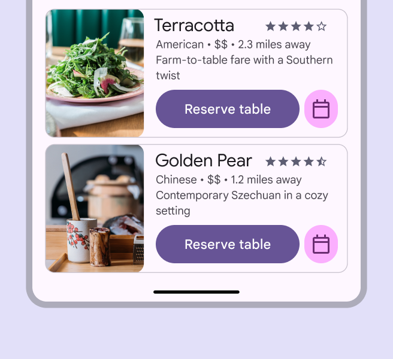

check Do

When mixing button variants, use color styles to make the primary action clear

Use the **filled** style for visual impact and key actions that require high emphasis. Avoid overusing the filled style on a screen. Use them sparingly. Use filled icon buttons for high emphasis actions, such as downloading or deleting

Use the **tonal** style as a middle ground between filled and outlined icon buttons. It’s useful for secondary actions paired with a high emphasis action. For example, use the tonal style for actions like **Raise hand** in a video meeting. When selected, its visual emphasis is greater than the outlined menu button, but less than the filled **End call** button.

Leverage the different color styles to establish emphasis and direct people to important actions

Use the **outlined** style for medium-emphasis buttons. It’s useful when the button isn’t the main focus of the interaction, such as browsing through sets of cards. Use the **standard** style for low-emphasis buttons, or when placing buttons on a colorful surface.

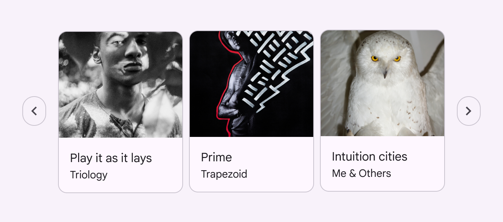

Outlined buttons indicate that more content is available without grabbing attention

### Size & width

Icon buttons are available in five different sizes:

- Extra small - 32dp
- Small - 40dp (default)
- Medium - 56dp
- Large - 96dp
- Extra large - 136dp

And three widths:

- Default
- Narrow
- Wide

Use size and width to provide emphasis and visual hierarchy in a page with multiple buttons. The main action should be the most visually prominent, whether through color or size, like starting and stopping a timer or playing and pausing a song.

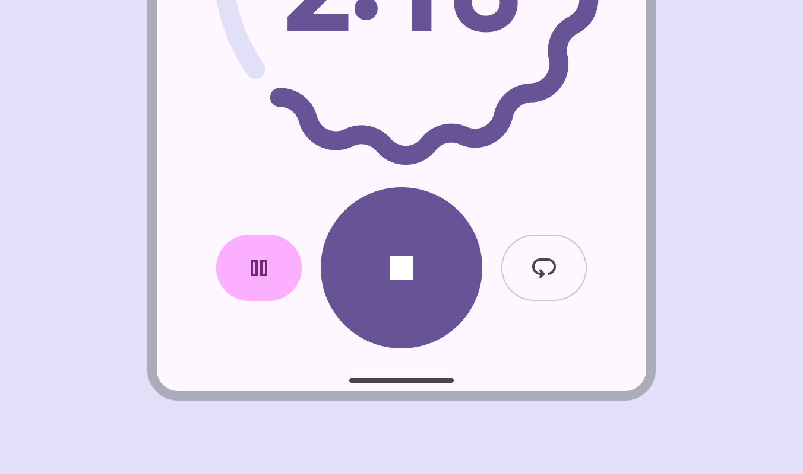

Use different button colors and sizes to provide visual hierarchy and emphasize primary actions

Not all icon buttons will need to emphasize a primary and secondary action. When buttons have a similar importance, they should be the same size.

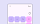

When everything should have the same emphasis, use icon buttons that are the same size

## Anatomy

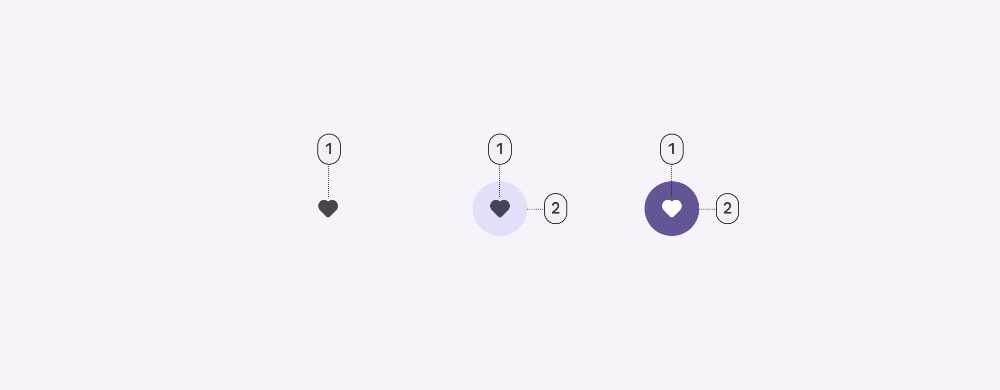

1. Icon
2. Container

### Icon

Icons visually communicate the button’s action. Their meaning should be clear and unambiguous. [Browse popular icons](https://fonts.google.com/icons)

Default icon buttons should use filled icons. Toggle buttons should use an outlined icon when unselected, and a filled version of the icon when selected. 

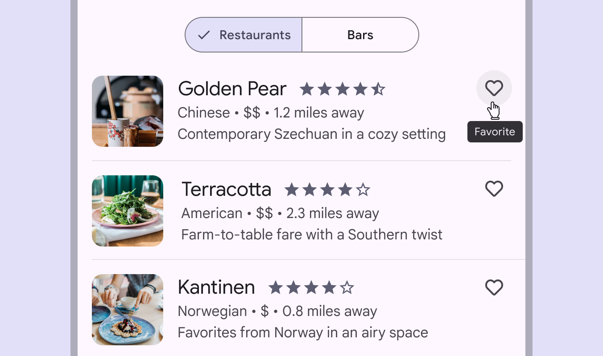

Ensure the meaning of the icon is clear, such as a heart indicating Favorite

#### Icon accessibility requirements

For selected toggle buttons, if a filled version of an icon doesn’t exist, increase the icon weight to semibold. If semibold doesn’t provide enough visual change, use bold. This is to ensure that selection is communicated through at least two properties, rather than just color. This requirement doesn't apply to default non-toggle buttons.

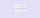

Icons without a fill should be semibolded when selected

### Container

The container provides increased contrast and hierarchy in places that need more visual separation from the background or other elements. 

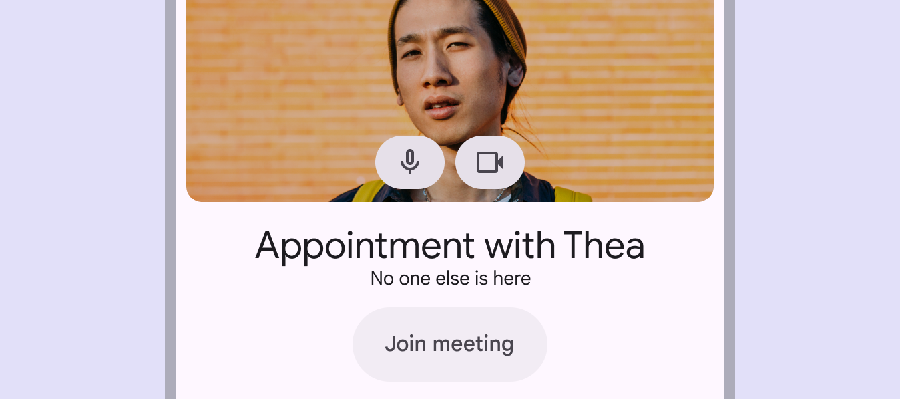

The container provides visual separation from the background image

## Placement

Icon buttons are commonly used in other components, such as app bars [More on app bars](/m3/pages/app-bars/overview) and cards [More on cards](/m3/pages/cards/overview). These buttons should be used for common, easily understandable actions. Only use a few icon buttons at once.

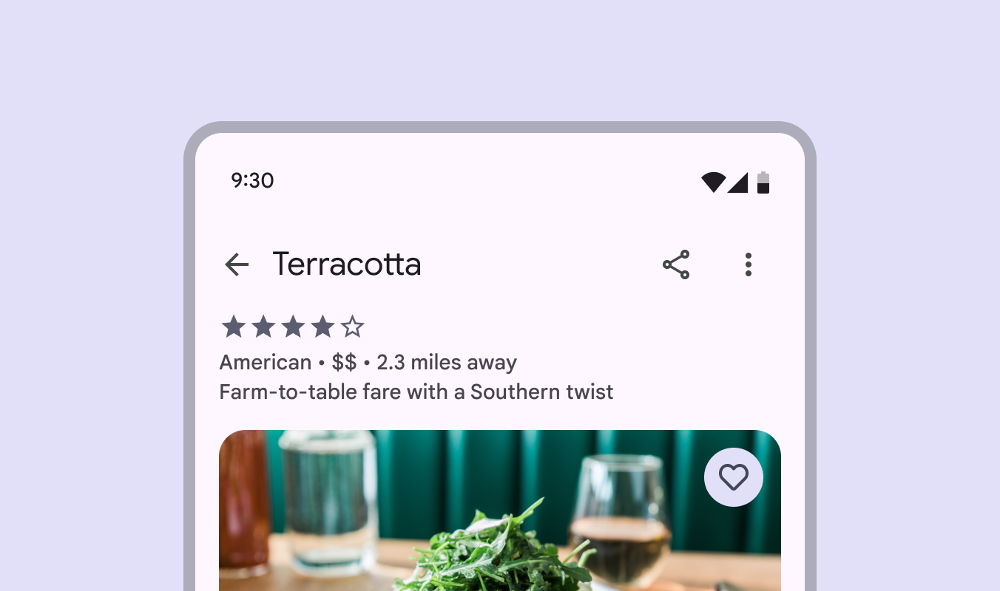

App bars often contain icon buttons

In dense layouts, group popular actions by placing many icon buttons next to each other in components like a toolbar [More on toolbars](/m3/pages/toolbars/overview) or button group [More on button groups](/m3/pages/button-groups/overview). These components draw attention or add interaction between buttons.

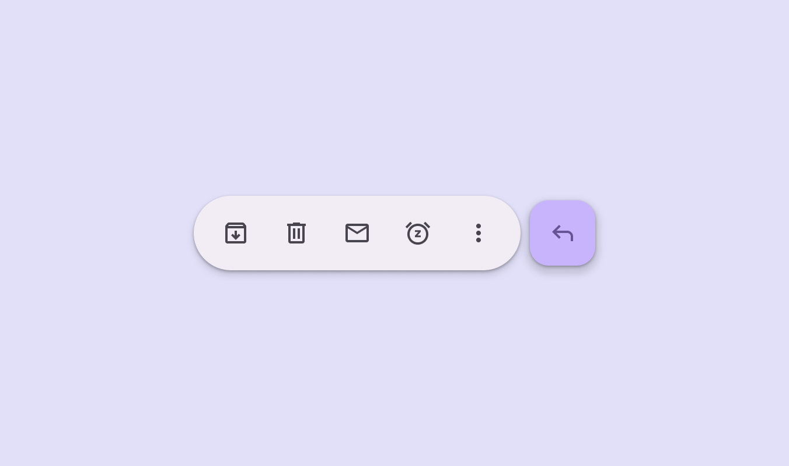

A toolbar is a collection of icon buttons and other components

## Behavior

### Hover

On hover, the icon button displays a tooltip describing its action, rather than the name of the icon itself. The tooltip label text should be clear and concise

### Selection

Toggle icon buttons allow a single choice to be selected or deselected, such as adding or removing something from favorites. When placed in a button group [More on button groups](/m3/pages/button-groups/overview), icon buttons change shape to help the selected button stand out.

[More on button groups](/m3/pages/button-groups/overview)

check Do

Use toggle icon buttons when the icon can be selected

close Don’t

Don’t use toggle icon buttons for actions that don’t have a selected state, such as an icon button for an overflow menu

The icon should become filled to represent selection. If a filled version of the icon doesn't exist, use semibold weight instead. When making a selection, such as bookmarking or saving a video, the icon transitions from outlined (unselected) to filled (selected)

