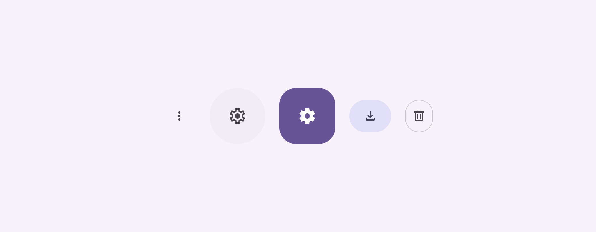
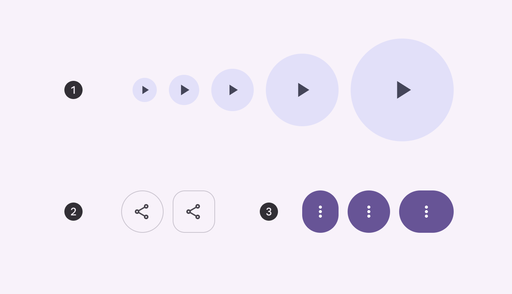
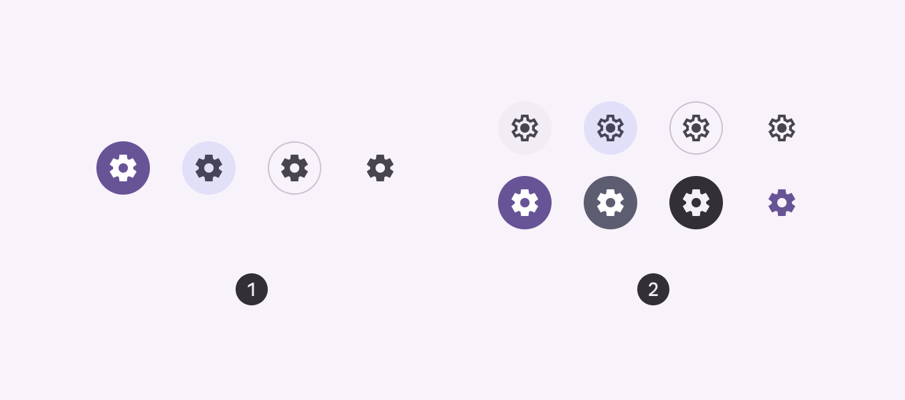

# Icon buttons

Icon buttons help people take actions with a single tap

- Icon buttons must use a system icon with a clear meaning
- Two variants: default and toggle
- Many configurations: Color, size, width, and shape
- On web, display a tooltip describing the action while hovering
- In toggle buttons, use the outlined style of an icon for the unselected state, and the filled style for the selected state

Standard, filled unselected, filled selected, filled tonal, and outlined icon buttons

## Availability & resources

| Type | Resource | Status |
| --- | --- | --- |
| Design | [Design Kit (Figma)](https://www.figma.com/community/file/1035203688168086460) | Available |
| Implementation |  | Available |
| Implementation | [Jetpack Compose](https://developer.android.com/develop/ui/compose/components/icon-button) | Available |
| Implementation | [Jetpack Compose: Expressive](https://developer.android.com/reference/kotlin/androidx/compose/material3/package-summary#IconButton\(kotlin.Function0,androidx.compose.ui.Modifier,kotlin.Boolean,androidx.compose.material3.IconButtonColors,androidx.compose.foundation.interaction.MutableInteractionSource,androidx.compose.ui.graphics.Shape,kotlin.Function0\)) | Available |
| Implementation |  | Available |
| Implementation |  | Available |
| Implementation |  | Available |

## M3 Expressive update

**May 2025**

Icon buttons now have a wider variety of shapes and sizes, changing shape when selected. When placed in button groups [More on button groups](/m3/pages/button-groups/overview), icon buttons interact with each other when pressed. [More on M3 Expressive](https://m3.material.io/blog/building-with-m3-expressive)

Variants and naming:

- Default and toggle (selection)
- Color styles are now configurations. (filled, tonal, outlined, standard)

Shapes:

- Round and square options
- Shape morphs when pressed
- Shape morphs when selected

Sizes:

- Extra small
- Small (default)
- Medium
- Large
- Extra large

Widths: 

- Narrow
- Default
- Wide

1. Five sizes
2. Two shapes
3. Three widths

## Differences from M2

- **Color:** New color mappings and compatibility with dynamic color
- **Variants and naming:** Icon buttons were called toggle buttons. There are now two variants of icon buttons: default and toggle.

1. Default icon buttons
2. Toggle icon buttons

