# Icon buttons

Icon buttons help people take actions with a single tap

## Variants

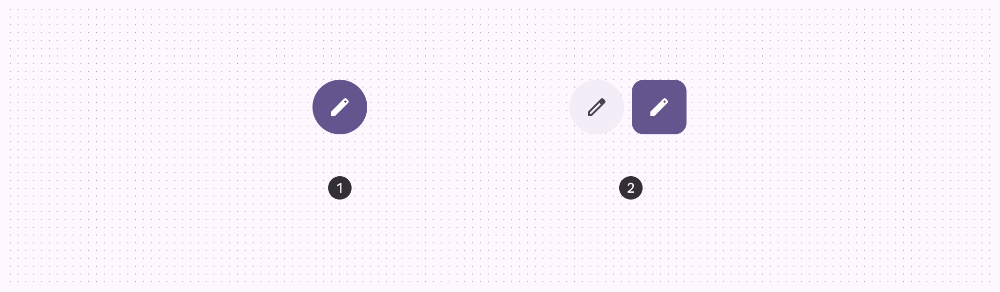

1. Default icon button
2. Toggle icon button

|
Variant

 |

M3

 |

M3 Expressive

 |
| --- | --- | --- |
|

Default

 |

Available

 |

Available

 |
|

Toggle (selection)

 |

Available

 |

Available

 |

## Configurations

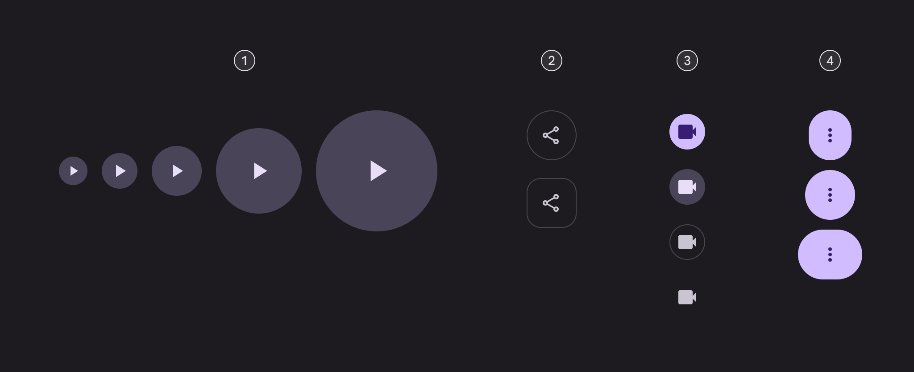

1. Five sizes
2. Two shapes
3. Four color styles
4. Three widths

|
Category

 |

Options

 |

M3

 |

M3 Expressive

 |
| --- | --- | --- | --- |
|

Size

 |

Small (default)

 |

Available

 |

Available

 |
|

XS, M, L, XL

 |

\--

 |

Available

 |
|

Shape

 |

Round (default)

 |

Available

 |

Available

 |
|

Square

 |

\--

 |

Available

 |
|

Color

 |

Filled (default), tonal, outlined, standard

 |

Available

 |

Available

 |
|

Width

 |

Default

 |

Available

 |

Available

 |
|

Narrow, wide

 |

\--

 |

Available

 |

## Tokens & specs

Icon button token sets are organized by common tokens, color, and size. Select the token set from the table’s menu. [Learn about design tokens](/m3/pages/design-tokens/overview/)

```
Icon button - Color - Filled
```

```
Icon button - Color - Filled
```

```
Icon button - Color - Filled
```

```
Icon button - Color - Filled
```

Icon button - Color - Filled

Token

Default, Light

Enabled

Disabled

Hovered

Focused

Pressed

## Anatomy

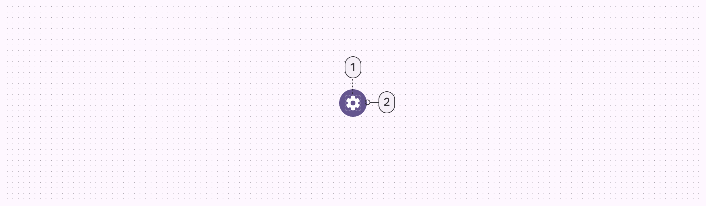

1. Icon
2. Container

## Color

Color values are implemented through design tokens [More on tokens](/m3/pages/design-tokens/overview). For designers, this means working with color values that correspond with tokens; in implementation, a color value will be a token that references a value. There are four built-in color styles: filled, tonal, outlined, and standard. Default and toggle buttons use different color roles per style.

star

Note:

These color roles were chosen to create design coherence and familiarity. Other color roles can be used as long as the container and text have a 3:1 contrast ratio. For example, tertiary and on tertiary.

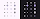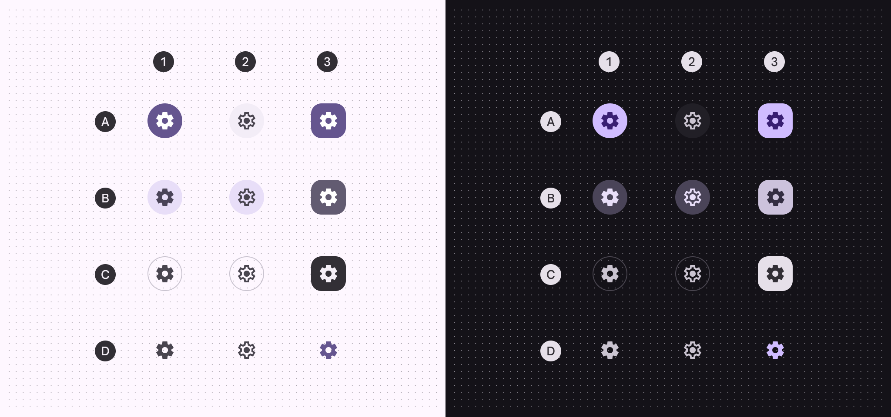

A: Filled, B: Tonal, C: Outlined, D: Standard

1. Default
2. Toggle, unselected
3. Toggle, selected

|
 |

1\. Default

 |

2\. Toggle, unselected

 |

3\. Toggle, selected

 |
| --- | --- | --- | --- |
|

Filled container

Filled icon

 |

Primary


On primary

 |

Surface container

On surface variant

 |

Primary

On primary

 |
|

Tonal container

Tonal icon

 |

Secondary container

On secondary container

 |

Secondary container

On secondary container

 |

Secondary

On secondary

 |
|

Outlined container

Outlined icon

 |

Outline variant (outline)

On surface variant

 |

Outline variant (outline)

On surface variant

 |

Inverse surface

Inverse on surface

 |
|

Standard icon

 |

On surface variant

 |

On surface variant

 |

Primary

 |

## States [More on states](/m3/pages/interaction-states/overview) are visual representations used to communicate the status of a component or interactive element. State layers slightly change button color. Disabled states have different base colors. [View tokens for details](/m3/pages/design-tokens/overview)

### Filled button states

#### Default

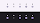

1. Enabled
2. Disabled (10% state layer)
3. Hovered (8% state layer)
4. Focused (10% state layer)
5. Pressed (10% state layer)

#### Toggle

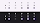

A: Unselected. B: Selected

1. Enabled
2. Disabled (10% state layer)
3. Hovered (8% state layer)
4. Focused (10% state layer)
5. Pressed (10% state layer)

### Tonal button states

#### Default

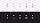

1. Enabled
2. Disabled (10% state layer)
3. Hovered (8% state layer)
4. Focused (10% state layer)
5. Pressed (10% state layer)

#### Toggle

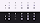

A: Unselected. B: Selected

1. Enabled
2. Disabled (10% state layer)
3. Hovered (8% state layer)
4. Focused (10% state layer)
5. Pressed (10% state layer)

### Outlined button states

#### Default

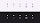

1. Enabled
2. Disabled (10% state layer)
3. Hovered (8% state layer)
4. Focused (10% state layer)
5. Pressed (10% state layer)

#### Toggle

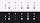

A: Unselected. B: Selected

1. Enabled
2. Disabled (10% state layer)
3. Hovered (8% state layer)
4. Focused (10% state layer)
5. Pressed (10% state layer)

### Standard icon button states

The standard icon button’s container is invisible at rest, but visible when the state layer is applied.

#### Default

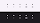

1. Enabled
2. Disabled (10% state layer)
3. Hovered (8% state layer)
4. Focused (10% state layer)
5. Pressed (10% state layer)

#### Toggle

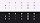

A: Unselected. B: Selected

1. Enabled
2. Disabled (10% state layer)
3. Hovered (8% state layer)
4. Focused (10% state layer)
5. Pressed (10% state layer)

## Shape morph

### Pressed state

While pressed, icon buttons can morph to become more square. Both round and square icon buttons should have the same pressed shape radius. The corner radius value differs for each button size. [See full icon button corner measurements](/m3/pages/icon-buttons/specs#b3df1f02-d313-44e9-9542-37f7e0e24dc7)

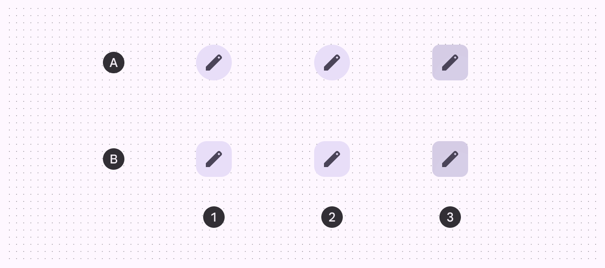

A. Round, B. Square

1. Enabled
2. Hovered
3. Pressed

### When selected

In addition to changing shape when pressed, toggle icon buttons also change the resting shape from round (unselected) to square (selected) by default. If the resting shape is square, the selected shape should be round.

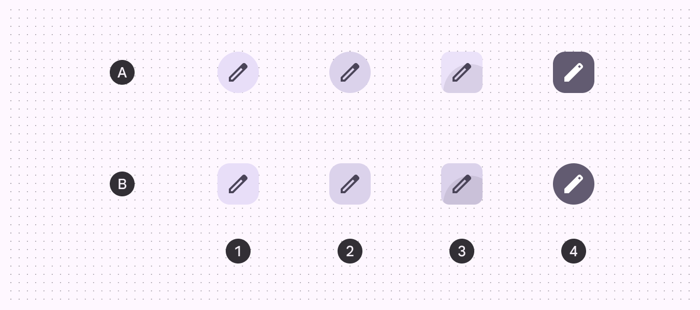

A. Round, B. Square

1. Enabled
2. Hovered
3. Pressed
4. Selected

## Measurements

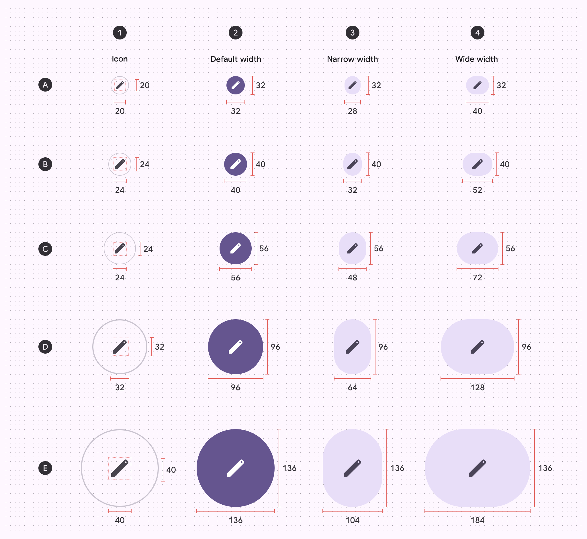

A. Extra small  B. Small  C. Medium  D. Large  E. Extra large

1. Icon size
2. Default width size
3. Narrow width size
4. Wide width size

### Target sizes

Extra small and small icon buttons must have a target size of 48x48dp or larger to be accessible.

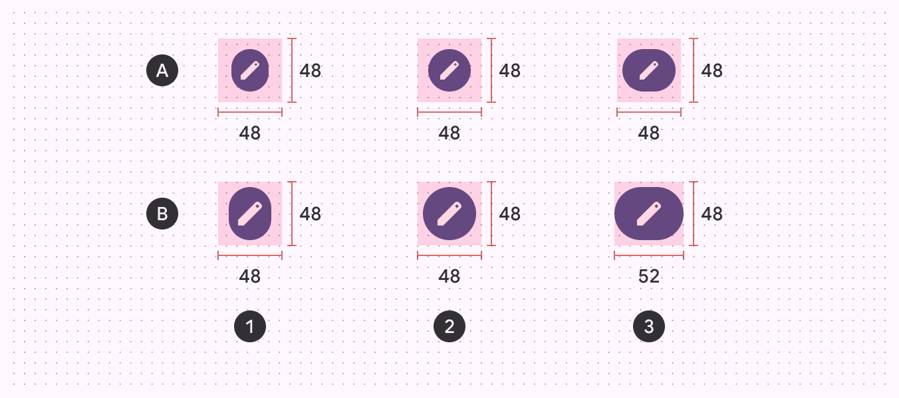

A. Extra small icon button size  B. Small icon button size

1. Narrow width
2. Default width
3. Wide width

### Button corner radius

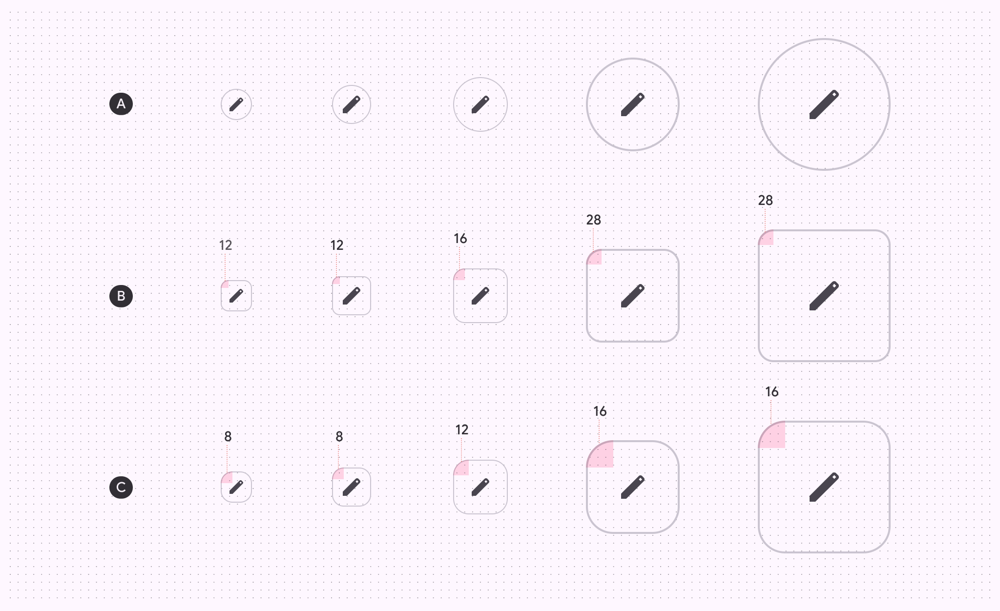

|
 | XS | S | M | L | XL |
| --- | --- | --- | --- | --- | --- |
| A. Round button | Full | Full | Full | Full | Full |
| B. Square button | 12dp | 12dp | 16dp | 28dp | 28dp |
| C. Pressed state | 8dp | 8dp | 12dp | 16dp | 16dp |

## Baseline tokens

Use the table's menu to select a token set. Filled, tonal, and outlined icon button tokens are now deprecated in favor of the new token sets. All other tokens are still available in the module at the top of the page.

\[Deprecated\] Icon button - Filled

Token

Default, Light

\[Deprecated\] Enabled

\[Deprecated\] Disabled

\[Deprecated\] Hovered

\[Deprecated\] Focused

\[Deprecated\] Pressed (ripple)

