# Lists

Lists are continuous, vertical indexes of text and images

## Use cases

People should be able to do the following with assistive technology:

- Navigate to a list item
- Select a list item

## Indicate selection with more than color

To make selected items clear for everyone, don't rely on color as the only visual cue. Use an additional indicator that an item is selected such as:

- Radio buttons [More on radio buttons](/m3/pages/radio-button/overview) or checkboxes [More on checkboxes](/m3/pages/checkbox/overview)
- Leading or trailing icons
- A visual style not related to color, like underlined text

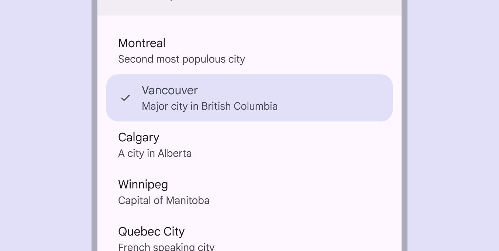

Use two visual cues to show a list item is selected, like a leading checkmark and filled color

## Interaction & style

### Touch

When a person taps on a list item, a touch ripple appears, indicating interaction feedback. A ripple appears when a person taps on a list item to select it

### Cursor

When hovered, the hover [More on hover state](/m3/pages/interaction-states/applying-states#71c347c2-dd75-485b-892e-04d2900bd844) state provides a visual cue that a list item is interactive.

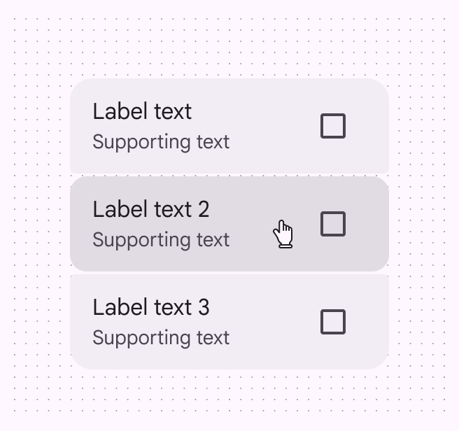

Cursor: Hover

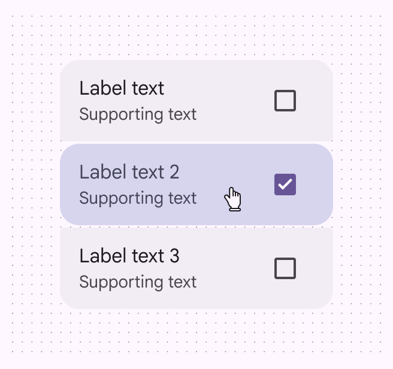

Cursor: Selected

### Keyboard & switch

When a person tabs to a single-action list, a focus indicator appears, providing a visual cue that the first list item is now focused [More on focused state](/m3/pages/interaction-states/applying-states#bc6d6853-48ef-490e-8076-448e89e69f0f) and action can be taken. When a person interacts with the focused list item via **Space** or **Enter**, the action is performed.

**Tab** key navigates to the list. **Space** or **Enter** keys activate items.

## Focus

### Single-action lists

The first element in a list should always receive focus, unless the list has a selected element. In that case, focus should go to the selected list item instead. After an element is focused [More on focused state](/m3/pages/interaction-states/applying-states#bc6d6853-48ef-490e-8076-448e89e69f0f), a person should be able to navigate within the list using arrow keys.

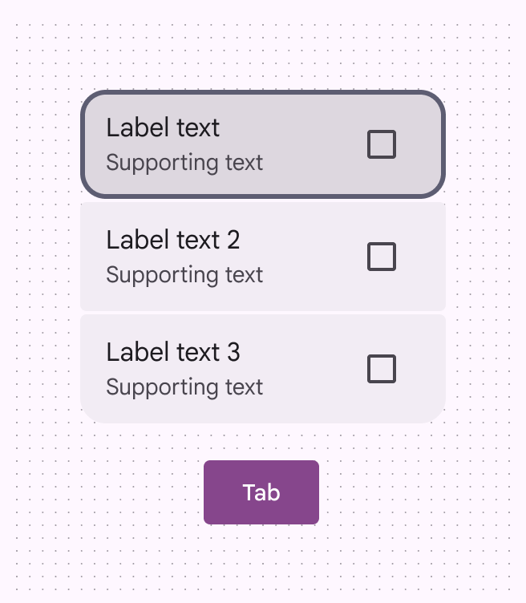

**Tab** key focuses on the first item or the selected item

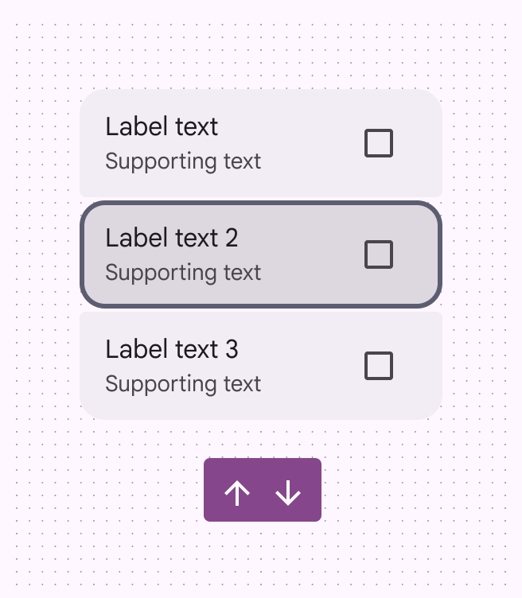

**Arrow** keys navigate up and down through list items

All list items must be able to be activated using the **Space** or **Enter** key.



[More on single-action lists](/m3/pages/lists/guidelines#3e45f939-457a-44a8-8551-a2354c521d26)

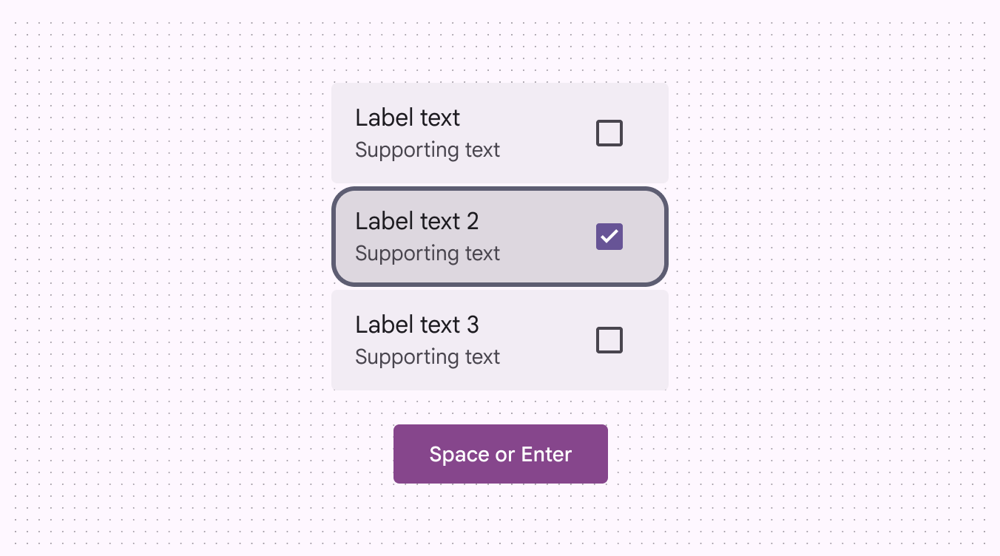

**Space** or **Enter** keys activate an element in a list

### Multi-action lists

Multi-action list items contain a primary action and at least one supplementary action. The list item as a whole isn't selectable; only the individual actions are. A person should be able to use a keyboard to:

- **Tab** to the list item, which focuses the first element
- Move between between all focusable elements in the list using the **Up**, **Down**, **Left**, and **Right** arrow keys
- Activate a focused element using **Space** or **Enter**

[More on multi-action lists](/m3/pages/lists/guidelines#db85439b-0e67-43b0-a2dc-61395738af64)

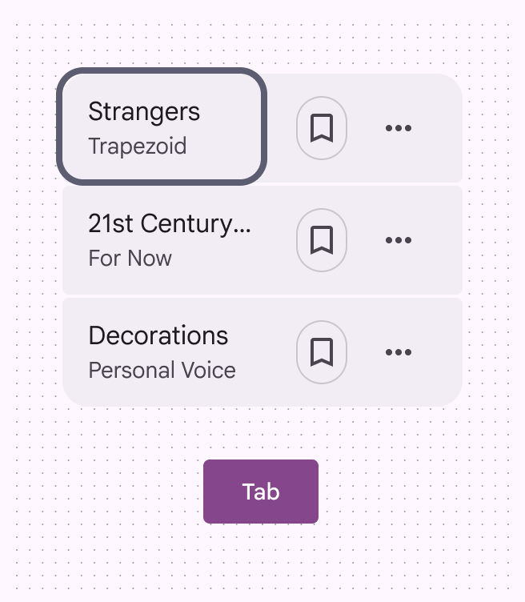

**Tab** brings the focus to the first action

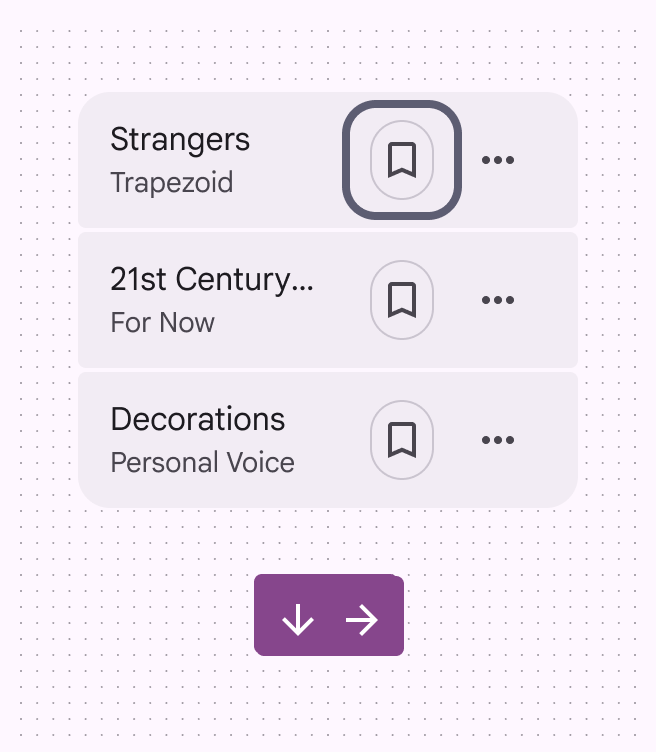

**Down** and **Right** arrow keys move focus to the next action of the list item, or to the first action in the next item

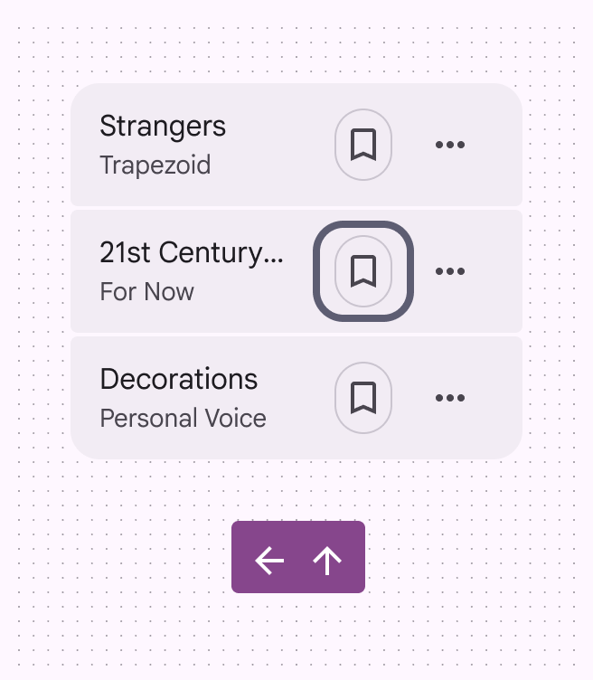

**Up** and **Left** arrow keys move focus to the previous action of the list item

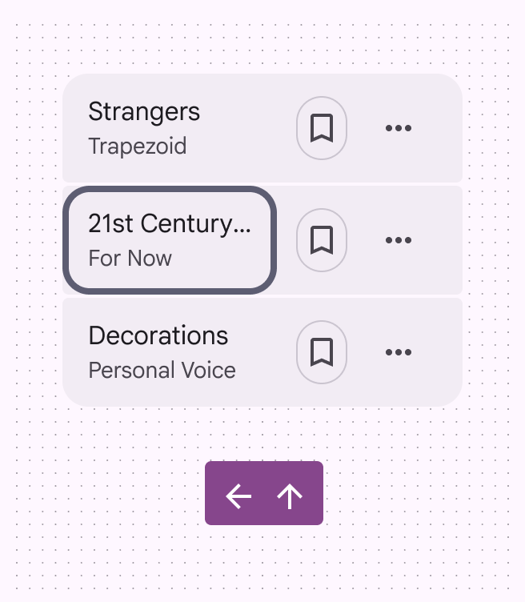

If the focus is on a list item’s first action, the **Up** and **Left** arrows move focus back to the last action of the previous item

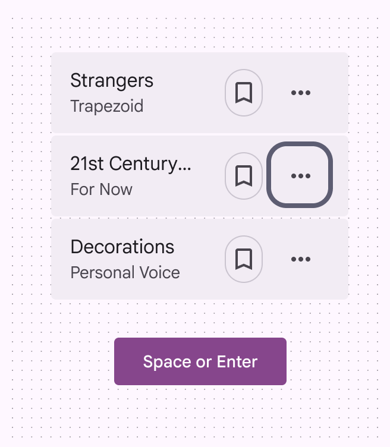

The **Space** or **Enter** key activates a selected action in a list

## Keyboard navigation

|
**Keys**

 |

**Actions**

 |
| --- | --- |
|

**Tab**

 |

To move focus to the first list item, last list item, or outside of the list component

 |
|

Down and right arrow keys

 |

Moves to the next element in the list; if the focused element is the last in the list, it wraps back to the top of the list

 |
|

Up and left arrow keys

 |

Moves to the previous element in the list; if the focused element is the first in the list, it wraps back to the bottom of the list

 |
|

**Space** or **Enter**

 |

To select a list item not yet selected

 |

## Labeling elements

Accessibility [More on accessibility](/m3/pages/overview/principles) labels are used with assistive devices like screen readers. The accessibility label for a list item is typically the same as the **label text** and **supporting text**. Some labels, roles, and states are [dependent on platform](/m3/pages/lists/accessibility#09e32b7d-78a1-45c1-be12-4c6646cfe1d1).

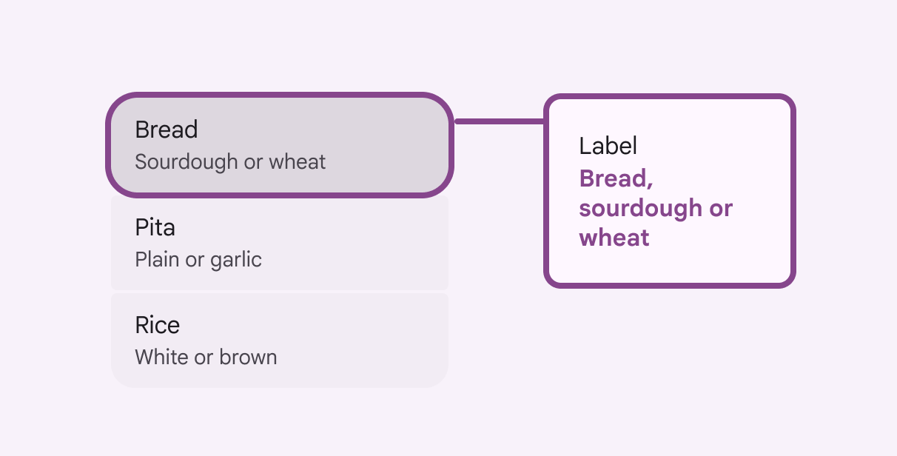

A list item’s **label text** and **supporting text** is used for its accessibility label

### Platform-specific labels 

#### Single-select lists

|
**Trait**

 |

 |

 |

**Jetpack Compose**

 |
| --- | --- | --- | --- |
|

Aria label

 |

Container label: Should describe selection type

List item: Should match the visible label text 

 |

List item: Should match the visible label text 

 |

List item: Should match the visible label text 

 |
|

Role

 |

Container: List box
 List item: Option

 |

List item: Radio button

 |

List item: Radio button

 |
|

State

 |

Selected or Not-selected

 |

Checked or Not-checked

 |

Checked or Not-checked

 |

#### Multi-select lists

|
**Trait**

 |

 |

 |

**Jetpack Compose**

 |
| --- | --- | --- | --- |
|

Aria label

 |

Container label: Should describe selection type

List item: Should match the visible label text 

 |

List item: Should match the visible label text

 |

List item: Should match the visible label text 

 |
|

Role

 |

Container: List box
 List item: Option

 |

List item: Checkbox

 |

List item: Checkbox

 |
|

State

 |

Selected or Not-selected

 |

Checked or Not-checked

 |

Checked or Not-checked

 |

On web, a list container’s accessibility label describes the type of selection that can be made, and the role is **List box**.

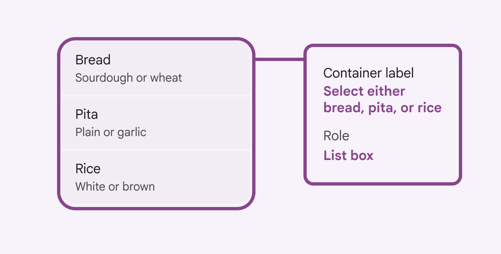

On web, a list container’s role is **List box**

On Jetpack Compose, the role applies to the list item as a whole. If a list isn't selectable, the label text is read out without a role.

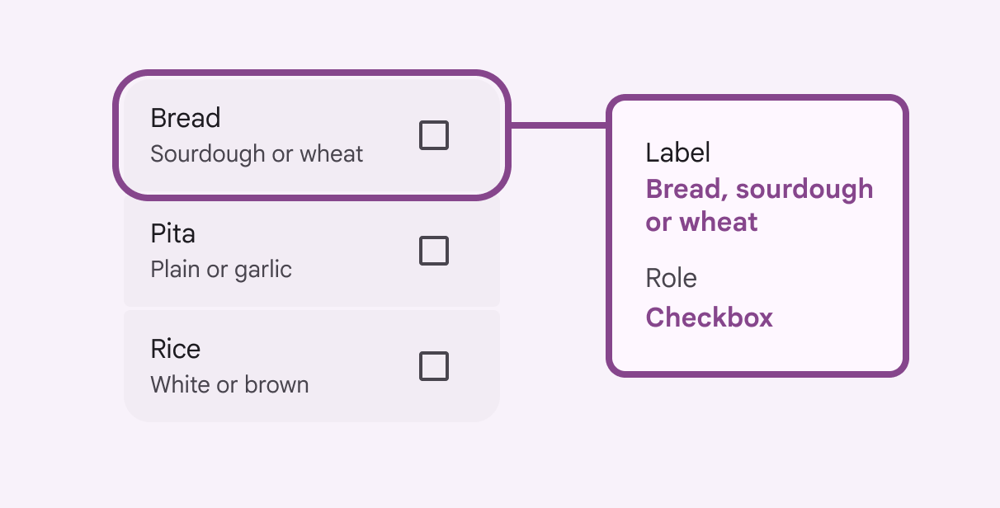

When selectable, the role **Checkbox** applies to the entire list item on Jetpack Compose

On Android Views (MDC-Android), components contained within the list should be labeled according to that component’s specific guidelines:

- [Checkbox](/m3/pages/checkbox/accessibility)
- [Radio button](/m3/pages/radio-button/accessibility)

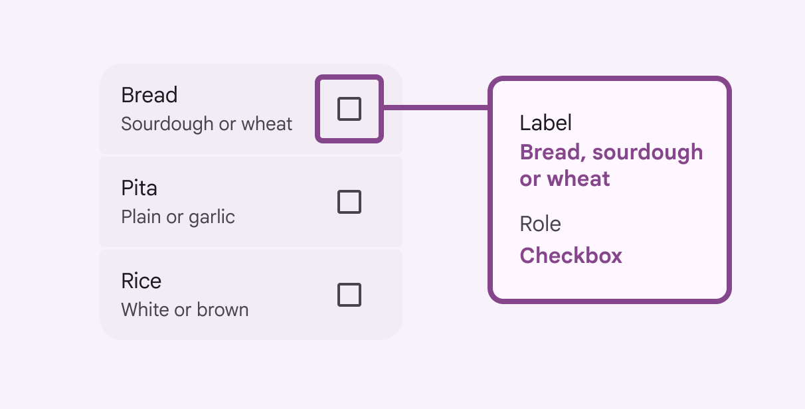

On Android Views (MDC-Android), the accessibility label and role are applied to the interactive component by default

