# Lists

Lists are continuous, vertical indexes of text and images

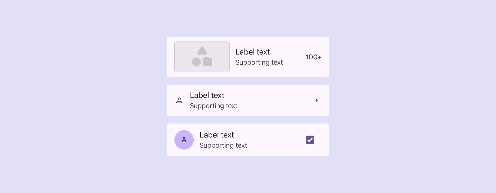

Lists can include a range of layout combinations:

1. Leading images, videos, icons, or avatars
2. Trailing text, icons, or icon buttons

## Usage

Lists are vertical groups of text, icons, images, and other elements, optimized for reading comprehension. List items can contain multiple actions at once, like selection, icon buttons, overflow menus, and more.

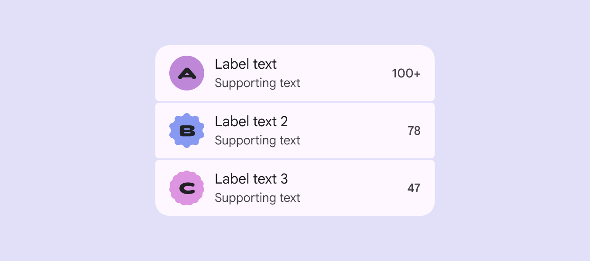

A clear visual hierarchy makes lists easy to scan and read

Use lists for communicating or selecting discrete items, such as choosing from a set of colors.

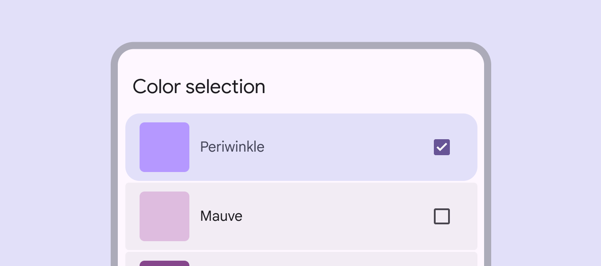

Lists are an organized way to add imagery and supporting elements to selection. In this color selection example, the list contains color swatches, color names, and a checkbox action. A list should be easy to scan. Any element can be used to anchor and align list item content. Place supporting visuals and primary text in the same position in each list item. Don’t vary the position of elements within a list.

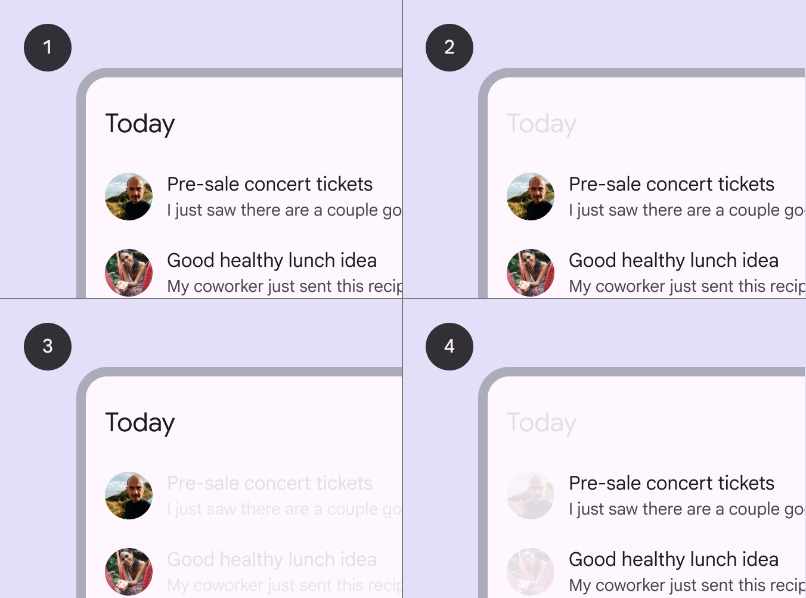

1. Sample list
2. Content placement in a row
3. Supporting visuals are aligned for easy scanning
4. Primary text is aligned for easy scanning

List items can adapt to different lengths of text:

**Label text only
**A list item can contain a single line of label text. If the text doesn’t fit on one line, it can wrap or be truncated.

**Label text with supporting text
**A list item can include supporting text below the label text. Both the label and supporting text can wrap or be truncated.

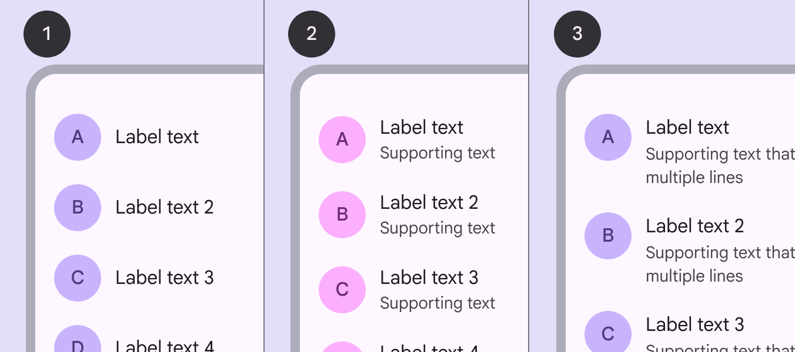

Three examples of list item sizes:

1. Label text only
2. Label text with supporting text on one line
3. Label text with supporting text that wraps to two lines

## Anatomy

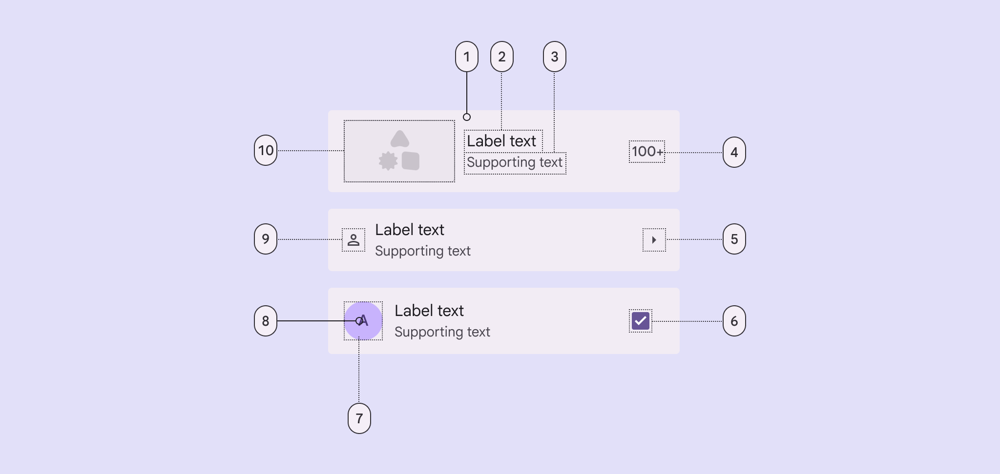

Container and label text are required. All other elements are optional:

1. Container
2. Label text
3. Supporting text
4. Trailing text
5. Trailing icon
6. Trailing selection control - checkbox, radio button, switch
7. Leading avatar container
8. Leading avatar text
9. Leading icon
10. Leading media - image or video

### Container

List containers hold all list items and their elements. List item size is determined by the tallest element within the list item. [See layout measurements](/m3/pages/lists/specs#1824b94d-7d17-4a29-889f-d277037a1313)



When a list item features an image, consider customizing the container color to use a content-based color scheme. This should be applied to either the enabled state or for an interaction. A list item can include a leading image and a vibrant color

### Label & supporting text

Keep label text brief. To ensure list items are scannable:

- Limit supporting text to one to three lines
- Truncate supporting text, depending on screen size

[See adaptive guidance](/m3/pages/lists/guidelines#561cc637-aa43-4055-be1e-0716faeef7af)

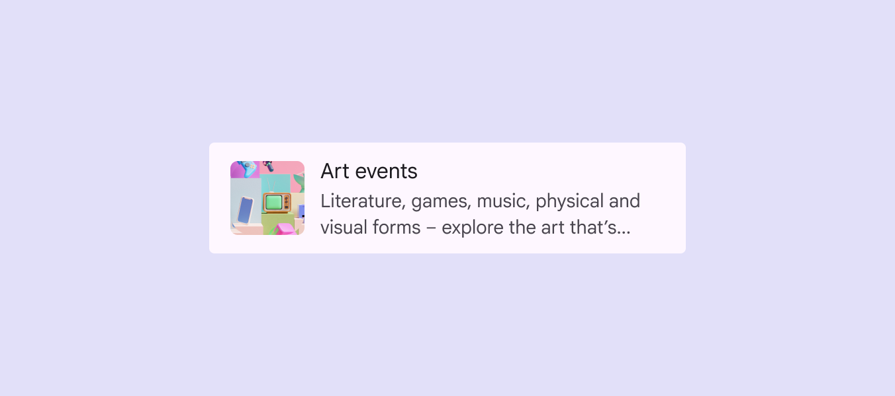

Limit supporting text to one to three lines

### Icons

**Leading icon**
A leading icon should provide a quick visual cue that relates to the item's label text, helping people scan the list.

**Trailing icon**
A trailing icon is often used to communicate status or indicate an action, like **Show more**.

1. Leading icons should relate to the label text
2. Trailing icons can communicate an action

### Leading media

List items can contain a leading avatar, image, or video. Anchor visuals to the leading edge of the list to improve scannability. Leading video thumbnails can open a video player or even play within the list.

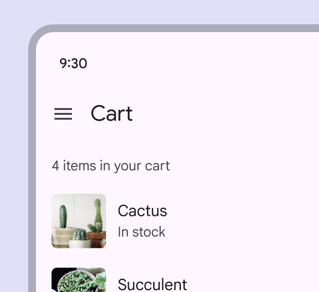

check Do

Place supporting visuals, like thumbnails, at the leading edge of a row to improve scannability

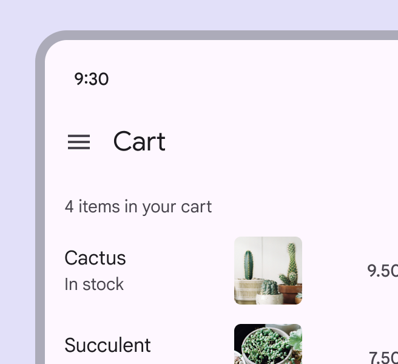

exclamation Caution

Avoid placing visuals in the center of a row because it makes the list difficult to scan

**Avatars**
List items can include images in circular or expressive shapes to represent a person or entity. Use square or rectangular images for other content, such as products or videos.

Use an expressive, circular avatar to represent a person or entity

**Primary & secondary actions**

Use spacing to draw attention to the most important aspect of the list item, usually the primary action area or key content.

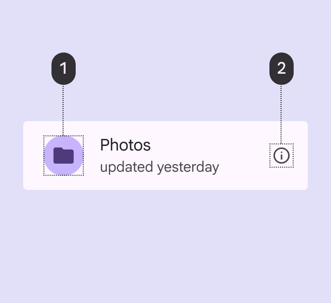

The primary action takes up more space:

1\. Primary action area

2\. Secondary action area

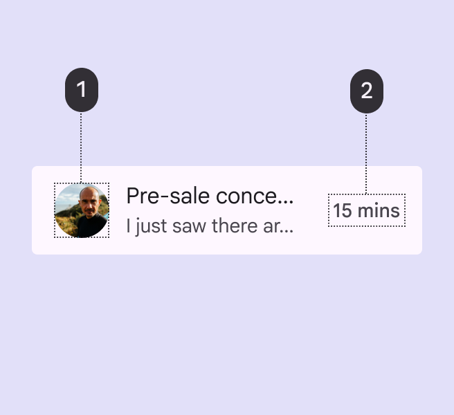

Align content by importance:

1\. More distinguishing content

2\. Less distinguishing content

### Trailing text

Trailing text can provide additional meta-information about a list item, such as a price, count, or other details.

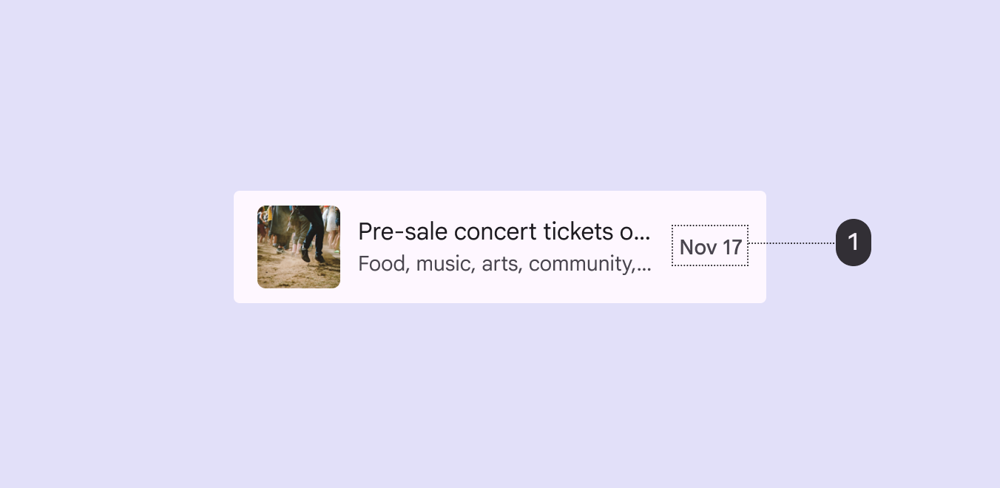

Use trailing text for supplemental details, like a price, count, or date

### Selection controls

Selection [More on selection](/m3/pages/selection) controls display list item actions. Position controls at the leading or trailing end of a list item:

- Use checkboxes [More on checkboxes](/m3/pages/checkbox/overview) to select multiple items
- Use switches [More on switches](/m3/pages/switch/overview) to toggle settings on or off
- Use radio buttons [More on radio buttons](/m3/pages/radio-button/overview) to select a single item

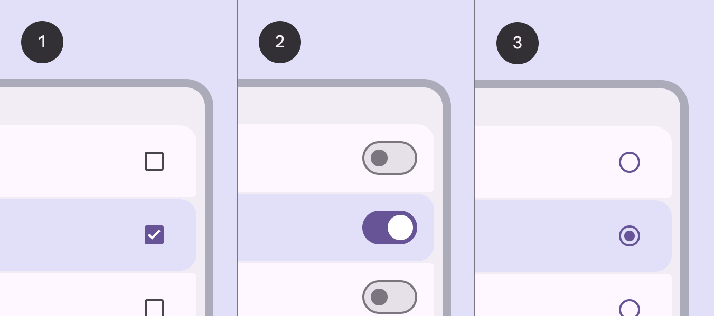

List items with: 

1. Checkboxes
2. Switches
3. Radio buttons

### Gaps & dividers

Gaps or dividers can separate lists into items and groups:

- Use **gaps** for contained lists. Gaps leverage expressive shape and containment tactics.
- Limit **dividers** to uncontained or complex lists, only when a stronger visual separation is necessary.

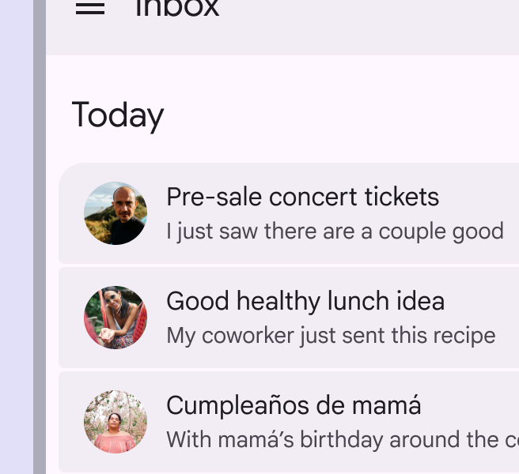

check Do

Use **segmented gaps** and filled list items to define a list group

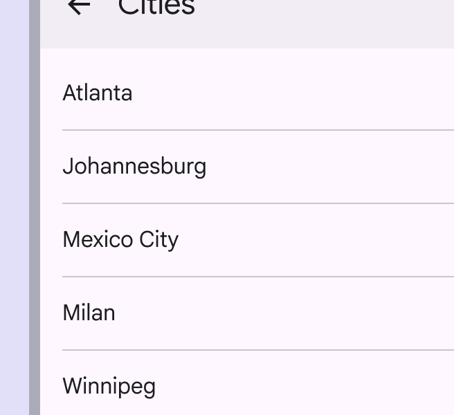

exclamation Caution

Limit the use of **dividers** to uncontained lists

## Adaptive design

### Line length

In fluid layouts [More on layout](m3/pages/layout-overview), avoid excessively long lines of text when expanding containers and text-heavy components. This often means changing margins [More on margins](/m3/pages/grids-spacing/spacing) and typography properties as the container scales.

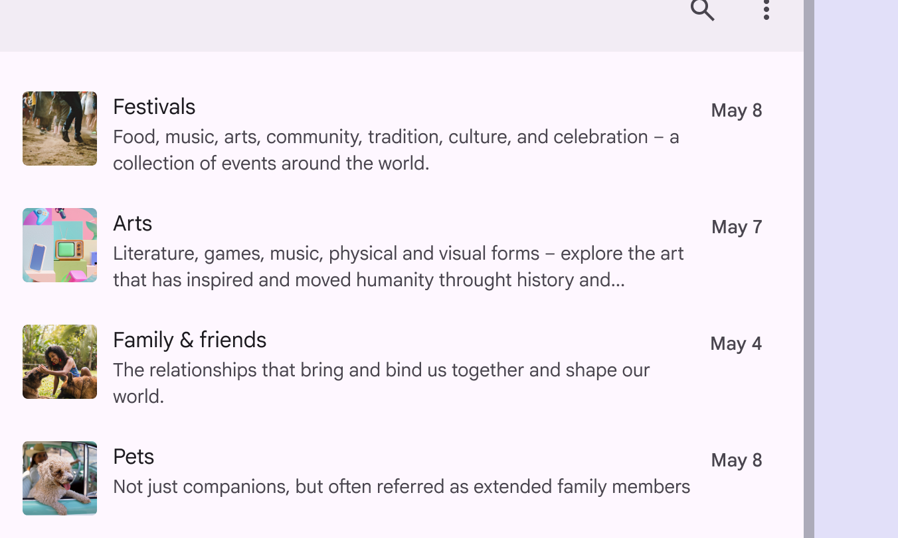

check Do

Adjust margins to create a more comfortable line length for reading

Adapt the width of the list container based on a line’s length, or by switching to a multi-column layout.

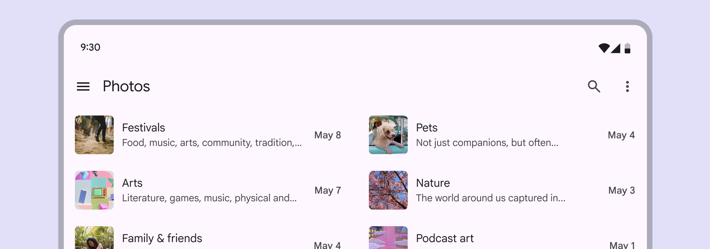

check Do

A multi-column layout can help break up content when needed

The ideal line length for text is typically between 40 to 60 characters, but large-screen devices can accommodate up to 120 characters per line. If a line of text is close to 120 characters in length, consider increasing the line height to improve readability .

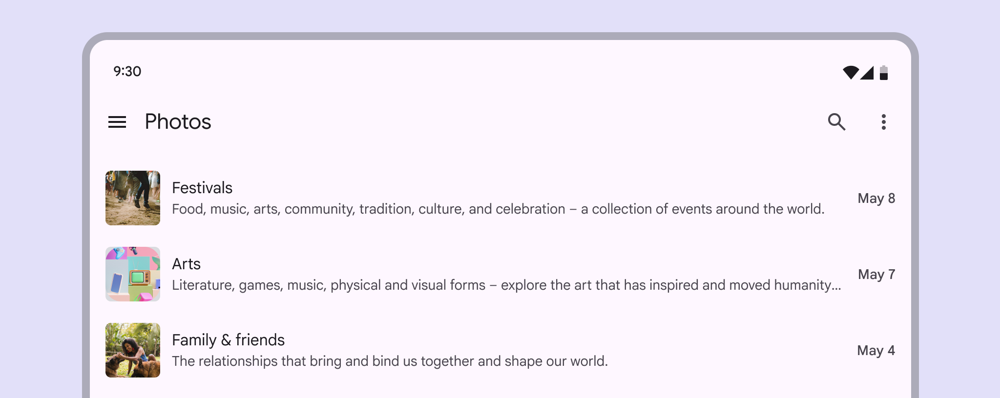

close Don’t

Don’t scale components without adjusting other affected areas of the screen, such as text length. This can result in line lengths that make reading difficult. A list in a compact window [More on compact window sizes](/m3/pages/breakpoints/compact) can become part of a two-column layout in an expanded window [More on expanded window sizes](/m3/pages/breakpoints/expanded), adjusting the amount of information shown in each list item. Reduce the amount of information shown in compact window sizes

### Adapt list elements & layout

Lists can change their layout to adapt to different window sizes. This affects the size and placement of content. For example, a list in a compact window can adjust margins [More on margins](/m3/pages/grids-spacing/spacing), spacing, or density to better fit an expanded window. On larger screens, lists can show more content, like supporting text and larger imagery

### Swap components

Lists are just a compact composition of images, text, and actions. Other components, like cards and carousels, use the same elements but take up more space. On large screens, consider swapping a list to a component with a similar purpose to take advantage of available space. Information displayed in list items on mobile can change to cards on tablet and desktop

### Compact window size

Lists should extend edge-to-edge in compact windows. Selecting a list item should open a page with the details. On small screens, people can navigate between lists and full-screen detailed views

### Medium & expanded window sizes

Medium [More on medium window size class](/m3/pages/applying-layout/medium) and expanded window sizes [More on expanded window size class](/m3/pages/applying-layout/expanded), such as tablet and desktop screens, can display primary and secondary content in the same view. For example, a list and the detailed information can appear side-by-side.

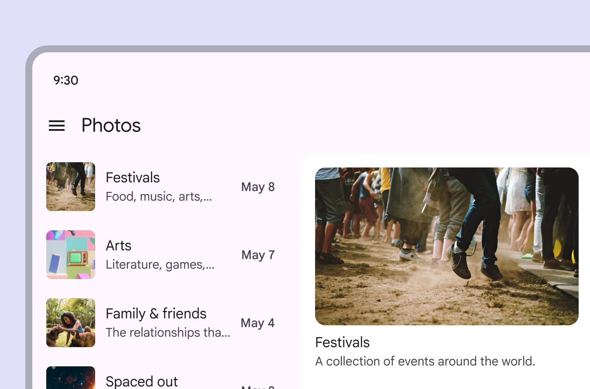

On larger screens, a list-detail view can be more appropriate

On a larger window size, a list may transform into a carousel. Lists can transform into carousels in expanded windows

Lists can also show more or less content as they scale up and down in size. For example, a list item can reveal more content when the component expands. List items reveal supporting text in expanded window sizes

## Behavior

### List selection modes

The selected state applies to the entire list item. For example, when an item with a checkbox is selected, both the list item and the checkbox show a selected state.

**Single-select**

Lists can feature a single-selection component such as a radio button [More on radio buttons](/m3/pages/radio-button/overview). Single-select list items:

- Don’t support multi-actions
- Can’t have secondary nested actions
- Shouldn’t use checkboxes

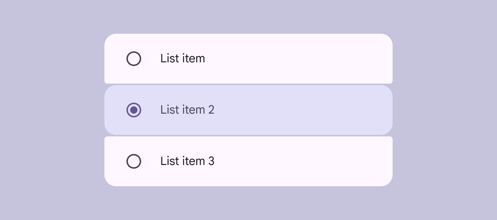

Use radio buttons to allow a single selection in a list

**Multi-select**

Multi-select lists allow for multiple list items to be toggled on. Multi-select list items:

- Pair well with checkboxes and switches
- Can’t have secondary nested actions
- Shouldn’t use radio buttons

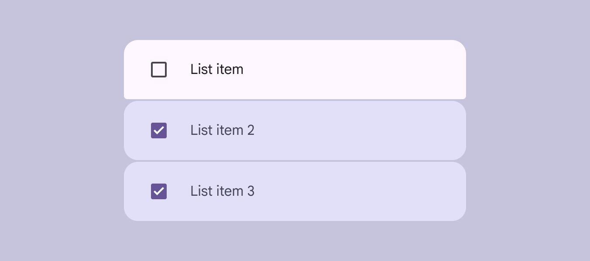

Use checkboxes or switches for multi-select lists

**Single-action**

In a single-action list, the entire list item performs one action, such as navigating to a new page. Single-action list items:

- Can’t have secondary nested actions
- Can’t be toggled into a persistent selected state

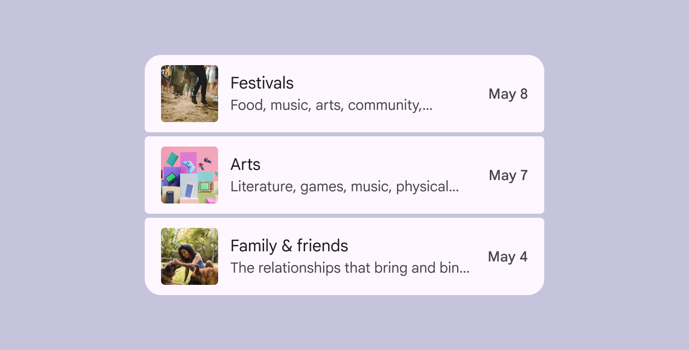

Use a single-action list for a primary action, like navigation

**Multi-action**

Multi-action lists can support multiple nested actions within a list item. The primary action should take up the majority of the space in the leading and content positions. Place supplementary actions, like a bookmark or menu, in the trailing position.



[More on multi-action accessibility](/m3/pages/lists/accessibility#b69b89a9-7ca0-4249-b25b-2d0c85a41dc0)

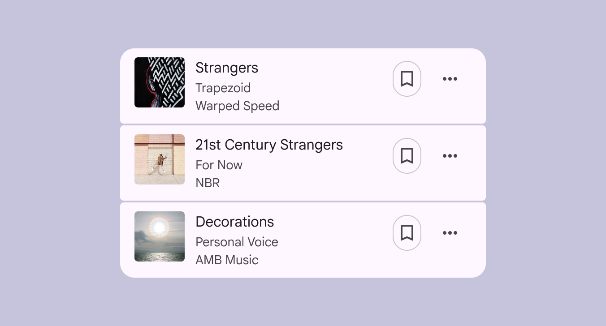

Place supplementary actions in the trailing position of a list item

**Non-interactive**

Non-interactive lists can organize information in a scannable way. They don’t perform any actions and can’t be selected.

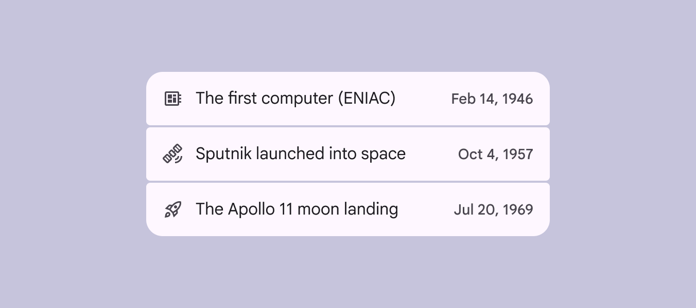

Use non-interactive lists to make information easy to scan

### List interactions

**Expand & collapse**

List items containing other list items can expand and collapse in a folder-like manner, to reveal or hide content. Tapping a list item expands it vertically across the entire screen using a container transform transition pattern. To expand a list item, display a parent-child transition

