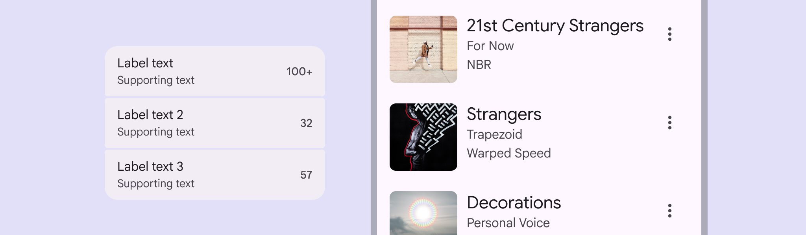
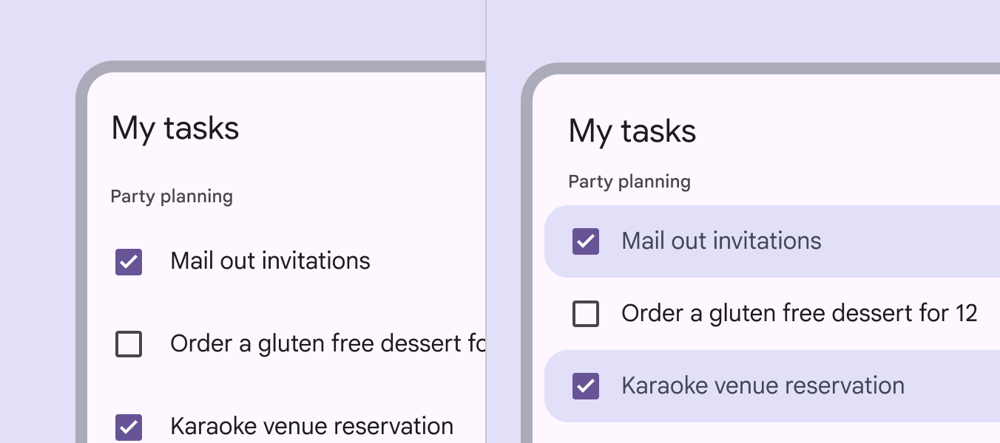
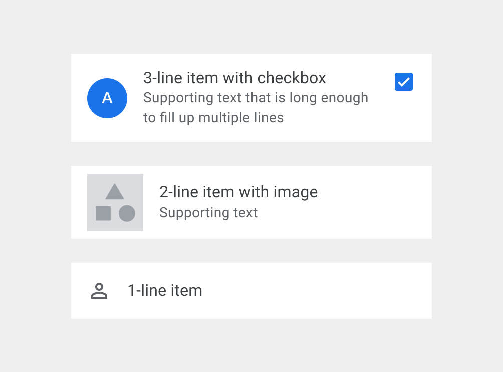
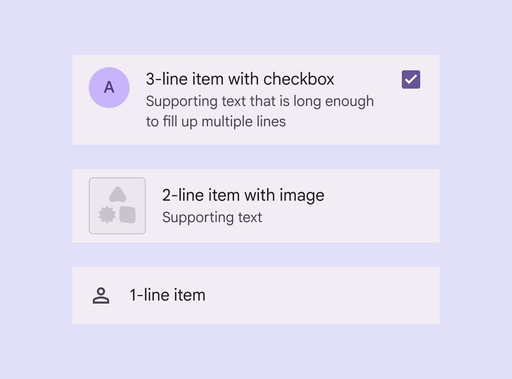

# Lists

Lists are continuous, vertical indexes of text and images

- Use lists to help people find a specific item and act on it
- Order list items in logical ways, like alphabetical or numerical
- Keep items short and easy to scan
- Show icons, text, and actions in a consistent format
- Choose between standard and segmented styles

A list item's label text, supporting text, image, and trailing icon can be customized to create a variety of lists

## Availability & resources

| Type | Resource | Status |
| --- | --- | --- |
| Design | [Design Kit (Figma)](https://www.figma.com/community/file/1035203688168086460) | Available |
| Implementation |  | Available |
| Implementation | [Jetpack Compose](https://developer.android.com/develop/ui/compose/lists) | Available |
| Implementation | [Jetpack Compose: Expressive](https://developer.android.com/reference/kotlin/androidx/compose/material3/package-summary#ListItem%28kotlin.Function0,androidx.compose.ui.Modifier,kotlin.Function0,kotlin.Function0,kotlin.Function0,kotlin.Function0,androidx.compose.material3.ListItemColors,androidx.compose.ui.unit.Dp,androidx.compose.ui.unit.Dp%29) | Available |
| Implementation |  | Available |
| Implementation |  | Available |
| Implementation |  | Available |

## M3 Expressive update

Lists have a new segmented visual style, improved selection treatment, and support for slots. [More on M3 Expressive](https://m3.material.io/blog/building-with-m3-expressive)

**December 2025**


Variants:

- Added **expressive** list

    - Recommended for new designs

- List (baseline [More on M3 Expressive](<https://m3.material.io/blog/building-with-m3-expressive >)) is still available

New visual styles:

- Standard or segmented
- Highlighted selection states
- Flexible slots

Supported platforms:

- [Jetpack Compose](https://developer.android.com/reference/kotlin/androidx/compose/material3/package-summary#ListItem%28kotlin.Function0,androidx.compose.ui.Modifier,kotlin.Function0,kotlin.Function0,kotlin.Function0,kotlin.Function0,androidx.compose.material3.ListItemColors,androidx.compose.ui.unit.Dp,androidx.compose.ui.unit.Dp%29)

Expressive lists feature improved selection states

## Differences from M2 to M3 baseline

- **Color:** New color mappings and compatibility with dynamic color [More on dynamic color](/m3/pages/dynamic/choosing-a-source)
- **Layout:** Padding and spacing rules are updated to be more consistent
- **Height:** The tallest element within a list item determines the list item’s height - either 56dp, 72dp, or 88dp
- **Alignment:**

    - In most cases, elements in a list item are middle-aligned
    - If a list is 88dp or larger, or contains three or more lines of text, elements are top-aligned

M2: Non-standard heights and alignments

M3 (baseline): Standardized heights and alignments

