# Lists

Lists are continuous, vertical indexes of text and images

## Variants

### Expressive lists

Use the expressive list variant for more flexible styling, highlighted selection states, and customizable slots.

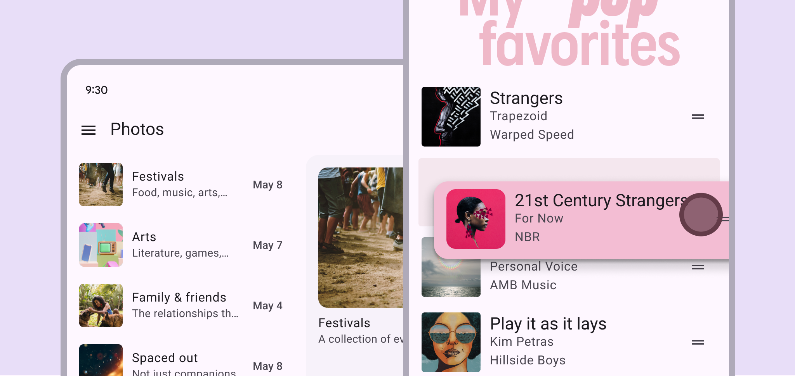

An **expressive list** has a segmented style and round corners

### Baseline lists

In M3 Expressive, baseline [More on M3 Expressive](<https://m3.material.io/blog/building-with-m3-expressive >) lists are still available to use, but don’t have the latest visual style, selection treatment, and slot functionality.

[See baseline list specs](/m3/pages/lists/specs#94cf7f4d-fe29-4fab-9aae-a99e9b754329)

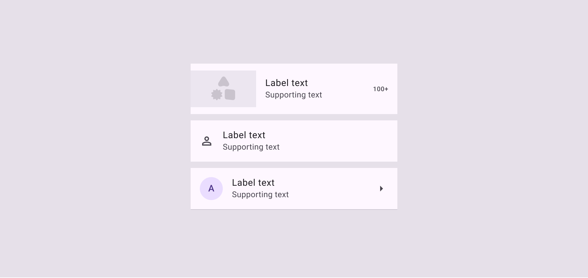

**Baseline list items** have square corners and standard colors

|
**Variants**

 |

**M3**

 |

**M3 Expressive**

 |
| --- | --- | --- |
|

List (expressive)

 |

\--

 |

Available

 |
|

List (baseline)

 |

Available

 |

Available

 |

## Configurations

### Styles

The standard and segmented styles are a visual choice, and don’t affect a list’s behavior.

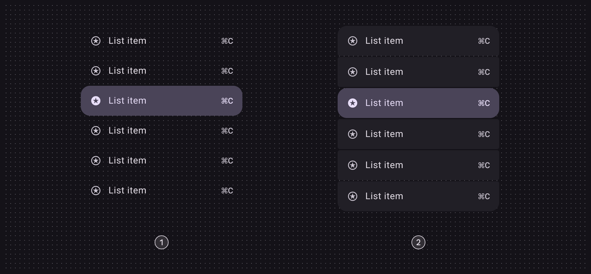

1. Standard
2. Segmented

### List selection modes

A list can have only one selection mode at a time. For example, a single-action list can change to a multi-select list, but can’t be both at once.

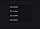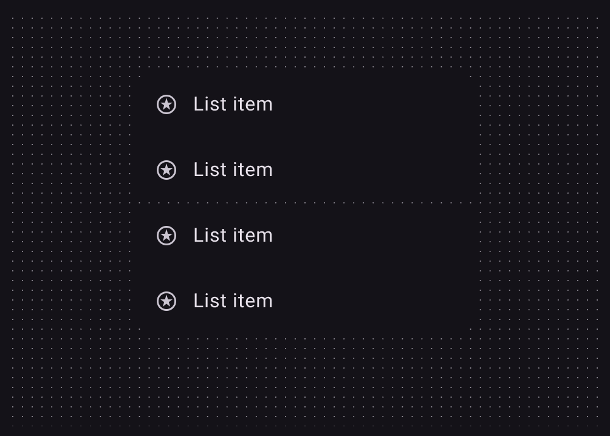

In a **single-action list**, each item is a single tappable area

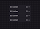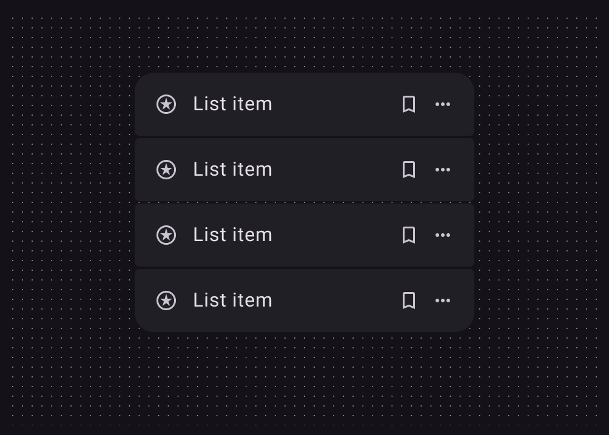

**Multi-action list** items include a primary action and one or more secondary actions

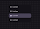

A **single-select list**

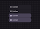

A **multi-select list**

### List interactions

#### Expand

On Android, lists can [expand and collapse](/m3/pages/lists/guidelines#90a236ee-b587-4361-8911-34006f25a6f1). A list can **expand** to include multiple items

|
**Category**

 |

**Configuration**

 |

**M3**

 |

**M3 Expressive**

 |
| --- | --- | --- | --- |
|

Styles

 |

Standard

 |

Available

 |

Available

 |
|

Segmented

 |

\--

 |

Available

 |
|

Selection modes

 |

Single-action, multi-action,

single-select, multi-select

 |

Available

 |

Available

 |
|

Interactions

 |

Expand

 |

Available

 |

Available

 |

## Tokens & specs

Use the table's menu to select a token set. The **common** set combines baseline tokens with new expressive shapes and sizes. The **expand** set has tokens for the expand interaction. [Learn about design tokens](/m3/pages/design-tokens/overview)

```
List - Common
```

```
List - Common
```

```
List - Common
```

```
List - Common
```

List - Common

Token

Default, Light

Color

Spacing

Shape

Size and typography

## Anatomy

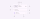

Container and label text are required. All other elements are optional:

1. Container
2. Overline
3. Label text
4. Trailing text
5. Supporting text
6. Trailing icon
7. Divider
8. Leading avatar
9. Leading icon
10. Leading media - image or video

### Flexibility & slots

The [M3 Design Kit](https://www.figma.com/community/file/1035203688168086460) includes lists with custom slots for designing flexible item layouts. Think of a custom list as a container with three different slots: leading, content, and trailing. Each slot can hold a different element.

#### **Slot accessibility**

Slots are not accessible by default. Consider the following:

- Elements must follow the rules, structure, and interaction patterns for lists
- Use standard list item padding
- Target size must be at least 48x48dp
- Don't add interactive elements that make the list item difficult to navigate, especially for people using screen readers

[More on required accessibility guidelines](/m3/pages/lists/accessibility#538f23f7-689c-4516-bfc8-5f6933a43f5e)

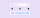

exclamation Caution

Reserve the use of slots for use cases that maintain the list’s accessibility and functionality

1. Leading slot
2. Content slot
3. Trailing slot

warning

Caution:

Slots require custom code implementation that you must create and maintain

The **leading** and **trailing** slot positions must be a smaller width than the **content** section.

1\. **Leading slots** can contain:

- Visual elements: Avatar, icon, image, or video thumbnail
- Selection [More on selection](/m3/pages/selection) controls: Checkbox, radio button, or switch
- Customizations: Badge or larger image

2\. **Content slots** must be the largest-width slot and can contain:

- Default content: Label text, supporting text
- Optional add-ons: Badge, icon, in-line label, or more text elements
- Avoid long lines of text to preserve readability
3 **Trailing slots** can contain:
- Action elements or text: Icon, icon button, or trailing text
- Selection controls: Checkbox, radio button, or switch

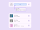

The content slot must be the largest section, placed in the middle of the list item

#### Selection lists

For selection lists, use only one selection interaction per list item.

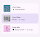

check Do

Use only one selection interaction per list item

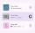

close Don’t

Don't use multiple selection interactions in one item

## Color

Color values are implemented through design tokens. For designers, this means working with color values that correspond with tokens. In implementation, a color value will be a token that references a value. [Learn more about design tokens](/m3/pages/design-tokens/overview)

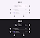

List color roles used for light and dark themes:

1. Surface
2. On surface variant
3. On surface
4. On surface variant
5. On surface variant
6. On surface variant
7. Outline variant
8. Primary container
9. On primary container
10. On surface variant

## States

States are visual representations used to communicate the status of a component or an interactive element. [Learn more about interaction states](/m3/pages/interaction-states/overview)

### Default list items

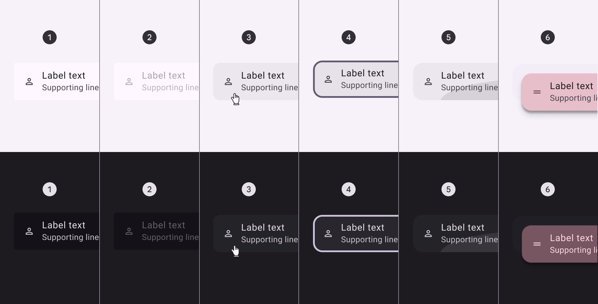

1. Enabled
2. Disabled
3. Hovered
4. Focused
5. Pressed
6. Dragged

### Selected list items

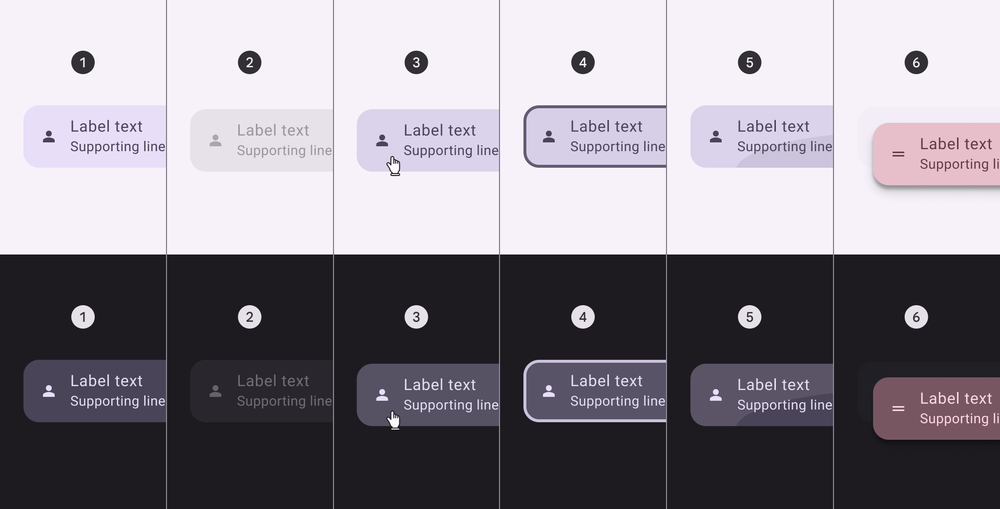

1. Enabled
2. Disabled
3. Hovered
4. Focused
5. Pressed
6. Dragged

## Measurements

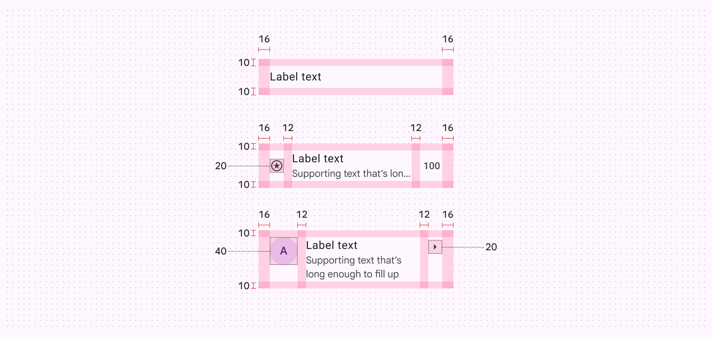

List item alignment, padding, and size measurements. The icon button height is dynamic, and automatically adjusts to fill the list item height.

## List (baseline)

The baseline [More on M3 Expressive](https://m3.material.io/blog/building-with-m3-expressive) list variant is available and continues to work in existing products. However, the [expressive list](/m3/pages/lists/specs#ebf87f58-d5bf-4cb5-a856-d2bb104eec4d) variant is recommended for new designs.

### Tokens & specs

Baseline list tokens [More on tokens](/m3/pages/design-tokens/overview) are in the **common** token set. Note: This set also includes several expressive tokens.

```
List - Common
```

```
List - Common
```

```
List - Common
```

```
List - Common
```

List - Common

Token

Default, Light

Color

Spacing

Shape

Size and typography

### Color

Color values are implemented through design tokens. For designers, this means working with color values that correspond with tokens. In implementation, a color value will be a token that references a value. [Learn more about design tokens](/m3/pages/design-tokens/overview)

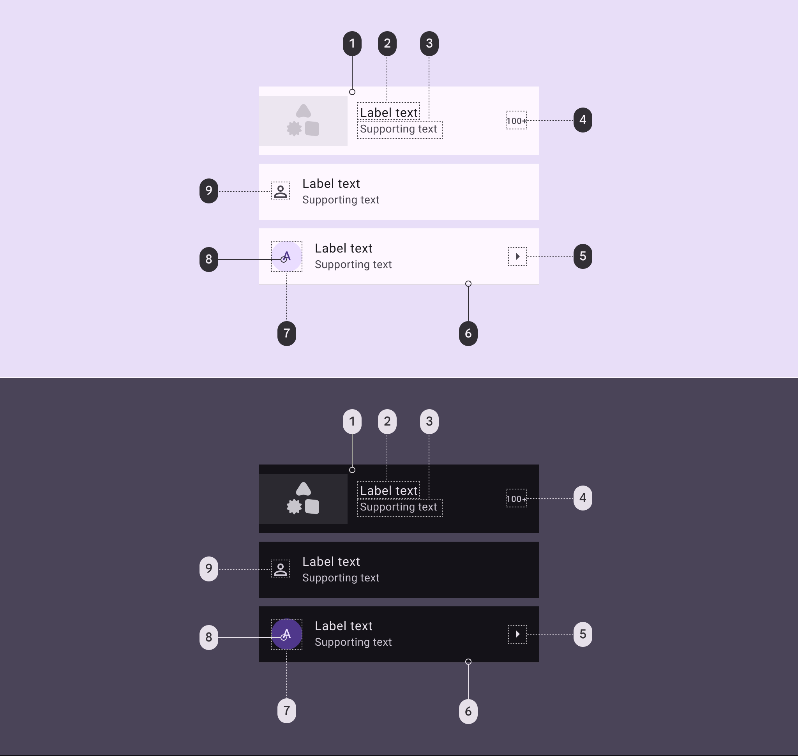

List color roles used for light and dark themes:

1. Surface
2. On surface
3. On surface variant
4. On surface variant
5. On surface variant
6. Outline variant
7. Primary container
8. On primary container
9. On surface variant

### States

States are visual representations used to communicate the status of a component or interactive element.

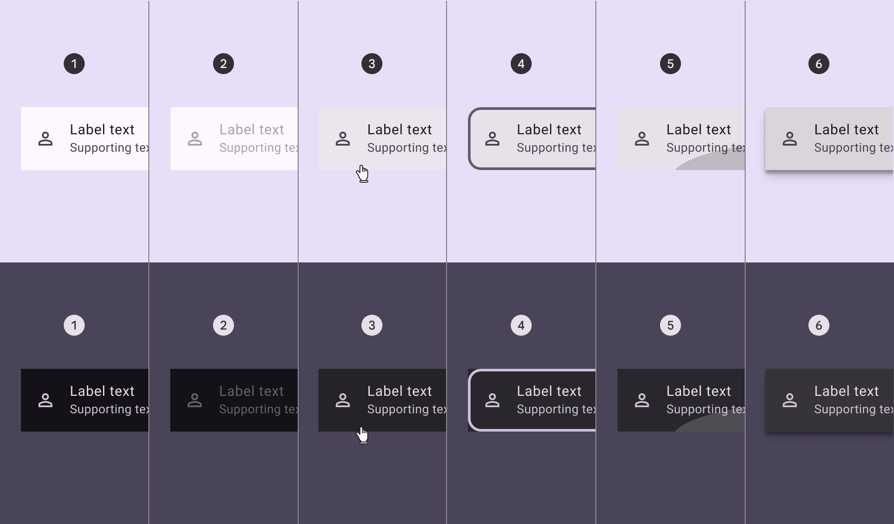

1\. Enabled

2\. Disabled

3\. Hovered

4\. Focused

5\. Pressed

6\. Dragged

### Layout

#### One-line lists

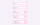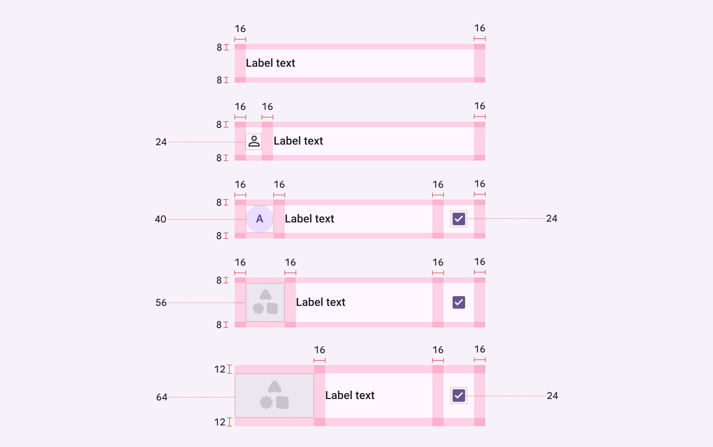

Baseline one-line list alignment, padding, and size measurements

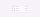

Baseline list item measurements and padding

#### Two-line lists

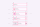

Baseline two-line list alignment, padding, and size measurements

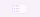

Baseline list item measurements and padding

#### Three-line lists

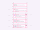

Baseline three-line list alignment, padding, and size measurements

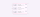

Baseline list item measurements and padding

| Attribute | Value |
| --- | --- |
|
Label alignment

 |

Center

 |
|

Label alignment when height is 88dp or taller

 |

Top

 |
|

Label left padding

 |

16dp

 |
|

Leading element alignment (vertical)

 |

Center

 |
|

Leading element alignment (vertical) when height is 88dp or taller

 |

Top

 |
|

Leading element left padding

 |

16dp

 |
|

Leading icon alignment (vertical)

 |

Top

 |
|

Leading icon top padding

 |

8dp

 |
|

Leading icon top padding when height is 88dp or taller

 |

12dp

 |
|

Trailing element alignment (vertical)

 |

Center

 |
|

Trailing element alignment (vertical) when height is 88dp or taller

 |

Top

 |
|

Trailing element left padding

 |

16dp

 |
|

Trailing element right padding

 |

24dp

 |
|

Padding above/below divider

 |

0dp

 |
|

Targets

 |

48dp

 |
|

Divider full-width

 |

100%

 |
|

Divider inset left padding

 |

16dp

 |
|

Divider inset right padding

 |

24dp

 |

### Configurations

#### Leading avatar


1. With leading avatar
2. With leading avatar and trailing checkbox

#### Leading image or thumbnail


1. With leading image
2. With leading image and trailing checkbox

#### Leading video

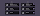

1. With leading video
2. With leading video and trailing checkbox

#### Leading icon

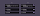

1. With leading icon
2. With leading icon and trailing checkbox

#### Text-only

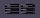

1. With text only
2. With text and trailing checkbox

#### Leading checkbox


1. With leading checkbox
2. With leading checkbox and trailing text

#### Leading radio button


1. With leading radio button
2. With leading radio button and trailing text

#### Trailing switch


1. With trailing switch
2. With leading icon and trailing switch

