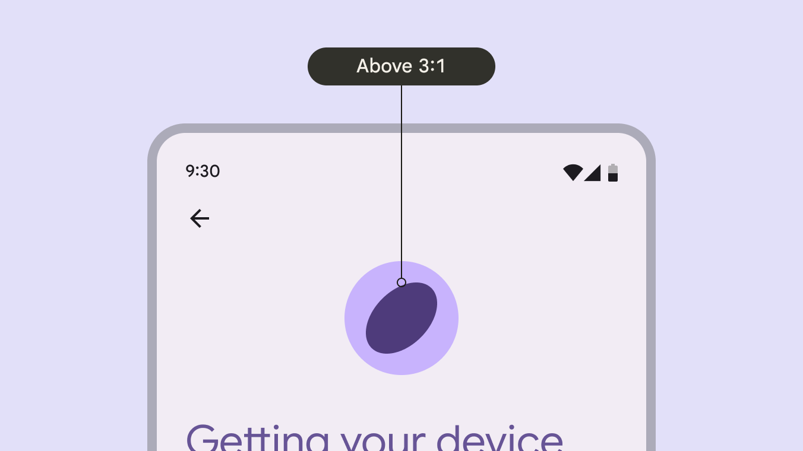
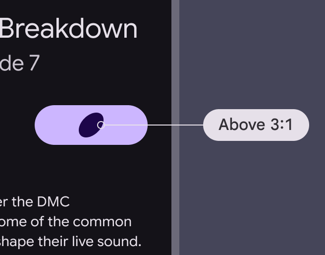
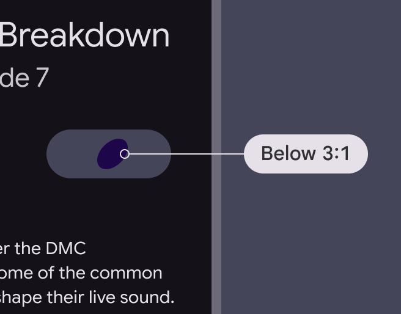
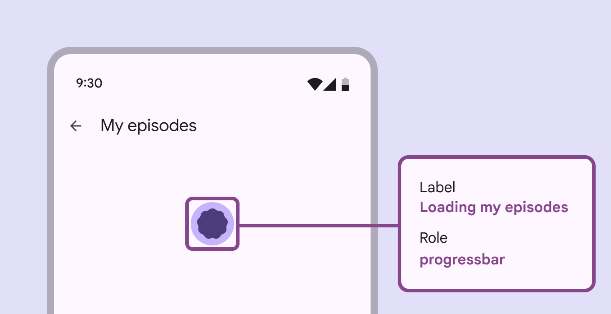

# Loading indicator

Loading indicators show the progress of a process for a short wait time

## Use cases

People should be able to do the following with assistive technology:

- Navigate to the loading indicator
- Understand what progress the indicator is communicating
- Initiate a content refresh without relying on a gesture

## Interaction & style

The active indicator, which displays progress, provides visual contrast of at least 3:1 against most container and surface colors. The indicator itself must have 3:1 contrast with the background, but the container does not.

The loading indicator provides visual contrast of at least 3:1 against most background colors

When integrated into another component, such as a button, make sure that the active indicator provides a visual contrast of at least 3:1 against the other component.

check Do

Ensure at least 3:1 contrast between the indicator and the surface it's on

close Don’t

Avoid using when the contrast is under 3:1

Pull-to-refresh interactions can’t be accessible by just swiping. Provide an alternate way to refresh the content with a single pointer, such as placing a refresh button in a menu or directly alongside the content. The refresh action can be in an app bar

## Labeling elements

Since the loading indicator is a visual cue, it needs an accessibility label to assist people who can't rely on visuals. It should use the **progress bar** accessibility role. Write a label describing the purpose of the loading indicator, such as **loading news article** or **refreshing page**.

Loading indicator labels should explain which items are loading

