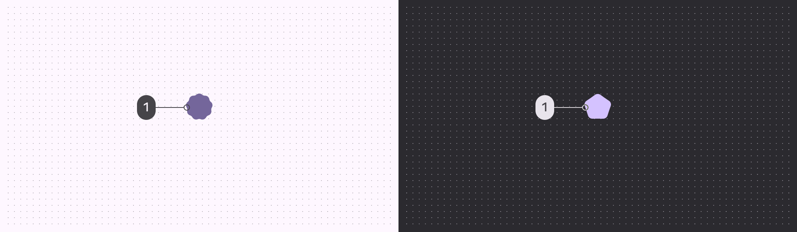
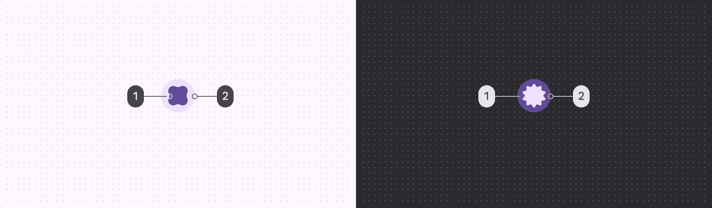

# Loading indicator

Loading indicators show the progress of a process for a short wait time

## Variants

1. Loading indicator

|
Variant

 |

M3

 |

M3 Expressive

 |
| --- | --- | --- |
|

Loading indicator

 |

\--

 |

Available

 |

## Configurations

1. Default
2. Contained

|
Category

 |

Configuration

 |

M3

 |

M3 Expressive

 |
| --- | --- | --- | --- |
|

Containment

 |

Default

 |

\--

 |

Available

 |
|

Contained

 |

\--

 |

Available

 |

## Tokens & specs

Loading indicators have a single token set. Loading indicator

Token

Default, Light

Color

Size

Shape

## Anatomy

1. Active indicator
2. Container

## Color

### Default

Color values are implemented through design tokens [More on tokens](/m3/pages/design-tokens/overview). For designers, this means working with color values that correspond with tokens; in implementation, a color value will be a token that references a value.

Loading indicator color roles used for light and dark schemes:

1. Primary

### Contained

Contained loading indicator color roles used for light and dark schemes:

1. On primary container
2. Primary container

## Measurements

To ensure sufficient margins, the size is 48dp while the shape container is 38dp

