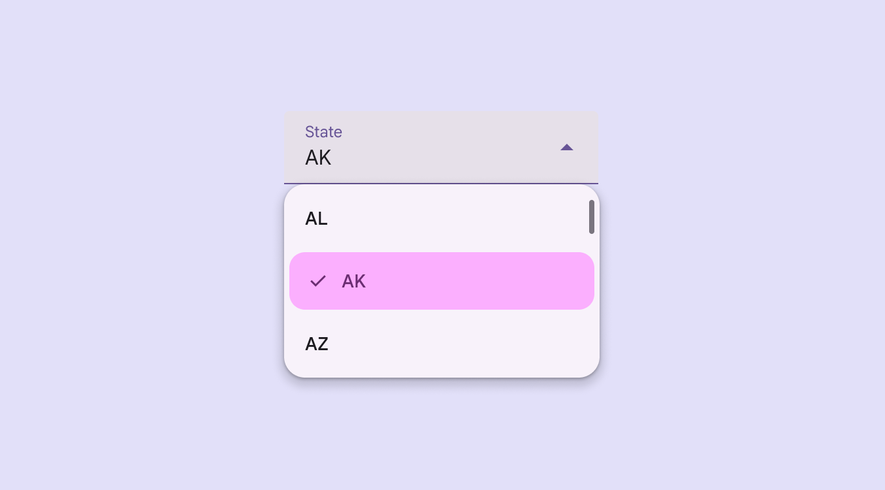
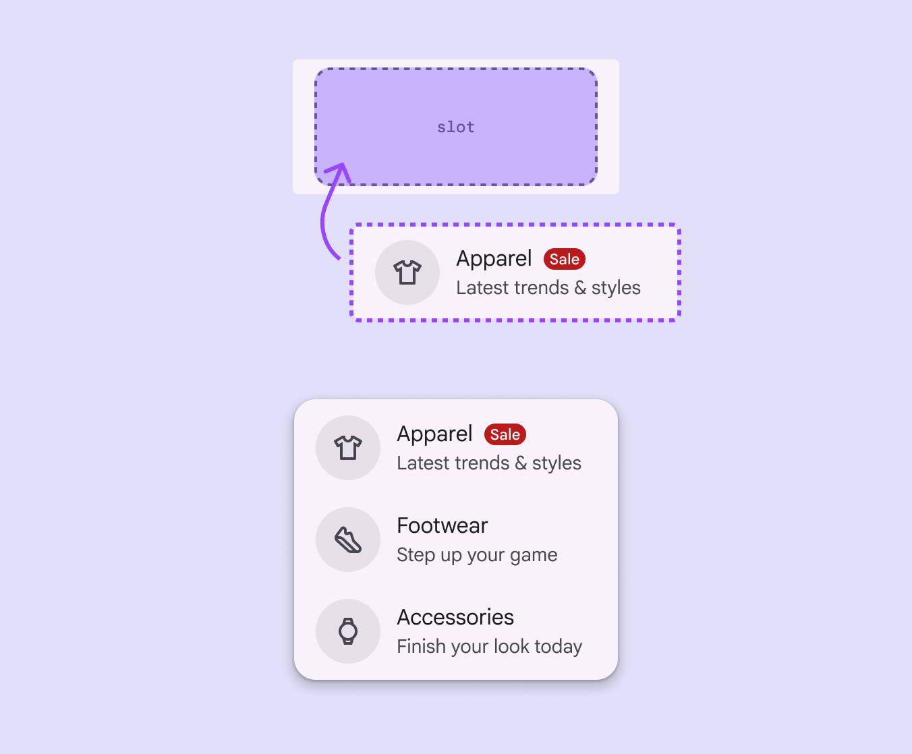
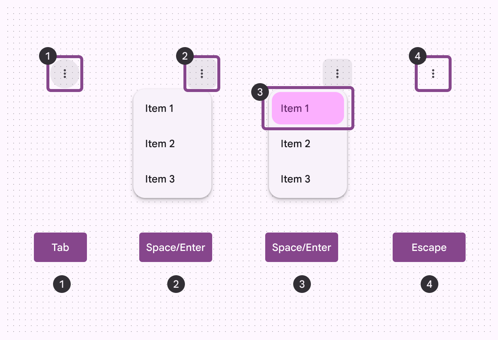
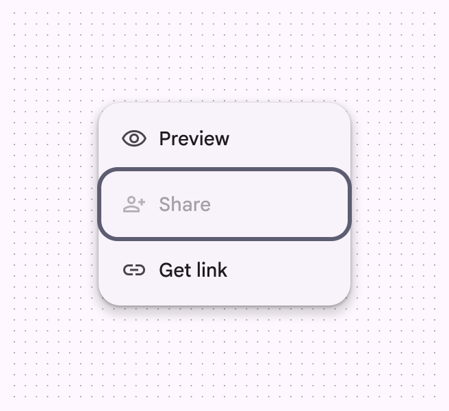
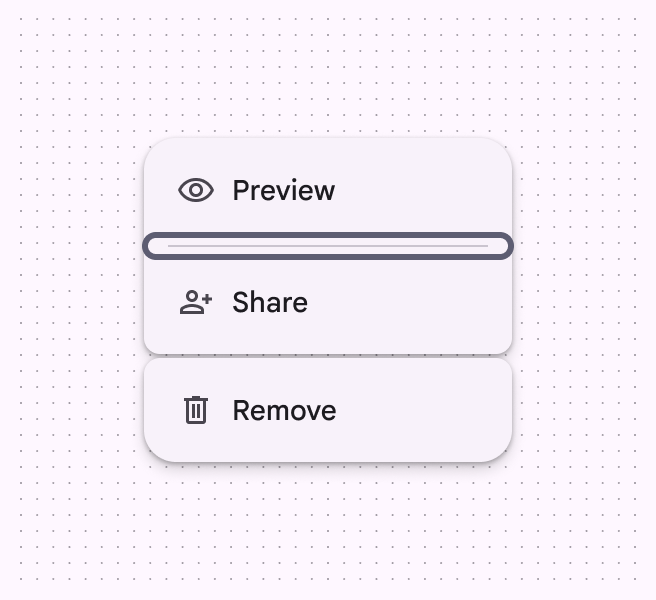
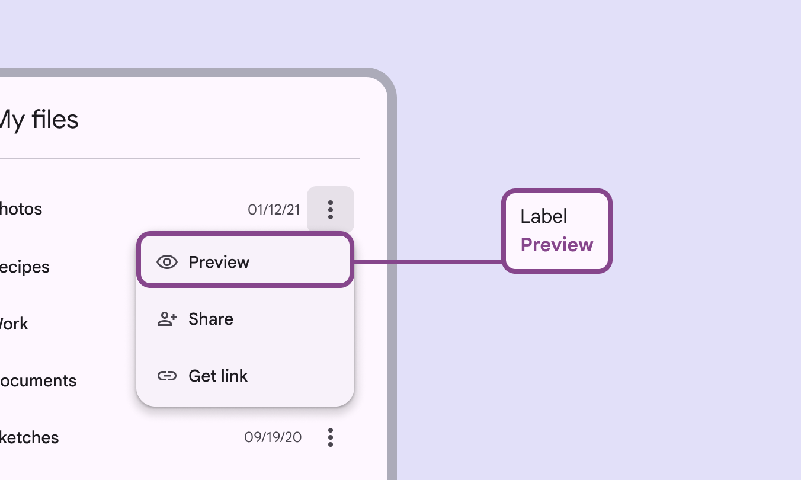
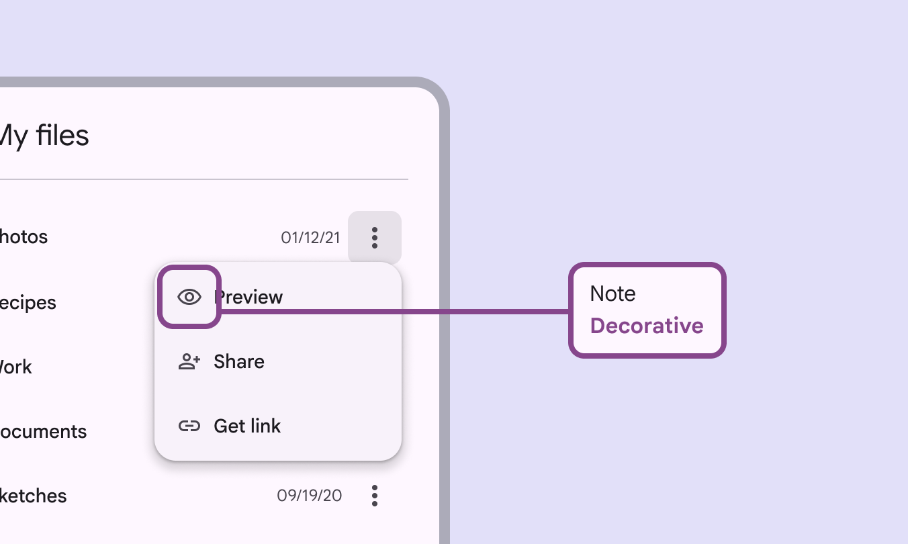

# Menus

Menus display a list of choices on a temporary surface

## Use cases

People should be able to do the following using assistive technology:

- Navigate to, open, and close a menu
- Navigate between and select menu items

## Interaction & style

Menu items need certain cues to clearly show when they're selected: 

- By default, menu items change shape and color when selected
- The default color contrast is 3:1 between selected and unselected menu items
- It's recommended to include another visual cue, like a checkmark

Use multiple visual cues like color, shape, and icons to show that an item is selected

## Flexibility & slots

Use caution when adding slots to menus:

- Make sure the menu remains accessible
- Elements must follow the rules and interaction patterns of the menu component
- Keep the same menu item padding
- Targets should be 48x48dp or larger

Don't add buttons, switches, or other direct actions into the menu item. Nested elements should only perform one action. Adding multiple actions can break keyboard navigation and screen reader functionality.

[More on slots in menus](/m3/pages/menus/guidelines#8a1684bb-99a5-4a73-91a0-068d0b406127)

exclamation Caution

Reserve the use of slots for use cases that maintain the menu’s accessibility and functionality

## Focus

**Initial focus**

When a menu opens, focus should be placed on the first menu item. This allows people using a keyboard or other assistive technologies to begin navigating the menu immediately.

**Exiting a menu**

People expect to exit a menu by:

- Selecting an option
- Tapping **Escape** or outside of the menu
- Using the system back button [More on buttons](/m3/pages/common-buttons/overview)

Where focus is placed after closing the menu depends on the app.

Keyboard navigation on Android and web:

1. **Tab** to select a menu item
2. **Space** or **Enter** to open a menu
3. **Space** or **Enter** to select a menu item
4. **Escape** to close a menu

## Keyboard navigation

| **Keys**
 | **Actions**
 |
| --- | --- |
| **Tab** | Focus lands on menu |
|
**Space** or **Enter**

 |

For closed menus: Opens menu or submenu

For open menus: Selects a menu item

 |
| **Up** and **Down** arrows |

For closed menus: Opens menu 

For open menus: Moves focus to the next item

 |
| **Left** and **Right** arrows | Opens or closes a submenu |
| **Letters** | Focus moves to the next menu item starting with letter |
| **Escape** | Closes menu |

## Interactability

Disabled [More on disabled state](/m3/pages/interaction-states/applying-states#4aff9c51-d20f-4580-a510-862d2e25e931) menu items can receive focus but aren't selectable. Dividers and gaps can't receive focus.

check Do

Disabled menu items can receive focus

close Don’t

A divider or gap can’t receive focus

## Labeling elements

Accessibility [More on accessibility](/m3/pages/overview/principles) labels are used with assistive technology devices like screen readers. The accessibility label should be the same as the menu item text. The role is [dependent on platform](/m3/pages/menus/accessibility#9c562e2c-da3a-4212-a2e3-ac91ba450b65).

The menu item’s accessibility label aligns with the UI text

|
**Element**

 |

**A11y label**

 |

**Role (Web)**

 |

**Role (Android Views)
**

 |

**Role (Jetpack Compose)**

 |
| --- | --- | --- | --- | --- |
| Menu item text | Preview | Menu item | Generic actionable element | Generic actionable element  |

For menu items with text and an icon, the icon’s accessibility label should be marked as **decorative** to avoid redundant verbalizations.

For menu items with text and an icon, the icon’s accessibility label is **decorative**

