# Menus

Menus display a list of choices on a temporary surface

A menu in the **vibrant** color style is more expressive, and one with **standard** colors is more utilitarian

## Usage

Use a menu to show a temporary set of actions. To show actions on screen at all times, use a toolbar [More on toolbars](/m3/pages/toolbars/overview) instead. A menu takes up less space than a set of radio buttons [More on radio buttons](/m3/pages/radio-button/overview) or chips [More on chips](/m3/pages/chips/overview). 

### Color options

Menus have two color mappings:

- Standard: Surface-based, lower visual emphasis
- Vibrant: Tertiary-based, higher visual emphasis

Vibrant menus are more prominent, and should be used sparingly.

On web, menus can open submenus

### Opening menus

Menus temporarily appear in front of all other permanent UI elements. A menu should open when a person:

- Selects an element, such as an icon, button [More on buttons](/m3/pages/common-buttons/overview), or text field
- Performs a specific action to trigger the menu, like right-click or press-and-hold

Use menus in situations that need extra actions, like: 

- Overflow menus
- Text field dropdown menus
- Select menus
- Context menus

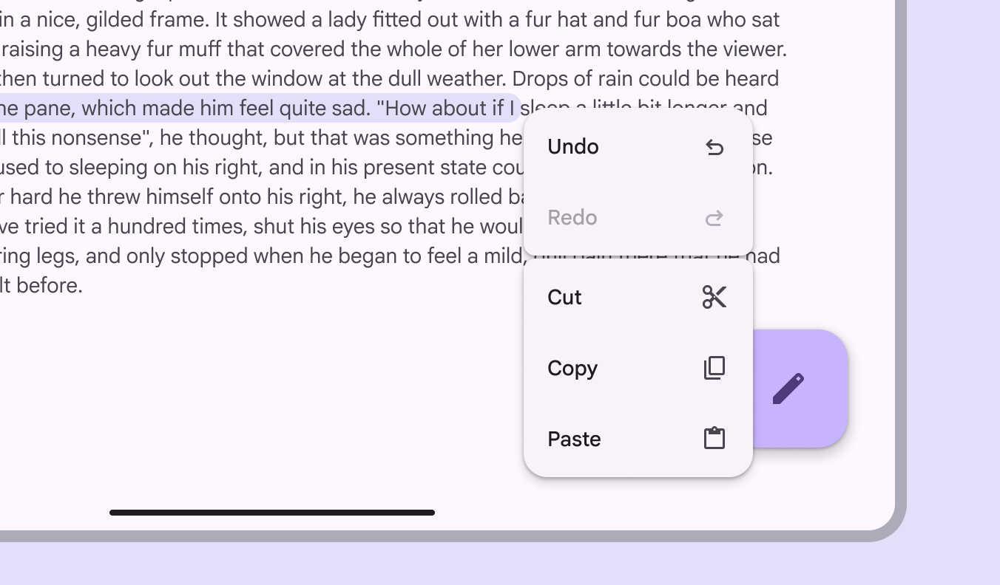

Menus appear in front of all other UI elements

### Menu groups

Vertical menu items can be grouped by adding a divider or small gap. Use groups to bundle similar actions together.



[Gaps and dividers guidelines](/m3/pages/menus/guidelines#d75ac70c-9122-4b4c-bd60-b856bc66c9bc)

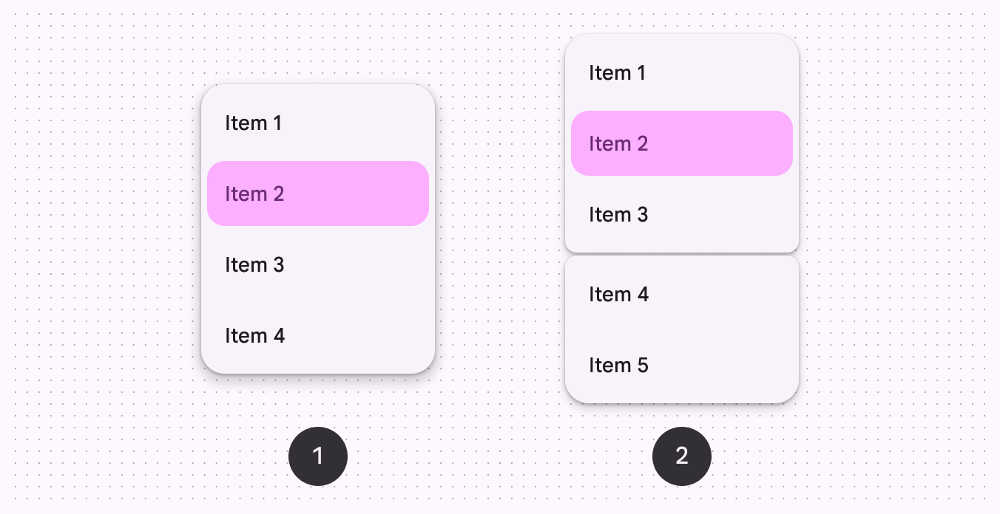

Menu items can be grouped to be more scannable:

1. Standard vertical menu
2. Grouped vertical menu

### Context menus

Context menus provide a list of additional actions a person can take on an item. A secondary click, like a right-click on a mouse or a two-finger tap on a trackpad, opens a context menu. 

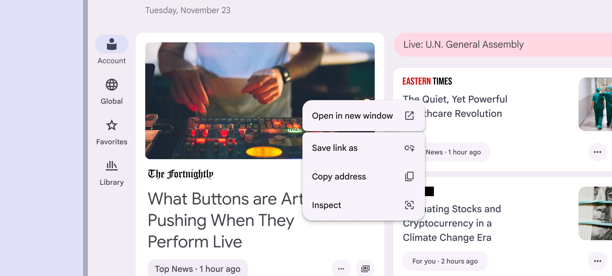

A context menu appears when right clicking with a mouse or trackpad. It can reveal key actions related to the associated content.

## Anatomy

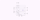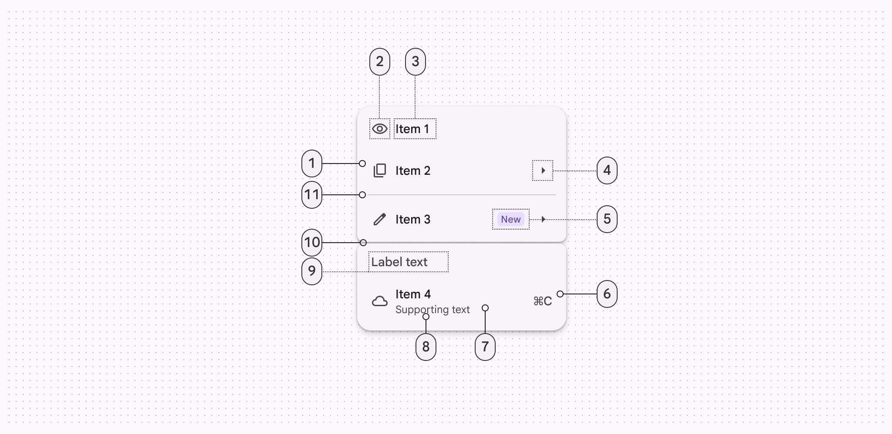

1. Menu item
2. Leading icon (optional)
3. Menu item text
4. Trailing icon (optional)
5. Badge (optional)
6. Trailing text (optional)
7. Container
8. Supporting text (optional)
9. Label text (optional)
10. Gap (optional)
11. Divider (optional)

### Menu items

Menu items can include label text, leading icons, trailing icons, and keyboard commands. When a menu item can only be used under specific conditions, it should appear disabled [More on disabled state](/m3/pages/interaction-states/applying-states#4aff9c51-d20f-4580-a510-862d2e25e931) rather than be removed.

The **Redo** action is disabled when that action isn’t available

### Gaps & dividers (optional)

Gaps and dividers can be used to separate and group menu items.

**Gaps**

Use a gap to visually divide menu items into distinct groups. Gaps are more expressive than dividers and make the relationship between items clear.

- Avoid changing the size of the gap
- Limit the number of gaps in a menu to one or two
- Don’t use gaps in scrollable menus

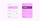

Gaps separate menu items using expressive shapes

star

Note:

Gaps are not currently available on web

**Dividers** 

Dividers create a more subtle separation between items. Use a divider for:

- Scrollable menus
- Text fields with a dropdown menu, where a grouped treatment isn’t appropriate

On web, use a divider to separate menu items. 

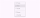

Dividers separate menu items in baseline menus and on web

## Flexibility & slots

Menus have custom slots that support more flexible item layouts. When creating a complicated menu, think of the menu item as a container with a swappable slot. Slots work best with simple content such as:

- Images
- Progress indicators
- Color swatches

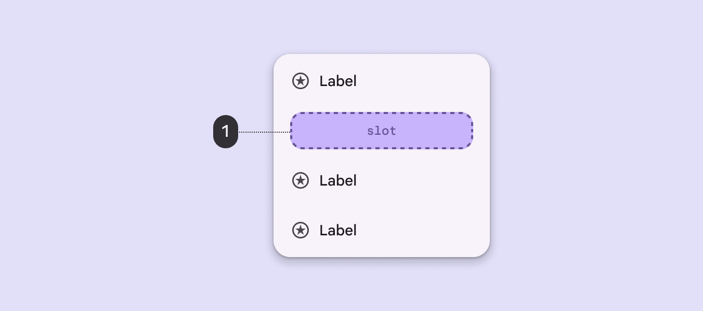

Slots can appear anywhere in a menu

**Slot accessibility**

Use caution when adding slots to menus:

- Make sure the menu remains accessible
- Elements must follow the rules and interaction patterns of the menu component
- Keep the same menu item padding
- Targets should be 48x48dp or larger

Don't add buttons, switches, or other direct actions into the menu item. Nested elements should only perform one action. Adding multiple actions can break keyboard navigation and screen reader functionality.

[More on required accessibility guidelines](/m3/pages/menus/accessibility/)

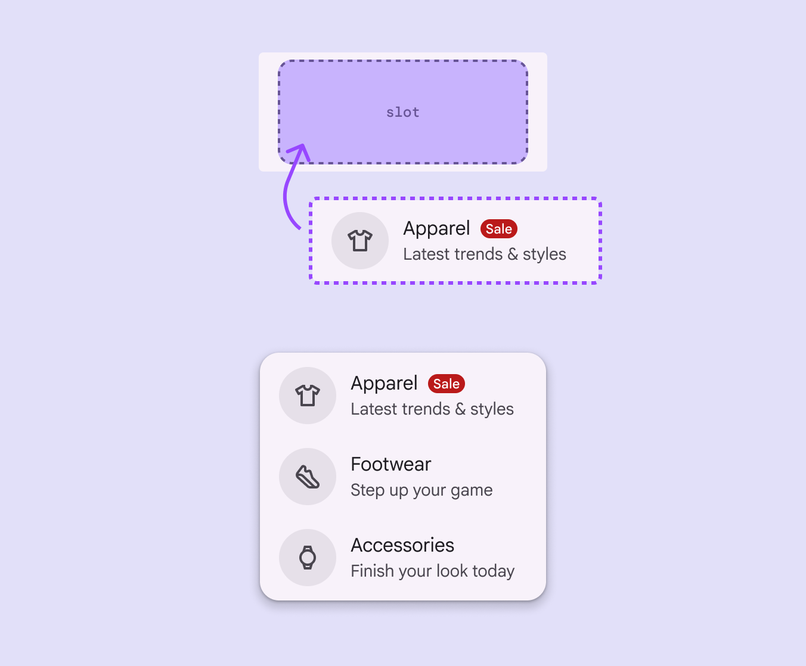

exclamation CautionReserve the use of slots for use cases that maintain the menu’s accessibility and functionality 

## Placement

A menu is positioned relative to the window edge. It typically appears below, next to, or in front of the element that generates it. If a menu is in a position to be cut off, it should automatically reposition to appear to the left, right, or above the element that generates it.

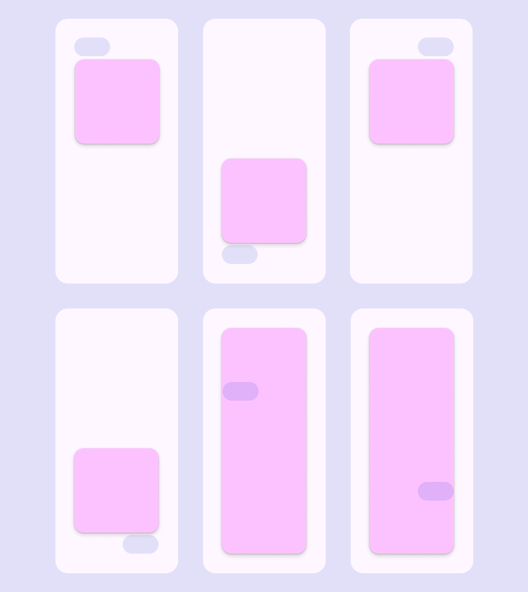

Menus can appear around or in front of the element that opened them

### Submenus

Submenus should open next to the parent menu item without overlapping it. Submenus are best used on large screens where there's space. [See adaptive guidance](/m3/pages/menus/guidelines#e588ae16-7a76-4bf9-8532-8d931a13ca35) for alternatives on mobile.



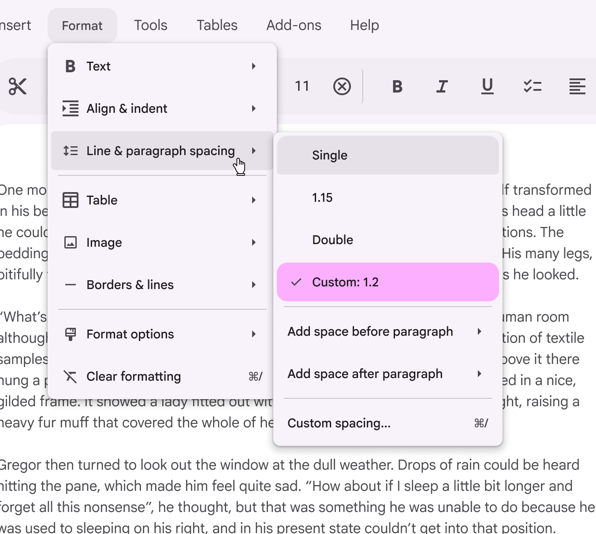

Position submenus to the side of the parent item

star

Note:

Submenus are not currently available on Jetpack Compose

## Adaptive design

### Compact window sizes

Consider adapting menus into bottom sheets [More on bottom sheets](/m3/pages/bottom-sheets/overview) on small screens. They have more space to display additional items and longer labels. 

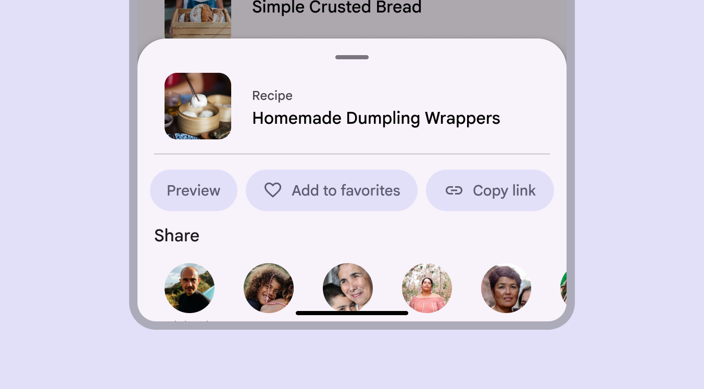

A bottom sheet can replace a menu on smaller screens

### Other window sizes

On medium [More on medium window size class](/m3/pages/breakpoints/medium) and expanded [More on expanded window size class](/m3/pages/breakpoints/expanded) windows, menus are most effective as they appear in context with the content. On larger screens, menus can also display more items, and can use submenus to organize complex sets of options.

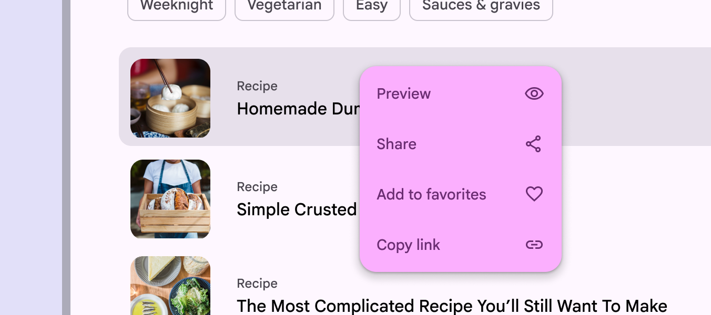

On large screens, a menu is often more appropriate than a bottom sheet

## Behavior

### Appearing

A menu can appear when a person interacts with an element on the page, like a button, text field, filter chip, or highlighted text. A menu’s position on screen affects where and how it appears. If opened at the top of the screen, it expands downwards to avoid being cropped. Menus at different positions on a screen open in different directions, adapting to the available space

A menu can open from a split button

A menu can appear in context, like next to highlighted text or a selected image

A menu can open from a text field

A menu can open from a filter chip

**Motion**

Menus use an enter and exit transition. This animation creates a relationship between the menu and the element that generates it. When a menu expands, the trigger element becomes pressed. When an item is selected, a ripple appears on touch. A menu expands when opened, and has a ripple when an item is selected

In dense products, such as on desktop, menus can open instantly to reduce motion. Desktop menus can open instantly

### Filtering

A menu can include a text field to filter options. This pattern is also known as autocomplete. As someone types, the list of menu options filters to show relevant results. This helps people quickly find the right option from a long list. Menu items ease into their new position as the menu is filtered. As a person types in the text field, the menu options filter to match the input

### Scrolling

Menus can scroll when all menu items can’t display at once. In this state, menus show a persistent scrollbar. Don’t use gaps if a menu scrolls; this is currently unsupported. When content is scrollable, menus display scrollbars

### Selecting

When a menu is opened, the corresponding button [More on buttons](/m3/pages/common-buttons/overview) or icon button [More on icon buttons](/m3/pages/icon-buttons/overview) should remain the same visually, with the addition of a pressed state. This should happen even when opening from a keyboard shortcut.

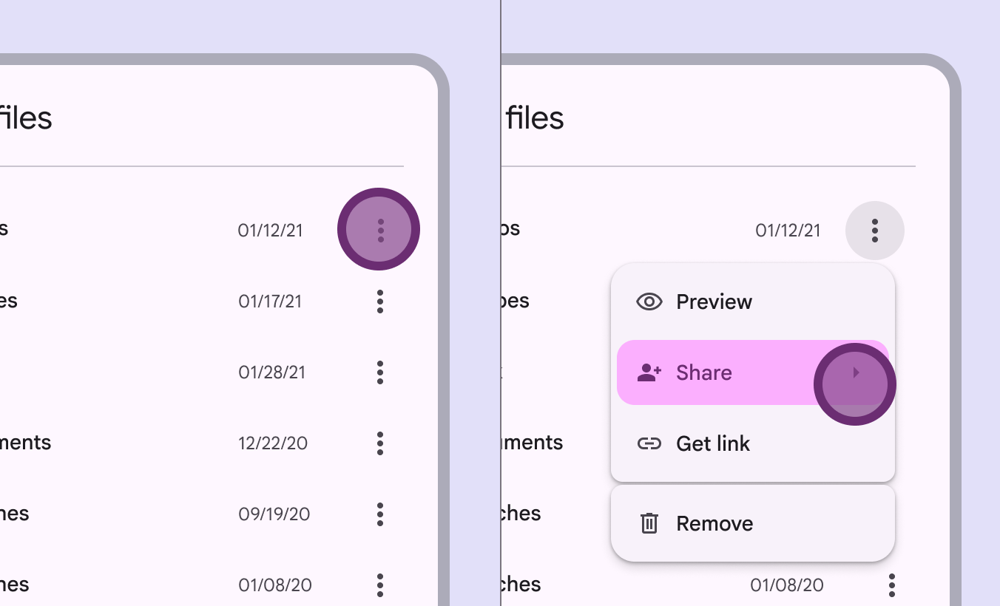

Tapping the icon triggers a menu. Choosing a menu option doesn’t change the icon generating the menu.

### Single- and multi-select menus

Menus can allow either single-select or multi-select actions:

- **Single-select** menus can have one item selected at a time. When a new item is selected, the previously selected item is automatically unselected.
- **Multi-select** menus can have many selected items. They stay open until the person dismisses the menu.

[More on selection accessibility requirements](/m3/pages/menus/accessibility#149778c9-eb42-4a56-8a0b-9932181ac2cd)

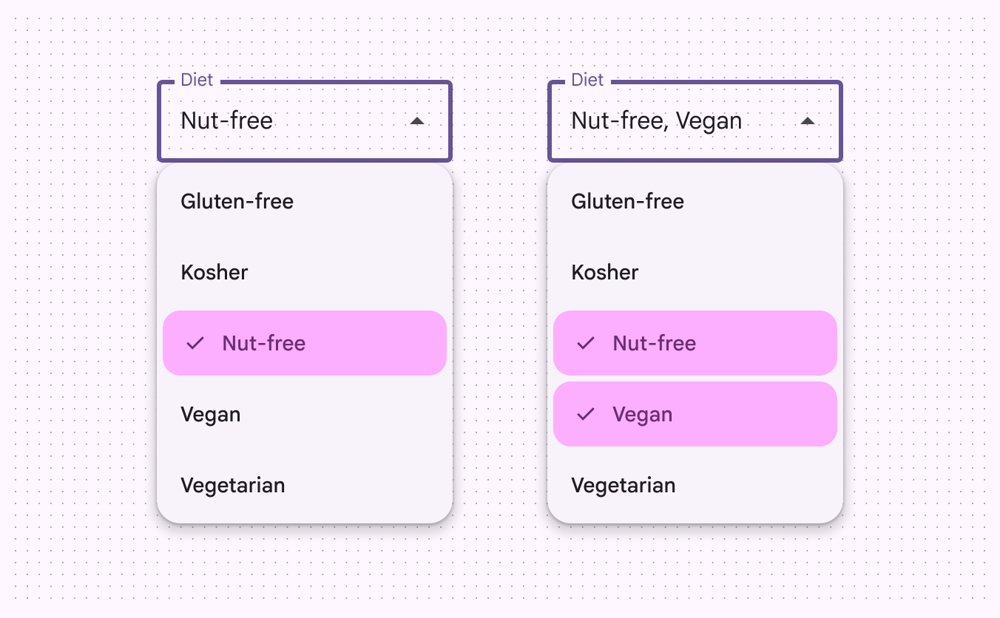

Menus can be single- or multi-select

## Focus

When a menu has multiple submenus, focus follows the current hovered or focused submenu. 

**Shape morphing**

As a person moves from one submenu to the next, the corners of the focused submenu become more rounded, while the unfocused submenu becomes less rounded. This adds a dynamic quality to menu interactions. On a custom menu, the corner shape changes to indicate focus as the cursor moves across submenus

## Density

On web only, density levels control the spacing between elements. Increasing density decreases the top and bottom padding. [More on layout density](/m3/pages/understanding-layout/density)

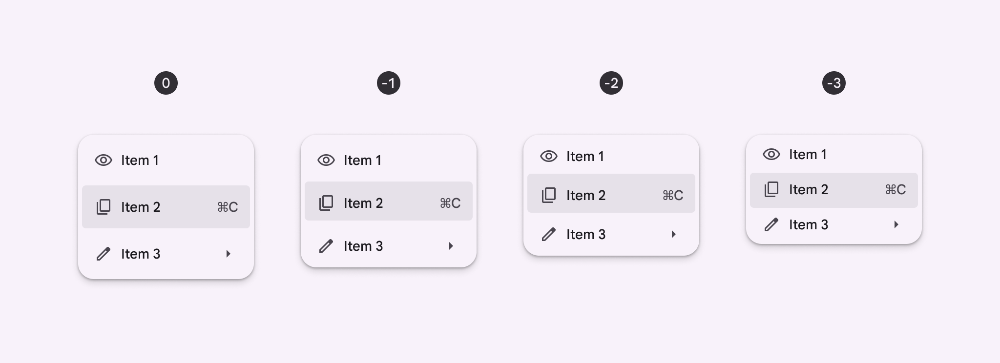

Density of menus from 0 to -3

