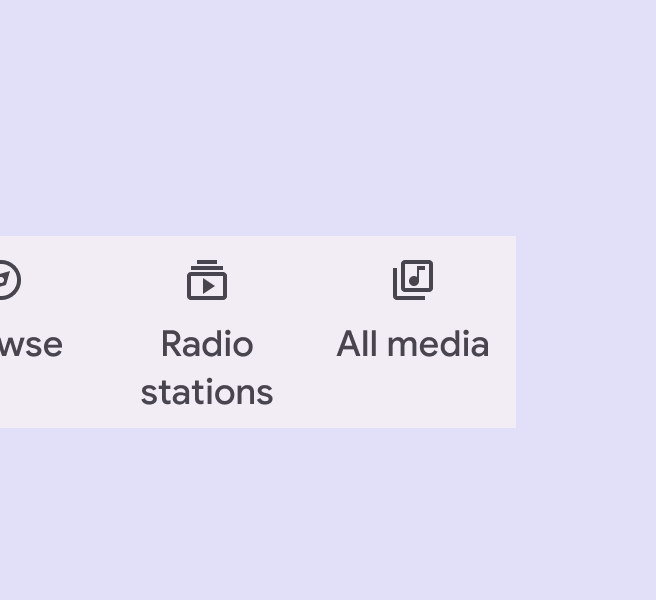
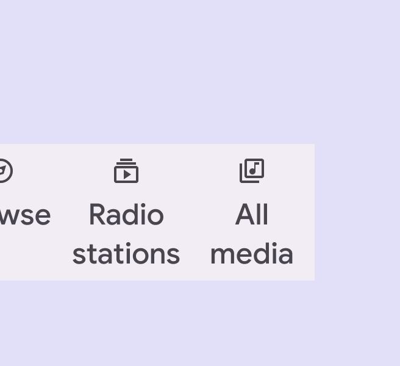
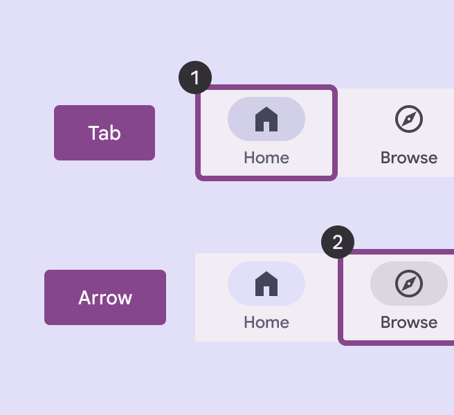
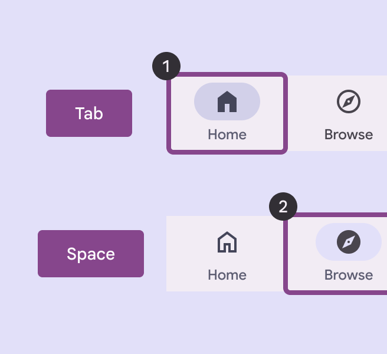
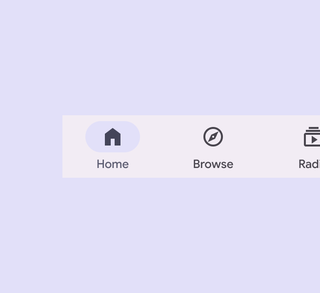
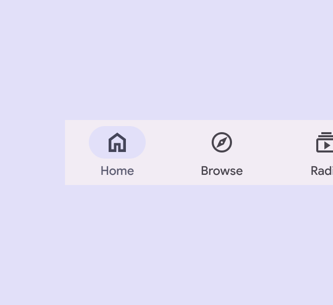
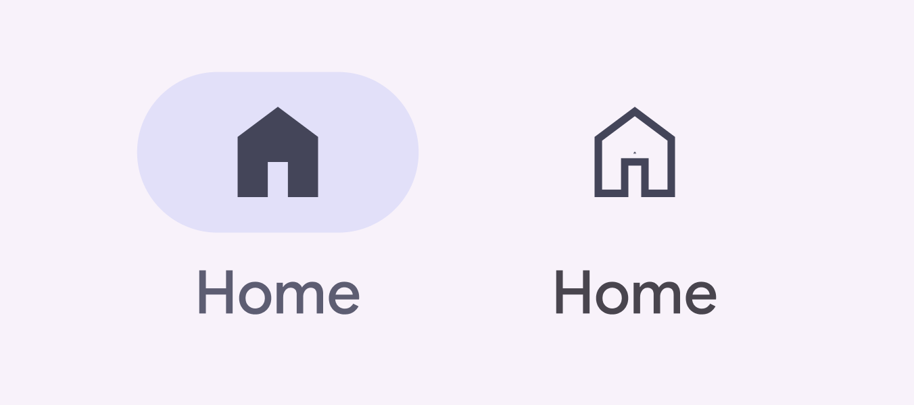
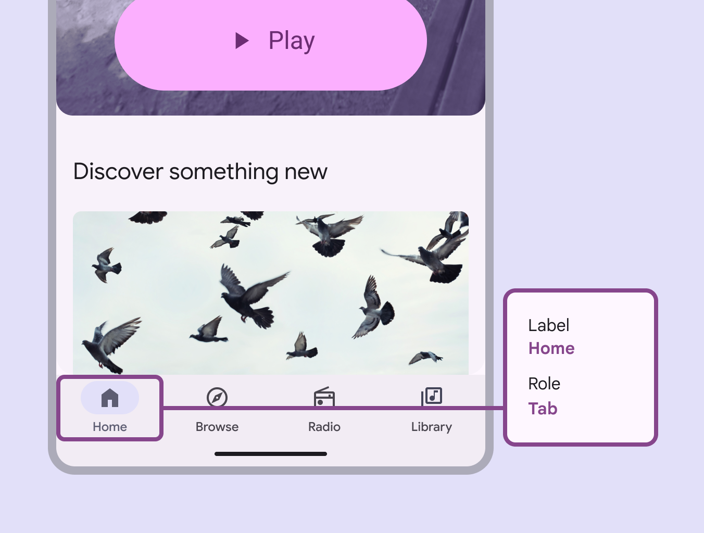
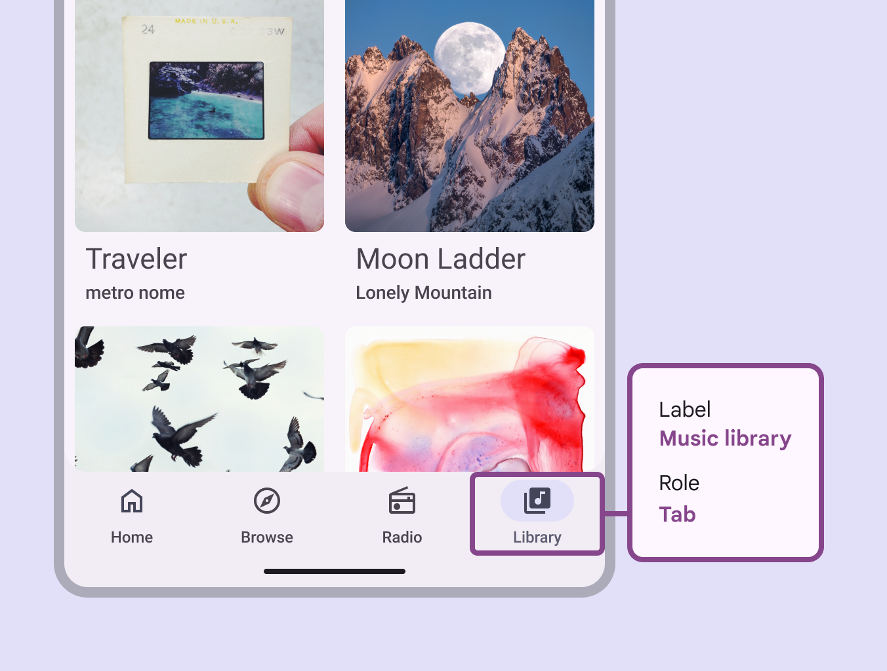

# Navigation bar

Navigation bars let people switch between UI views on smaller devices

## Use cases

People should be able to do the following using the assistive technology:

- Move between navigation destinations
- Select a particular navigation destination from a set
- Get appropriate feedback based on input type

## Interaction & style

**Touch**

- When a navigation item is tapped, the active indicator appears in place, providing feedback that it’s selected
- A touch ripple passes through the indicator
- The icon switches from outlined to filled
- The icon changes color

Touch: Tap

**Cursor**

- When hovered, the active indicator appears in a reduced state providing a visual cue that the destination is interactive
- When clicked (in both active and inactive states), a ripple passes through the indicator
- The icon switches from outlined to filled
- The icon changes color, becoming darker

Cursor: Hover, Click

### Text scaling and truncation

When someone sets their device to show a larger text size, the navigation bar should grow vertically to accommodate larger labels while retaining the default padding. It’s okay for scaled text to wrap in navigation items. To remain accessible, ensure the full label is always visible on-screen at up to 2x text sizing. Beyond this size, text can truncate. 

Text scaled to 1.5 size

Text scaled to 2x size

## Initial focus

Initial focus lands directly on the first navigation item, since that is the first interactive element of the component.

Focus lands on first navigation item

The navigation item is selected with Space/Enter

## Visual indicators

Use a filled icon with a bold label for selected destinations. For unselected destinations use an outlined icon with a medium label. If an icon doesn’t have a filled style, use a thicker or heavier version of the icon instead.

check Do

Use a filled icon for the selected navigation destination to differentiate from the other destinations

close Don’t

Don’t use outlined icons on selected nav items

When selected, the icon fills, darkens, and is backed by an active indicator shape

## Keyboard navigation

<table style="width:100%"><tbody><tr><th>Keys</th><td>Actions</td></tr><tr><th>Tab</th><td>Move between navigation items</td></tr><tr><th>Space / Enter</th><td>Selects the focused navigation item</td></tr></tbody></table>

## Labeling elements

The accessibility label for a navigation item is typically the same as the destination name.

A navigation bar’s accessibility label can incorporate its adjacent UI text

When the visible UI text is ambiguous, accessibility labels need to be more descriptive. For example, a navigation destination visibly labeled **Library** would benefit from additional information in its accessibility label to clarify the destination’s intent. Note: On Android Views (MDC-Android), a more descriptive accessibility label is not available and the role is not announced.

While the visible label text reads **Library**, the accessibility label for this destination clarifies its function: **Music library**

