# Navigation bar

Navigation bars let people switch between UI views on smaller devices

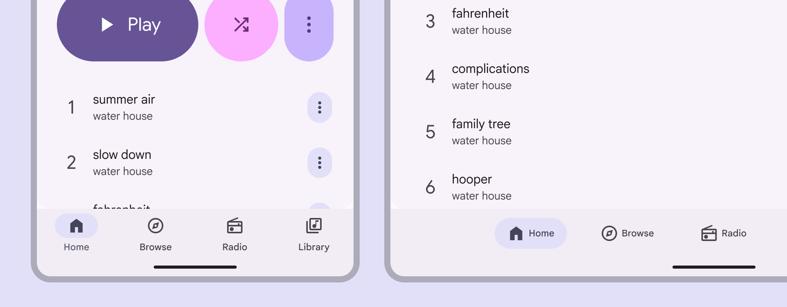

Navigation bars adapt to different window sizes

## Usage

Navigation bars provide access to three to five destinations. The nav bar is positioned at the bottom of windows for convenient access. Each destination is represented by an icon and label text. One navigation destination is always active. When a navigation bar icon is tapped or focused, people are taken to the navigation destination associated with that icon.

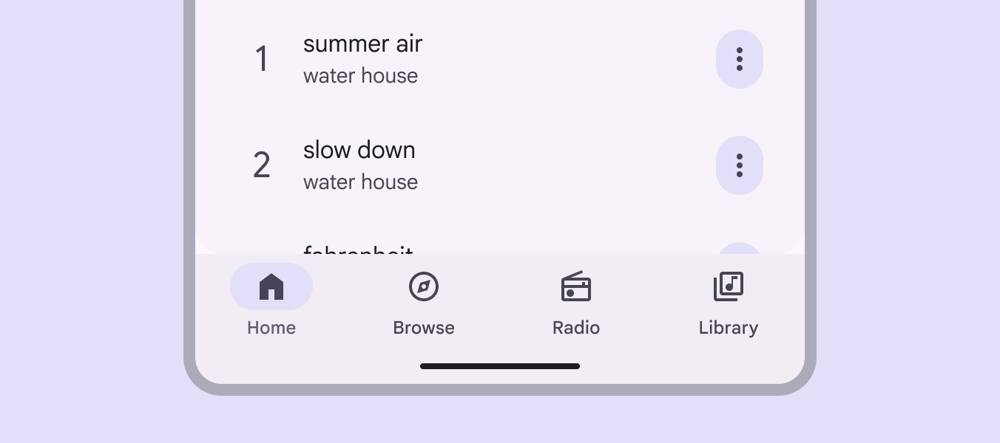

Navigation bars can have three to five destinations

Navigation bars should be used for:

- Three to five main pages in the product
- Mobile or tablet only

Navigation bars shouldn’t be used for accessing single tasks, such as viewing one email.

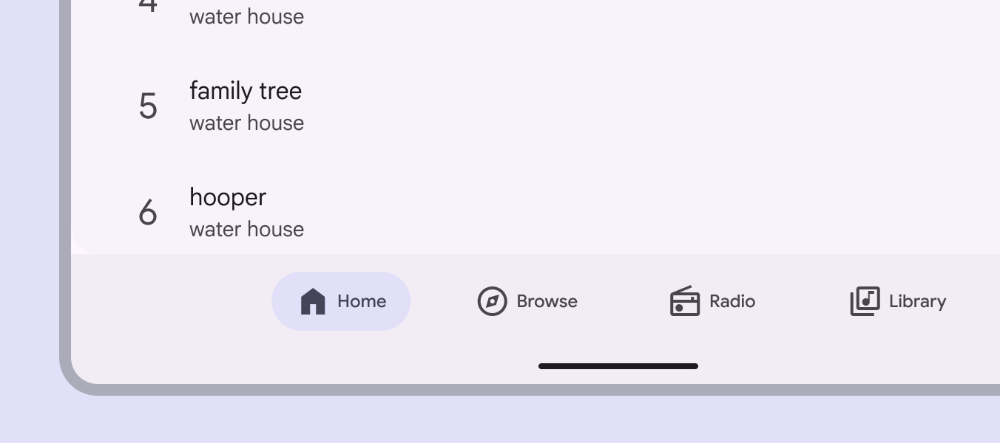

On mobile or tablet, navigation bars should be used for top-level destinations

The navigation items can be **vertical** or **horizontal**.

- Use vertical items in compact windows [More on compact window size class](/m3/pages/breakpoints/compact), like mobile
- Use horizontal items in medium windows [More on medium window size class](/m3/pages/breakpoints/medium), like tablets

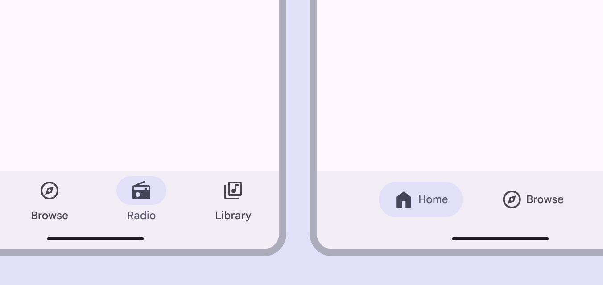

Vertical navigation items work best in compact windows. Horizontal items work best in medium windows. For products with more than five navigation items, don’t use a navigation bar; the elements may collide and there likely won’t be enough space for translated text. Instead, consider using tabs [More on tabs](/m3/pages/tabs/overview) to organize similar content within a page, or hide the navigation behind a menu icon using a modal expanded navigation rail [More on navigation rails](/m3/pages/navigation-rail/overview).

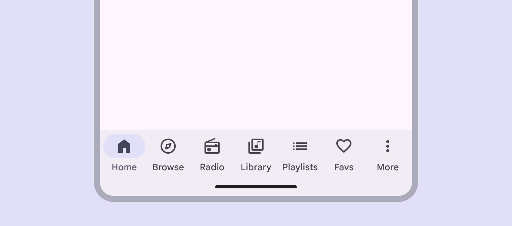

close Don’t

Avoid putting more than five navigation items in a navigation bar

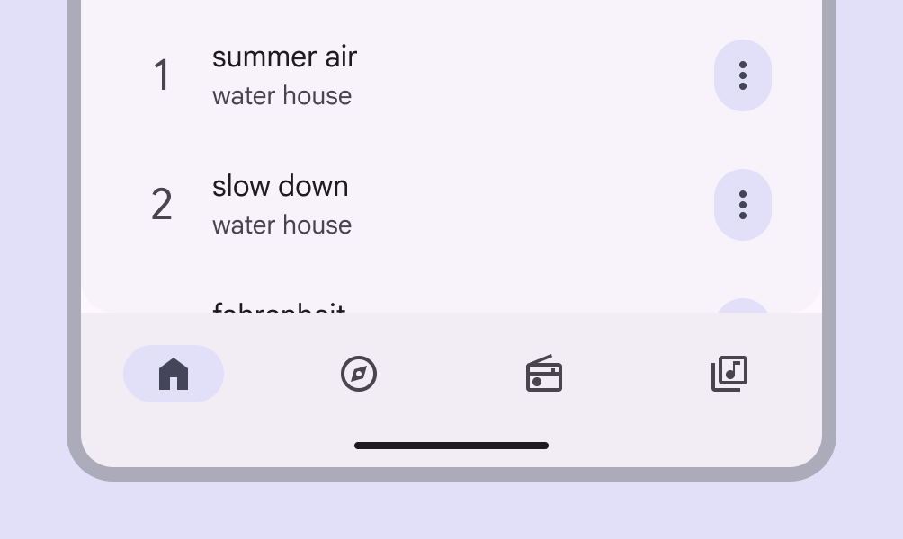

close Don’t

Don’t remove the labels from navigation items

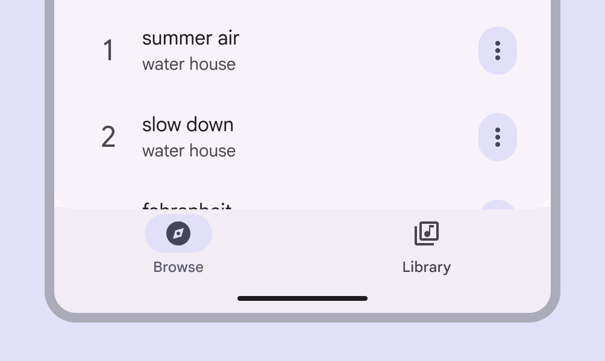

close Don’t

Don’t use a navigation bar for fewer than three destinations. Instead, use tabs.

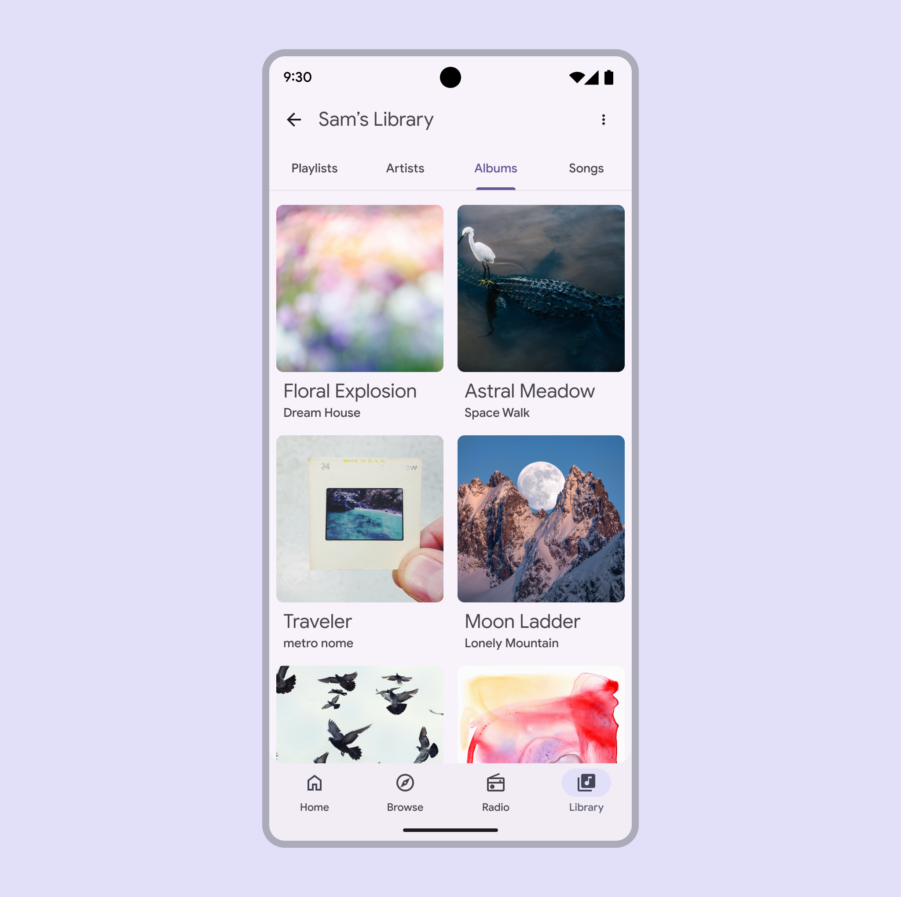

Use navigation for distinct pages and tabs for related content within a page

close Don’t

Navigation bar destinations have fixed positions. Don’t scroll them or modify their positions.

## Anatomy

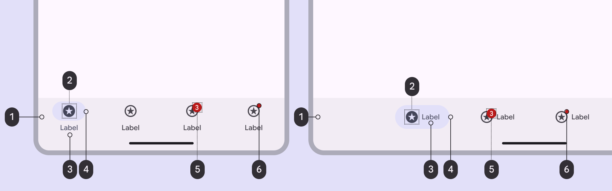

1. Container
2. Icon
3. Label text
4. Active indicator
5. Large badge (optional)
6. Small badge (optional)

### Container

The container should always be placed at the bottom of the product and span the full length of the window. Navigation items are centered within the container. The container has a color fill to provide separation from other content.

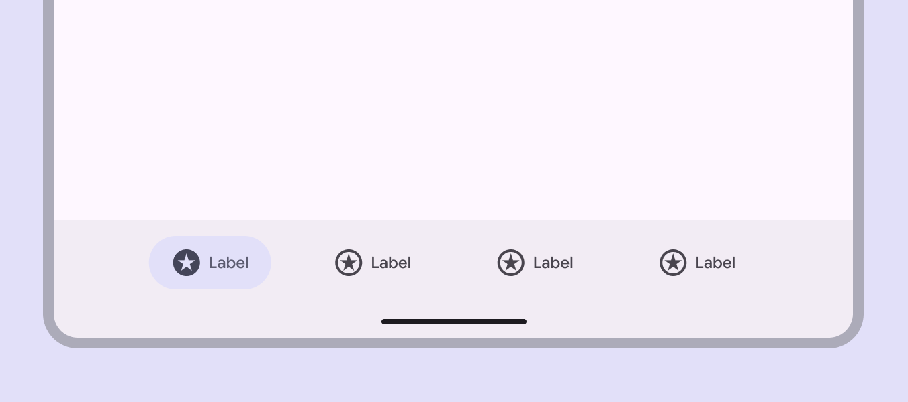

The navigation bar container holds all elements

### Navigation items

Navigation items hold all elements for each destination: the icon, label text, and active indicator. They can be **vertical**, with the text below the icon and indicator, or **horizontal**, with the icon and text beside each other inside the indicator. Vertical items are best in compact windows [More on compact window size class](/m3/pages/breakpoints/compact), and horizontal items are best in medium windows [More on medium window size class](/m3/pages/breakpoints/medium). Horizontal items are centered in the nav bar with outer margins.

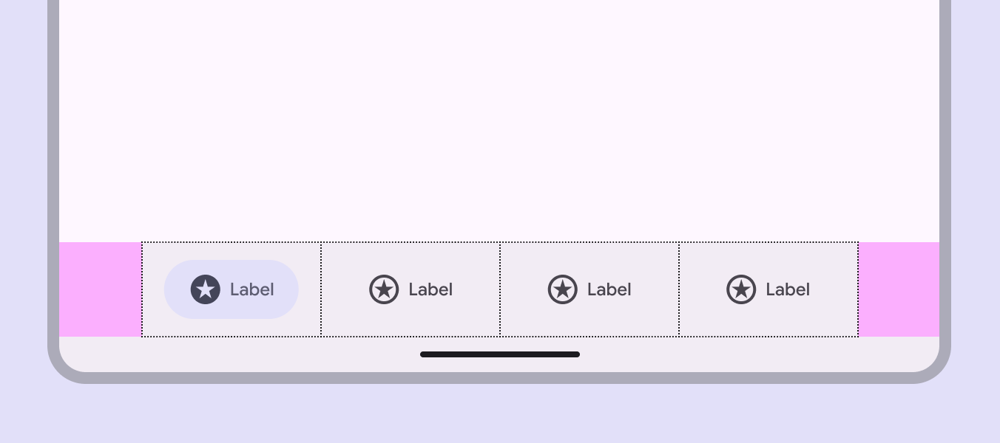

The navigation bar is divided into equal-width segments with padding from the window edge

### Icons

Navigation rail items must use icons that symbolize the content of their page. Browse [popular icon](https://fonts.google.com/icons). Use a filled icon for the active destination and outlined icons for inactive destinations. If an icon doesn’t have a filled version, apply **semibold** weight to the icon instead.

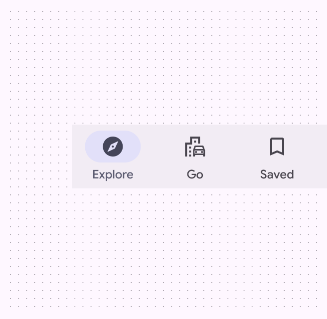

check Do

Use filled icons when the navigation item is active

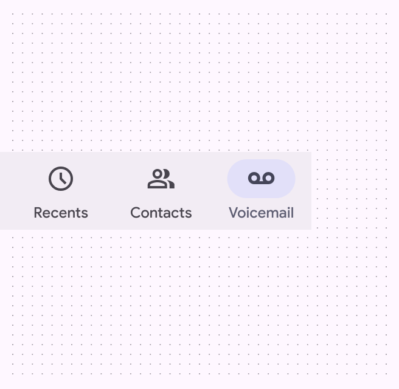

exclamation Caution

If a filled version of an icon is unavailable, the icon’s weight must increase

Active and inactive icons must have a minimum 3:1 contrast ratio with the container.

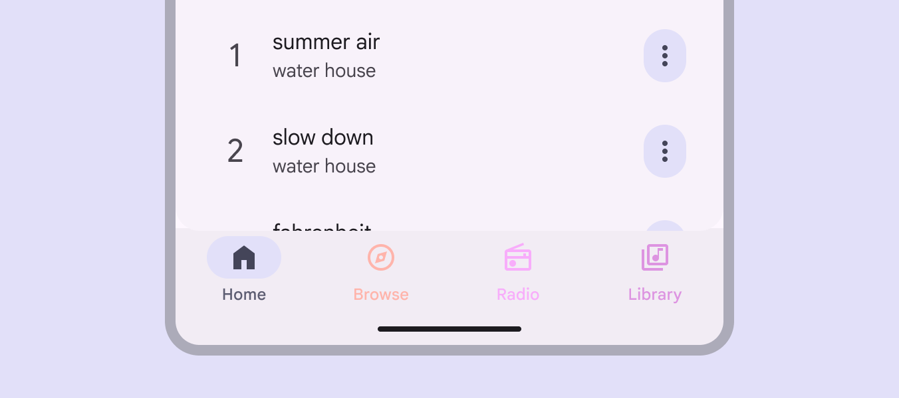

close Don’t

Don’t use multiple or low-contrast colors in a navigation bar, as they make it harder for people to distinguish the active item and navigate to other destinations

### Active indicator

The active indicator shows which page from the nav bar is currently being displayed.

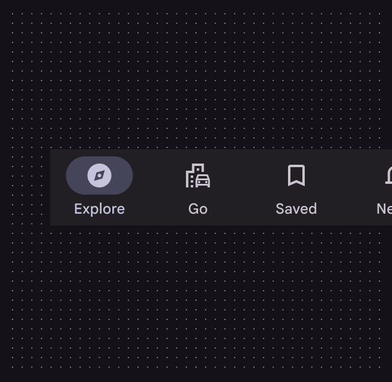

check Do

Use the active indicator only for the active destination

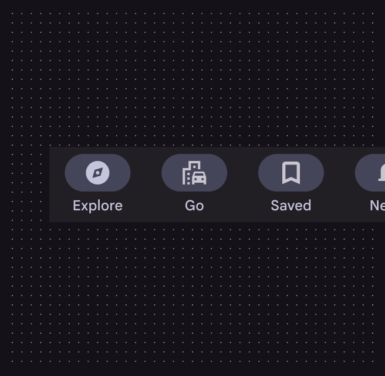

close Don’t

Don’t use the active indicator for more than one destination at a time

### Label text

The label text should be a short, meaningful description of each navigation destination and another way for people to understand an icon’s meaning. All navigation items require a label text. It should be 1-2 words.

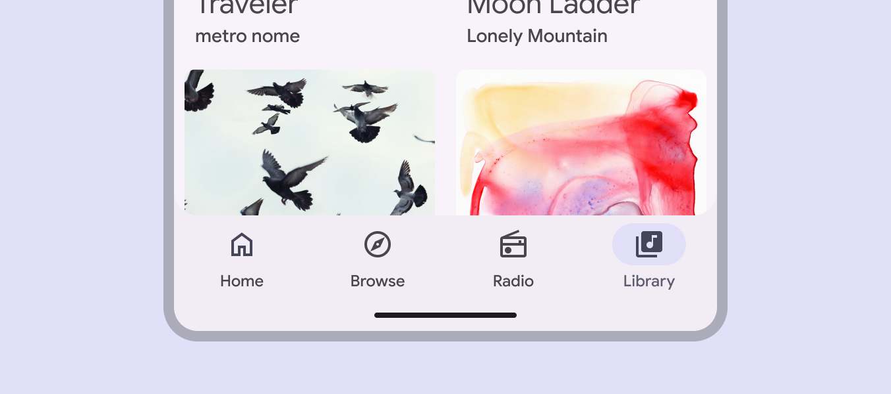

Label text must be brief and clear

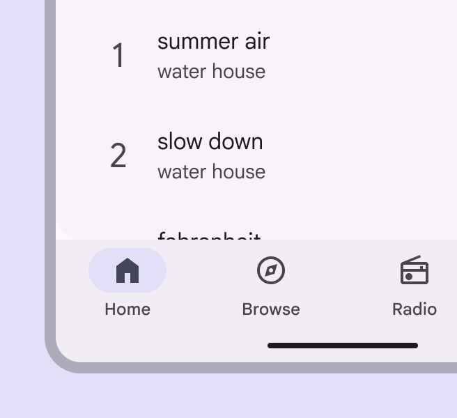

check Do

Use brief text labels to identify the purpose of a destination

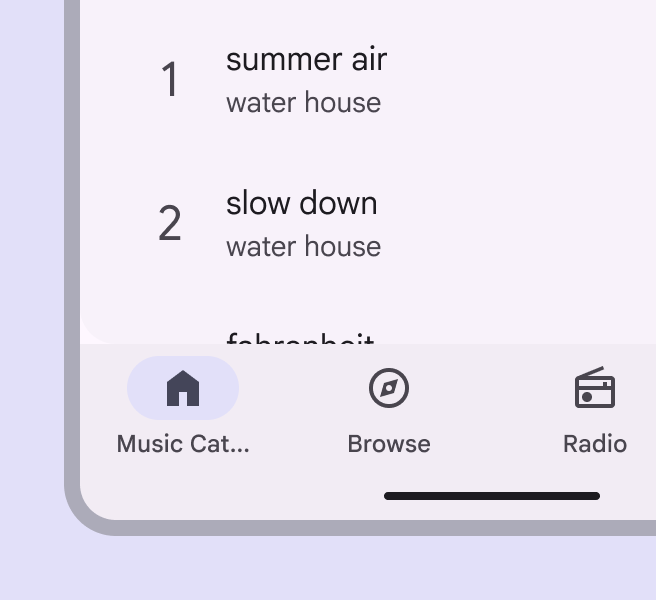

close Don’t

Don’t wrap or truncate text as it can make the label hard to understand

close Don’t

Don’t shrink longer text to fit on a single line

### Badges (optional)

Navigation bars can display badges in the upper right corners of the destination icon. Badges can contain dynamic information, such as the number of new messages.

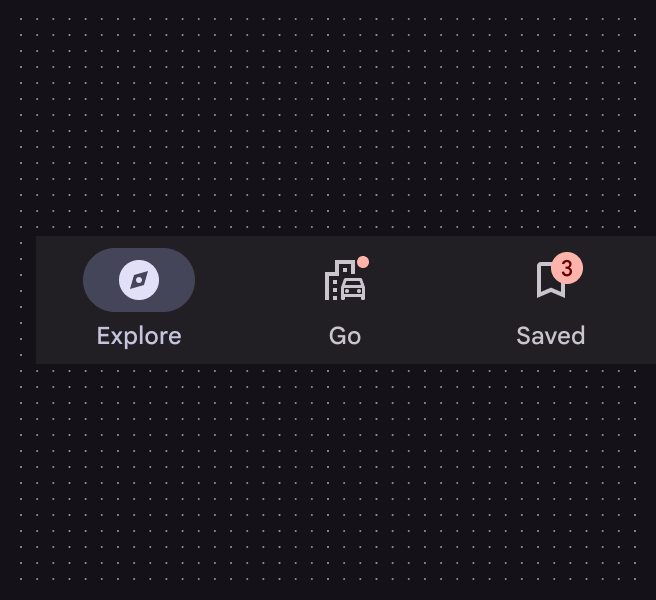

Use a small badge to indicate an update, and a large badge to show the amount of updates

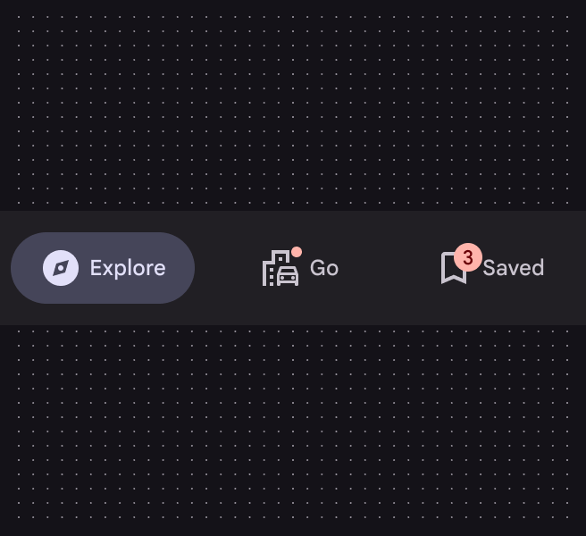

Badges overlap the icon in both vertical and horizontal navigation items

## Placement

The floating action button (FAB) is placed above the navigation bar. Nav bars are always placed at the bottom of the window.

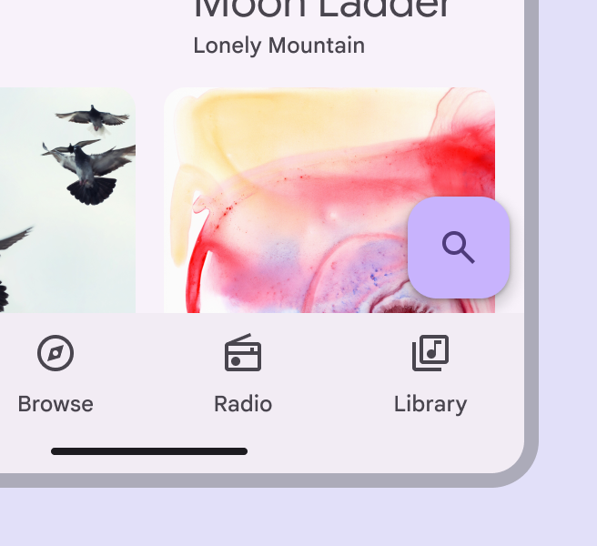

check Do

The FAB should be right-aligned above the navigation bar

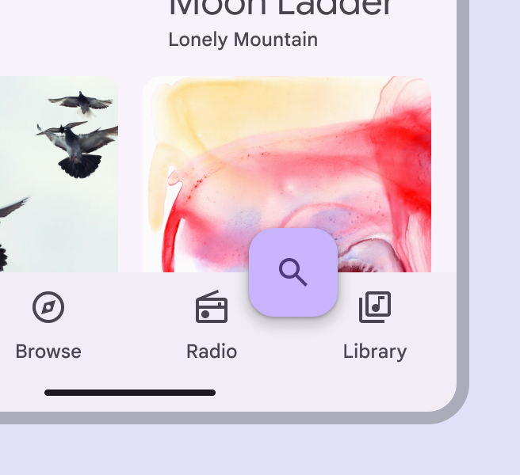

close Don’t

Don’t cover the navigation bar with a FAB

Navigation bars can be temporarily covered by dialogs, bottom sheets, navigation drawers, the on-screen keyboard, or other elements needed to complete a flow. They should not be permanently obstructed on any screen. The search feature of the screen triggers the on-screen keyboard, temporarily covering the bottom navigation bar until the search flow is completed

## Adaptive design

Adaptive design allows an interface to respond or change based on context, such as the user, device, and usage. More on [adaptive design](/m3/pages/layout-overview/adaptive-design)

### Resizing

Only use navigation bars for compact [More on compact window size class](/m3/pages/applying-layout/compact) and medium [More on medium window size class](/m3/pages/applying-layout/medium) window size classes. 

**Compact**: For narrow windows, use a navigation bar or modal navigation rail.

**Medium**: Use a navigation bar or navigation rail. Decide based on whether horizontal or vertical space is more important.

**Expanded and extra-large**: Use a navigation rail instead. Decide based on available window space and the number of navigation destinations. Navigation bars are best suited for compact and medium window sizes

The navigation bar container spans 100% of the window width.

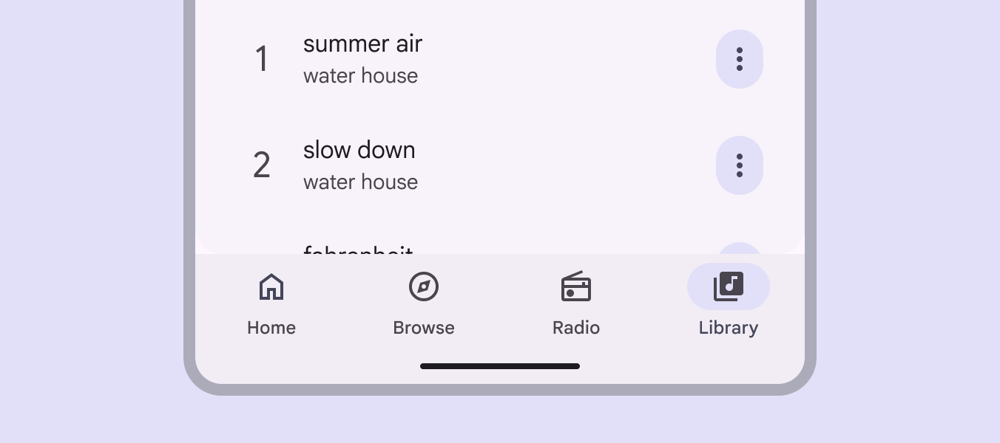

Navigation bars use 100% of the screen width

The navigation bar is used on smaller devices. It’s not intended for desktop.

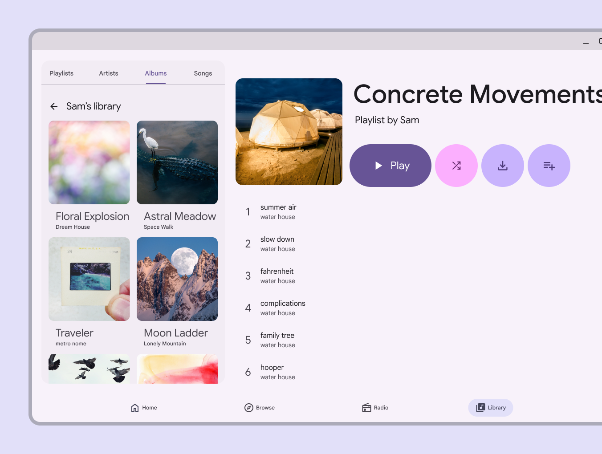

close Don’t

Don’t use navigation bars for desktop layouts. Instead, use a navigation rail or tabs.

### Presentation

In medium window sizes, use horizontal nav items to better use available space. Horizontal nav items should remain centered with the same padding at each window size.

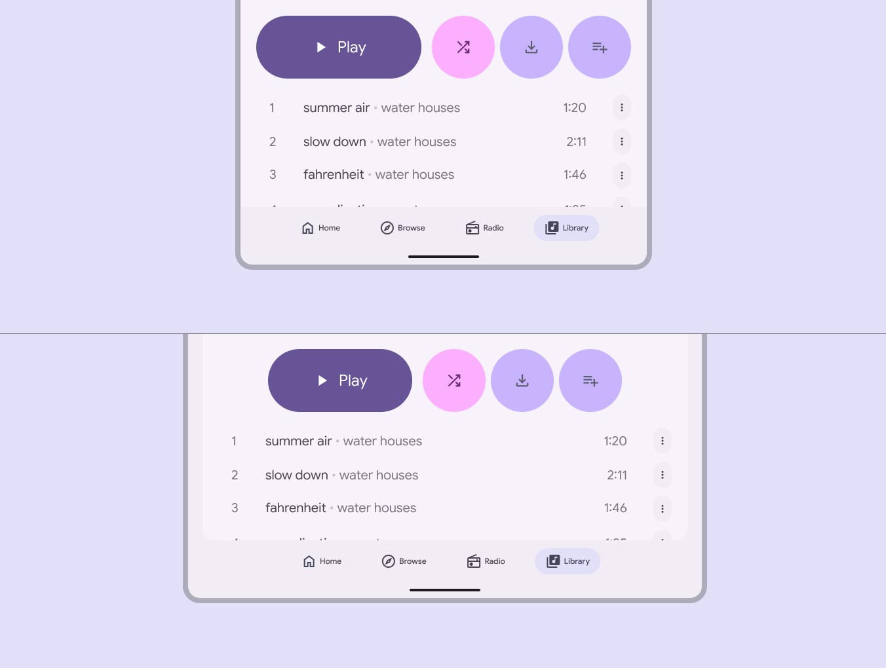

A navigation bar in horizontal orientation keeps the same spacing between destinations

## Behavior

### Navigation

When selecting a navigation bar item not currently selected, the product navigates to that destination’s screen using a [top level](/m3/pages/motion-transitions/transition-patterns#f852afd2-396f-49fd-a265-5f6d96680e16) transition pattern. It can either remember where you left off, or reset to the default view.

1. **Preserve state**: If someone has interacted with this destination, it returns to their scroll position, current tab, and in-line search status.
2. **Reset state**: Any prior user interactions are reset, including scroll position, tab selection, and in-line search. Choose the behavior that best suits the product and user needs. For example, an app that requires frequent switching between sections should preserve each section’s state. After selecting an item on the bottom navigation bar, the app navigates to that destination’s screen

Re-selecting the currently active destination should reset the scroll position to the top of the page.

**Don't swipe between destinations**
Swiping across the screen does not navigate between destinations, and is not supported by the navigation bar. Swipe behavior should be reserved for related items, such as cards in a carousel, or actions such as archiving a list item. Selecting the already selected navigation item scrolls to the top of the screen

### Scrolling

Upon scroll, the navigation bar can appear or disappear. Don’t hide the navigation bar on scroll when a [screen reader](https://m3.material.io/foundations/overview/assistive-technology#ec6f3e84-a51c-4dc0-a353-6844f5bde698) is active. Scrolling downward can hide the navigation bar; scrolling upward reveals it

### Selection

The icon becomes filled and the active indicator expands from the center of the icon when switching between destinations. The active indicator animation should only apply on one axis to better represent a flat, shared plane. An active indicator appears when the item is selected. When a destination is tapped, the destination screens use a [top level](/m3/pages/motion-transitions/transition-patterns#f852afd2-396f-49fd-a265-5f6d96680e16) transition pattern. In addition, the icon becomes filled and the active indicator expands from the center of the icon. Tapping a destination uses a top level transition pattern

