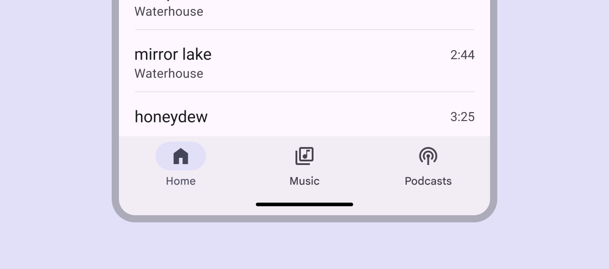
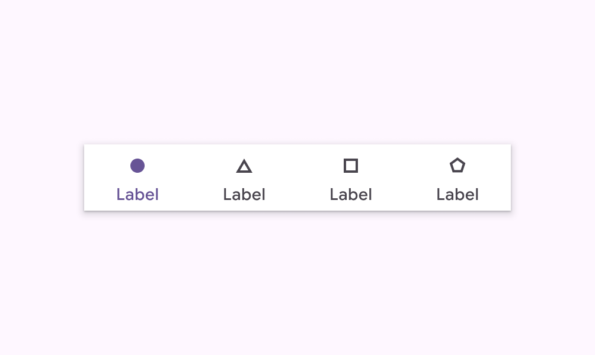
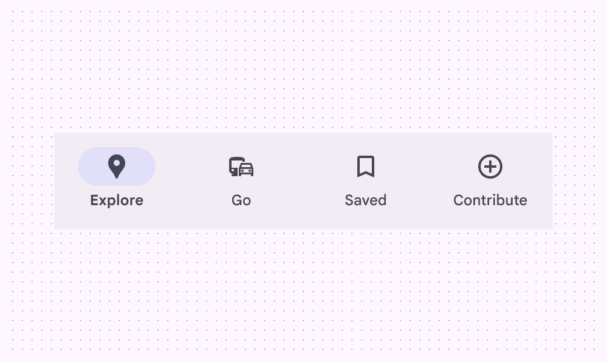

# Navigation bar

Navigation bars let people switch between UI views on smaller devices

- Use navigation bars in compact [More on compact window size class](/m3/pages/breakpoints/compact) or medium [More on medium window size class](/m3/pages/breakpoints/medium) window sizes
- Can contain 3-5 destinations of equal importance
- Destinations don't change. They should be consistent across app screens.

Navigation bar for compact and medium window sizes

## Availability & resources

| Type | Resource | Status |
| --- | --- | --- |
| Design | [Design Kit (Figma)](https://www.figma.com/community/file/1035203688168086460) | Available |
| Implementation |  | Available |
| Implementation | [Jetpack Compose](https://developer.android.com/develop/ui/compose/components/navigation-bar) | Available |
| Implementation | [Jetpack Compose: Expressive](https://developer.android.com/reference/kotlin/androidx/compose/material3/package-summary#NavigationBar\(androidx.compose.ui.Modifier,androidx.compose.ui.graphics.Color,androidx.compose.ui.graphics.Color,androidx.compose.ui.unit.Dp,androidx.compose.foundation.layout.WindowInsets,kotlin.Function1\)) | Available |
| Implementation |  | Available |
| Implementation |  | Available |

## M3 Expressive update

**May 2025**

A new flexible navigation bar was introduced to replace the baseline navigation bar. It’s shorter and supports horizontal navigation items in medium windows. [More on M3 Expressive](https://m3.material.io/blog/building-with-m3-expressive)

Variants and naming:

- Baseline navigation bar is no longer recommended
- Added **flexible** navigation bar

    - Shorter height
    - Can be used in medium window sizes with horizontal navigation items

Color:

- Active label changed from **on-surface-variant** to **secondary**

The flexible navigation bar is shorter and can be used in medium windows with horizontal nav items

## Differences from M2

- Color: New color mappings and compatibility with dynamic color
- Elevation: No shadow
- Layout: Container height is taller
- States: The active destination can be indicated with a pill shape in a contrasting color
- Name: Bottom navigation has been renamed **navigation bar**

M2: A drop shadow indicates placement on top of content. Filled and regular weight icons indicate active states.

M3: Taller and no drop shadow. Filled icons and an active indicator indicate active state.

