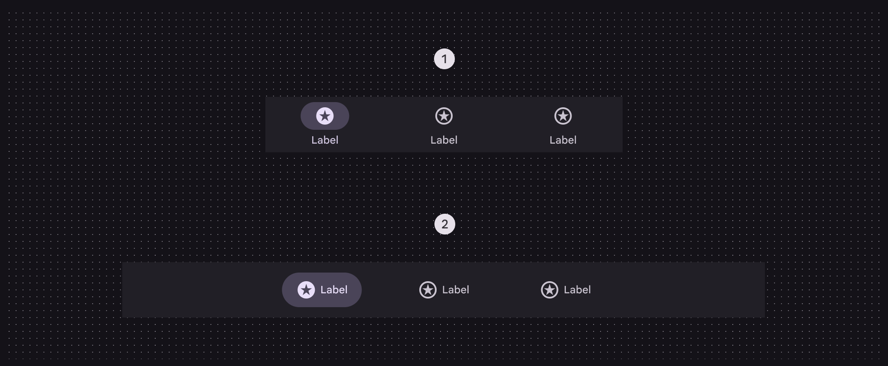
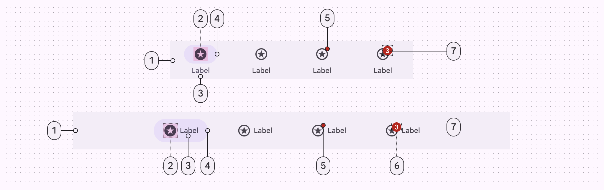
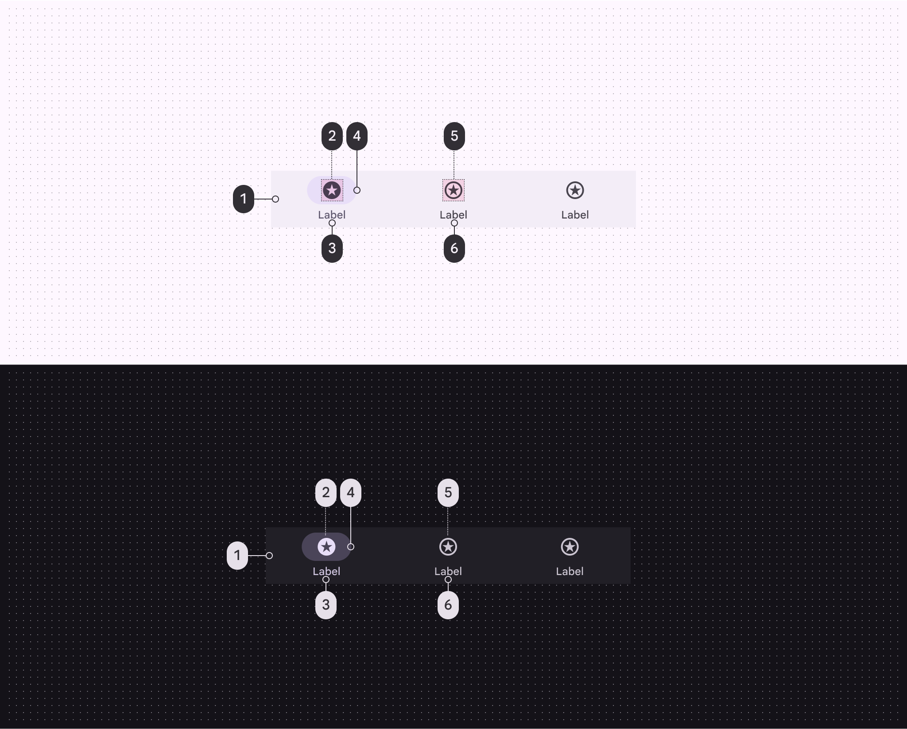
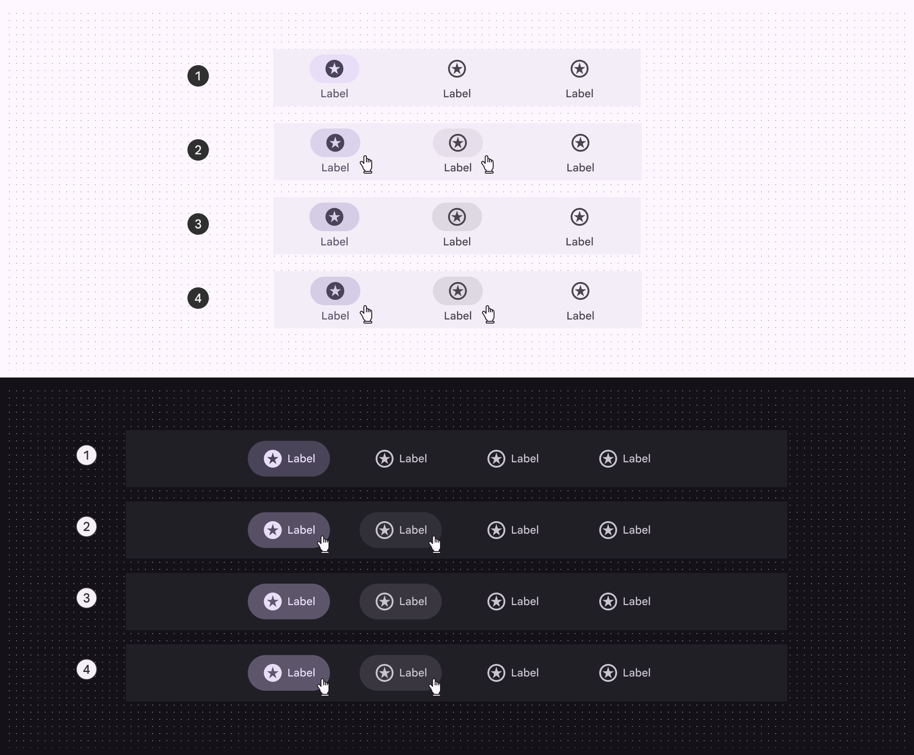
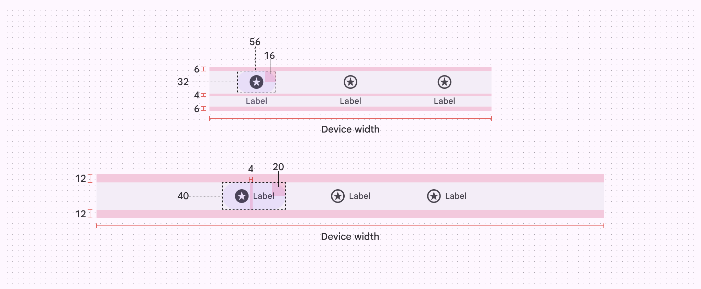
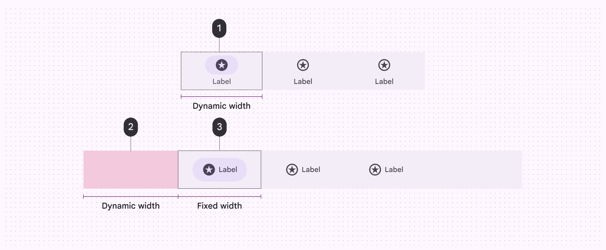
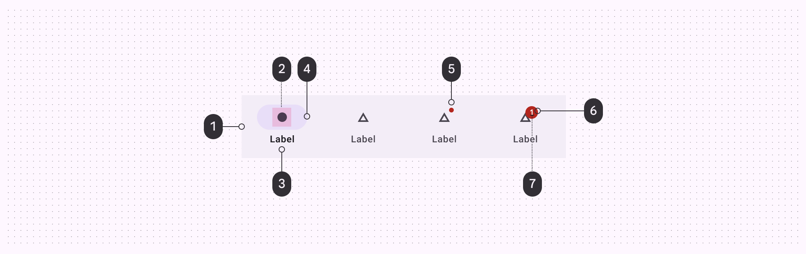
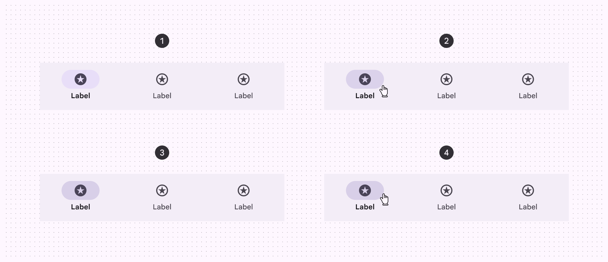
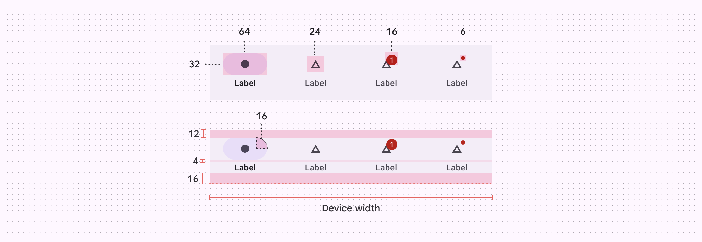
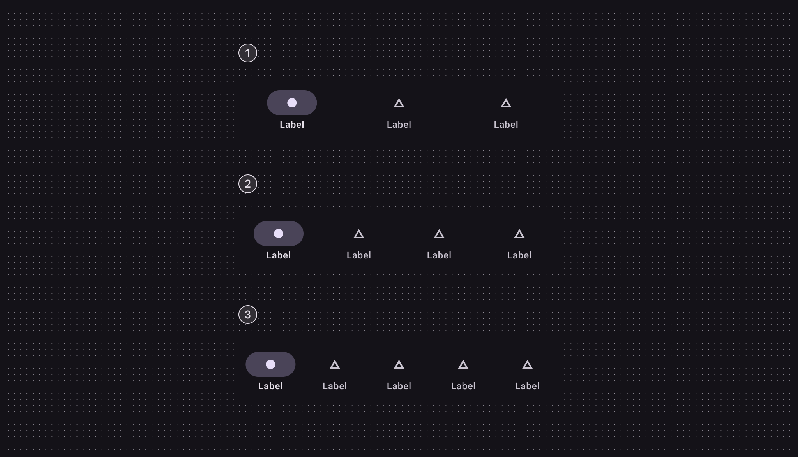

# Navigation bar

Navigation bars let people switch between UI views on smaller devices

## Variants


1. Flexible navigation bar

### Baseline variants

The baseline nav bar is no longer recommended, and should be replaced by the flexible nav bar, which is shorter and supports horizontal navigation items in medium windows. [View baseline nav bar specs](/m3/pages/navigation-bar/specs#46dc2521-acf0-44e3-bbc0-78dc225b9749)


1. Navigation bar (not recommended)

|
Variant

 |

M3

 |

M3 Expressive

 |
| --- | --- | --- |
|

Flexible navigation bar

 |

\--

 |

Available

 |
|

Navigation bar

 |

Available

 |

Not recommended. Use **flexible navigation bar**.

 |

## Configurations

In compact windows, navigation bars use vertical items. In medium windows, navigation bars should use horizontal items.



1. Vertical navigation items
2. Horizontal navigation items

|
Category

 |

Configuration

 |

M3

 |

M3 Expressive

 |
| --- | --- | --- | --- |
|

Navigation item layout

 |

Vertical (default)

 |

Available

 |

Available

 |
|

Horizontal

 |

\--

 |

Available

 |

## Tokens & specs

Use the table's menu to switch between token sets for the navigation bar and the nav items. [](/m3/pages/navigation-bar/specs#3425f33a-0b11-492a-ae5a-40d63f939384)[Learn about design tokens](/m3/pages/design-tokens/overview/)

```
Nav bar - Common
```

```
Nav bar - Common
```

```
Nav bar - Common
```

```
Nav bar - Common
```

Nav bar - Common

Token

Default, Light

Color

Nav item

Container

## Anatomy



1. Container
2. Icon
3. Label text
4. Active indicator
5. Small badge (optional)
6. Large badge (optional)
7. Large badge label

## Color

Color values are implemented through design tokens. For designers, this means working with color values that correspond with tokens; in implementation, a color value will be a token that references a value. [Learn more about design tokens](/m3/pages/design-tokens/overview)



Navigation bar color roles used for light and dark schemes:

1. Surface container
2. On-secondary container
3. Secondary
4. Secondary container
5. On-surface variant
6. On-surface variant

For badge color roles, go to [badge specs](/m3/pages/badges/specs).

## States

States are visual representations used to communicate the status of a component or an interactive element.



1. Enabled
2. Hovered (8% state layer)
3. Focused (10% state layer)
4. Pressed (10% state layer)

## Measurements

The navigation bar stretches the full window width.



Navigation bar padding and size measurements

Vertical navigation items dynamically change width to equally fit the container. Horizontal navigation items have a fixed width, so extra space is added to the ends of the navigation bar instead.



Navigation bar width and margins for compact and medium windows.

1. Vertical navigation item
2. Margin from window edge
3. Horizontal navigation item
*. * *

## Baseline navigation bar



1. Container
2. Icon
3. Label text
4. Active indicator
5. Small badge
6. Large badge
7. Large badge label

### Tokens & specs

These tokens are for the baseline navigation bar. Navigation bar (baseline)

Token

Default, Light

Enabled

### Color

Color values are implemented through design tokens. For designers, this means working with color values that correspond with tokens; in implementation, a color value will be a token that references a value. [Learn more about design tokens](/m3/pages/design-tokens/overview)


Navigation bar color roles used for light and dark schemes:

1. Surface
2. On secondary container
3. On surface
4. Secondary container
5. On surface variant
6. On surface variant

For badge color roles, go to [badge specs](/m3/pages/badges/specs).

### States

States are visual representations used to communicate the status of a component or an interactive element.



Navigation bar states: 

1. Enabled
2. Hovered
3. Focused
4. Pressed

## Measurements



Navigation bar padding and size measurements


Navigation bar target size and margins

## Configurations



1. 3 destinations
2. 4 destinations
3. 5 destinations

