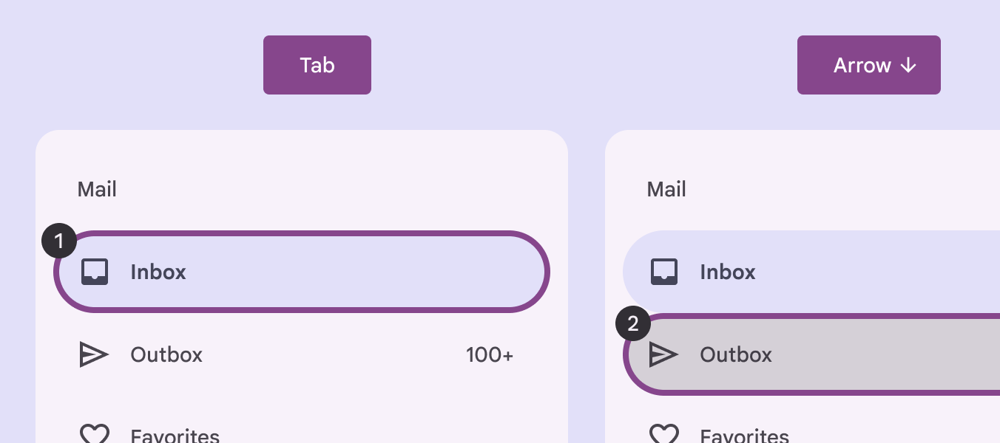
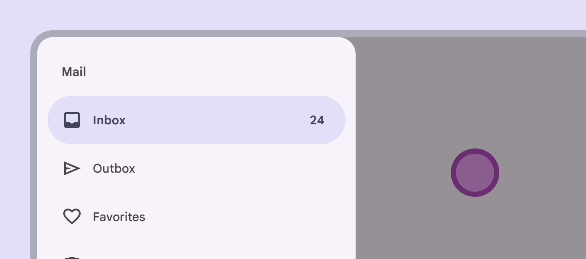
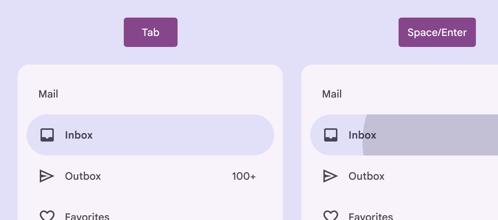
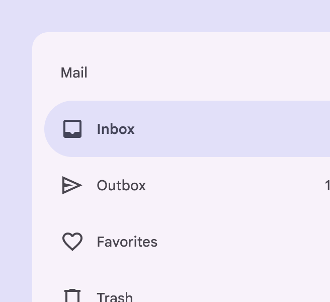
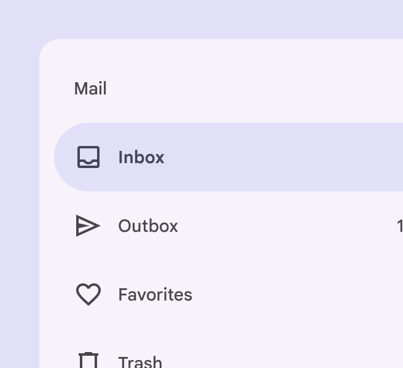
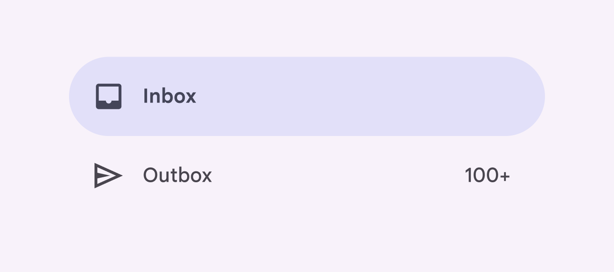
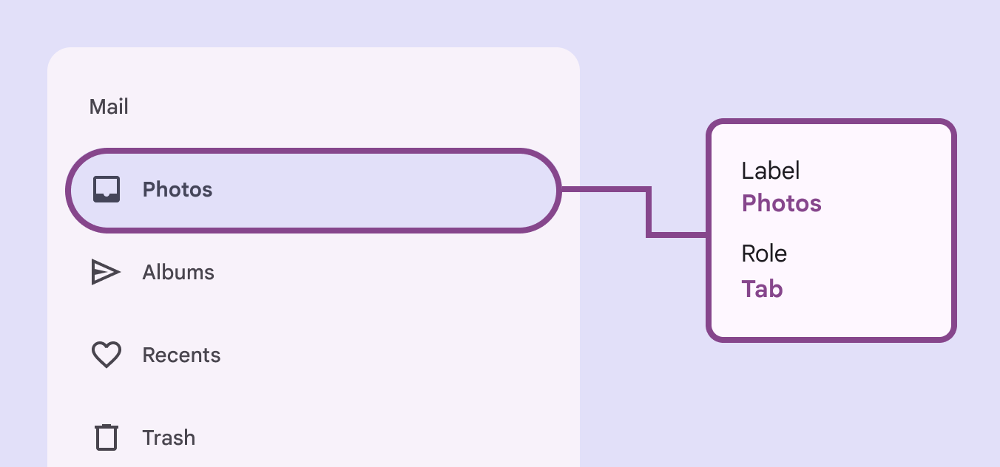
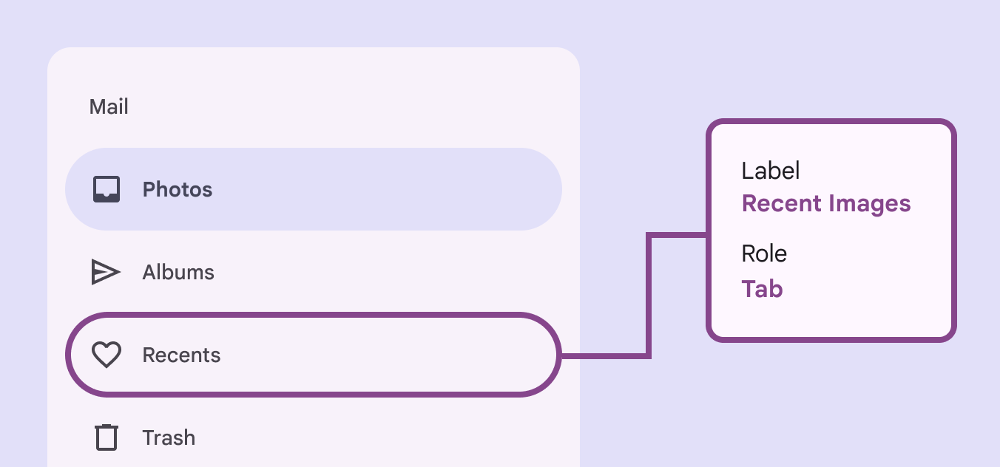

# Navigation drawer

Navigation drawers let people switch between UI views on larger devices

star

Note:

The navigation drawer is no longer recommended in the Material 3 Expressive update. For those who have updated, use an [expanded navigation rail](/m3/pages/navigation-rail/overview/), which has mostly the same functionality of the navigation drawer and adapts better across window size classes.

## Use cases

Users should be able to: 

- Move between navigation destinations with assistive technology
- Select a particular navigation destination from a set
- Get appropriate feedback based on input [More on inputs](/m3/pages/inputs) type

## Interaction & style

**Touch**

- When a navigation item is tapped, the active indicator appears in place, providing feedback to the user that it is selected
- A touch ripple passes through the indicator
- The icon switches from outlined to filled
- The icon changes color, becoming darker

Touch: Tap

**Cursor**

- When hovered, the hover [More on hover state](/m3/pages/interaction-states/applying-states#71c347c2-dd75-485b-892e-04d2900bd844) indicator appears providing a visual cue that the destination is interactive
- When clicked, a ripple passes through the indicator
- The icon switches from outlined to filled
- The icon changes color, becoming darker in light theme and lighter in dark theme, to increase the contrast

Cursor: Hover, Click

## Initial focus

Initial focus lands directly on the first navigation item, since that is the first interactive element of the component.

Focus lands on first navigation item

## Closing

The modal navigation drawer can be dismissed by selecting the scrim that covers the rest of the screen.

Select the scrim to close the navigation drawer

## Visual indicators

Icons are the primary focus of the navigation and such give the dominant cue of its state [More on states](/m3/pages/interaction-states/overview). Use a filled icon for the selected destination to differentiate from the outlined icons of non-selected destinations.

The navigation item is selected via **Space**/**Enter**

check Do

Use a filled icon for the selected navigation destination to differentiate from the other destinations

close Don’t

Avoid keeping the icon style for the selected navigation destination the same as unselected destination's icons. This removes an important visual indicator of which destination is active.

When selected, the icon fills, darkens in light theme (or lightens in dark theme), and is backed by an active indicator shape

## Keyboard navigation

| **Keys** | **Actions** |
| --- | --- |
| Tab | Focus lands on the first navigation destination  |
| Space or Enter | Selects the focused [More on focused state](/m3/pages/interaction-states/applying-states#bfc1624f-6bcc-4306-b0c1-425e2d8a1bf9) navigation destination, and focus moves to the newly opened section (if applicable) |
| Arrow | Navigate between destinations within the navigation drawer |

## Labeling elements

The accessibility [More on accessibility](/m3/pages/overview/principles) label for a navigation item is typically the same as the destination name. If the UI text is correctly linked, assistive tech (such as a screenreader) will read the UI text followed by the component’s role. For Android Views (MDC-Android), a more descriptive accessibility label is not available to be set and the role is not announced.

A navigation drawer’s accessibility label can incorporate its adjacent UI text

When the visible UI text is ambiguous, accessibility labels need to be more descriptive. For example, a navigation destination visibly labeled **Recents** would benefit from additional information in its accessibility label to clarify the destination’s intent.

While the visible label text reads **Recents,** the accessibility label for this destination clarifies its function: **Recent images**

