# Navigation drawer

Navigation drawers let people switch between UI views on larger devices

star

Note:

The navigation drawer is no longer recommended in the Material 3 Expressive update. For those who have updated, use an [expanded navigation rail](/m3/pages/navigation-rail/overview/), which has mostly the same functionality of the navigation drawer and adapts better across window size classes.

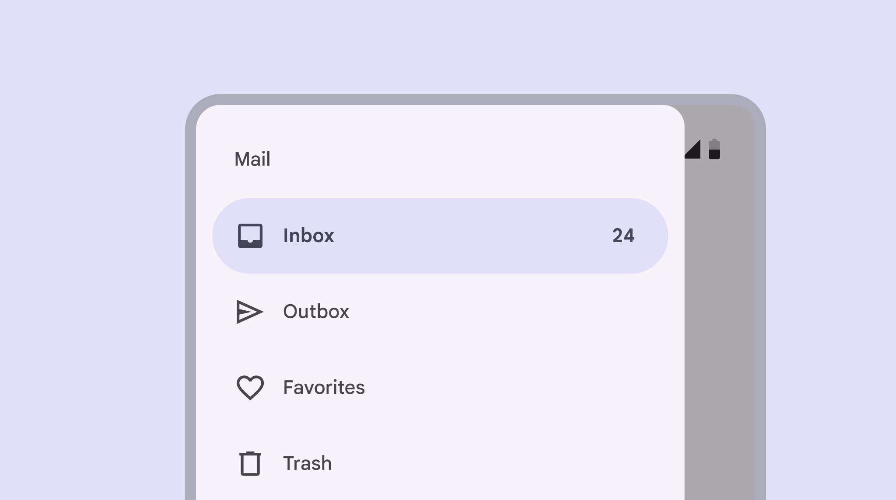

## Usage

Navigation drawers provide access to destinations and app functionality, such as switching accounts. They can either be permanently on-screen or opened and closed by a navigation Menus display a list of choices on a temporary surface. More on menus [More on menus](/m3/pages/menus/overview) icon. One navigation destination is always active. Navigation drawers are recommended for:

- Apps with 5 or more top-level destinations
- Apps with 2 or more levels of navigation hierarchy
- Quick navigation between unrelated destinations
- Replacing the navigation rail [More on navigation rails](/m3/pages/navigation-rail/overview) or navigation bar [More on navigation bars](/m3/pages/navigation-bar/overview) on large screens

check Do Use a navigation drawer for 5 or more primary destinations, or more than 1 level of navigation hierarchy

Avoid using a navigation drawer with other primary navigation components, such as a navigation bar. Instead, choose a single navigation component based on product requirements, breakpoints, and window size class [More on window size classes](/m3/pages/breakpoints):

- Navigation bars [More on navigation bars](/m3/pages/navigation-bar/overview) for compact window sizes [More on compact window size class](/m3/pages/breakpoints/compact)
- Navigation rails [More on navigation rails](/m3/pages/navigation-rail/overview) for medium [More on medium window size class](/m3/pages/breakpoints/medium) and expanded window sizes [More on expanded window size class](/m3/pages/breakpoints/expanded)
- Standard navigation drawers for expanded, large [More on large window size class](/m3/pages/breakpoints/large-extra-large) and extra-large [More on extra-large window size class](/m3/pages/breakpoints/large-extra-large) window sizes

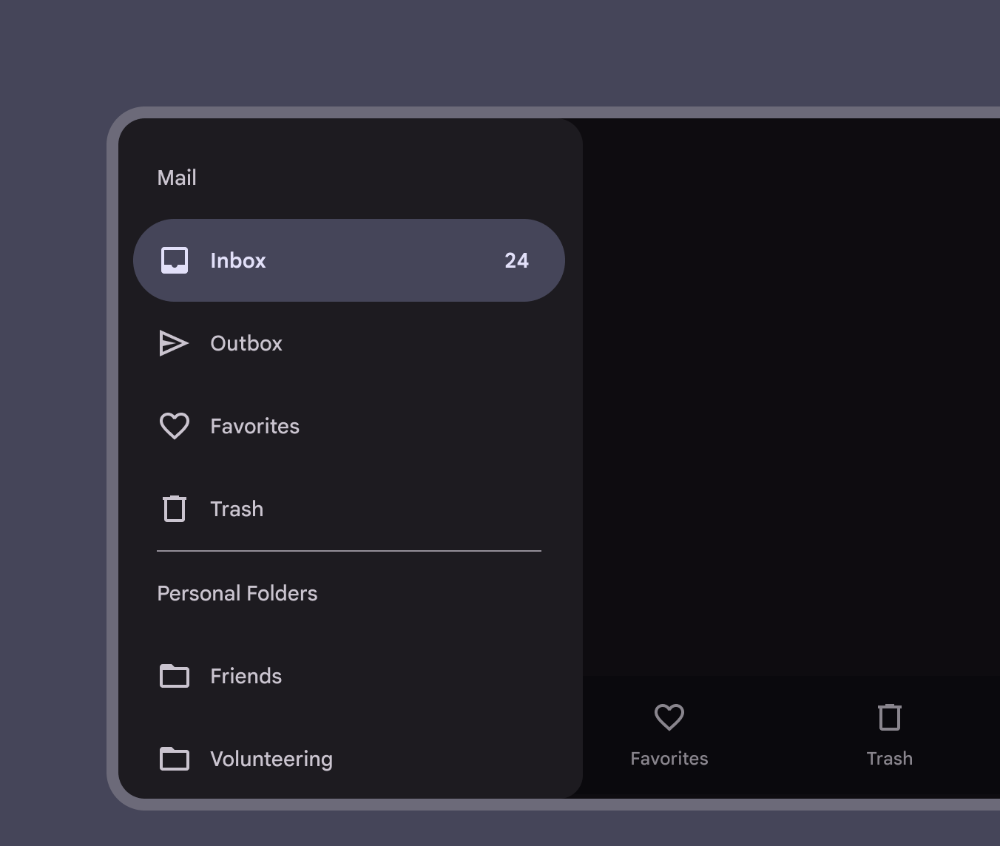

exclamation Caution

Avoid using two navigation components on the same screen

There are two variants of navigation drawers:

1. Standard navigation drawer
2. Modal navigation drawer

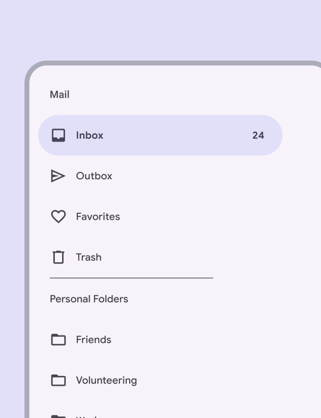

Standard navigation drawer

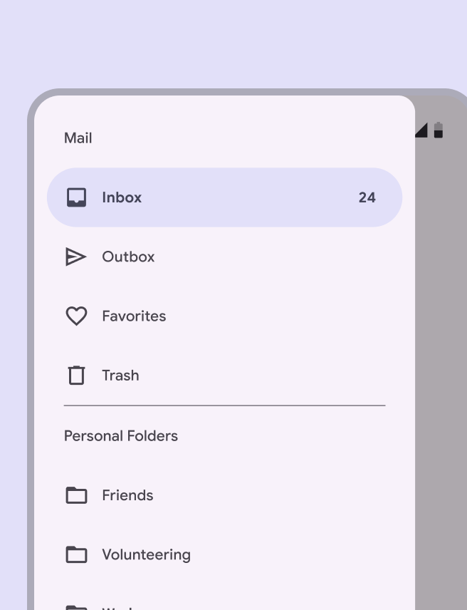

Modal navigation drawer

### Standard navigation drawer

Standard navigation drawers provide access to drawer destinations and app content for layouts [More on layout](/m3/pages/layout-overview/overview) in expanded [More on expanded window size class](/m3/pages/breakpoints/expanded), large [More on large window size class](/m3/pages/breakpoints/large-extra-large), and extra-large [More on extra-large window size class](/m3/pages/breakpoints/large-extra-large) window sizes. Standard drawers can be permanently visible (best for frequently switching destinations) or opened and closed by tapping a Menus display a list of choices on a temporary surface. More on menus [More on menus](/m3/pages/menus/overview) icon (best for focusing more on screen content). In medium [More on medium window size class](/m3/pages/breakpoints/medium) and compact window sizes [More on compact window size class](/m3/pages/breakpoints/compact), use modal drawers instead.

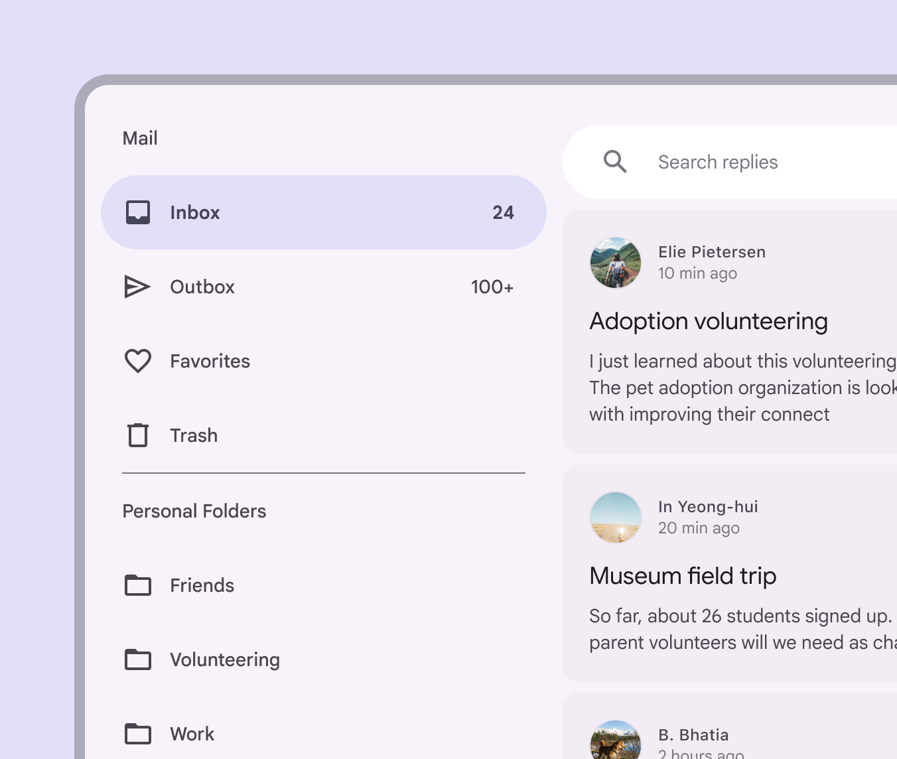

Standard navigation drawer providing access to drawer destinations next to app content

### Modal navigation drawer

Modal navigation drawers use a scrim to block interaction with the rest of an app’s content, and don’t affect the screen’s layout [More on layout](/m3/pages/layout-overview/overview) grid. Modal navigation drawers can be used in any window size, but are primarily used in compact and medium sizes where space is limited or prioritized for app content. They can be swapped with standard drawers on expanded, large [More on large window size class](/m3/pages/breakpoints/large-extra-large), and extra-large [More on extra-large window size class](/m3/pages/breakpoints/large-extra-large) window sizes. 

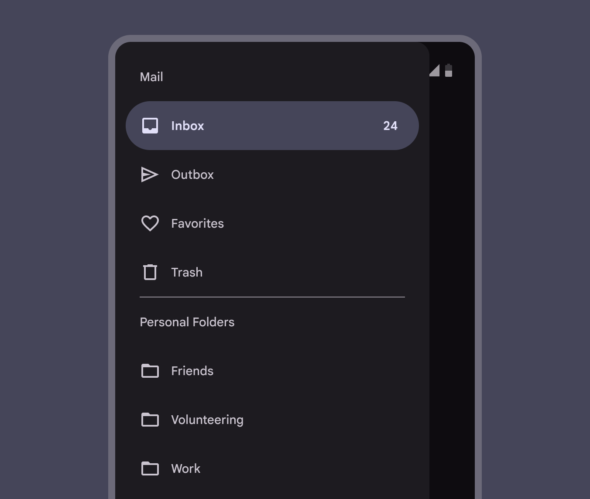

Modal navigation drawer using a scrim to block interaction with the rest of an app’s content

Modal navigation drawers are always opened by an action outside of the drawer, such as clicking a navigation Menus display a list of choices on a temporary surface. More on menus [More on menus](/m3/pages/menus/overview) icon in a navigation rail [More on navigation rails](/m3/pages/navigation-rail/overview). Modal drawers can be dismissed by:

- Selecting a drawer item
- Tapping the scrim
- Swiping toward the drawer’s anchoring edge (for example, swiping right-to-left for a left-aligned navigation drawer)

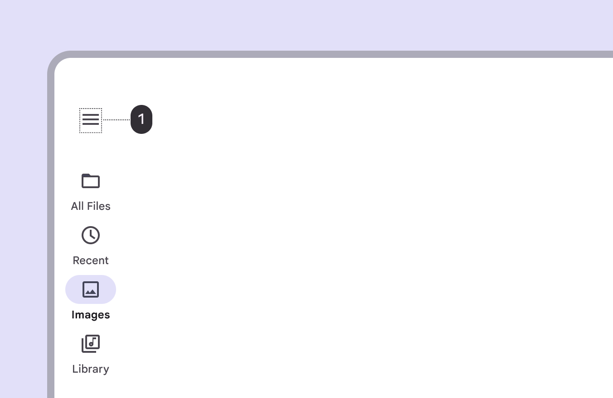

A modal drawer opened by an action such as clicking a navigation menu icon (1)

Modal drawers can be dismissed by tapping the scrim or swiping the drawer toward its anchoring screen edge.

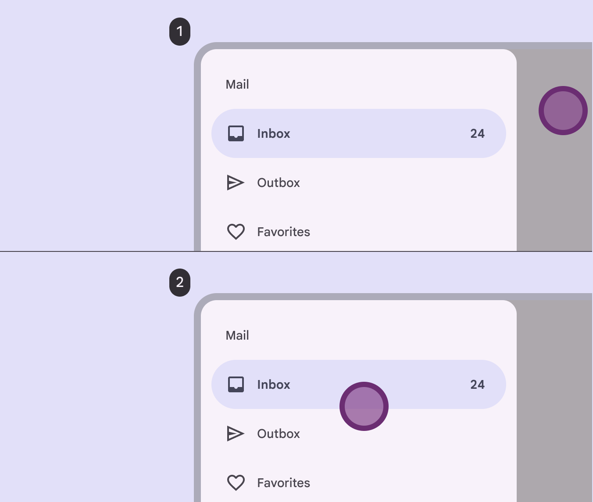

1\. Dismiss by tapping the scrim
2\. Dismiss by swiping the drawer

## Anatomy

Navigation drawers are essentially a list [More on lists](/m3/pages/lists/overview) contained within a side sheet [More on side sheets](/m3/pages/side-sheets/overview). They can also include headers, subheads, and dividers [More on dividers](/m3/pages/divider/overview) to organize longer lists.

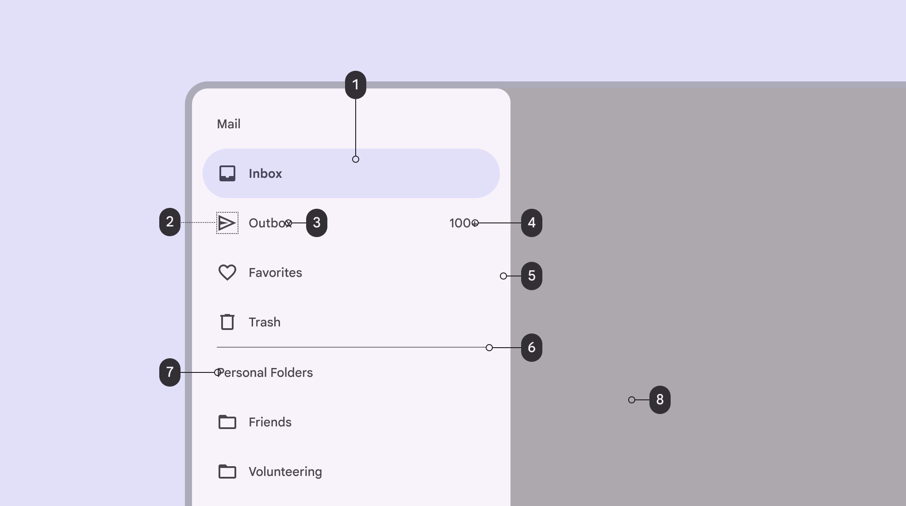

Navigation drawers can include headers, subheads, and dividers to organize longer lists

1. Active Indicator
2. Icon
3. Label
4. Badge label
5. Sheet
6. Divider
7. Section label (optional)
8. Scrim

### Sheet

A sheet holds all navigation drawer elements. Side sheets [More on side sheets](/m3/pages/side-sheets/overview) are used as the container for standard and modal navigation drawers. Navigation drawers that open from the side are always placed on the start edge of the screen, on the left for left-to-right (LTR) languages, and on the right for right-to-left (RTL) languages.

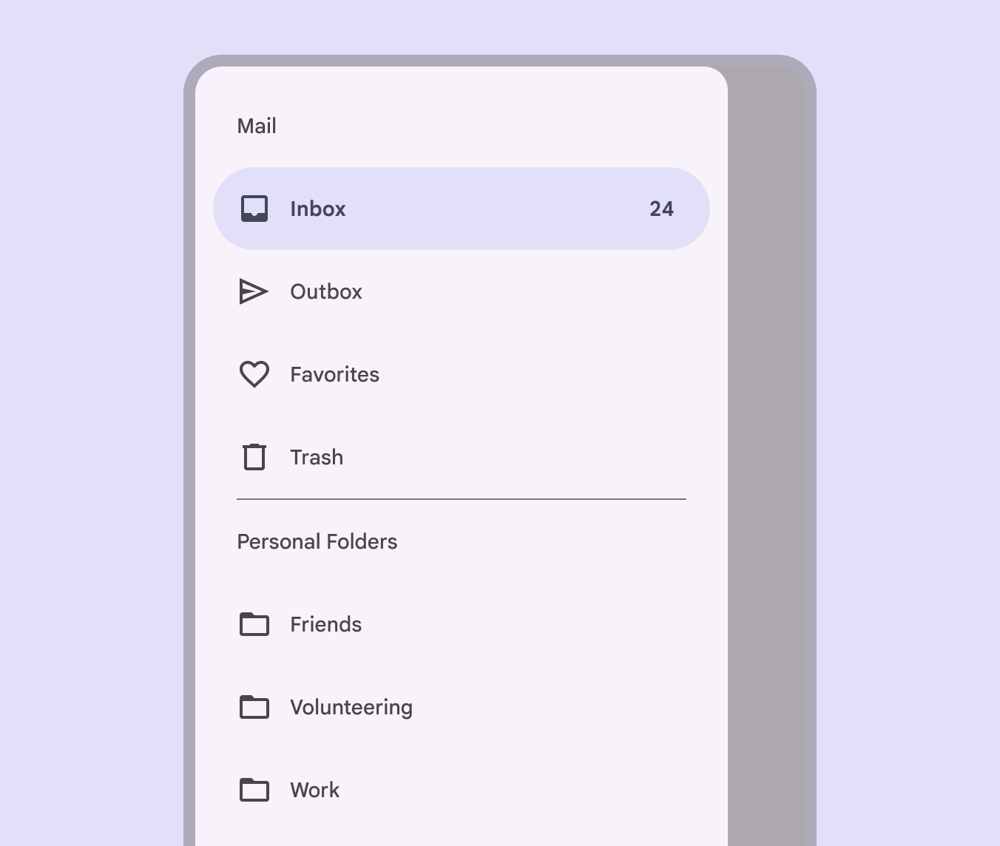

check Do

A navigation drawer opens from the left side of the screen for left-to-right languages

### Divider (optional)

Dividers [More on dividers](/m3/pages/divider/overview) can be used to separate groups of destinations within the navigation drawer.

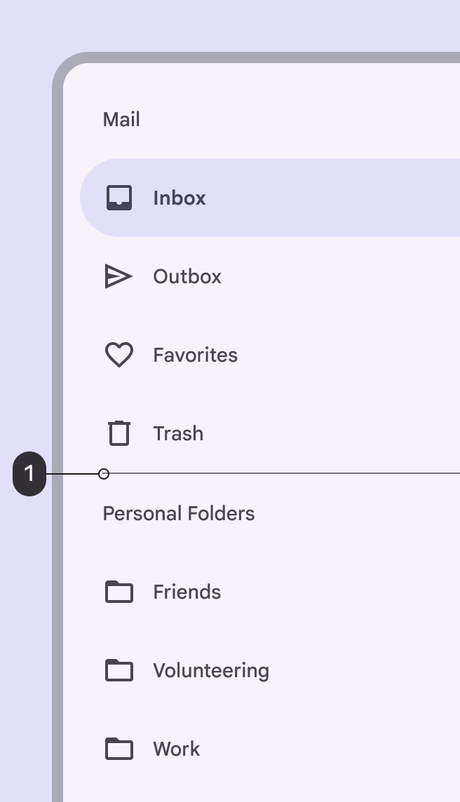

check Do

Use full-width dividers (1) to separate groups of destinations

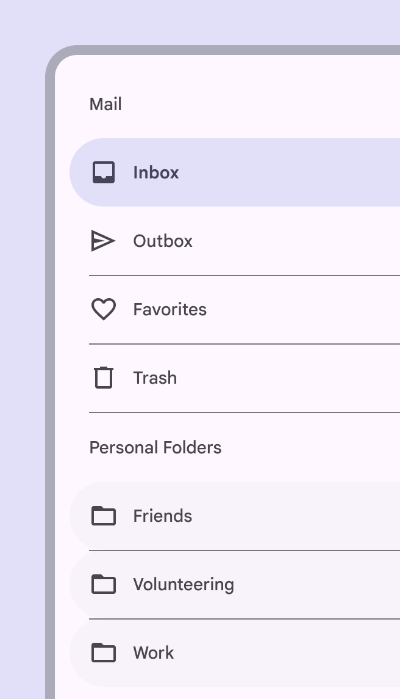

close Don’t

Don’t use dividers to separate individual destinations

### Active indicator

The active indicator is a background shape communicating which destination of the navigation drawer is currently being displayed.

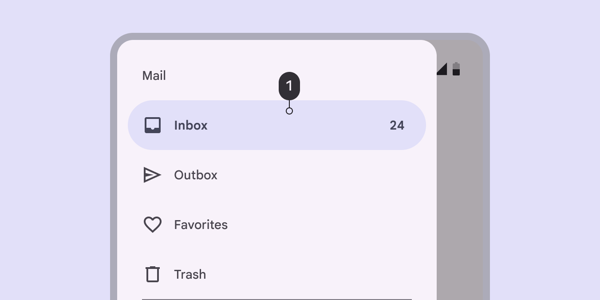

The active indicator (1) is a background shape communicating which destination of the navigation drawer is currently being displayed

### Label text and icons

Destinations in a navigation drawer take the form of actionable list [More on lists](/m3/pages/lists/overview) items. Each item describes its destination using label text and an optional icon.

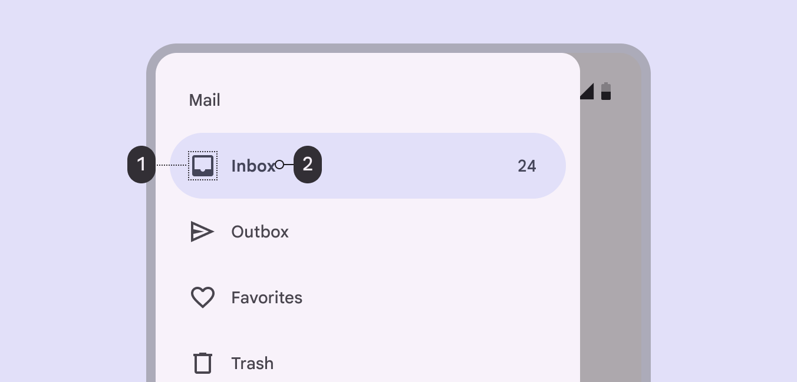

Actionable list items in a navigation drawer describe each destination using (1) an optional icon and (2) required label text

Label text should be clear and short enough that it isn’t cut off by the sheet.

Navigation drawers can use text labels without icons

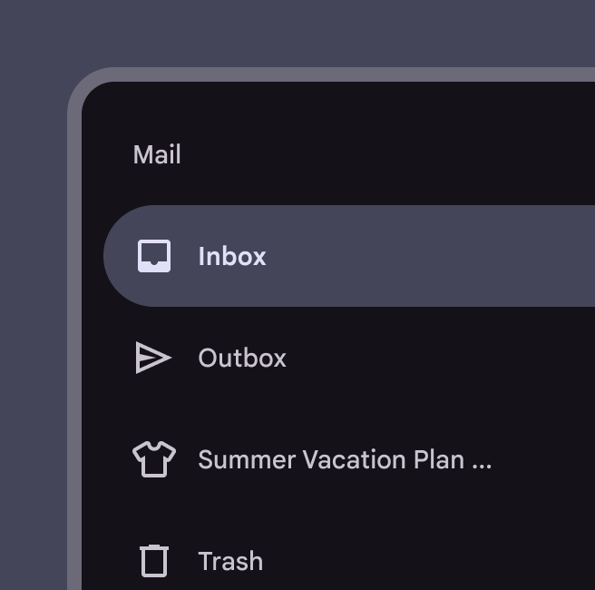

check Do

Keep text labels concise, but truncate them if they extend beyond the container width

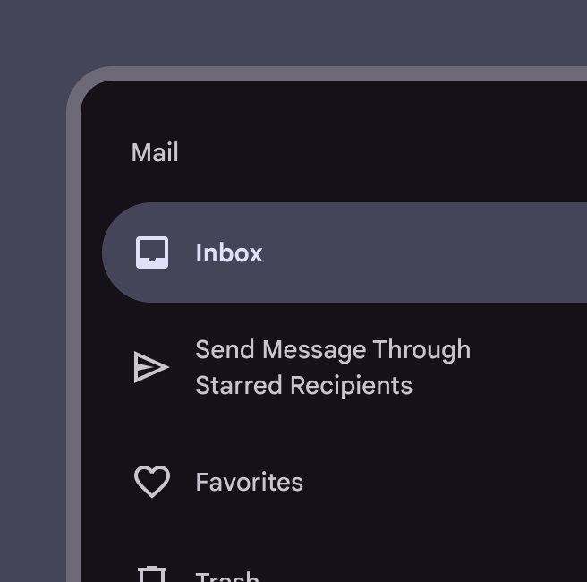

close Don’t

Don’t wrap label text

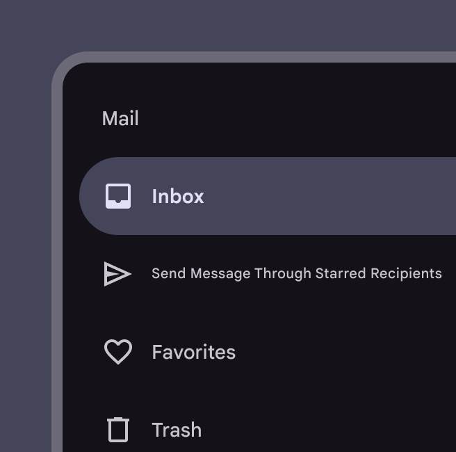

close Don’t

Don’t shrink text size in order to fit a text label on a single line

Icons can supplement labels as indicators of a destination. When used, they should always be placed before text. Other app components and content should reference these icons.

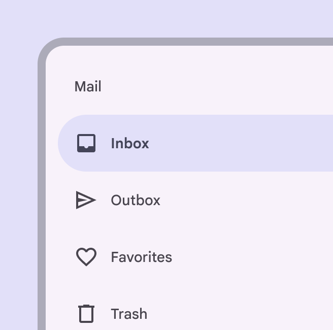

check Do

Use recognizable icons when conventions exist

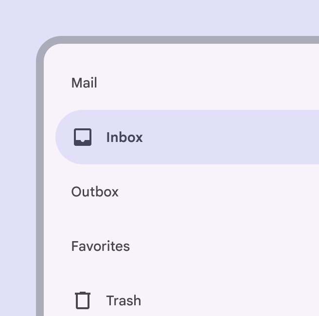

close Don’t

Don’t apply icons to some destinations and not others. Icons should be used for all destinations, or none.

### Section label (optional)

Short subhead section labels can help group related destinations in the navigation drawer.

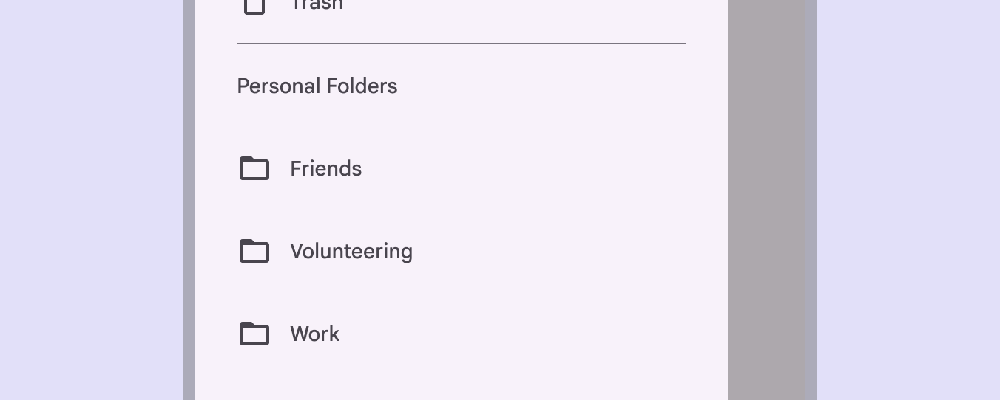

Related destinations can be grouped using short subhead section labels in the navigation drawer

### Scrim (modal only)

Modal navigation drawers use a scrim to block interaction with the rest of the app. The scrim is placed directly behind the drawer’s sheet and can be tapped or clicked to dismiss the drawer.

Scrim applied behind a modal navigation drawer

## Responsive layout

A product’s navigation component should change to suit the window size class [More on window size classes](/m3/pages/breakpoints) and form factor of the screen. Modal navigation drawers can be used at any window size but are most common in compact [More on compact window size class](/m3/pages/breakpoints/compact) and medium window sizes [More on medium window size class](/m3/pages/breakpoints/medium). Standard navigation drawers are best for expanded [More on expanded window size class](/m3/pages/breakpoints/expanded), large [More on large window size class](/m3/pages/breakpoints/large-extra-large), and extra-large [More on extra-large window size class](/m3/pages/breakpoints/large-extra-large) window sizes. Use a transition when swapping components. For example, when switching from a portrait to landscape layout [More on layout](/m3/pages/layout-overview/overview), the navigation rail [More on navigation rails](/m3/pages/navigation-rail/overview) should transform into a navigation drawer.

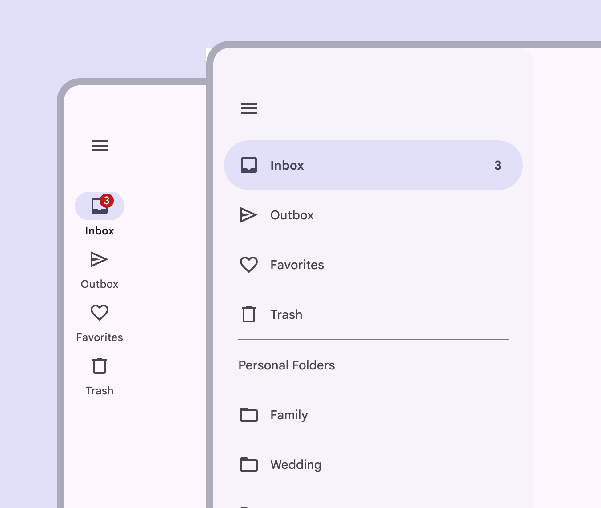

Standard navigation drawers change size to suit the device’s screen

### Compact window size

Use modal navigation drawers in compact window sizes [More on compact window size class](/m3/pages/breakpoints/compact). Or swap the drawer for a navigation bar. On web, when the screen size is smaller than 320 CSS pixels [More on CSS pixels](https://www.w3.org/Style/Examples/007/units.en.html), swap the navigation drawer for a navigation bar to ensure accessibility [More on accessibility](/m3/pages/overview/principles).

Use a modal navigation drawer on mobile screens

### Medium & expanded window sizes

Use a modal navigation drawer alone or with a navigation rail on medium [More on medium window size class](/m3/pages/breakpoints/medium) and expanded [More on expanded window size class](/m3/pages/breakpoints/expanded) window sizes. When a navigation rail [More on navigation rails](/m3/pages/navigation-rail/overview) and modal navigation drawer are used together, the drawer can repeat destinations in the navigation rail as long as the drawer offers enough visual separation between levels of the navigation hierarchy. A standard navigation drawer can be used in [single pane layouts](/m3/pages/understanding-layout/parts-of-layout) in expanded window sizes. Use a navigation rail on tablet screens, or also allow a drawer to open and close via a menu icon

### Large and extra-large window sizes

For web experiences on laptop and desktop devices, use either a standard navigation drawer, or a navigation rail [More on navigation rails](/m3/pages/navigation-rail/overview) that transitions into a modal navigation drawer.

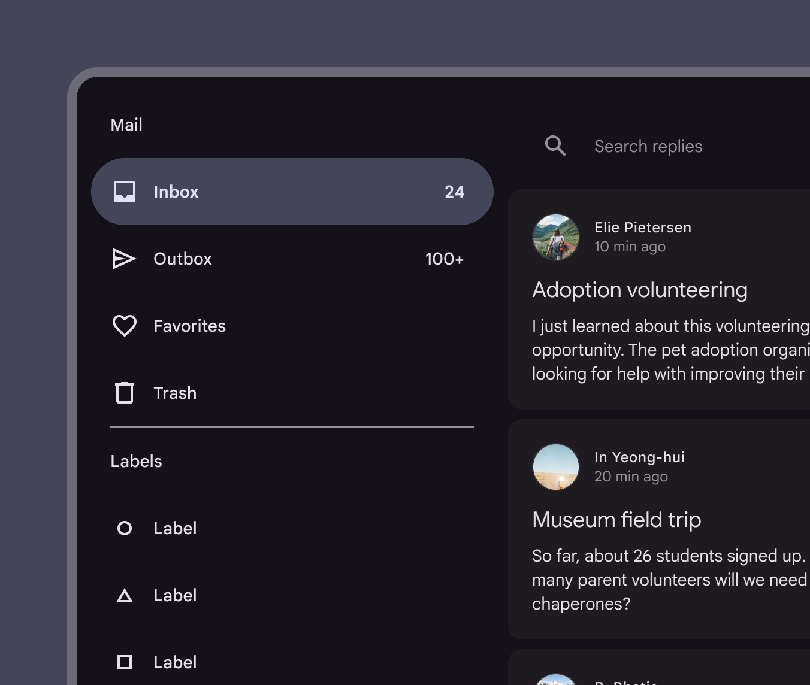

Use a standard navigation drawer on large and desktop screens

## Behavior

### Scrolling

Navigation drawers can be vertically scrolled, independent of the rest of the screen’s content and UI. If the list [More on lists](/m3/pages/lists/overview) of navigation destinations is longer than the height of the drawer, the drawer’s contents can be scrolled within the drawer. When a navigation drawer is scrolled, the body content should remain stationary

### Visibility

**Dismissible standard drawers** can be used for layouts [More on layout](/m3/pages/layout-overview/overview) that prioritize content (such as a photo gallery) or for apps where users are unlikely to switch destinations often. They should use a visible navigation Menus display a list of choices on a temporary surface. More on menus [More on menus](/m3/pages/menus/overview) icon to open and close the drawer.

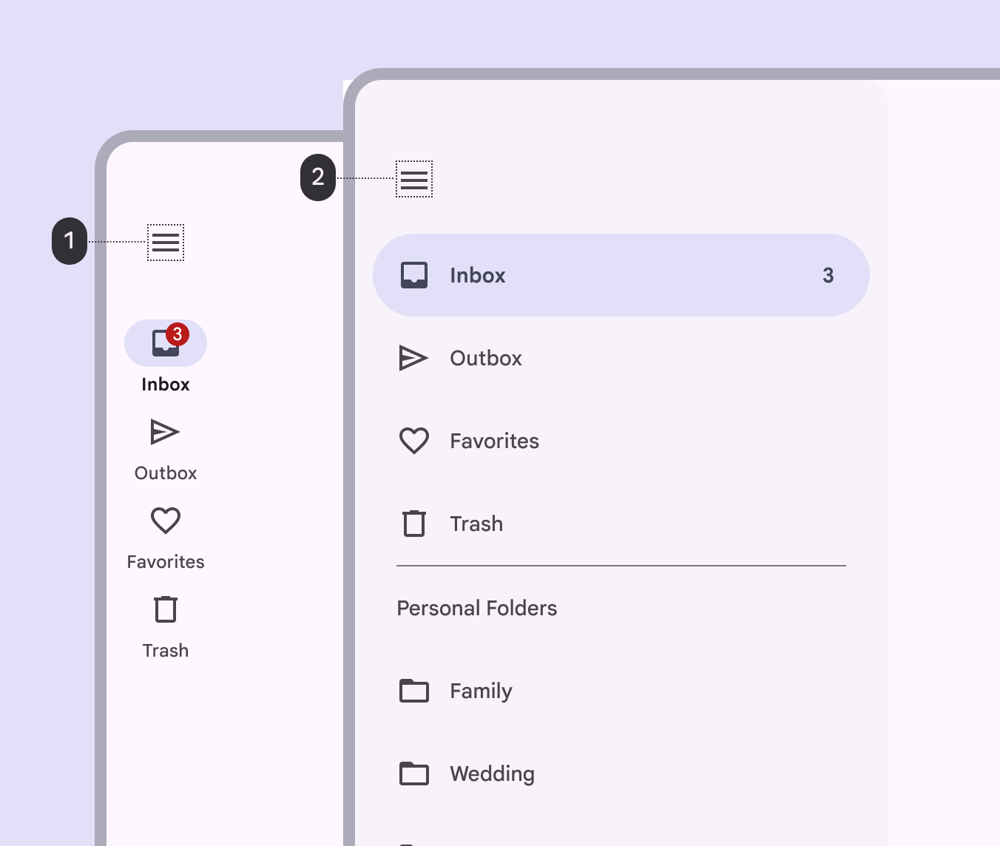

A standard dismissible navigation drawer is opened and closed by tapping the navigation menu icon in the app bar (1), and remains open until the menu icon is tapped again (2)

**Permanently visible standard drawers** allow quick navigation between unrelated destinations. They can’t be closed or dismissed by the user.

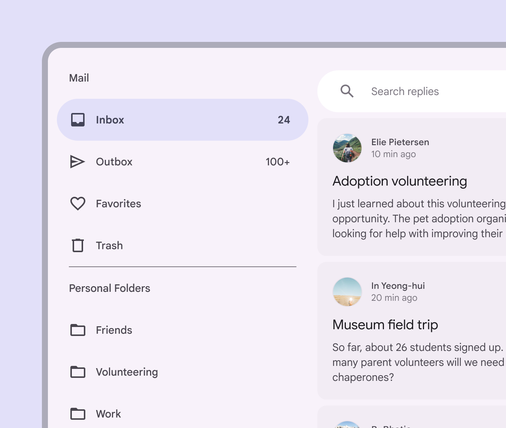

A permanently-visible standard navigation drawer on desktop

### Appearing

When a navigation drawer animates on screen, it uses an [enter and exit](/m3/pages/motion-transitions) transition pattern. A navigation drawer animating on screen

