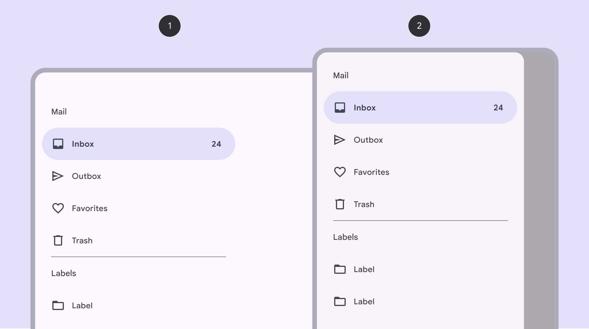
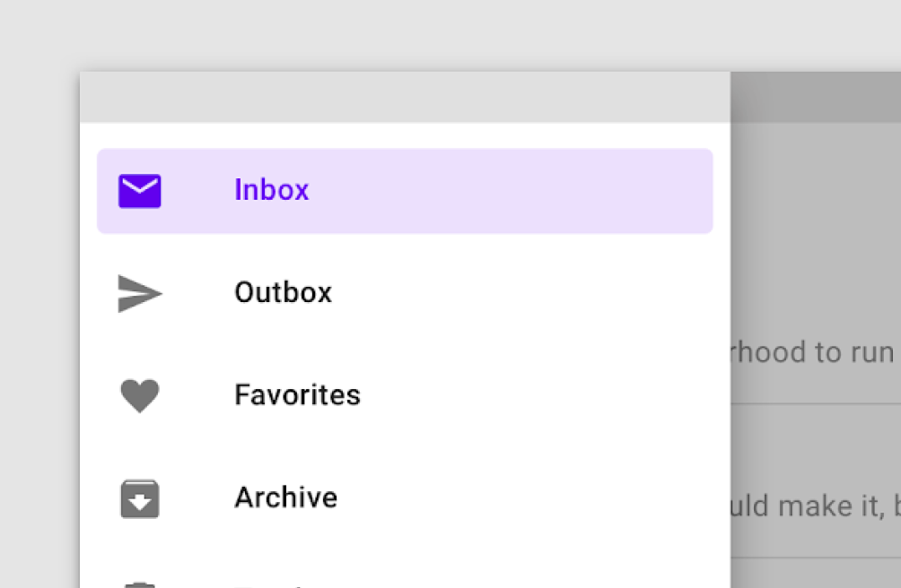
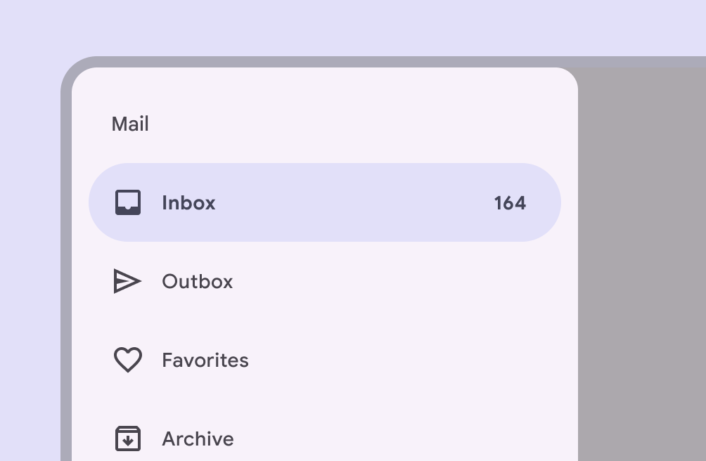

# Navigation drawer

Navigation drawers let people switch between UI views on larger devices

star

Note:

The navigation drawer is no longer recommended in the Material 3 Expressive update. For those who have updated, use an [expanded navigation rail](/m3/pages/navigation-rail/overview/), which has mostly the same functionality of the navigation drawer and adapts better across window size classes.

- Use standard navigation drawers in expanded [More on expanded window size class](/m3/pages/breakpoints/expanded), large [More on large window size class](/m3/pages/breakpoints/large-extra-large), and extra-large window sizes [More on extra-large window size class](/m3/pages/breakpoints/large-extra-large)
- Use modal navigation drawers in compact [More on compact window size class](/m3/pages/breakpoints/medium) and medium [More on medium window size class](/m3/pages/breakpoints/medium) window sizes
- Can be open or closed by default
- Two variants: standard and modal
- Put the most frequent destinations at the top and group related destinations together

1. Standard navigation drawer
2. Modal navigation drawer

## Availability & resources

| Type | Resource | Status |
| --- | --- | --- |
| Design | [Design Kit (Figma)](https://www.figma.com/community/file/1035203688168086460) | Available |
| Implementation |  | Available |
| Implementation | [Jetpack Compose](https://developer.android.com/develop/ui/compose/components/drawer) | Available |
| Implementation |  | Available |

## M3 Expressive update

**May 2025**

The navigation drawer is no longer recommended. Use the expanded navigation rail [More on navigation rails](/m3/pages/navigation-rail/overview) instead. [More on M3 Expressive](https://m3.material.io/blog/building-with-m3-expressive)

## Differences from M2

- Color: New color mappings and compatibility with dynamic color [More on dynamic color](/m3/pages/dynamic/choosing-a-source)
- Variants: Distinguishes two separate variants of navigation drawer: Standard and modal
- Shape: Rounded corners at the ending edge of the drawer
- States [More on states](/m3/pages/interaction-states/overview): Updated color and shape for indicating selected state

M2: Navigation drawer had square corners and a rectangular shape indicating the active destination

M3: Navigation drawer has rounded corners, new color mappings, and an updated style for indicating the active destination

