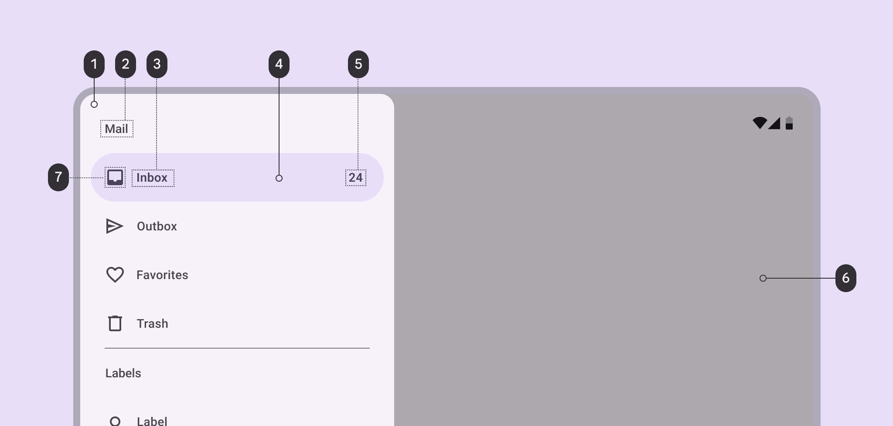
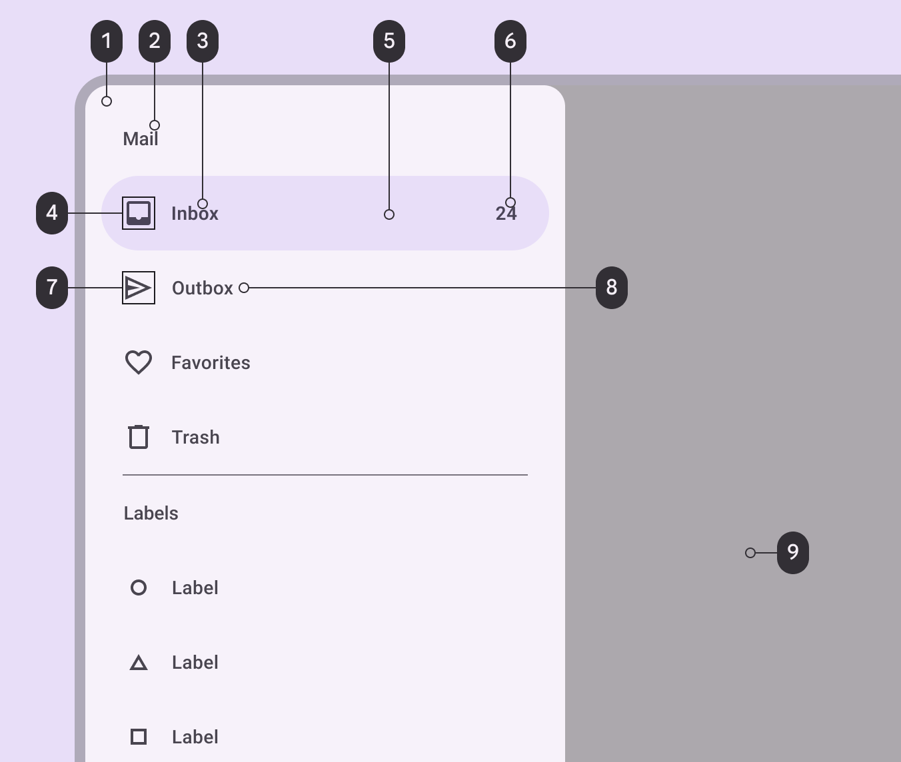
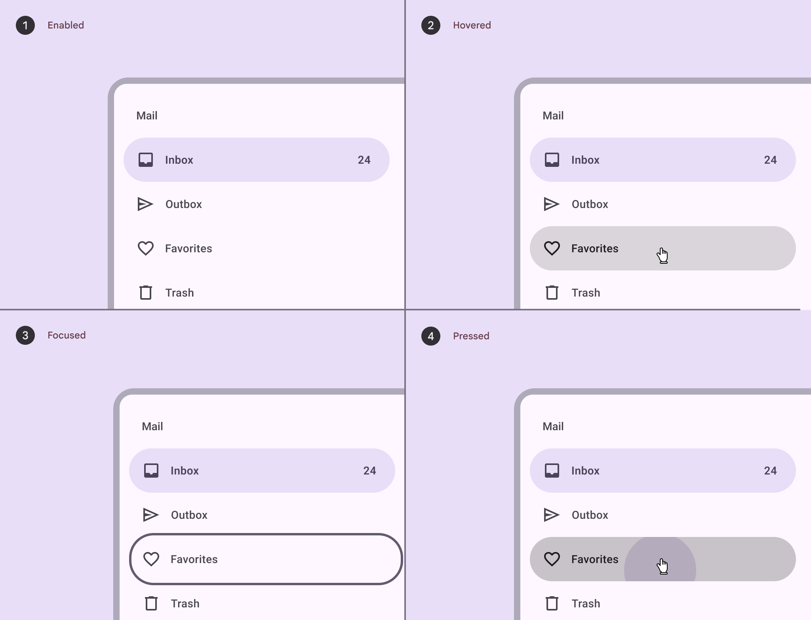
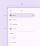
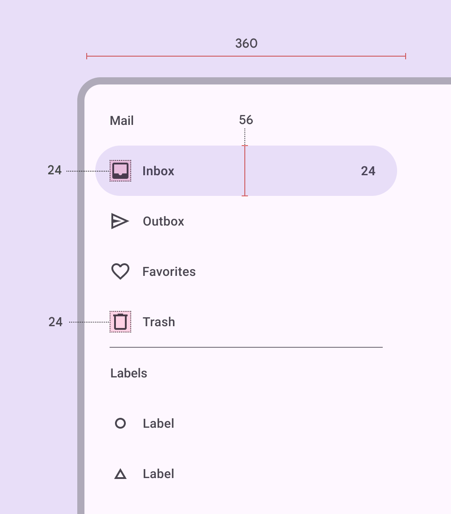
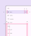
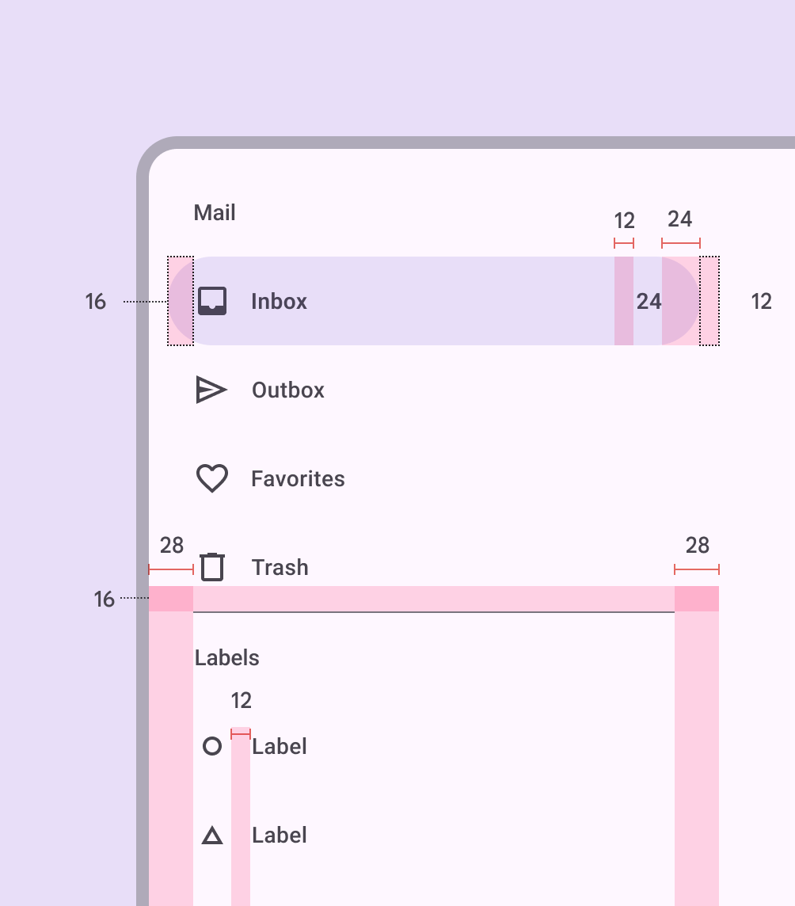
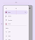
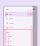

# Navigation drawer

Navigation drawers let people switch between UI views on larger devices

star

Note:

The navigation drawer is no longer recommended in the Material 3 Expressive update. For those who have updated, use an [expanded navigation rail](/m3/pages/navigation-rail/overview/), which has mostly the same functionality of the navigation drawer and adapts better across window size classes.

1. Container
2. Headline
3. Label text
4. Active indicator
5. Badge label text
6. Scrim
7. Icon

## Tokens & specs

The navigation drawer has one token set. [Learn about design tokens](/m3/pages/design-tokens/overview/)

Navigation drawers (baseline)

Token

Default, Light

Enabled

Hovered

Focused

Pressed (ripple)

## Color

Color values are implemented through design tokens [More on tokens](/m3/pages/design-tokens/overview). For design, this means working with color values that correspond with tokens. For implementation, a color value will be a token that references a value. [Learn more about design tokens](/m3/pages/design-tokens/overview)

Navigation drawer color roles used for light and dark schemes:

1. Surface container low
2. On surface variant
3. On secondary container
4. On secondary container
5. Secondary container
6. On secondary container
7. On surface variant
8. On surface variant
9. Scrim

For divider color roles, go to [divider specs](/m3/pages/divider/specs).

## States [More on states](/m3/pages/interaction-states/overview) are visual representations used to communicate the status of a component or interactive element. [Learn more about interaction states](/m3/pages/interaction-states/overview)

Navigation drawer states: 

1. Enabled
2. Hovered
3. Focused
4. Pressed

[State specs are in the tokens module above](/m3/pages/navigation-drawer/specs#6207b00f-a259-41d2-8146-b6efc6380976)

## Measurements

### Standard navigation drawer

Element size measurements

Padding and margins

| Attribute | Value |
| --- | --- |
| Container height
 | 100% |
| Container width
 | 360dp |
| Container shape
 | 0,16,16,0dp corner radii |
| Icon size
 | 24dp |
| Active indicator height
 | 56dp |
| Active indicator shape
 | 28dp |
| Active indicator width
 | 336dp |
| Horizontal label alignment
 | Start-aligned |
| Left padding
 | 28dp |
| Right padding
 | 28dp |
| Active indicator padding
 | 12dp |
| Padding between elements
 | 0dp |

### Modal navigation drawer

Element size measurements

Padding and margins

| Attribute | Value |
| --- | --- |
| Container height
 | 100% |
| Container width
 | 360dp |
| Icon size
 | 24dp |
| Active indicator height
 | 56dp |
| Active indicator shape
 | 28dp |
| Active indicator width
 | 336dp |
| Horizontal label alignment
 | Start-aligned |
| Left padding
 | 28dp |
| Right padding
 | 28dp |
| Active indicator padding
 | 12dp |
| Padding between elements
 | 0dp |

