# Navigation rail

Navigation rails let people switch between UI views on mid-sized devices

## Use cases

People should be able to do the following using the assistive technology:

- Navigate between navigation destinations
- Select a particular navigation destination from a set
- Get appropriate feedback based on input type

## Interaction & style

When a navigation item is tapped, the active indicator appears, providing the following feedback to the user that it is selected:

- A ripple passes through the indicator
- The icon switches from outlined to filled
- The icon and text change color

When hovered, the hover state appears, providing a visual cue that the destination is interactive.

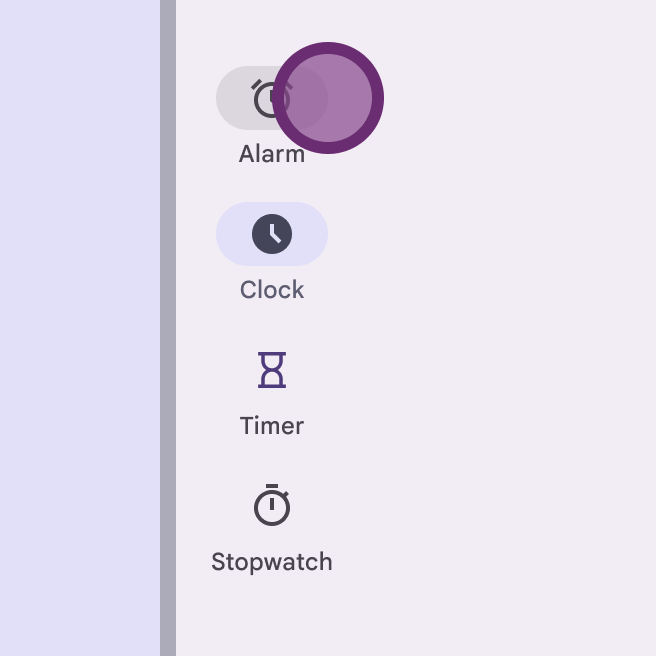

Touch: Tap

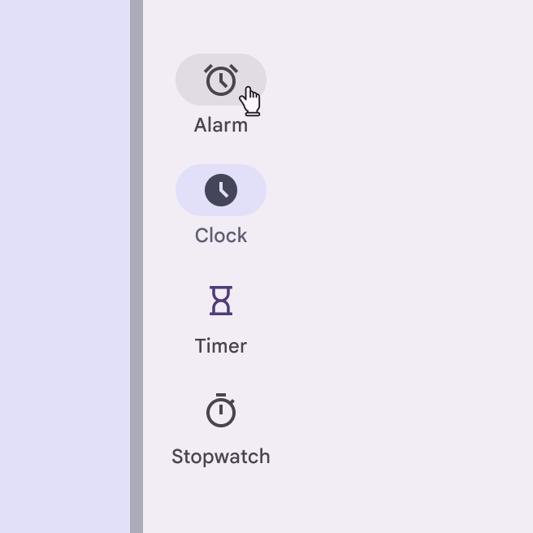

Cursor: Hover, Click

The target area for expanded navigation rails spans the full width of the container, even though the active indicator visually hugs the content.

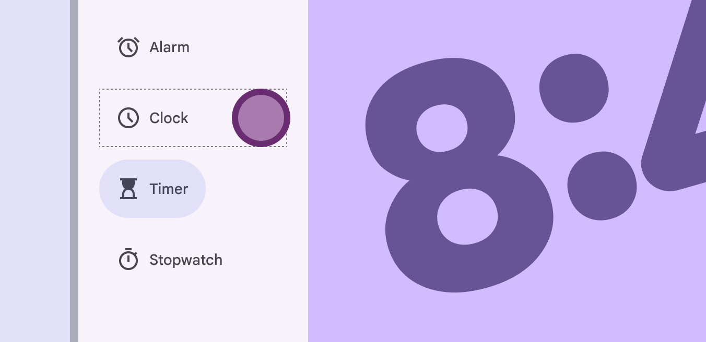

Touch: Tap

Use a filled icon for the active destination and outlined icons for inactive destinations. Active and inactive icon colors need sufficient contrast against the container.

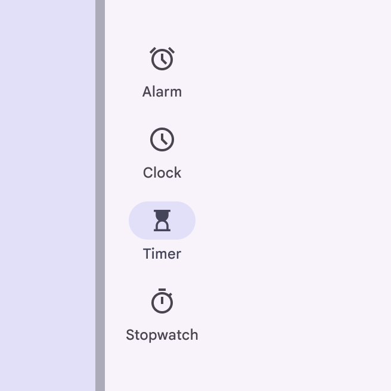

check Do

Use the default color scheme to ensure proper contrast and emphasis on the active destination

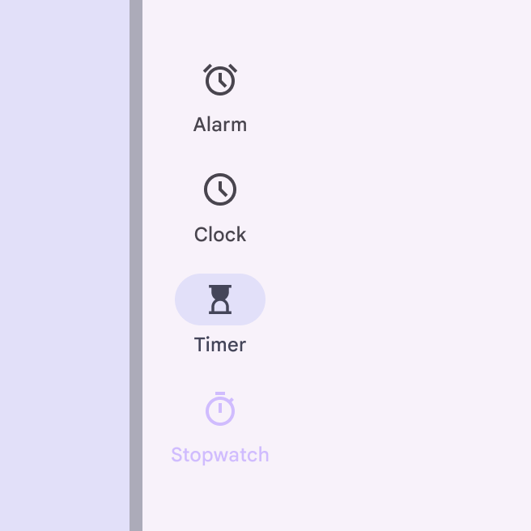

close Don’t

Don’t use more than two colors for destinations or low-contrast colors in the navigation rail. This will make distinguishing active items difficult. If an icon doesn’t have a filled style, use the semibold icon weight instead.

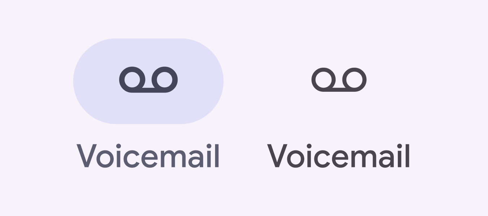

An icon with no filled option should use the semibold weight when active

### Text scaling and truncation

When someone sets their device to show a larger text size, the navigation rail items should grow vertically to accommodate larger labels while retaining the default padding. It’s okay for scaled text to wrap in navigation items. To remain accessible, ensure the full label is always visible on-screen at up to 2x text sizing. Beyond this size, text can truncate. 

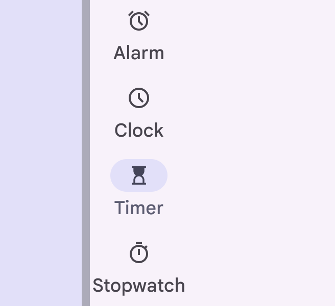

Text scaled to 1.5 size

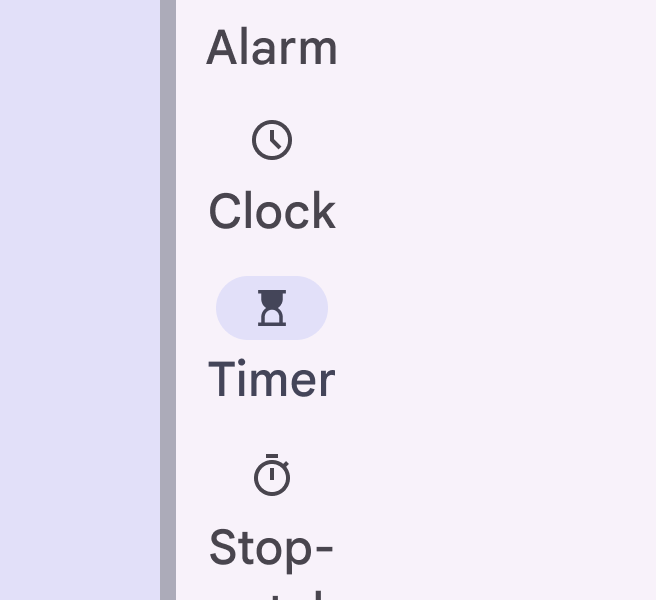

Text scaled to 2x size

### Initial focus

Initial focus lands directly on the first interactive item, whether it’s the menu, the FAB, or the first navigation item. From the FAB or menu, **Tab** brings the person to the navigation items. **Tab** or **Arrows** then navigate between items.

Use arrows to move between navigation items

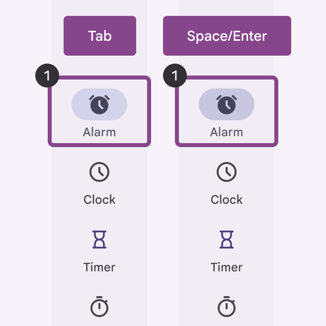

Use space/enter to activate the focused navigation item

### Visual indicators

Icons give the dominant cue of the navigation state. Use a filled icon for the selected destination to contrast with outlined icons for the non-selected destinations.

check Do

Use a filled icon variant on the selected navigation item to differentiate from inactive navigation items

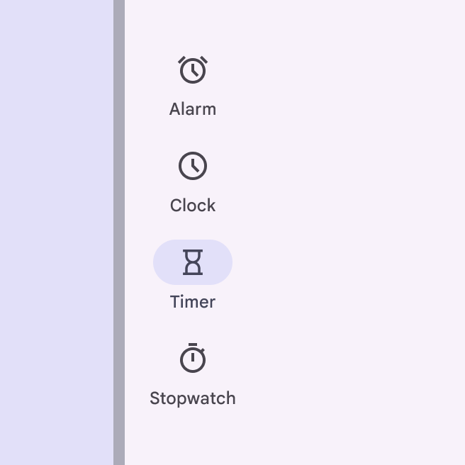

close Don’t

Avoid using the same unfilled icon style for both selected and unselected items because it lacks important visual feedback cue

## Keyboard navigation

| Keys | Actions |
| --- | --- |
| Tab / Arrows | Navigate between interactive elements |
| Space / Enter
 | Selects an interactive element |

## Labeling elements

The accessibility label for a navigation item is typically the same as the adjacent text label. When the visible UI text is ambiguous, accessibility labels need to be more descriptive. For example, a navigation item visibly labeled **Recent** would benefit from additional information in its accessibility label to clarify the destination's intent. Note: On Android Views (MDC-Android), a more descriptive accessibility label is not available and the role is not announced.

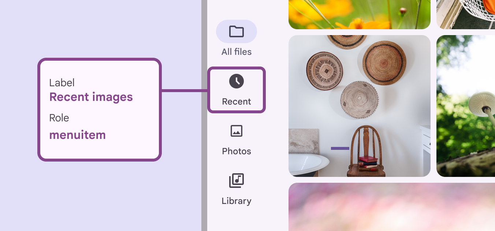

While the visible label text reads **Recent**, the accessibility label for this switch clarifies its function: **Recent images**

