# Navigation rail

Navigation rails let people switch between UI views on mid-sized devices

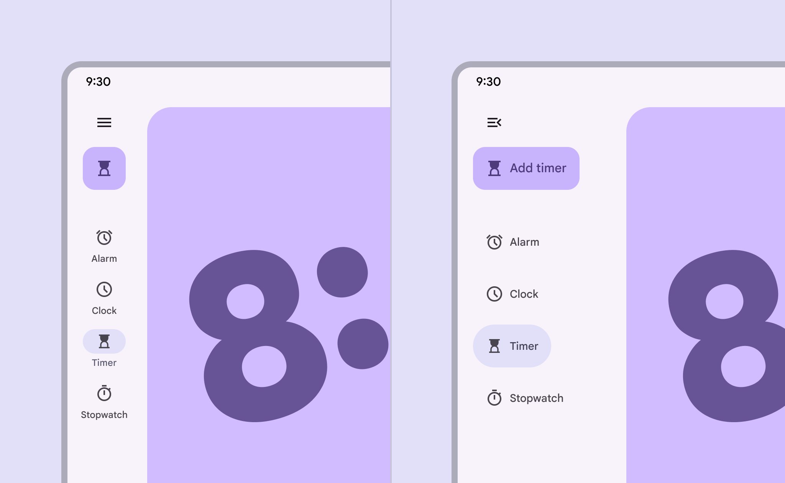

Use the menu icon to transition between collapsed and expanded navigation rails

## Usage

The navigation rail can display navigation items, a menu, and a floating action button [More on FABs](/m3/pages/fab/overview) (FAB) in a vertical orientation. There are two variants of navigation rails, **collapsed** and **expanded**, which can easily transform into each other when the menu button is selected.

### Collapsed

The **collapsed** nav rail runs along the leading edge of the window, and should contain 3–7 navigation items. It should not be hidden. It can be used in medium [More on medium window size class](/m3/pages/breakpoints/medium) to extra large window sizes [More on extra-large window size class](/m3/pages/breakpoints/large-extra-large), such as tablets and desktop. In  medium windows with few destinations, consider using a navigation bar [More on navigation bars](/m3/pages/navigation-bar/overview) instead. Compact windows [More on compact window size class](/m3/pages/breakpoints/compact) should always use a navigation bar.

A navigation rail should be the only visible navigation element

### Expanded

The **expanded** navigation rail can be standard or modal, and should always open from a menu icon. An expanded rail can reveal secondary destinations not visible when collapsed. The **standard** configuration is placed beside body content. It’s best for larger windows with lots of available space. The **modal** configuration overlaps the body content, and should be opened from a menu icon. Use the modal configuration for:

- Information dense layouts where space is limited
- Products with many navigation items

A navigation rail can be expanded by default on larger screen sizes, or can be expanded over content on smaller screen sizes

In immersive experiences, the expanded navigation rail can be hidden entirely, appearing only when the menu icon is selected. The collapsed navigation rail should not be hidden.

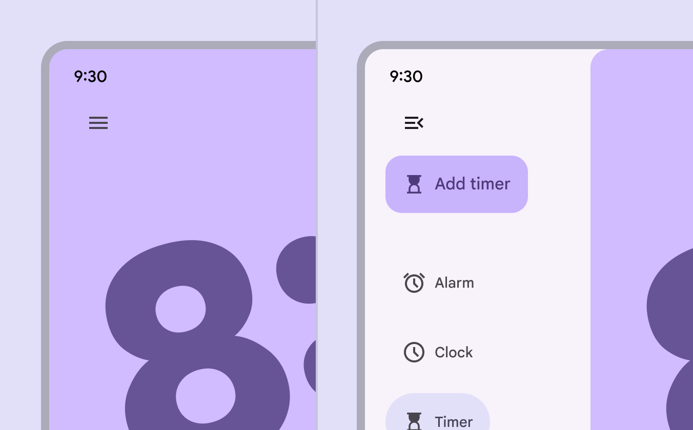

The expanded navigation rail can also be hidden, appearing only when the menu icon is selected

## Anatomy

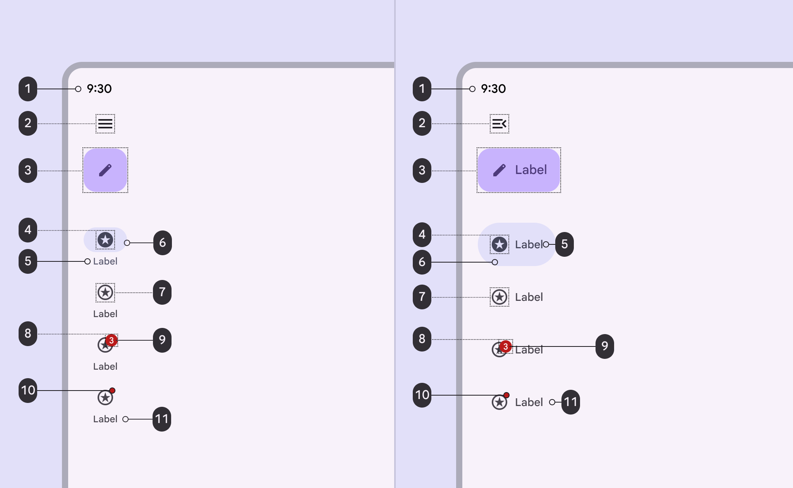

1. Container
2. Menu (optional)
3. Floating action button (FAB) (optional)
4. Icon - active
5. Label text - active
6. Active indicator
7. Icon - inactive
8. Large badge (optional)
9. Large badge label
10. Small badge
11. Label text - inactive

### Container

The navigation rail should be placed on the leading edge of the window. This is the left side for left-to-right languages, and the right side for right-to-left languages. The container fill can be turned off so the nav rail appears directly on the surface. When doing this, make sure all items have a minimum of 3:1 color contrast.

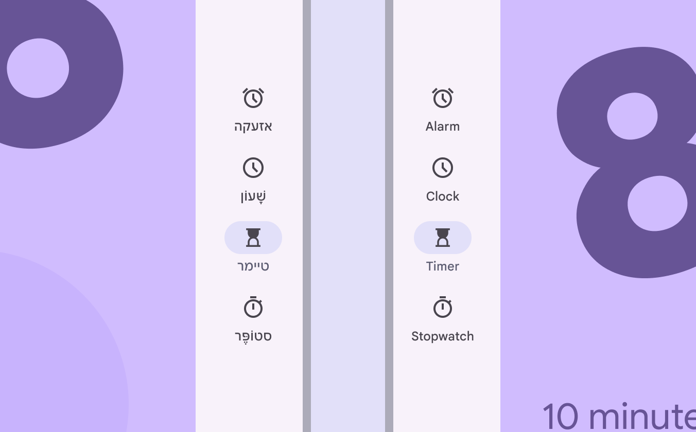

The navigation rail should be placed on the leading edge of the window

The navigation rail should always run vertically along the side of a layout. Don’t make it horizontal. Use a navigation bar [More on navigation bars](/m3/pages/navigation-bar/overview) for horizontal navigation.

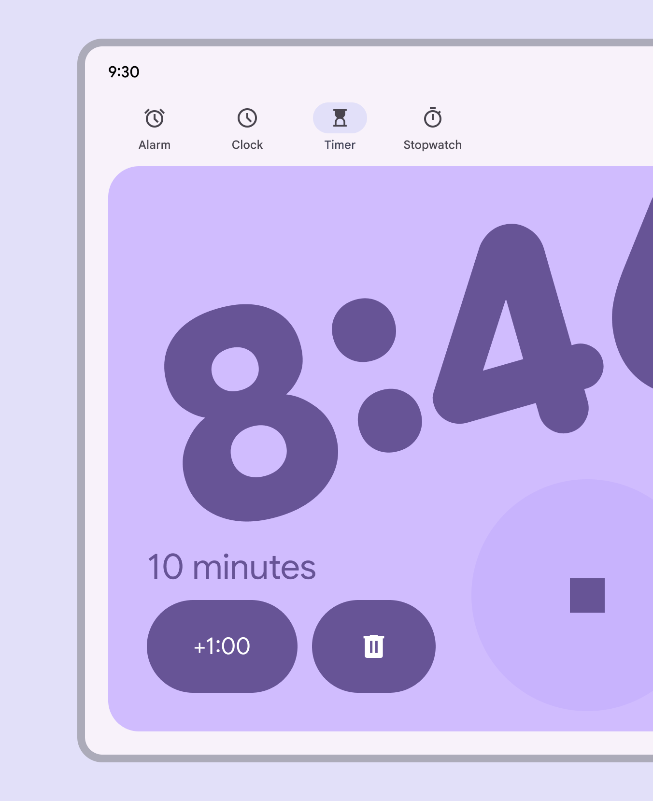

close Don’t

Don’t use the navigation rail horizontally. Use a navigation bar instead. Navigation rail items can be aligned as a group to the top or center of a layout. On tablets, use center alignment to make it easier to reach items. The menu icon and FAB should always be top-aligned.

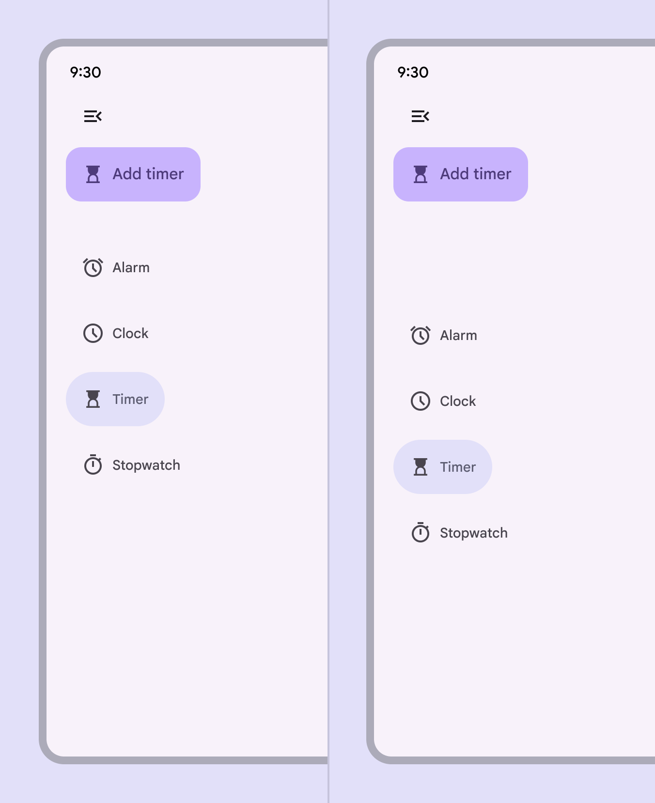

Top and center aligned rail destination placement

### Menu (optional)

The menu button can transition between the **collapsed** and **expanded** navigation rails. Once expanded, the rail can reveal secondary destinations. When the navigation rail is expanded, the menu icon should change to represent that it can be collapsed.

A navigation rail can expand to reveal more destinations

### Floating action button (FAB) (optional)

The container of the navigation rail is ideal for anchoring the FAB to the top of a screen, placing the app’s key action above navigation destinations. When nested within another component, such as the navigation rail, the FAB's resting elevation should be [level 0](/m3/pages/elevation/applying-elevation).

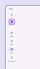

check Do

A top-aligned FAB in the navigation rail

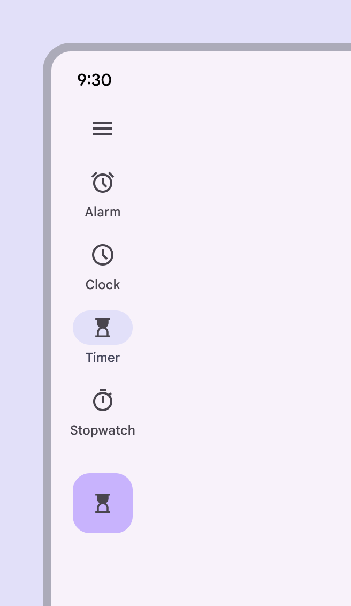

close Don’t

Avoid placing the FAB below navigation items

The top of the rail can also be used for a logo, however avoid using logos that could be mistaken as buttons. Don’t use a logo as a menu button to expand the navigation rail.

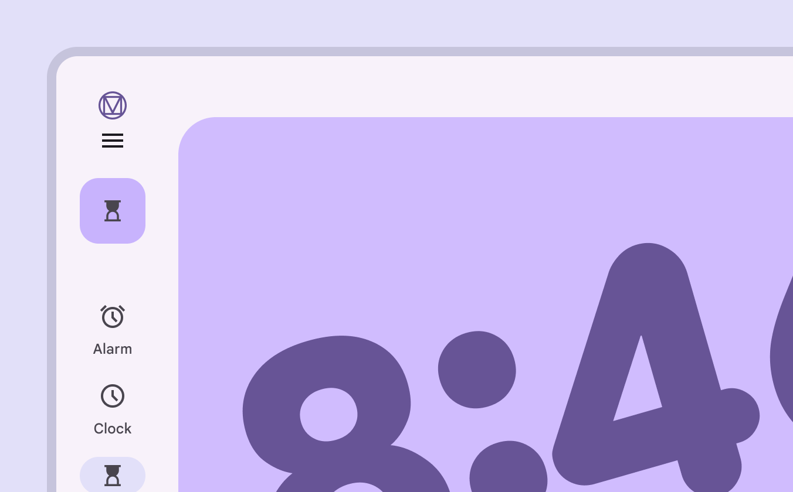

exclamation Caution

Use caution when placing logos in the rail where they might be confused with an action or destination

### Active indicator

The active indicator shows which page is being displayed.

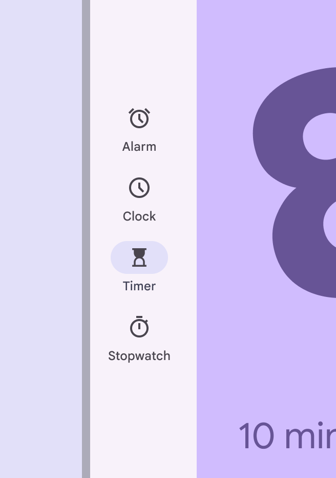

check Do

Use the active indicator only for the current open page

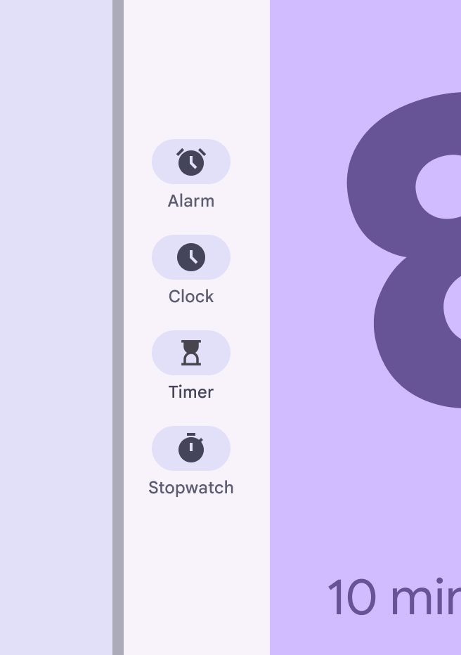

close Don’t

Don’t use the active indicator for more than one navigation item at a time

The active indicator hugs the label text in the expanded nav rail. To achieve a similar style to the baseline navigation drawer [More on navigation drawers](/m3/pages/navigation-drawer/overview), consider modifying the active indicator to fill the container. The target area should always span the full width.

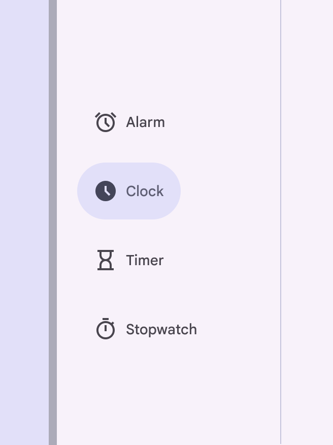

The active indicator hugs contents in the expanded nav rail

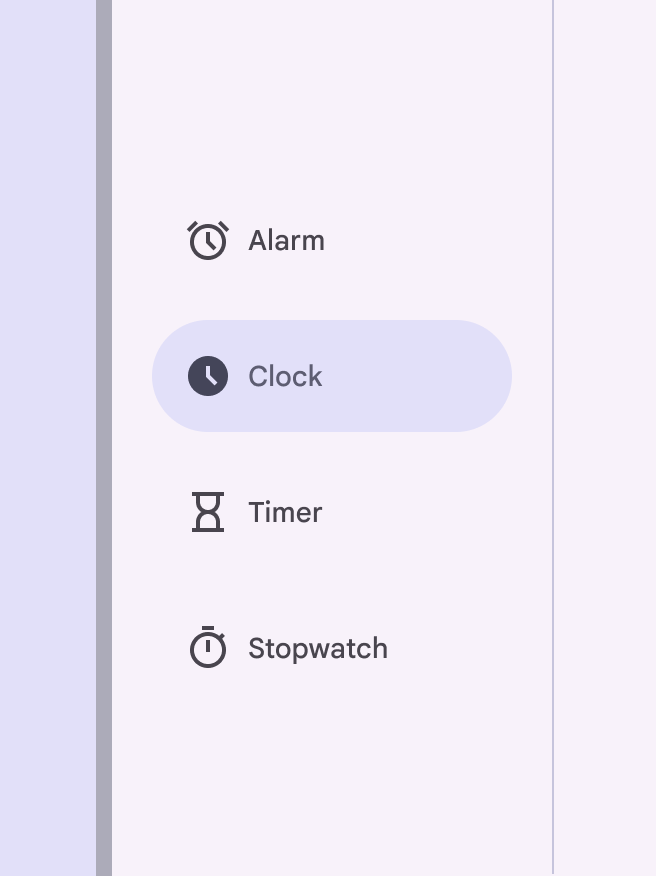

Override the indicator to fill the container to more closely resemble the baseline navigation drawer

### Icons

Navigation rail items must use icons that symbolize the content of their page. Browse popular icons on [Google Fonts](http://fonts.google.com/icons).

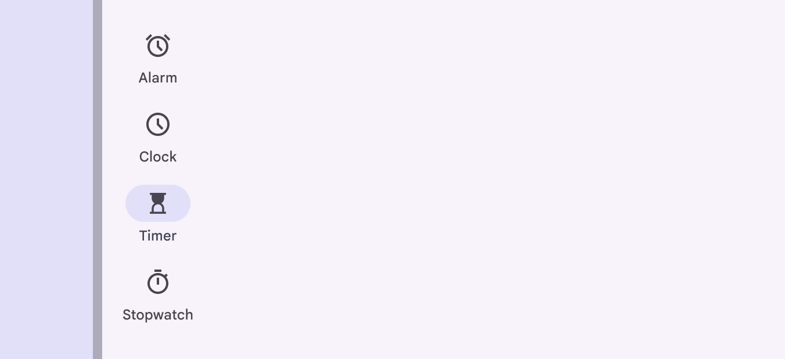

Icons should symbolize the content of the page they open

When a destination is selected, the icon fills and changes color. An active indicator appears behind the icon.

Selected navigation items have an active indicator, a filled icon, and a more prominent color

### Label text

The label text should be a short, meaningful description of each navigation destination and another way for users to understand an icon’s meaning. All navigation items require a one word label text.

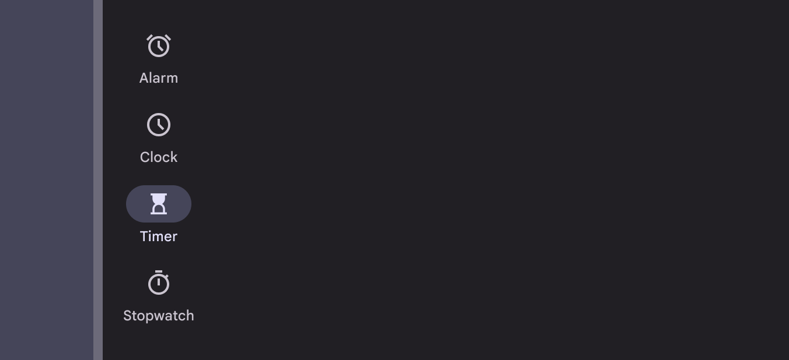

check Do

Write clear and concise labels that describe the destination page

Avoid wrapping long labels when possible. If necessary, create a line break between words, or hyphenate longer words.

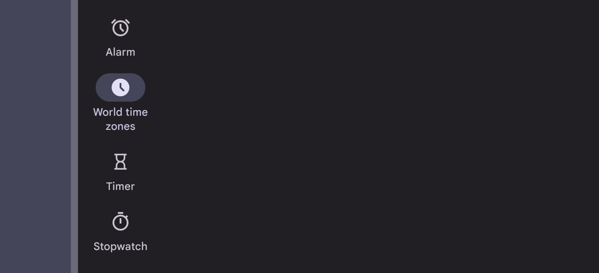

exclamation Caution

Break up longer phrases into two text lines if necessary

Labels should be short enough to not be truncated. Don’t shrink the type scale to fit longer text labels.

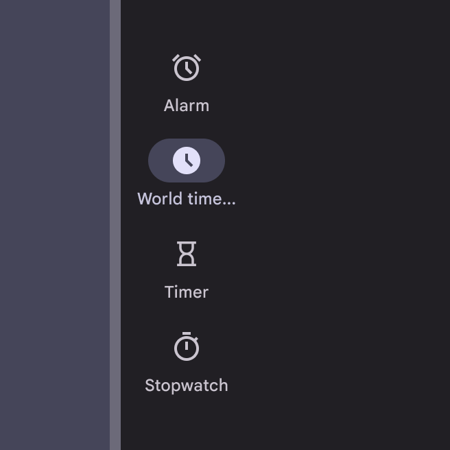

close Don’t

Don’t truncate or display an ellipsis in place of label text

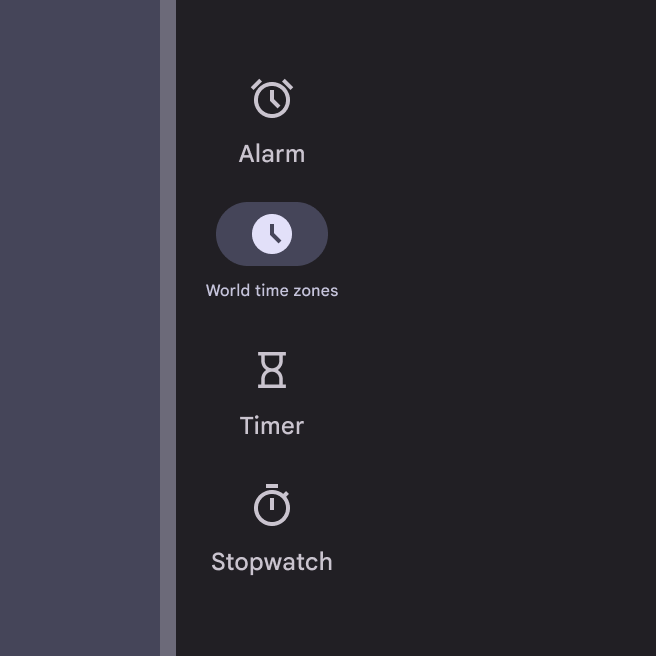

close Don’t

Don’t reduce the type size to fit more characters into a destination label

### Badges

Navigation rail icons can include badges to communicate dynamic information about the  destination, such as counts or status. In compact nav rails, the badge is placed in the upper right corner of the icon. In expanded nav rails, the badge should be placed next to the label text.

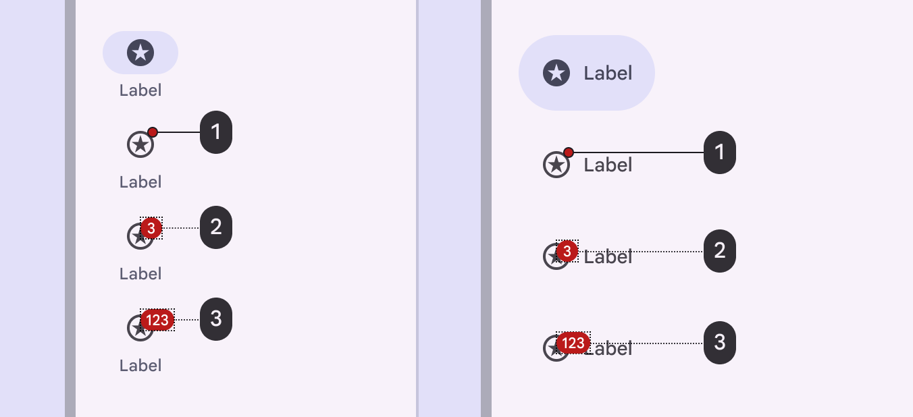

1\. Small badge on a rail destination 
2\. Large badge with a number
3\. Large badge with a maximum character count

### Divider (optional)

A vertical divider can help separate the rail from app content. The divider should be positioned on the edge of the rail container that’s adjacent to the app’s content area.

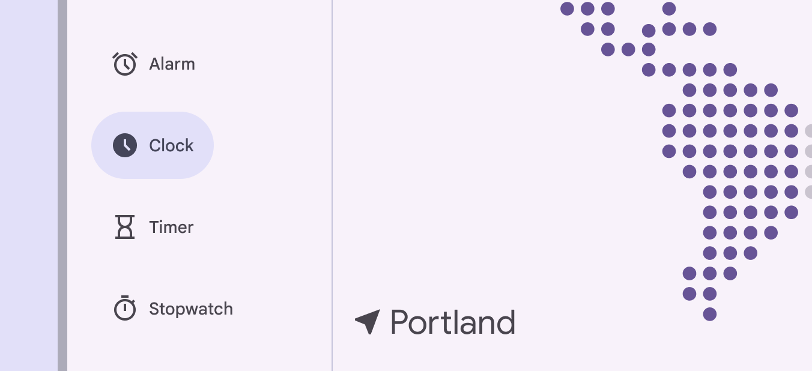

A divider can make the navigation rail container distinct from other on-screen content

## Placement

In adaptive layouts, the navigation rail should be placed outside any panes [More on panes](/m3/pages/understanding-layout/parts-of-layout#73de653a-fc57-4a7c-bc3b-5b9e94207de8), always along the leading edge of the window. Don’t place it within body content. When the navigation rail is hidden, the body content can fill in the remaining space as long as the menu icon is still accessible. Tabs [More on tabs](/m3/pages/tabs/overview) can be used alongside a navigation rail to create an extra layer of visible navigation. Expanded navigation rails can open from menu buttons on mobile

## Adaptive design

For more, see [adaptive design](/m3/pages/adaptive-design/).

### Resizing

When moving from a large screen to a small screen, a navigation rail can transform into a navigation bar, providing the same quick access in a configuration that’s easier to use on smaller displays. Never use the navigation rail and navigation bar simultaneously. Only use navigation rails for medium window size classes and larger. Don’t use a navigation bar. If there are more than five destinations, consider using a modal expanded nav rail instead.

**Compact:** Don’t use a standard navigation rail for compact layouts due to space constraints. Use a navigation bar instead.

**Medium:** Use a navigation rail, especially if prioritizing persistent vertical navigation over maximizing vertical content space.

**Expanded to extra-large:** Use a navigation rail, not a navigation bar. Consider available horizontal space and the number of destinations when choosing between standard and modal.

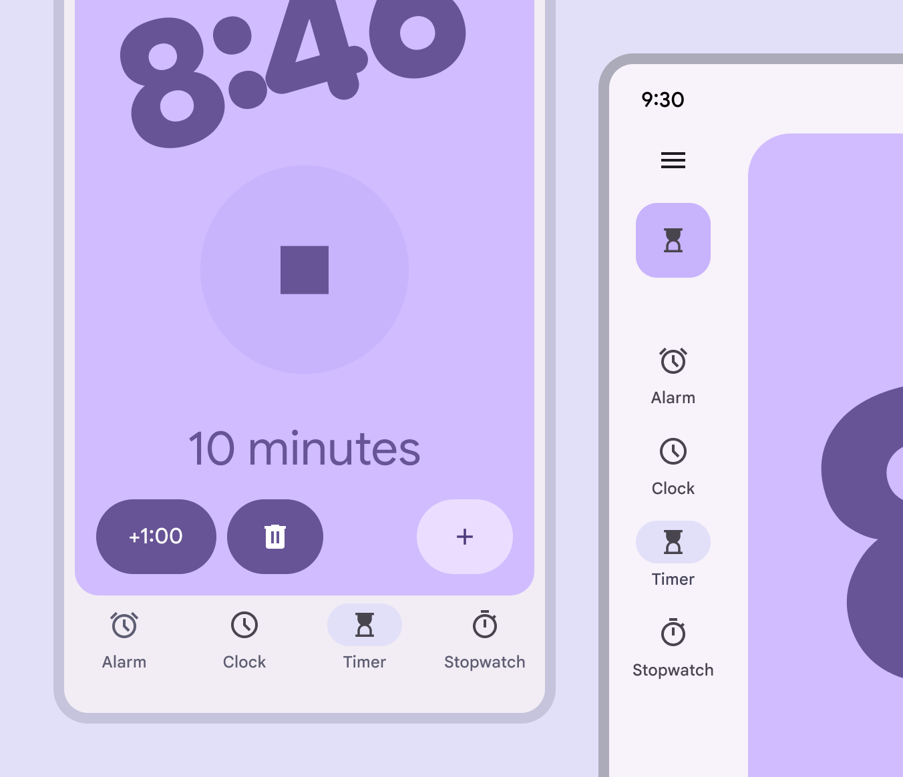

On smaller devices, use a navigation bar. On larger displays, use a navigation rail.

### Presentation

When the navigation rail transitions from collapsed to expanded, the contents of the page should automatically adjust to fit. The contents of the navigation rail also expand to fill the space. For example, the FAB should transition into an extended FAB. Extra destinations can be shown in an expanded nav rail. Use a standard expanded rail when there are secondary destinations or actions that have lower priority than the main navigation items

## Behavior

### Scrolling

Destinations in the navigation rail should remain visible and fixed when scrolling vertically. Rail destinations remain fixed while on-screen content scrolls vertically

If a layout scrolls horizontally, the rail can scroll off-screen or remain fixed. To distinguish that content is scrolling underneath the rail, use a divider or add elevation to the rail. A divider and color fill change create visual distinction between the rail and horizontally scrolling content

Elevating the rail to level 1 creates visual distinction between the rail and horizontally scrolling content

### Selection

When a destination is tapped, the destination screen uses a [top level](/m3/pages/motion-transitions/transition-patterns#f852afd2-396f-49fd-a265-5f6d96680e16) transition pattern. In addition, the icon becomes filled and the active indicator expands from the center of the icon. Tapping a destination uses a top level transition pattern

### Back

On Android, a gesture called predictive back allows people to swipe left or right on the screen to go back or dismiss modal components.

- Previous screen is revealed in a preview to signal the destination
- Predictive back only applies to the **modal expanded** navigation rail. A list of compatible components is available on the [gestures page](/m3/pages/gestures/). The nav rail pops off the edge of the window during the predictive back gesture

