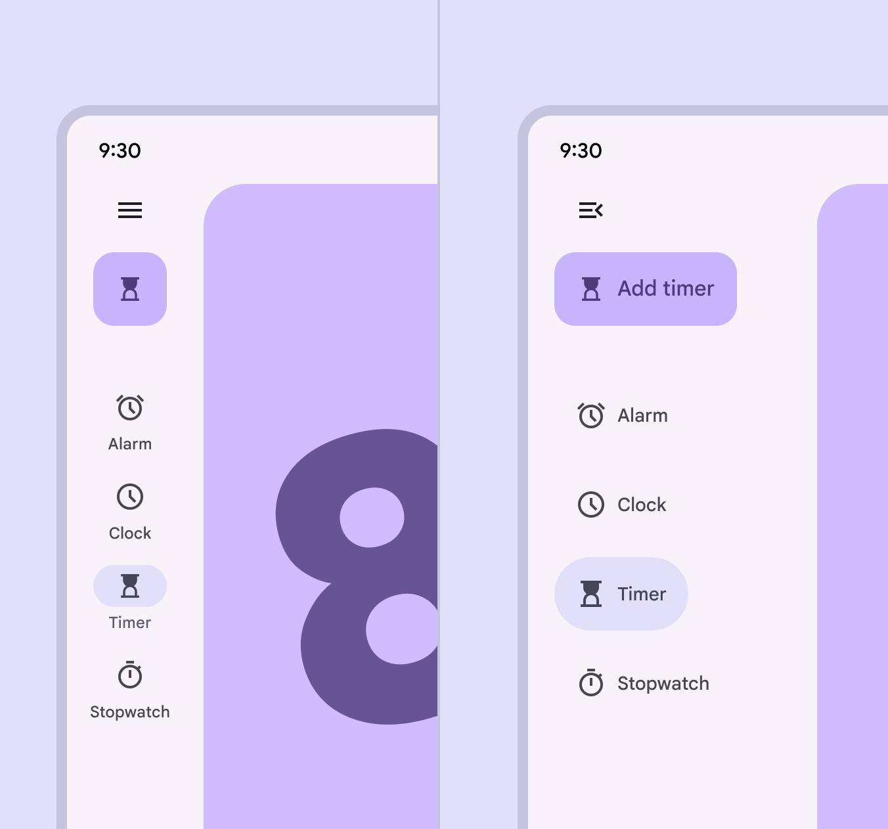
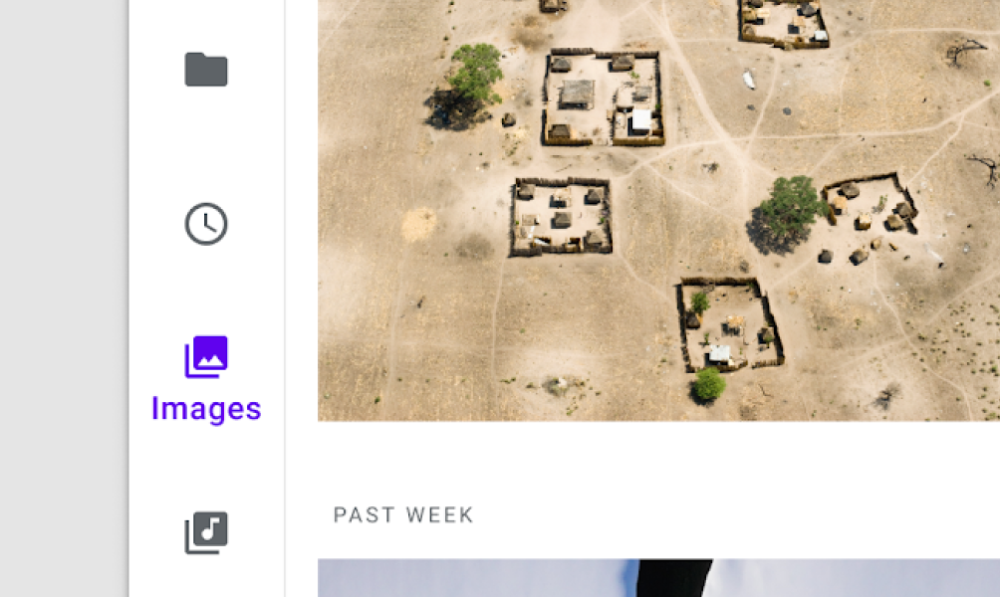

# Navigation rail

Navigation rails let people switch between UI views on mid-sized devices

- Use navigation rails in medium, expanded, large, or extra-large window sizes
- Can contain 3-7 destinations plus an optional FAB
- Always put the rail in the same place, even on different screens of an app

Collapsed and expanded navigation rails can transition between each other on any device, including:


1\. Large or medium window size classes like tablets
2\. Compact window size classes like phones in portrait orientation

## Availability & resources

| Type | Resource | Status |
| --- | --- | --- |
| Design | [Design Kit (Figma)](https://www.figma.com/community/file/1035203688168086460) | Available |
| Implementation |  | Available |
| Implementation | [Jetpack Compose](https://developer.android.com/develop/ui/compose/components/navigation-rail) | Available |
| Implementation | [Jetpack Compose: Expressive](https://developer.android.com/reference/kotlin/androidx/compose/material3/package-summary#NavigationRail\(androidx.compose.ui.Modifier,androidx.compose.ui.graphics.Color,androidx.compose.ui.graphics.Color,kotlin.Function1,androidx.compose.foundation.layout.WindowInsets,kotlin.Function1\)) | Available |
| Implementation |  | Available |
| Implementation |  | Available |

## M3 Expressive update

**May 2025**

A **collapsed** and **expanded** navigation rail have been introduced to replace the baseline nav rail. The expanded nav rail is meant to replace the navigation drawer [More on navigation drawers](/m3/pages/navigation-drawer/overview). [More on M3 Expressive](https://m3.material.io/blog/building-with-m3-expressive)

Variants and naming:

- The baseline **navigation rail** is no longer recommended
- Added two wider navigation rails:

    - **Collapsed:** replaces baseline nav rail
    - **Expanded**: replaces navigation drawer [More on navigation drawers](/m3/pages/navigation-drawer/overview)

Configurations:

- Expanded rail modality:

    - Non-modal
    - Modal
- Expanded behavior:

    - Transition to collapsed navigation rail
    - Hide when collapsed
- Color:

    - Active label on vertical items changed from **on surface variant** to **secondary**

The collapsed and expanded navigation rails match visually and can transition into each other

## Differences from M2

- Behavior: Predictive back interaction
- Color: New color mappings and compatibility with dynamic color
- States: The active destination can be indicated with a pill shape in a contrasting color

M2: The navigation rail uses icon color, weight, and fill to communicate which destination is active

M3: The navigation rail uses a pill-shaped active indicator to communicate which destination is active

