# Navigation rail

Navigation rails let people switch between UI views on mid-sized devices

## Variants

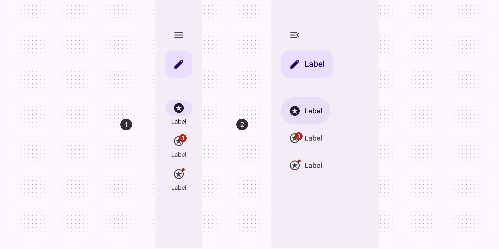

1. Collapsed navigation rail
2. Expanded navigation rail

### Baseline variants

The baseline navigation rail is no longer recommended, and should be replaced by the collapsed navigation rail. [View baseline tokens](/m3/pages/navigation-rail/specs#d4d97764-20ec-496f-a6f3-0d423940ec5a)

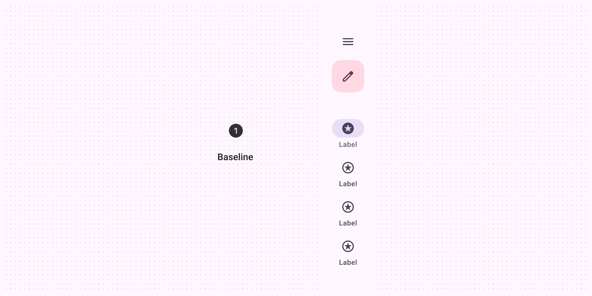

1. The baseline navigation rail is no longer recommended

|
Variant

 |

M3

 |

M3 Expressive

 |
| --- | --- | --- |
|

Collapsed navigation rail

 |

\--

 |

Available

 |
|

Expanded navigation rail 

 |

\--

 |

Available

 |
|

Navigation rail (baseline)

 |

Available

 |

Not recommended. Use **collapsed navigation rail**.

 |

## Configurations

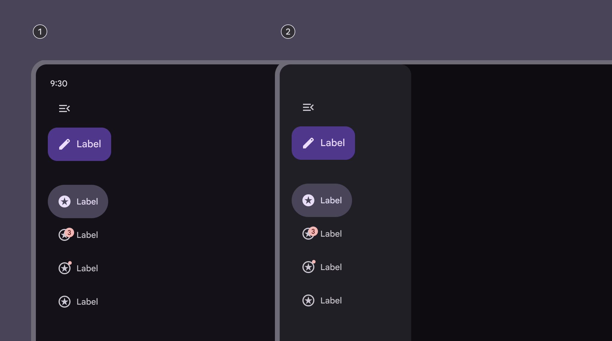

1. Expanded layout: standard
2. Expanded layout: modal

|
Category

 |

Configuration

 |

M3

 |

      M3 Expressive

 |
| --- | --- | --- | --- |
|

Expanded layout

 |

Standard (default)

 |

Available as navigation drawer [More on navigation drawers](/m3/pages/navigation-drawer/overview)

 |

Available

 |
|

Modal

 |

Available as navigation drawer [More on navigation drawers](/m3/pages/navigation-drawer/overview)

 |

Available

 |
|

Expanded behavior

 |

Hide when collapsed

 |

\--

 |

Available

 |

## Tokens & specs

Browse the component elements, attributes, tokens, and their values. [Learn about design tokens](/m3/pages/design-tokens/overview/)

```
Nav rail - Common
```

```
Nav rail - Common
```

```
Nav rail - Common
```

```
Nav rail - Common
```

Nav rail - Common

Token

Default, Light

Enabled

Hovered

Focused

Pressed

## Anatomy

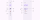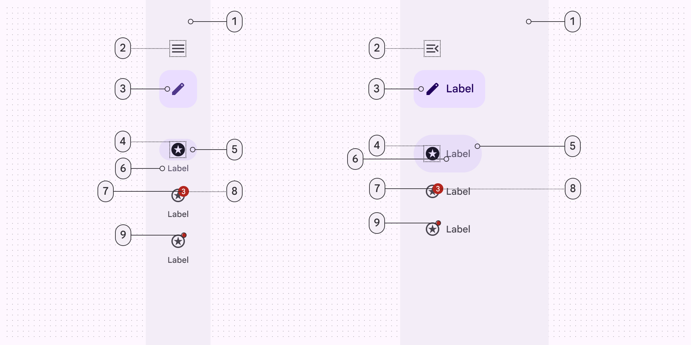

Collapsed and expanded navigation rail elements:

1. Container
2. Menu (optional)
3. FAB or Extended FAB (optional)
4. Icon
5. Active indicator
6. Label text
7. Large badge (optional)
8. Large badge label (optional)
9. Small badge (optional)

## Color

Color values are implemented through design tokens. For designers, this means working with color values that correspond with tokens; in implementation, a color value will be a token that references a value. [Learn more about design tokens](/m3/pages/design-tokens/overview)

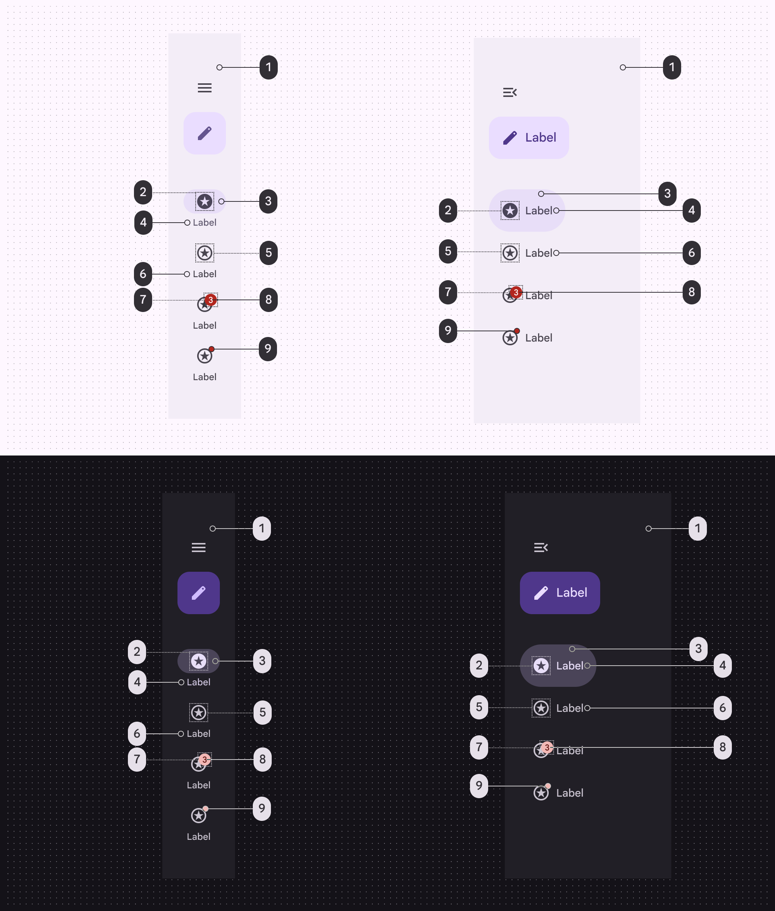

Navigation rail color roles used for light and dark schemes:

1. Surface container (optional)
2. On secondary container
3. Secondary container
4. Secondary (vertical), On secondary container (horizontal)
5. On surface variant
6. On surface variant
7. Error
8. On error
9. Error

## States [More on states](/m3/pages/interaction-states/overview) are visual representations used to communicate the status of a component or an interactive element. The navigation item’s target area always spans the full width of the nav rail, even if the item container hugs its contents.

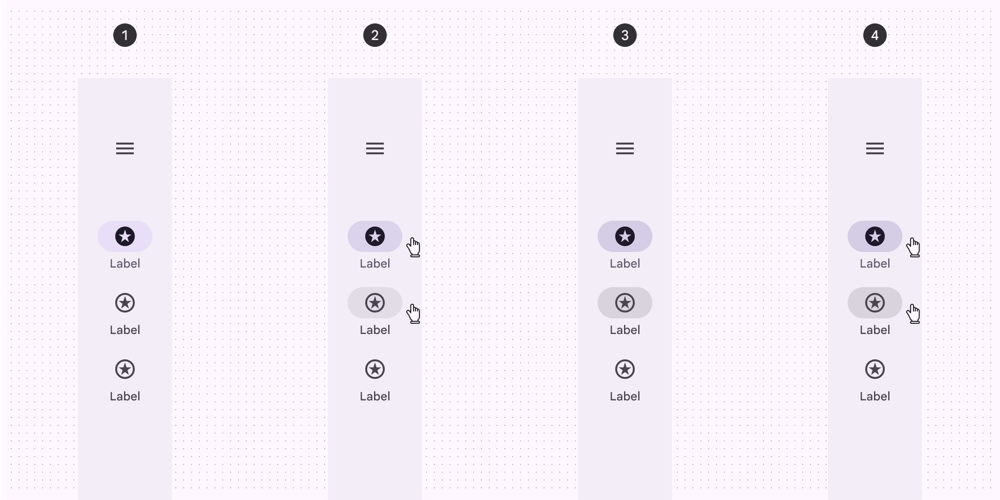

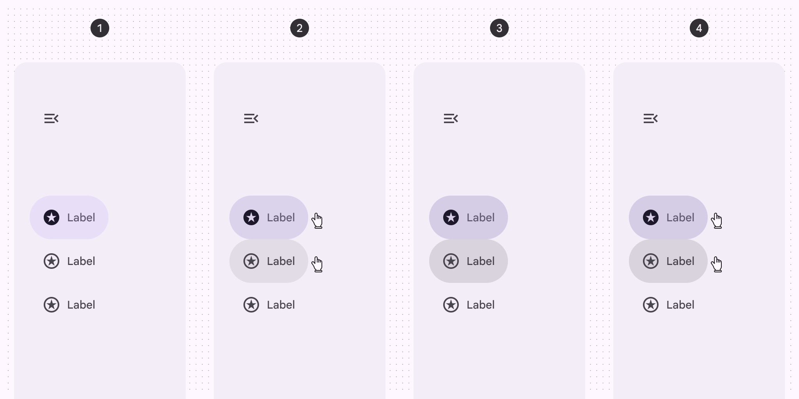

1. Enabled
2. Hovered
3. Focused
4. Pressed

## Measurements

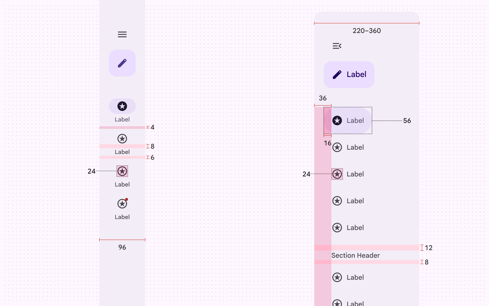

Navigation rail padding and size measurements

## Common layouts

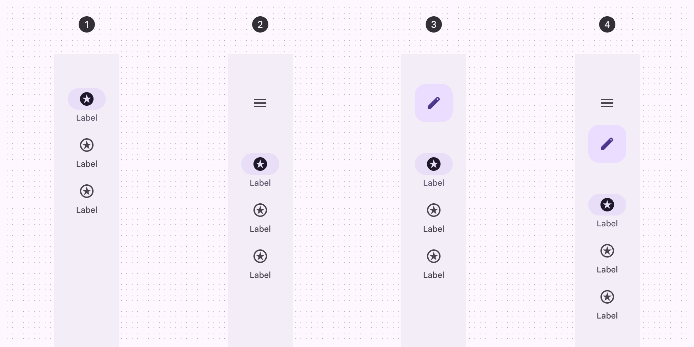

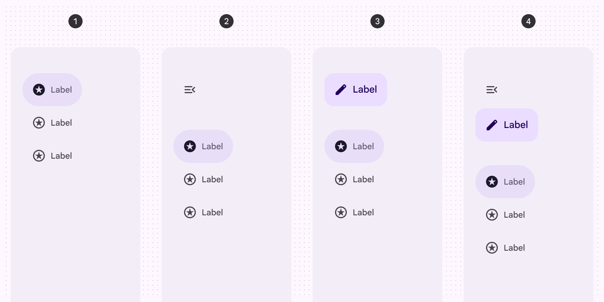

1. Three navigation items
2. Three navigation items with a menu
3. Three navigation items with a FAB
4. Three navigation items with a menu and FAB
*. * *

## Baseline navigation rail


1. Container
2. Menu icon (optional)
3. Icon
4. Active indicator
5. Label text
6. Large badge label (optional)
7. Large badge (optional)
8. Badge (optional)

### Tokens & specs

Navigation rail (baseline)

Token

Value

Enabled

Hovered

Focused

Pressed (ripple)

### Color

Color values are implemented through design tokens. For design, this means working with color values that correspond with tokens. For implementation, a color value will be a token that references a value. [Learn more about design tokens](/m3/pages/design-tokens/overview)

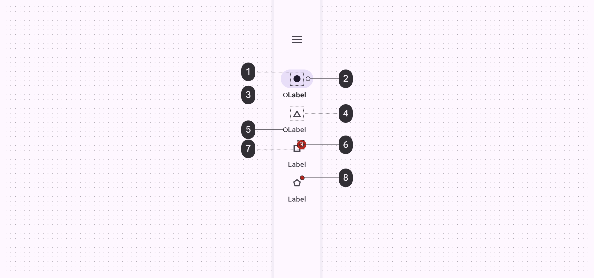

Navigation rail color roles used for light and dark themes:

1. On secondary container
2. Secondary container
3. On surface
4. On surface variant
5. On surface variant
6. Error
7. On error
8. Error

### States

States are visual representations used to communicate the status of a component or interactive element.

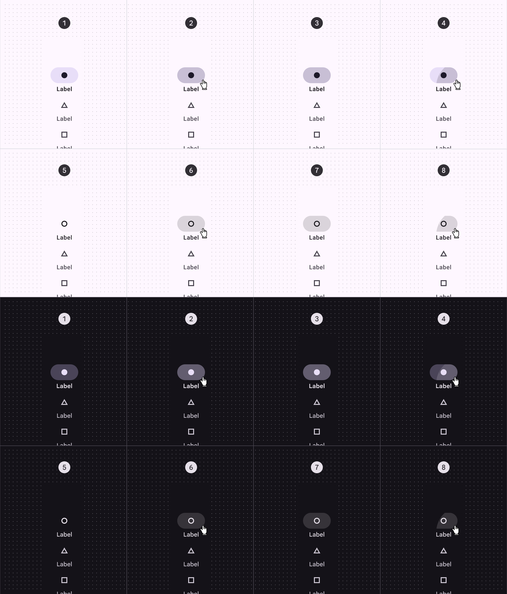

Navigation rail states:

1. Enabled (on active destination)
2. Hovered (on active destination)
3. Focused (on active destination)
4. Pressed (on active destination)
5. Enabled (on inactive destination)
6. Hovered (on inactive destination)
7. Focused (on inactive destination)
8. Pressed (on inactive destination)

### Measurements

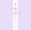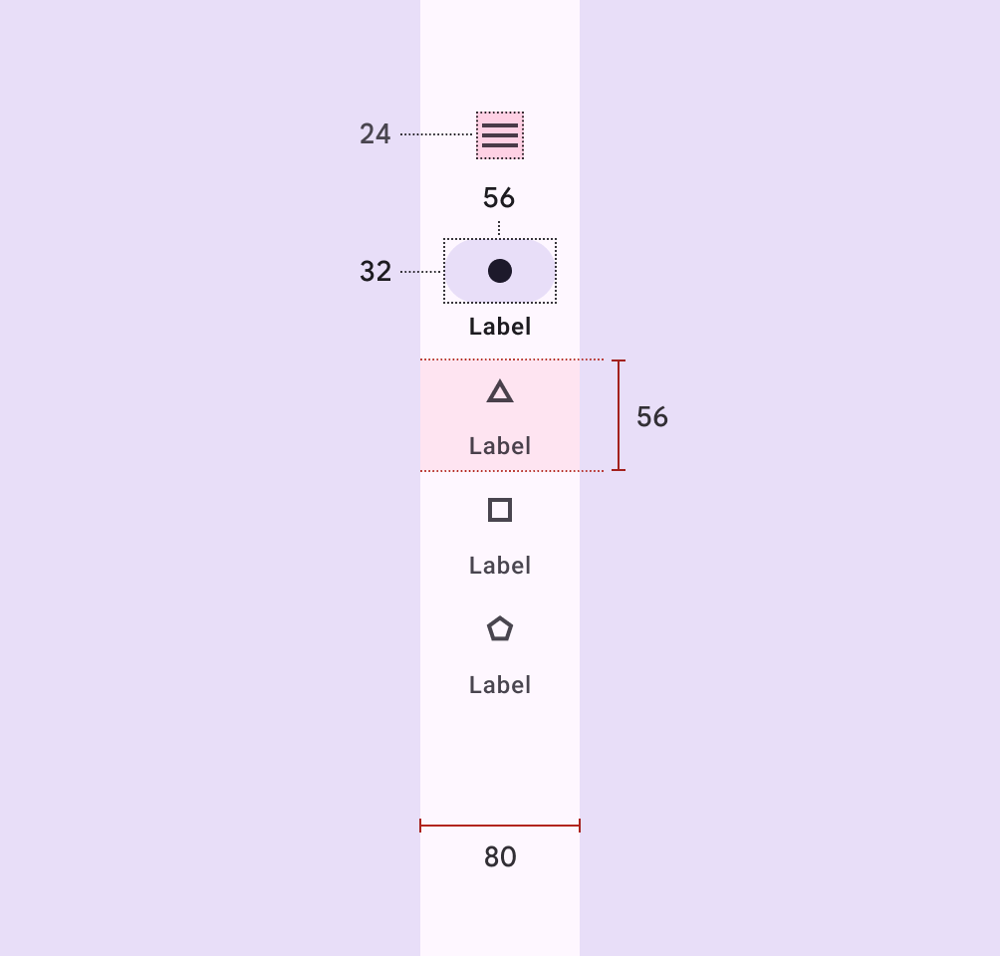

Navigation rail size measurements

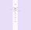

Navigation rail padding and margin measurements

### Configurations

Common arrangements of elements within a navigation rail.

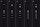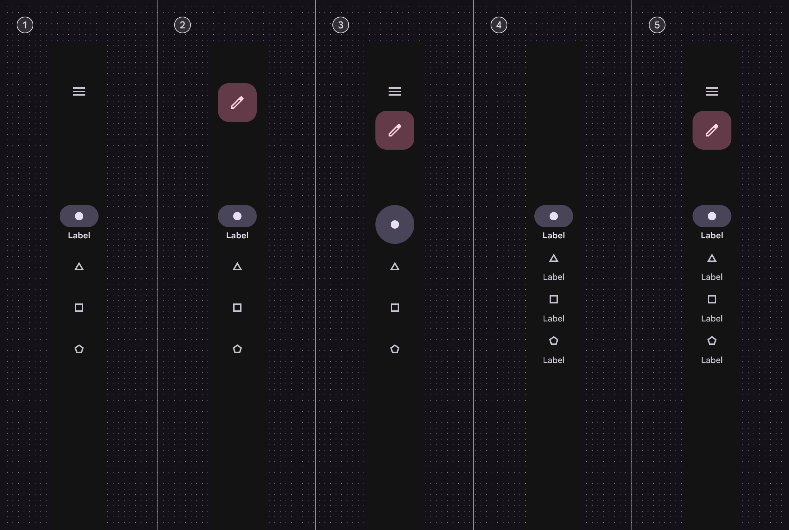

1. With a menu
2. With a FAB
3. With menu and FAB, without labels
4. All destinations with text labels
5. With menu, FAB, and label text for all destinations

