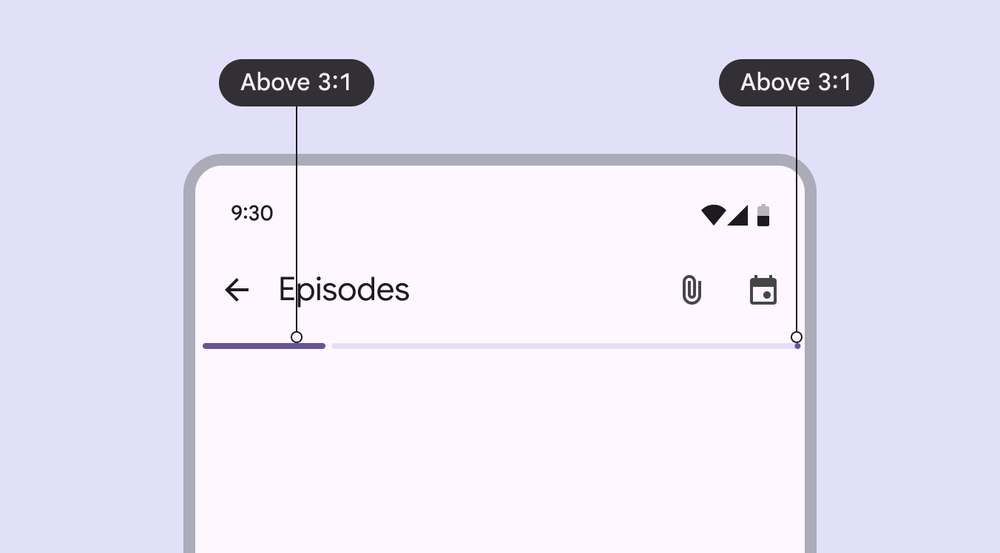
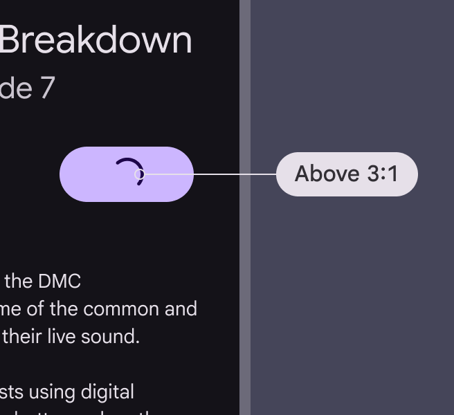
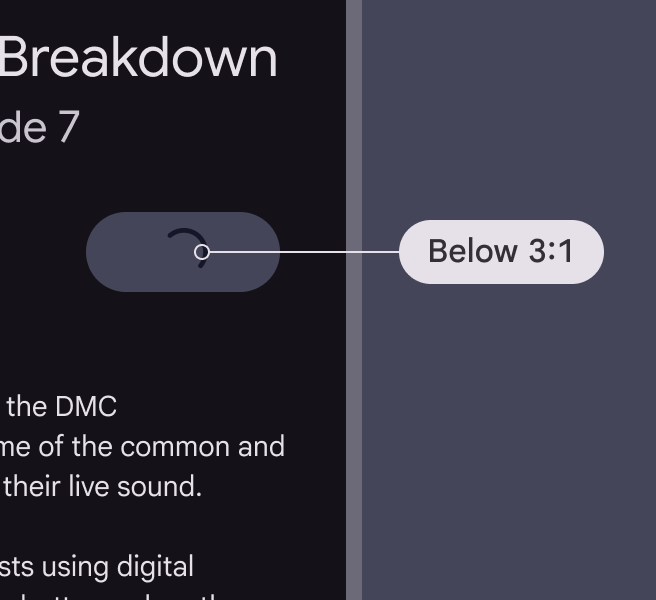
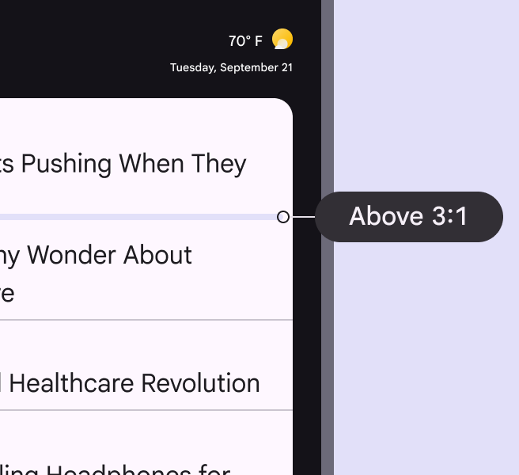
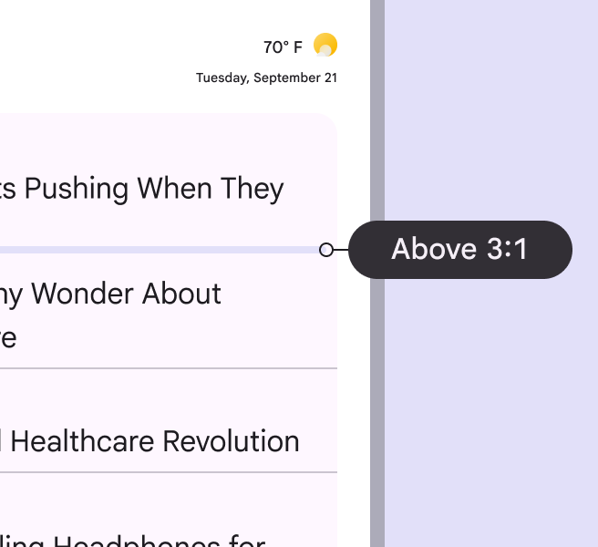
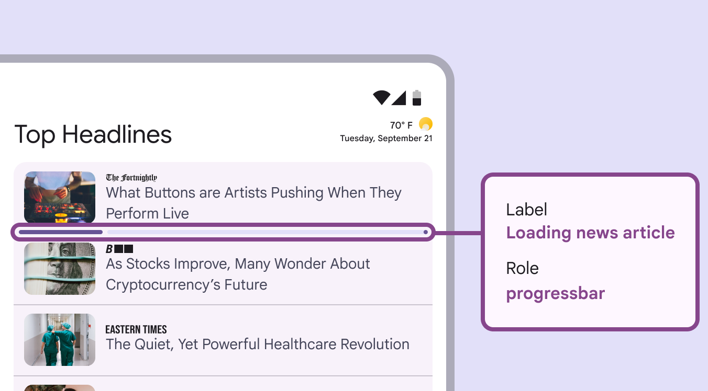
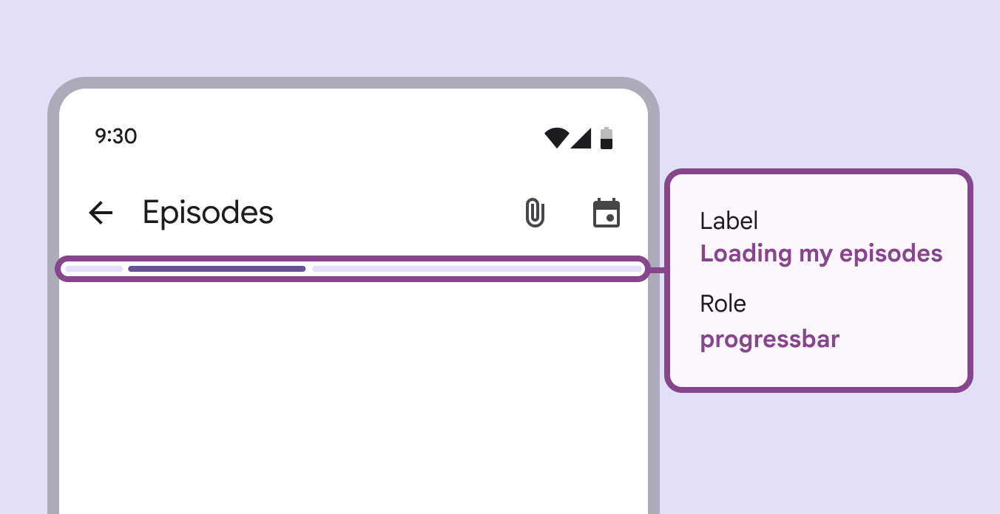

# Progress indicators

Progress indicators show the status of a process in real time

## Use cases

People should be able to do the following using the assistive technology:

- Navigate to the progress indicator
- Understand what progress the indicator is communicating

## Interaction & style

The active indicator, which displays progress, provides visual contrast of at least 3:1 against most background colors.

The progress indicator and stop indicator provide visual contrast of at least 3:1 against most background colors

When integrated into another component, such as a button, make sure that the active indicator provides visual contrast of at least 3:1 against the other component. For the active indicator, use the same color as the label text or icon. The track should be removed.

check Do

Ensure the indicator’s color provides at least 3:1 contrast against the surface it's on

close Don’t

Avoid using a color below 3:1 contrast

For linear progress indicators, the stop indicator is required if the track has a contrast below 3:1 with its container or the surface behind the container. Essentially, the end of the track must be easy to identify.

check Do

Only remove the stop indicator when the linear progress indicator has at least a 3:1 color contrast with surrounding containers and surfaces

close Don’t

Avoid removing the stop indicator if any adjacent containers or surfaces are below the 3:1 color contrast

## Labeling elements

Since the progress indicator is a visual cue, it needs an accessibility label to describe the kind and amount of progress made. Use the **progress bar** accessibility role, and write an accessibility label that describes the purpose of the progress indicator. The label should include the process, such as "loading,” and the affected content, such as a page, article, or episode. For example: "Loading news article" or "Refreshing page."

Progress indicator labels should explain which items are loading

A label on an intedeterminate progress indicator on a screen which is loading a set of podcast episodes

