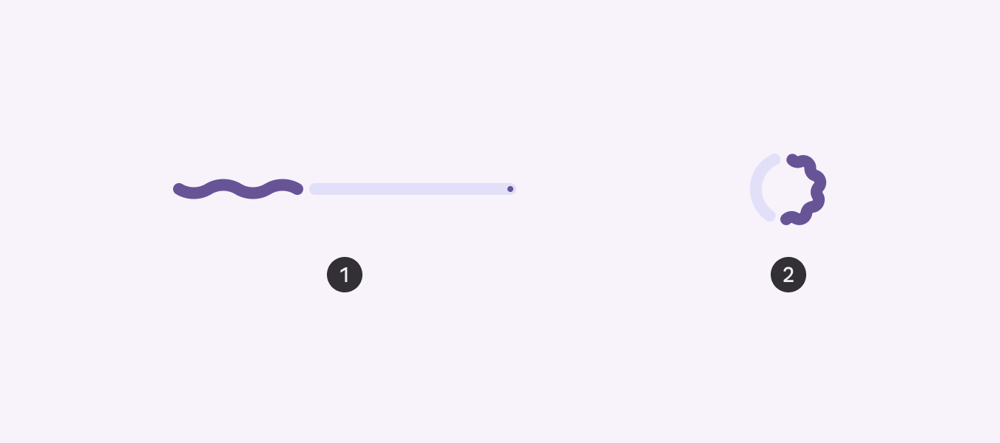
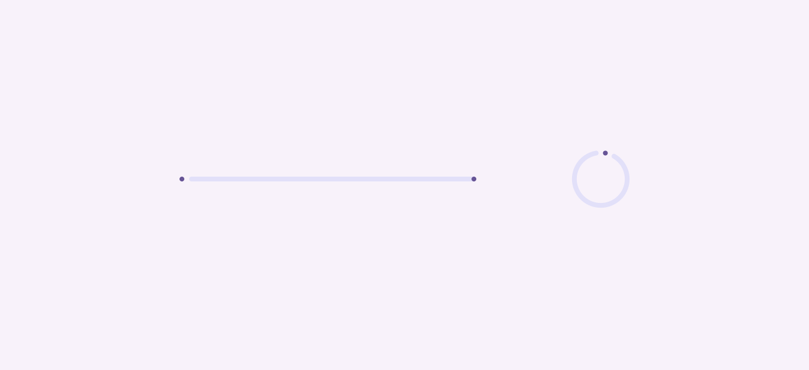
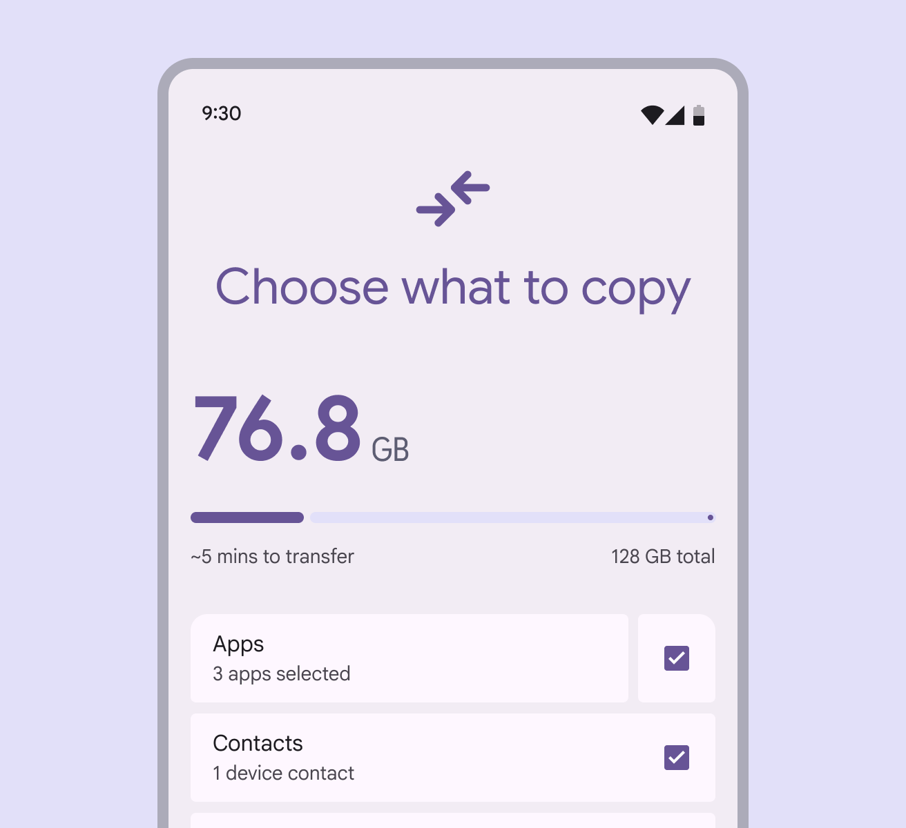
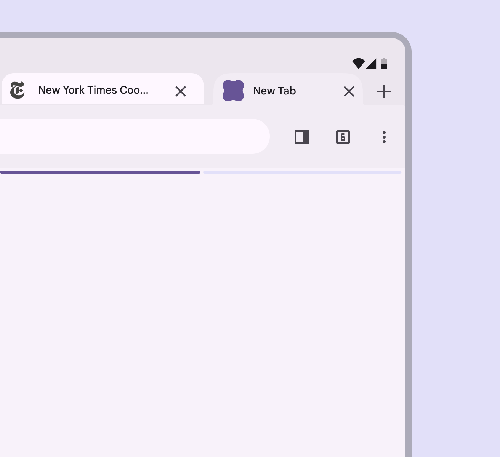
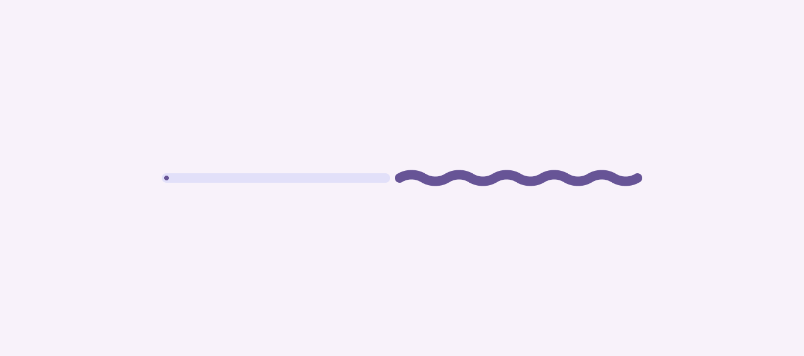
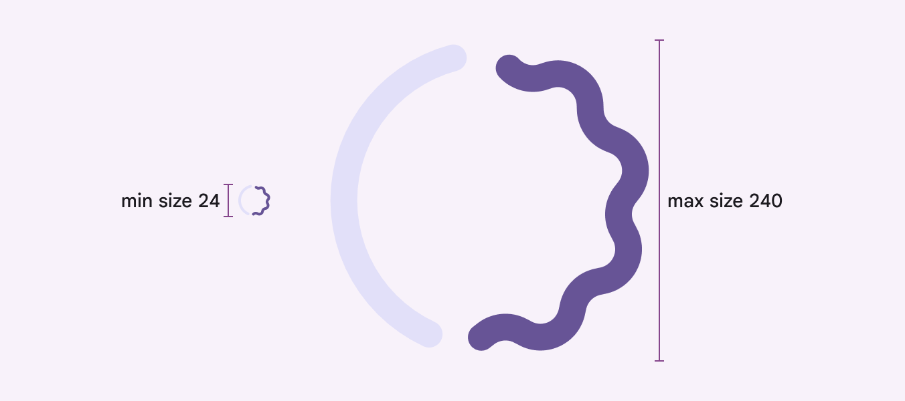
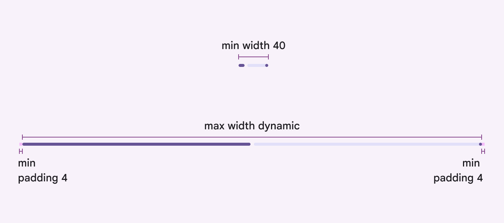

# Progress indicators

Progress indicators show the status of a process in real time

Progress indicators communicate the status of an ongoing process

## Usage

Use progress indicators to show the status of ongoing processes, such as loading an app, submitting a form, or saving updates. When multiple items are loading, use a single progress indicator to show progress for the group. Don’t add progress indicators to every activity.

check Do

Indicate overall progress of a group of items

close Don’t

Don’t show the progress of each activity in a group

Choose a loading [More on loading indicators](/m3/pages/loading-indicator/overview) or progress indicator [More on progress indicators](/m3/pages/progress-indicators/overview) that corresponds to the expected wait time and kind of process. If the wait is very long, consider allowing people to navigate away from the page while the process finishes up. 

| **Expected wait time**
 | **Recommendation** |
| --- | --- |
| Instant (under 200ms) | No indicator |
| Short (between 200ms and 5s) | Loading indicator |
| Long (Over 5s) | Progress indicator |

**Instant (under 200ms):** Display the content immediately

**Short (between 200ms and 5s):** Use a loading indicator

**Long (over 5s):** Use a progress indicator

There are two variants of progress indicators:

1. Linear
2. Circular

**Linear** indicators are best when placed on the edge of a container.

**Circular** indicators are best when centered in an element. A process should be represented by the same variant of progress indicator throughout the product. For example, if refreshing uses a circular indicator in one place, it should use circular indicators everywhere.

1. Linear indicator
2. Circular indicator

Progress indicators behave differently based on the time of progress being tracked:

- **Determinate**: Known progress and wait time
- **Indeterminate**: Unknown progress and wait time

When using a **determinate** indicator, the indicator must accurately represent the progress of what it's measuring. Use **indeterminate** indicators to show that a process is happening, but the wait time is unknown.

1. Determinate progress indicators fill from 0% to 100%
2. Indeterminate progress indicators move along a fixed track, growing and shrinking in size

As more information about a process becomes available, a progress indicator should change from **indeterminate** to **determinate**. A linear progress indicator changes from indeterminate to determinate while loading a screen

## Anatomy

1. Active indicator
2. Track
3. Stop indicator

### Active indicator

The active indicator shows the progress that has been made so far. In indeterminate processes, it grows and shrinks along the track repeatedly. Linear indicators animate from the leading to the trailing edge along the track. Circular indicators animate from the top of the track, clockwise by default. The active indicator appears as soon as progress begins. At low percentages where space is limited, this should appear as a dot to help people understand that there’s progress underway.

When progress first begins, the active indicator appears as a dot

The active indicator has two shape options: **flat** and **wavy**. Use the shape that best fits the product’s tone. The wavy shape can make longer processes feel less static and is best used when a more expressive style is appropriate. When using the wavy shape, the overall height of the component changes. At very small sizes, the wavy shape may not be as visible. Wavy linear indicators increase the height of the overall container

### Stop indicator

The stop indicator is a 4dp circle that marks the end of a linear determinate progress indicator to meet Material's accessibility standards. It's not used for indeterminate or circular progress indicators. The stop indicator is required if the track has a contrast below 3:1 with its container or the surface behind the container.

check Do

Use a stop indicator when placing the progress indicator inside a container with low contrast

exclamation Caution

Only remove the end stop indicator if there's a visual contrast of at least 3:1 with surrounding surfaces

## Placement

Place a linear progress indicator along the edge of a container that’s loading. If the container changes shape, place it on the edge that animates. It can also be placed in the middle of a container. Use a single progress indicator at the top of a page to show progress of the whole group. Don’t add one for every element unless they’re activated independently. When at the top of a screen, a progress indicator shows that all of the page content is loading

When attached to a card, a progress indicator shows that just the card content is loading

A progress indicator on the expanding edge of a card shows that the edge may expand to show the loaded content

Circular progress indicators should be centered directly on the container or page that's loading, such as a button or card. When loading more items on a page, place the circular progress indicator in the empty space where the new content will appear, not overlapping existing content. However, if the content does not take long to load, consider using a loading indicator instead. A circular progress indicator can show that the page is loading

A circular progress indicator can show where new items will appear on a page. A loading indicator also works well in this space.

### Progress indicators in buttons

A circular indicator can be placed in a button to show that the button’s action is currently in progress. In very small buttons, use the flat shape since the wavy shape is not as visible at that size. To ensure a minimum 3:1 contrast ratio, change the active indicator color to be the same color as the button’s icon or label text, and remove the track.

check Do

Use circular indicators for short, indeterminate activities under 5 seconds

close Don’t

Avoid applying progress indicators to every button in a list

## Responsive layout

### Right-to-left languages

Linear progress indicators should be mirrored horizontally for products using right-to-left (RTL) languages. Circular progress indicators don’t need to be mirrored.

Linear progress indicators can flow from right to left in right-to-left (RTL) languages

### Large screens

Circular progress indicators have flexible sizes. They can range from 24dp to 240dp, depending on the placement and the window size. Avoid exceeding the minimum and maximum sizes. Reserve very large progress indicators for large and extra-large windows, such as desktop.

The waveform should scale with the size so the proportions look the same across sizes

Linear progress indicators dynamically adjust to fit the width of the window or element they’re placed within, such as a card. They shouldn’t be used in any elements smaller than 40dp. The padding on each end should be 4dp minimum, but can be modified.

The linear progress indicator should always span the width of the UI element it’s placed within

