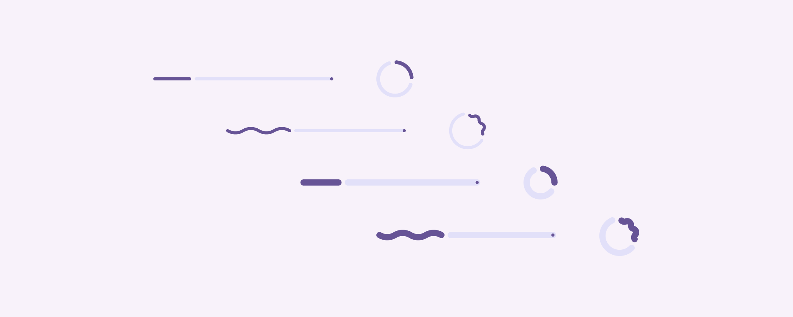
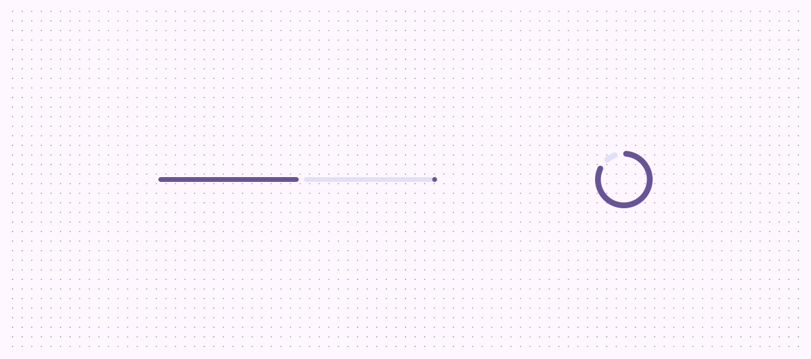
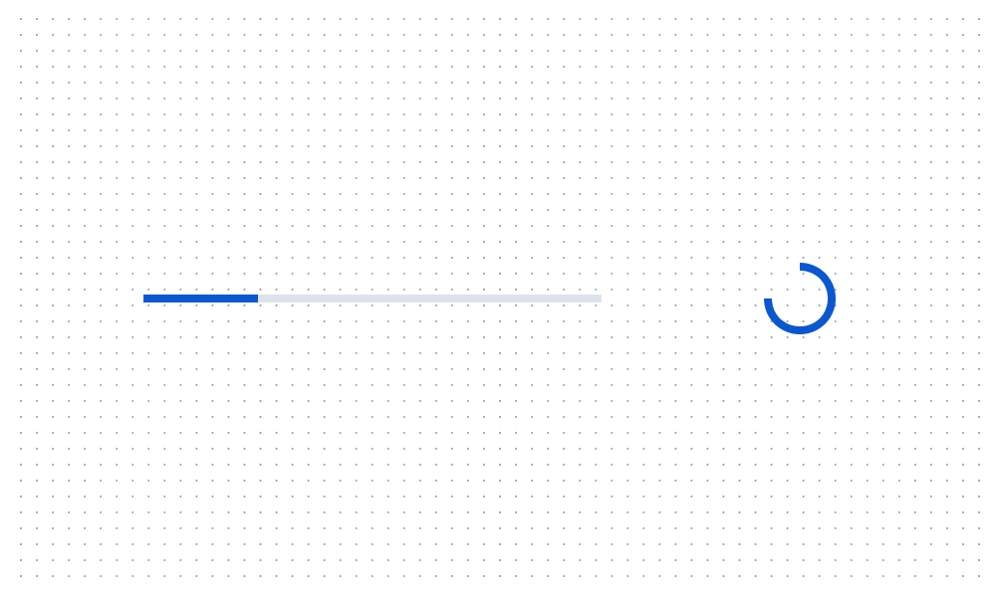
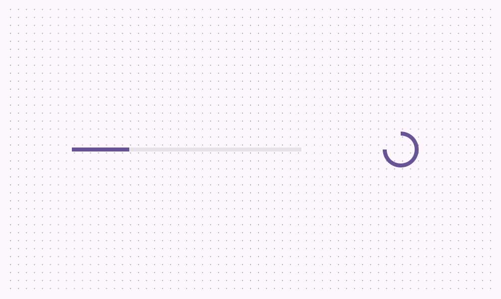

# Progress indicators

Progress indicators show the status of a process in real time

- Two variants: linear and circular
- Use the same configuration for all instances of a process (like loading)
- They capture attention through motion
- Option to apply a wave to the active track for use cases that would benefit from increased expressiveness

Linear and circular progress indicators have visual configurations for shape and thickness

## Availability & resources

| Type | Resource | Status |
| --- | --- | --- |
| Design | [Design Kit (Figma)](https://www.figma.com/community/file/1035203688168086460) | Available |
| Implementation |  | Available |
| Implementation | [Jetpack Compose](https://developer.android.com/develop/ui/compose/components/progress) | Available |
| Implementation | [Jetpack Compose: Expressive](https://developer.android.com/reference/kotlin/androidx/compose/material3/package-summary#LinearWavyProgressIndicator\(androidx.compose.ui.Modifier,androidx.compose.ui.graphics.Color,androidx.compose.ui.graphics.Color,androidx.compose.ui.graphics.drawscope.Stroke,androidx.compose.ui.graphics.drawscope.Stroke,androidx.compose.ui.unit.Dp,kotlin.Float,androidx.compose.ui.unit.Dp,androidx.compose.ui.unit.Dp\)) | Available |
| Implementation |  | Available |
| Implementation |  | Available |
| Implementation |  | Available |

## M3 Expressive update

**Aug 2024**

The progress indicators have configurations for height and wavy shape. Choose the visual style that best fits your product. [More on M3 Expressive](https://m3.material.io/blog/building-with-m3-expressive)

- Track height: Configurable
- Shape: Wavy

Progress indicators have a new rounded, colorful style, and more configurations to choose from, including a wavy shape and variable track height

## Previous updates

**Dec 2023: Non-text contrast (NTC)**

- Anatomy: Added an end stop indicator to improve accessibility
- Contrast: Higher contrast between track and active indicator to enhance the perception of progress
- Motion: New motion behavior
- Shape: Rounded corners

Progress indicators have a new rounded, colorful style

## Differences from M2

**July 2022: Added to Material 3**

- **Color:** New color mappings and compatibility with dynamic color

M2: Progress indicators have a boxier, neutral style

M3: Progress indicators are compatible with dynamic color

