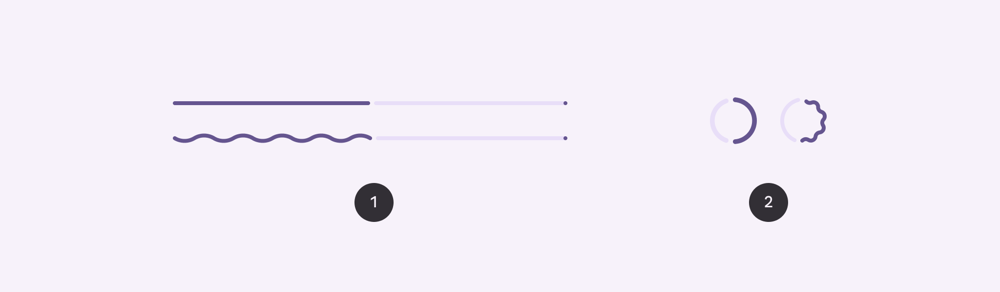
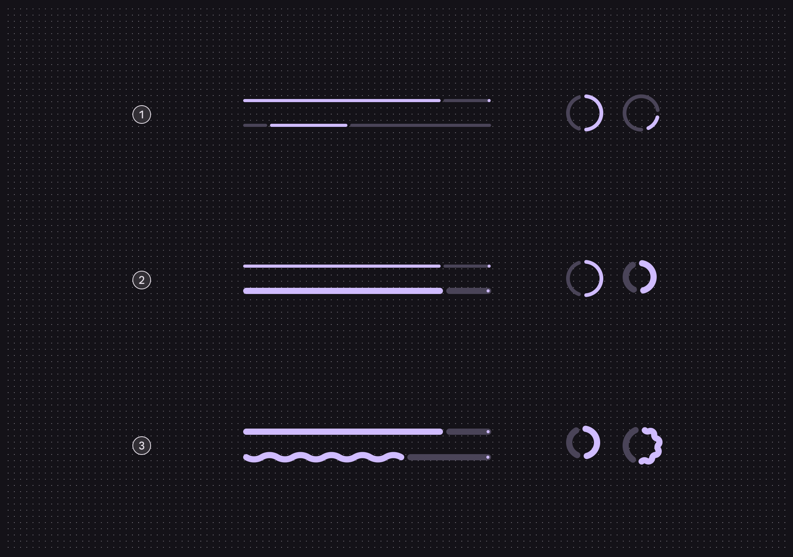
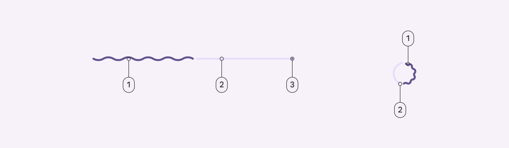
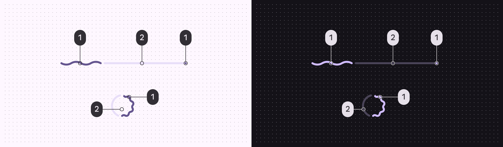
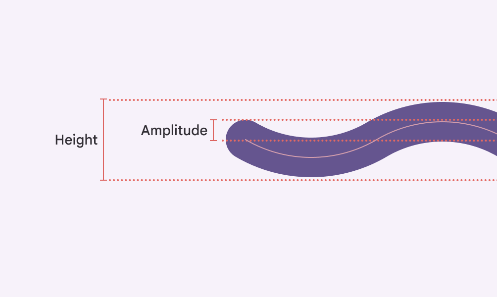
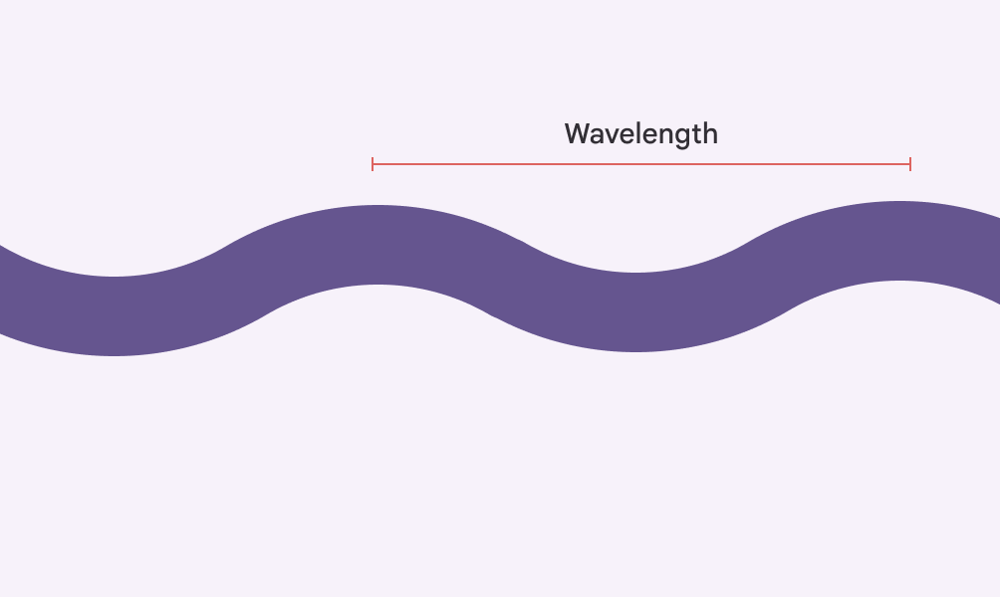
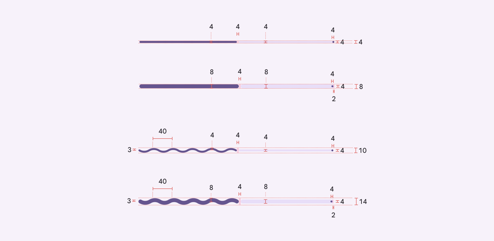
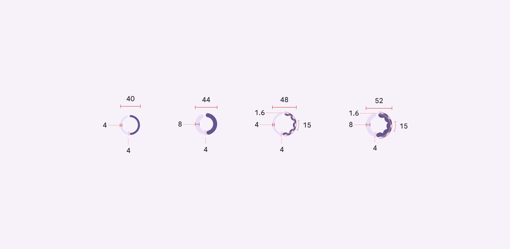
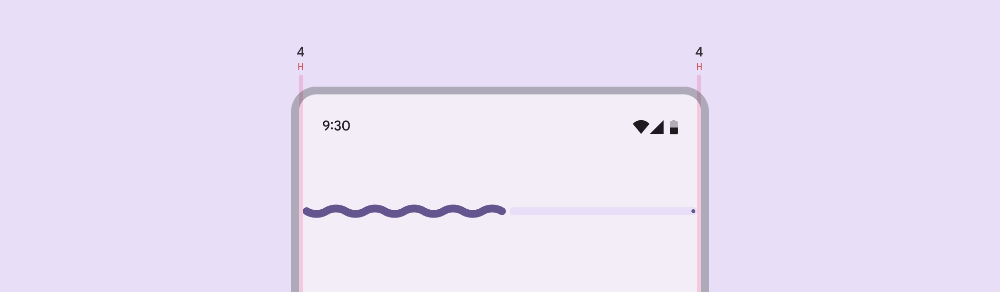

# Progress indicators

Progress indicators show the status of a process in real time

## Variants



1. Linear progress indicator
2. Circular progress indicator

|
Variant

 |

M3

 |

M3 Expressive

 |
| --- | --- | --- |
|

Linear progress indicator

 |

Available

 |

Available

 |
|

Circular progress indicator

 |

Available

 |

Available

 |

## Configurations



1. Behavior: Determinate and indeterminate
2. Thickness: Default (4dp) and variable
3. Shape: Flat and wavy

|
Category

 |

Configuration

 |

M3

 |

M3 Expressive

 |
| --- | --- | --- | --- |
|

Behavior

 |

Determinate (default), Indeterminate

 |

Available

 |

Available

 |
|

Track thickness

 |

Fixed (4dp) 

 |

Available

 |

Available

 |
|

Configurable

 |

\--

 |

Available

 |
|

Shape

 |

Flat (default)

 |

Available

 |

Available

 |
|

Wavy

 |

\--

 |

Available

 |

## Tokens & specs

Browse the component elements, attributes, tokens, and their values. [View baseline tokens](/m3/pages/progress-indicators/specs#c6f484b0-2bc6-4d37-bd75-f859a35a3594)

```
Progress Indicator - Common
```

```
Progress Indicator - Common
```

```
Progress Indicator - Common
```

```
Progress Indicator - Common
```

Progress Indicator - Common

Token

Default, Light

Color

Shape

\[Deprecated\] Enabled

## Anatomy



1. Active indicator
2. Track
3. Stop indicator

## Color



Progress indicator color roles used for light and dark schemes:

1. Primary
2. Secondary container

## Measurements

Wavy indicators use **amplitude** and **wavelength** to determine the shape of the wave. The height is the overall container height.



**Amplitude** measures from the center of the resting position to the center of the peak



**Wavelength** measures the distance between two adjacent peaks



Size measurements for linear progress indicators. The thicker variants are provided as sample measurement for makers to adjust the default version based on their use cases. 



Size measurements for circular progress indicators. The thicker variants are provided as sample measurement for makers to adjust the default version based on their use cases. 



The linear progress indicator is inset from the edge of the screen by 4dp

## Baseline tokens

The circular and linear progress indicator had separate token sets. These are no longer recommended.

\[Deprecated\] Progress indicator - Circular

Token

Default, Light

\[Deprecated\] Enabled

