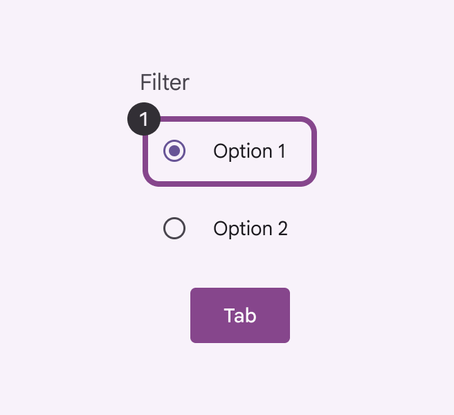
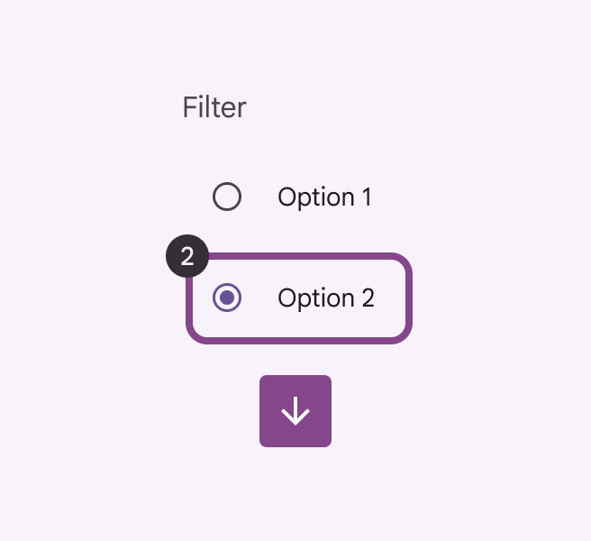
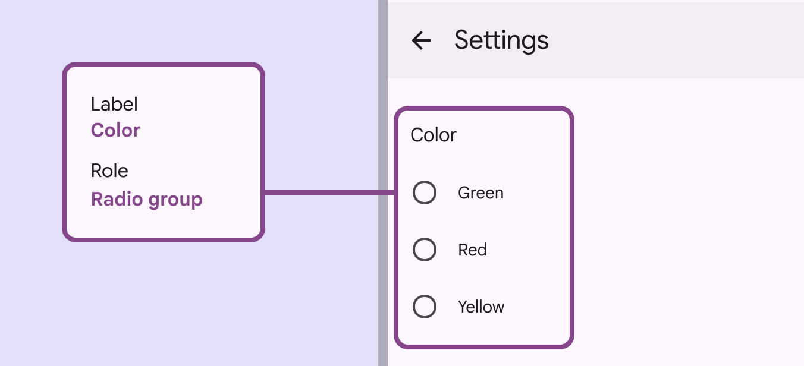
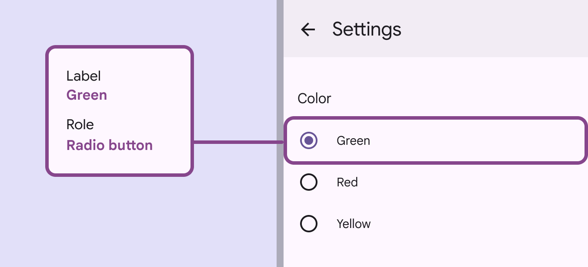

# Radio button

Radio buttons let people select one option from a set of options

## Use cases

People should be able to do the following with assistive technology:

- Navigate to a radio button
- Select a radio button
- Get appropriate feedback based on input type

## Interaction & style

A radio button can be either selected or unselected. Selecting one radio button deselects any others. A radio group can start with one radio button selected, or none selected. Once a radio button is selected, the group can’t be deselected. To let people opt out of their selection, either provide a **Not applicable** or **No option** radio button, or provide a separate way to deselect all radio buttons, like **Clear selection**. People should be able to select either the text label or the radio button to select an option. Only one radio button is selected at a time

### Avoid applying density by default

Don't apply density to radio buttons by default. This lowers their targets below Material's recommendation of 48x48 CSS pixels. Instead, give people a way to choose a higher density, like selecting a denser layout or changing the theme. To ensure this density setting can be easily reverted when it's active, keep all targets to change it at a minimum of 48x48 CSS pixels each.

## Initial focus

When outside the radio group, **Tab** moves focus directly to the selected radio button, or the first one if none are selected. 

**Shift+Tab** instead focuses on the last radio if none are selected. Use the **arrows** to navigate between options.

Tab brings the focus to the initially selected item or the initial radio option

Arrows move to next element in a list

## Keyboard navigation

| Keys | Actions |
| --- | --- |
| **Tab** | Moves focus into the group to the selected radio button, or the first if none are selected |
| **Shift** + **Tab** | Moves focus into the group to the selected radio button, or the last if none are selected |
| **Arrows** | Moves focus and selects the previous or next radio button. Wraps focus and selection between the first and last radio buttons. |
| **Space** | Selects a focused radio button. If already selected, does nothing. |

## Labeling elements

If the UI text is correctly linked to the radio button, assistive tech such as a screenreader will read the UI text, followed by the component’s role. The accessibility [More on accessibility](/m3/pages/overview/principles) label for a group of radio buttons is typically the same as its title. The role is **Radio group**.

Label the radio group based on the category title

The accessibility [More on accessibility](/m3/pages/overview/principles) label for an individual radio button is typically the same as its adjacent text label.

Label the radio button based on its label text

