# Radio button

Radio buttons let people select one option from a set of options

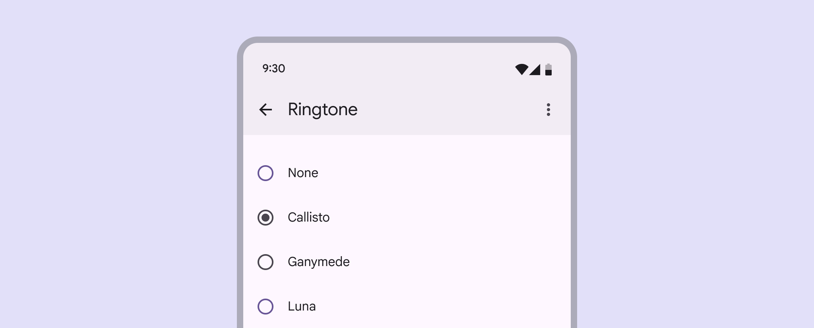

Radio buttons

## Usage

Radio buttons are the recommended way to allow users to make a single selection [More on selection](/m3/pages/selection) from a list of options. Only one radio button can be selected at a time. Radio buttons should always be accompanied by clear inline labels

Use radio buttons to:

- Select a single option from a set
- Expose all available options

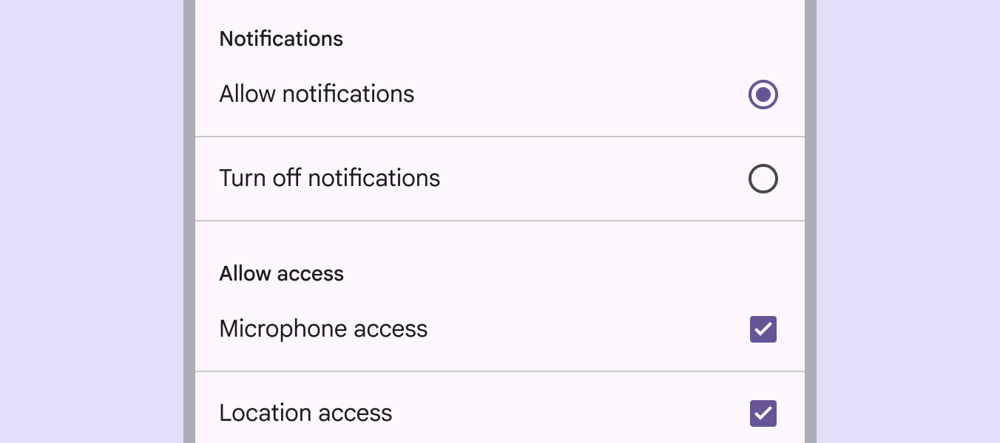

Radio buttons are single-select, unlike checkboxes which are multi-select

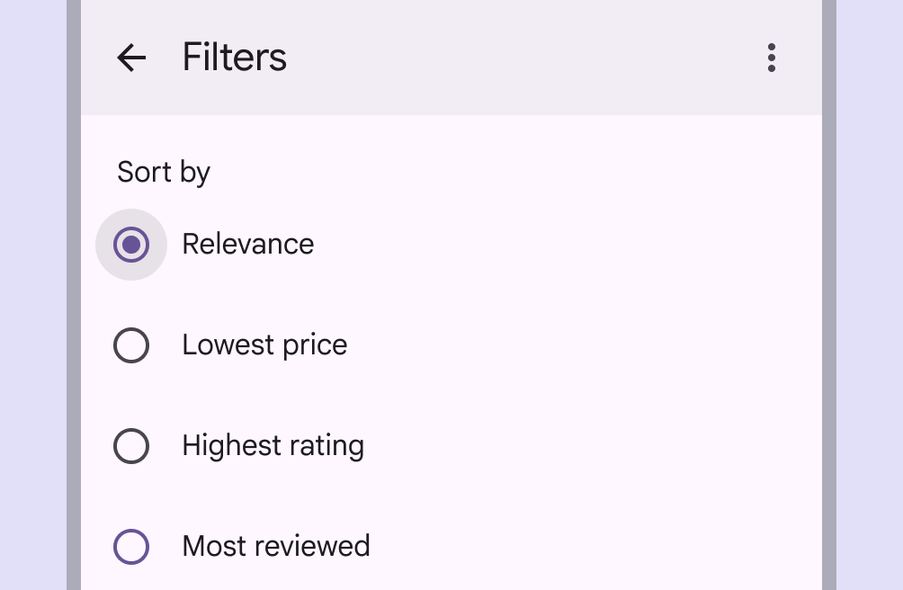

check Do

Use radio buttons when only one option can be selected from a list

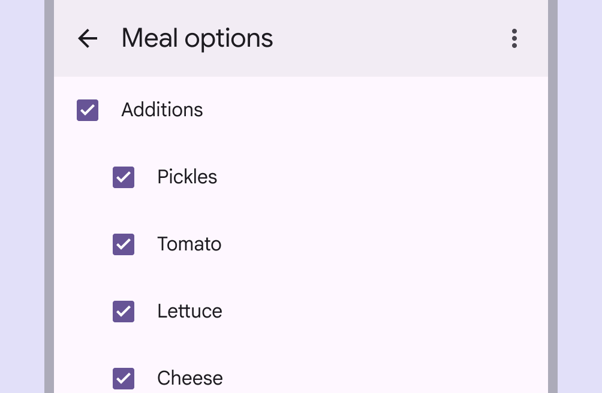

check Do

Use checkboxes when multiple options can be selected from a list

Avoid nesting radio buttons or using radio buttons to select multiple options.

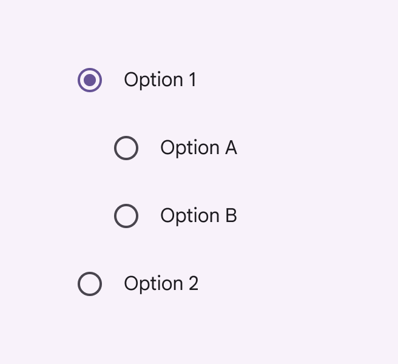

close Don’t

Don’t nest radio buttons

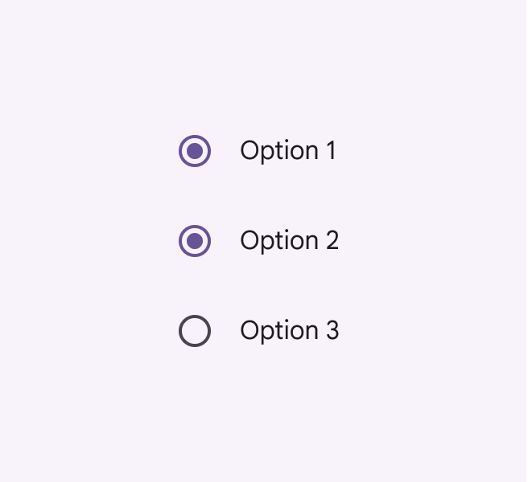

close Don’t

Don’t allow radio buttons to select multiple options

### Alternate selection controls

Radio buttons are one of several selection [More on selection](/m3/pages/selection) controls, which allow people to make choices such as selecting options or switching settings on or off. Switches [More on switches](/m3/pages/switch/overview) and checkboxes [More on checkboxes](/m3/pages/checkbox/overview) are alternative selection controls that can be used to change settings or preferences.

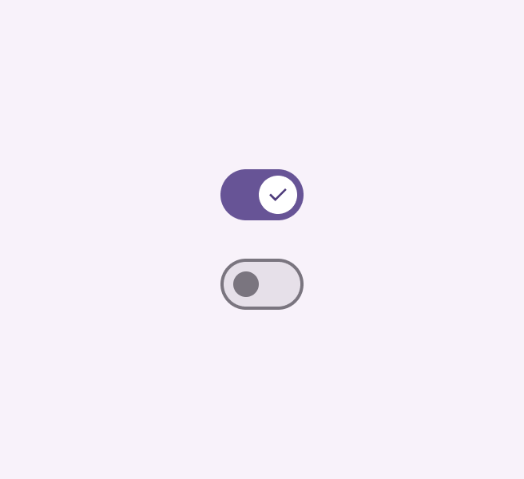

Switches

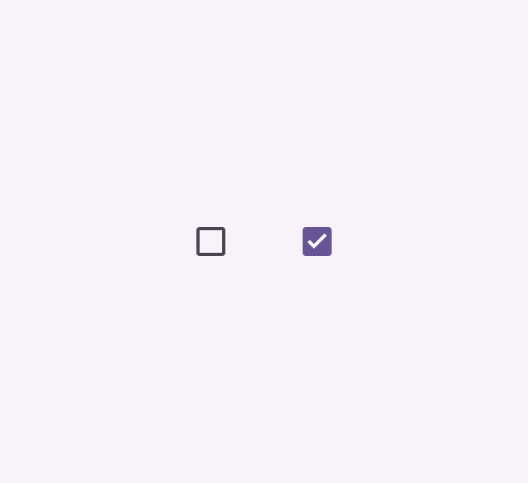

Checkboxes

Use radio buttons when there are five or fewer options. Consider using a drop-down Menus display a list of choices on a temporary surface. More on menus [More on menus](/m3/pages/menus/overview) instead of radio buttons when it’s important to save space on a screen. However, drop-down menus require additional steps for a person, both in the number of clicks and cognitive effort. 

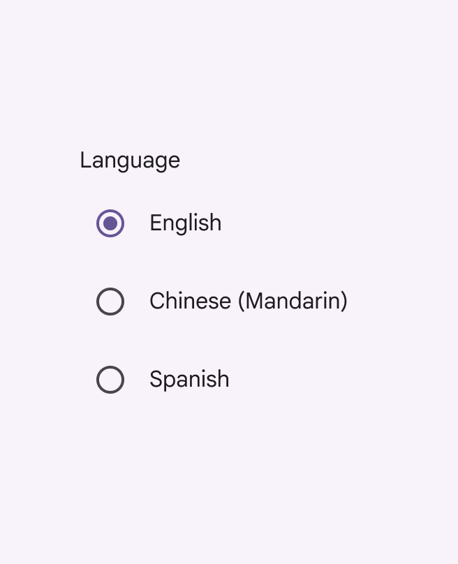

check Do

Use radio buttons when there are five or fewer options

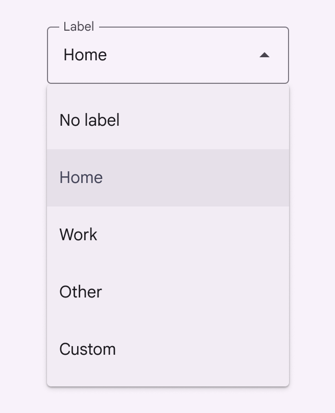

check Do

Consider using a drop-down menu instead of radio buttons when space is constrained

## Anatomy

1. Selected icon
2. Adjacent label text
3. Unselected icon

### Adjacent label text

Always pair radio buttons with an adjacent label describing what the radio button selects. Because only one radio button can be selected at a time, each choice must have its own label. Radio button always need label text

## Placement

Radio buttons are often arranged in stacked layouts [More on layout](/m3/pages/understanding-layout/overview).

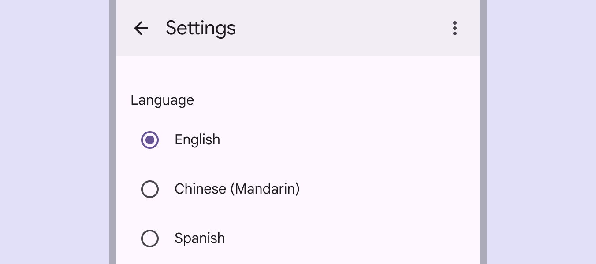

Radio buttons should be vertically listed and have one option always selected.

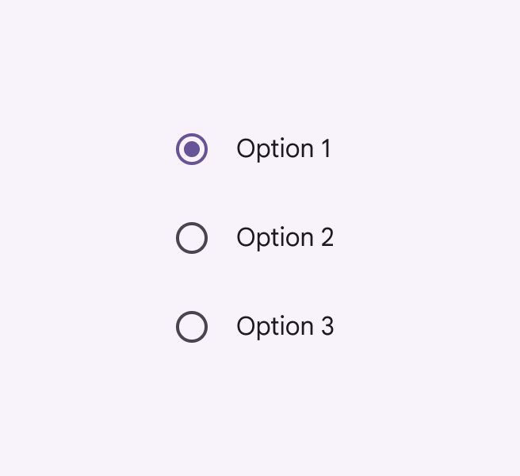

check Do

Radio buttons should always have one option pre-selected

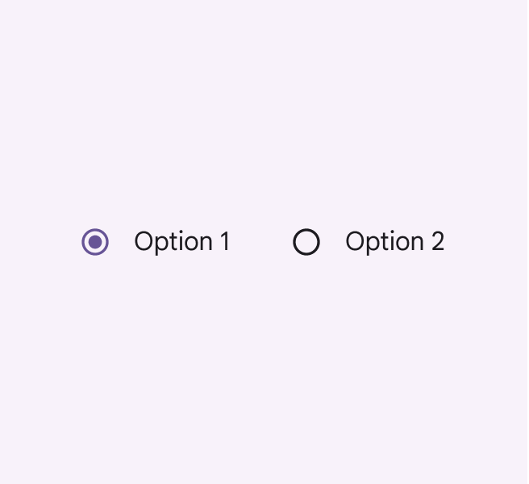

exclamation Caution

Avoid using horizontal radio button lists

## Behavior

A radio button is successfully selected when a person clicks or taps either the radio button icon or the label. Radio buttons should take effect immediately, unless they're in a dialog or page that needs to be saved

