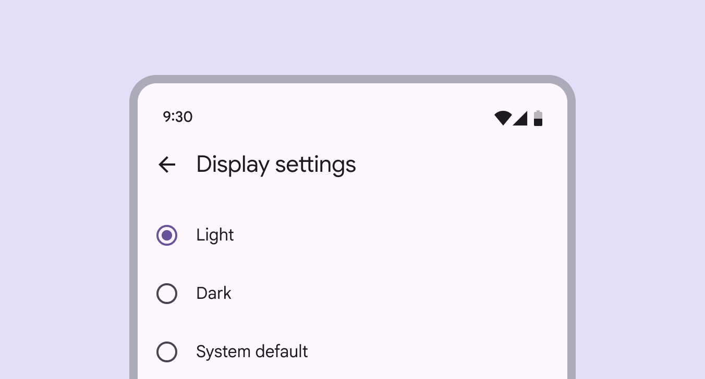

# Radio button

Radio buttons let people select one option from a set of options

- Use radio buttons (not switches [More on switches](/m3/pages/switch/overview)) when only one item can be selected from a list [More on lists](/m3/pages/lists/overview)
- Label should be scannable
- Selected items are more prominent than unselected items

Radio buttons can be selected

| Type | Resource | Status |
| --- | --- | --- |
| Design |
| [Design Kit (Figma)](https://www.figma.com/community/file/1035203688168086460) | Available |
| Implementation |
|  | Available |
| [Jetpack Compose](https://developer.android.com/develop/ui/compose/components/radio-button) | Available |
|  | Available |
|  | Available |

## What’s new

- Color: New color mappings and compatibility with dynamic color [More on dynamic color](/m3/pages/dynamic-color/overview)

Radio buttons feature new color mappings

