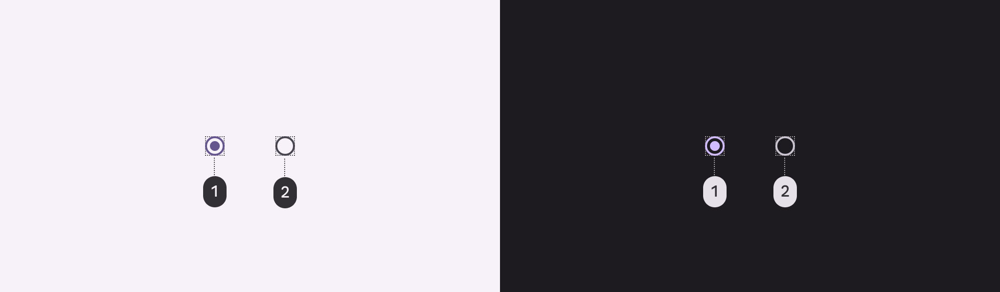
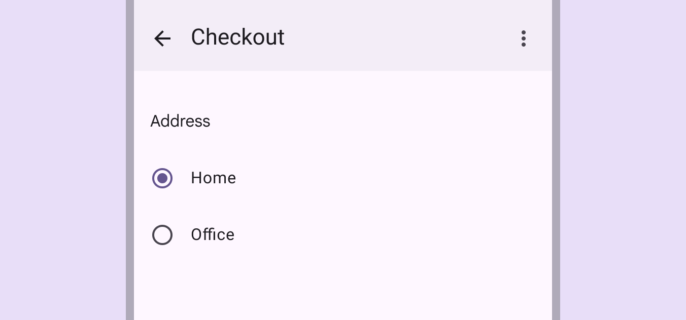
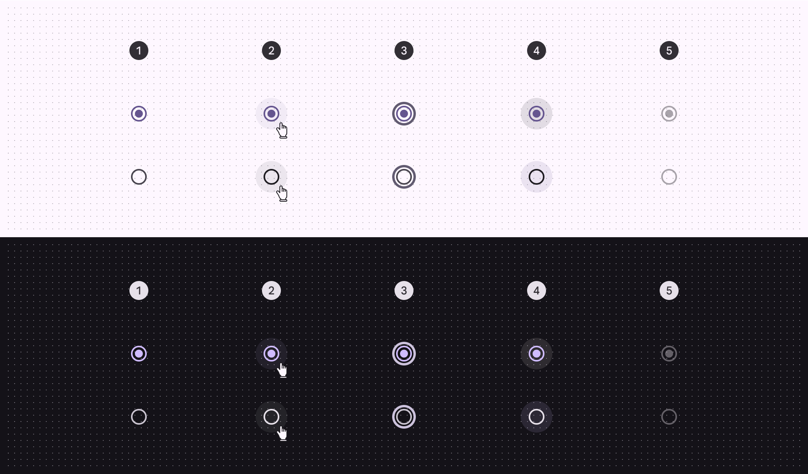

# Radio button

Radio buttons let people select one option from a set of options

1. Radio button icon

## Tokens & specs

[Learn more about design tokens](/m3/pages/design-tokens/overview)

Radio Button

Token

Default, Light

Enabled

Disabled

Hovered

Focused

Pressed (ripple)

## Color

Color values are implemented through design tokens [More on tokens](/m3/pages/design-tokens/overview). For design, this means working with color values that correspond with tokens. For implementation, a color value will be a token that references a value. [Learn more about design tokens](/m3/pages/design-tokens/overview)

Radio button color roles used for light and dark themes:

1. Primary
2. On surface variant

### Adjacent text label color

Use the color role **on surface** for adjacent text labels. This remains the same even if interacting with the label or component.

The text color remains the same regardless if the button is selected or not

## States [More on states](/m3/pages/interaction-states/overview) are visual representations used to communicate the status of a component or interactive element. [Learn more about interaction states](/m3/pages/interaction-states/overview)

1. Enabled
2. Hover
3. Focus
4. Pressed
5. Disabled

[State specs are in the token module above](/m3/pages/radio-button/specs#3eef19a6-cdcb-4ecf-b1af-2b8095d485ac)

## Measurements

Radio button size measurements

| Attribute
 | Value
 |
| --- | --- |
| Icon size
 | 20dp |
| State layer size
 | 40dp |
| Target size
 | 48dp |

