# Search

Search lets people enter a keyword or phrase to get relevant information

When focused, a search bar can show a list of search suggestions. As text is entered, search results appear.

## Usage

Search helps people find information quickly. Use search for products with many items to manage, such as files or messages.

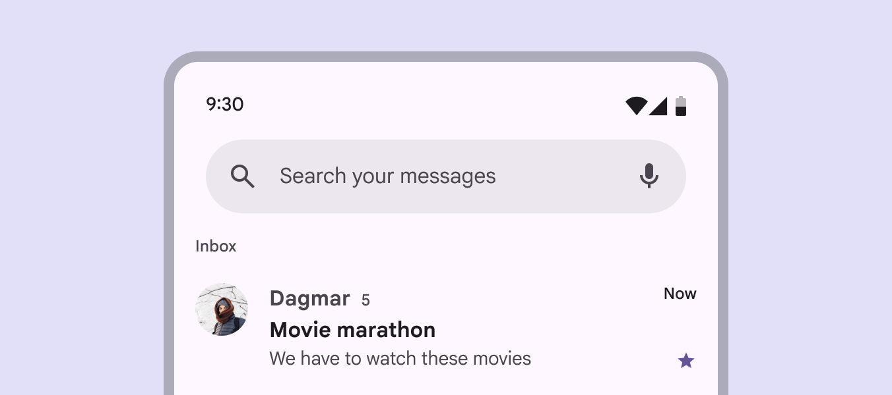

Search helps people find information in large inboxes like messages or emails

### Different ways to search

The search entry point is dependent on a product’s needs, and should be easy to find:

- Search bar : Use to search contents in a specific view, like **Search your messages**
- Search app bar [More on search app bars](/m3/pages/app-bars/guidelines#ed1f4c54-fc2d-4544-b1ed-ac667181dabe): Use this app bar [More on app bars](/m3/pages/app-bars/overview) variant when search is the primary, global function
- Search icon button [More on icon buttons](/m3/pages/icon-buttons/overview): Use when search is a secondary action or not the main focus

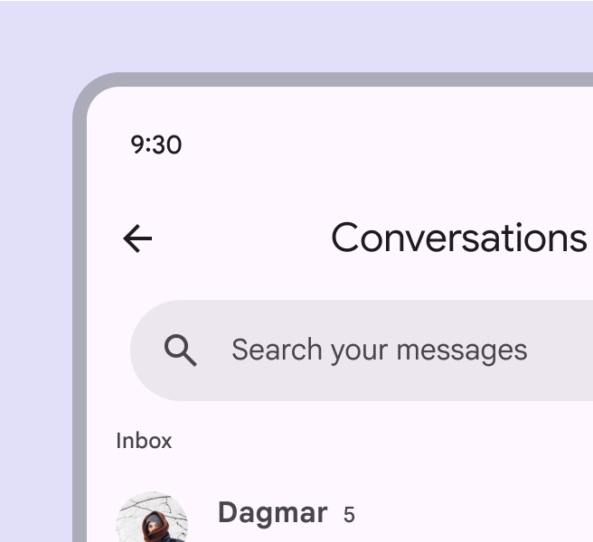

Add a **search bar** below a title to search specific content

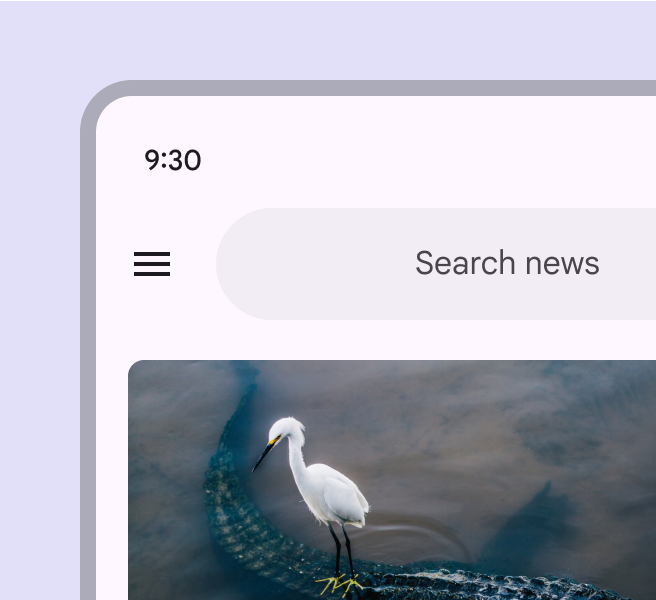

For global search, use a persistent **search app bar**, integrated into an app bar

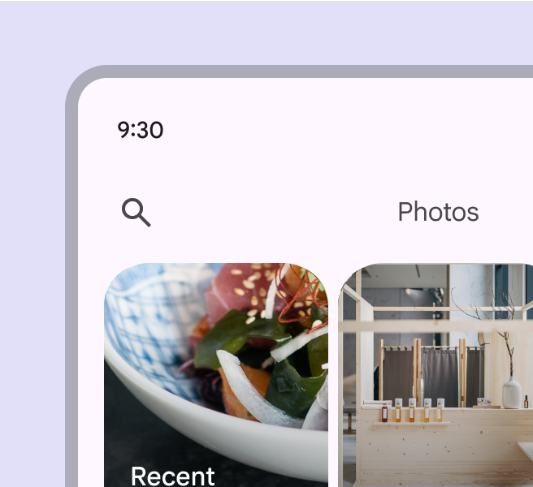

Use a **icon button** when search is a secondary action

### Focused search

When a search entry point is selected, it opens focused [More on focused state](/m3/pages/interaction-states/applying-states#bc6d6853-48ef-490e-8076-448e89e69f0f) search.



- Search suggestions can appear before text is entered
- Search results can show as someone is typing or after a search is executed
- Individual elements maintain their own interaction states [More on states](/m3/pages/interaction-states/overview) when search is focused

[More on search states](/m3/pages/search/specs#65c58b10-4569-43d6-9c11-64a5b02f3099)

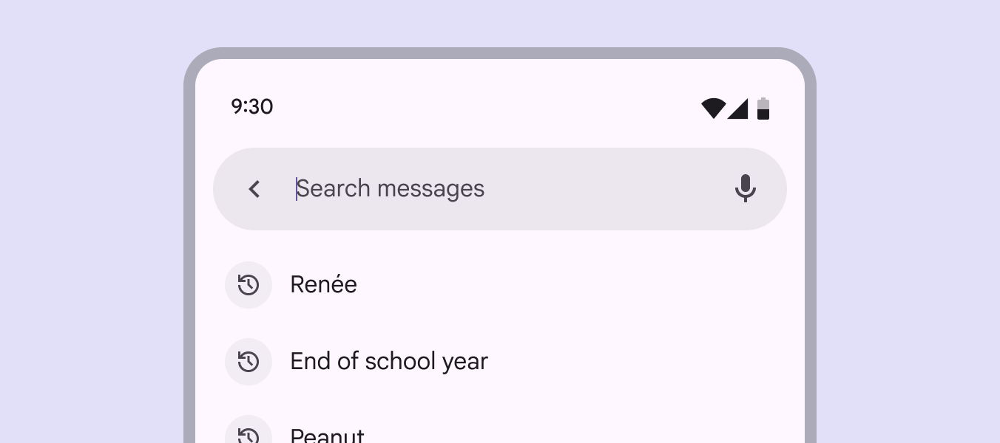

When focused, a search bar expands to show search suggestions or results in a list

If search is the primary action, focused search can be a standalone destination reached from a navigation bar [More on navigation bars](/m3/pages/navigation-bar/overview).

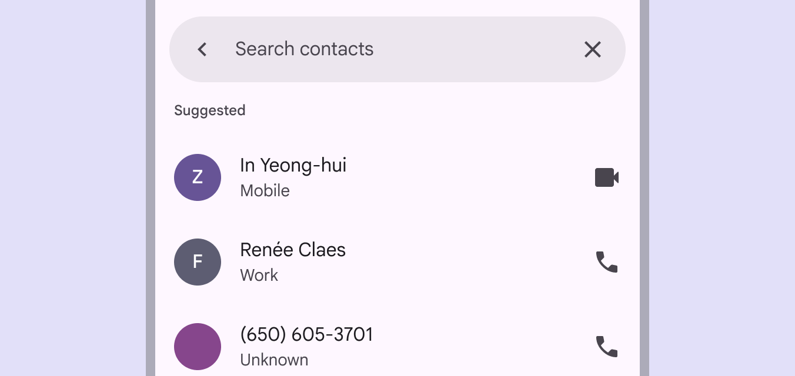

Focused search can be a standalone destination, reached by selecting an item in a navigation bar

### Search suggestions & results

Search suggestions and results both appear in a list [More on lists](/m3/pages/lists/overview) component by default. To help people find information quickly, consider adding variety and context, such as:

- Leading icons related to suggestions
- Category labels, like **Recent**, **Contacts**, or **Suggestions**
- Avatars or other high-priority items
- Filter chips to narrow down results

Include high-priority items like avatars in search suggestions or results

### Gaps

Use gaps to separate a list of suggestions or results into groups.

[More on using gaps in lists](/m3/pages/lists/guidelines#9e96fd72-5bf3-49df-9baf-e025dcca344d)

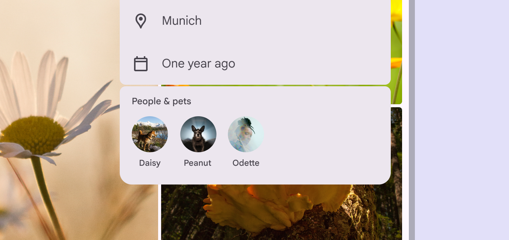

To separate list items into distinct groups, use a gap

## Placement

A search bar is typically placed at the top of a screen to remain prominent and accessible. Its location depends on whether search is the primary focus of a product or a secondary action.

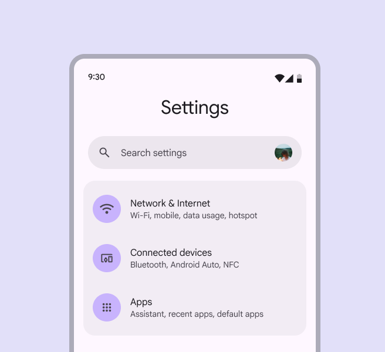

A search bar can be the primary focus of a page

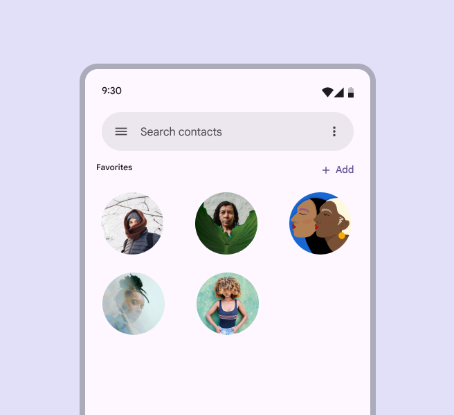

Search bars should usually be placed at the top of the content

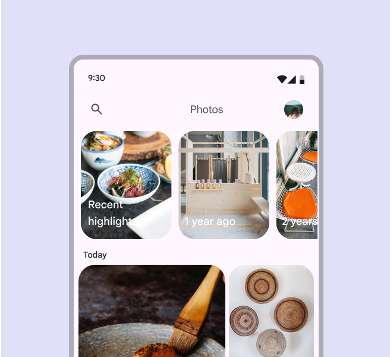

Search can be a secondary action

### Focused search layouts

When focused, search suggestions and results appear in a list below the search bar. There are two layout options:

- **Docked** opens a list below the search bar, with a scrim covering main content
- **Full-screen** expands to fill the screen

[More on adaptive design](/m3/pages/search/guidelines#eb45ccc4-d1b5-4ea1-bee5-ea1c3d1c5436)

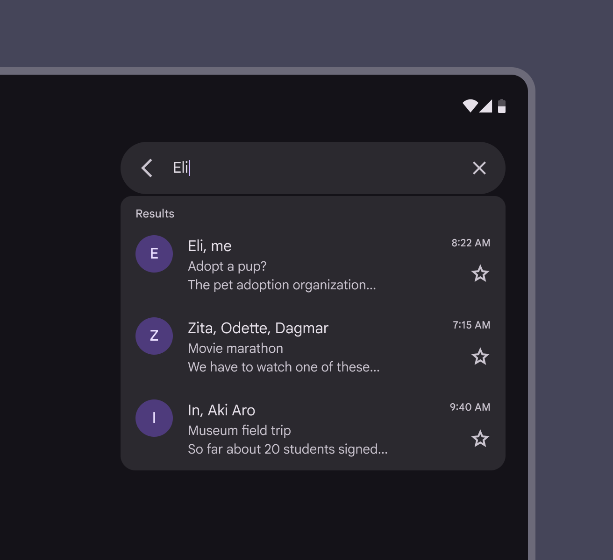

Docked layout on a tablet

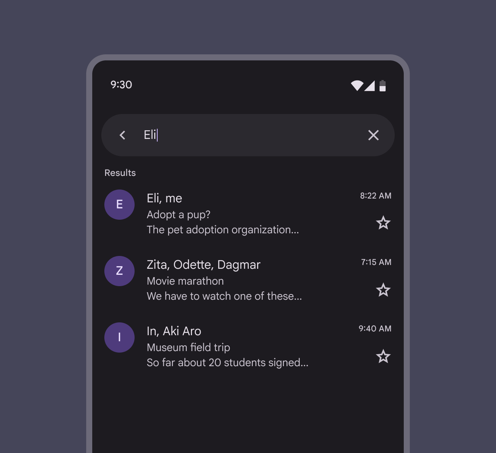

Full-screen layout on mobile

## Anatomy

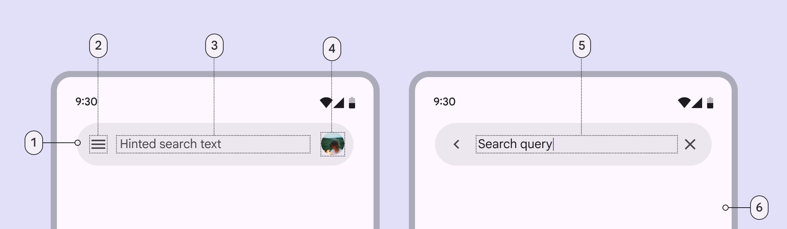

1. Search bar container
2. Leading icon
3. Supporting text
4. Avatar or trailing icon (optional)
5. Input text
6. Container for search suggestions or results

### Search bar container

In the contained style, the search bar container remains the same shape in both the unfocused and focused states. Avoid changing the container behavior. The container’s margins should be:

- Unfocused: 24dp
- Focused: 12dp

In the divided (baseline) style, a divider separates the search bar and results.

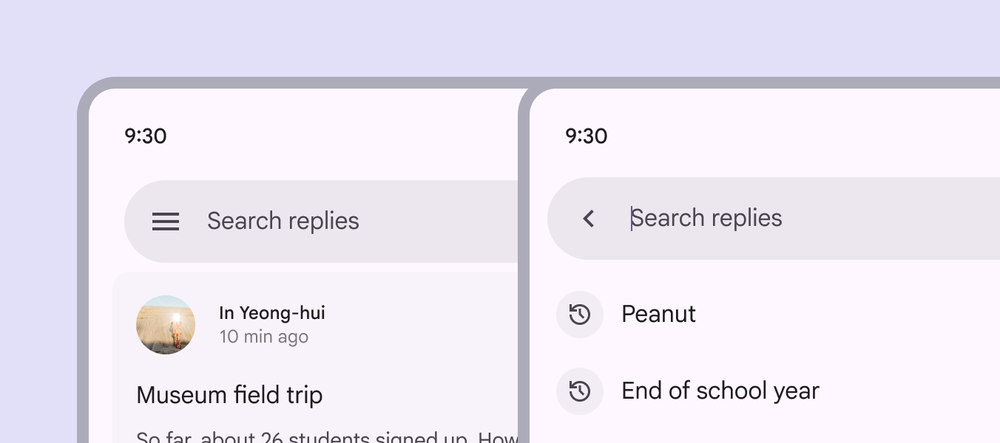

Search bar containers have persistent, rounded corners

#### Container color

Search bars use the **surface container high** color role [More on color roles](/m3/pages/color-roles?s=m3). This role applies when the screen background is white or a tonal **surface** color, ensuring the container has clear contrast.

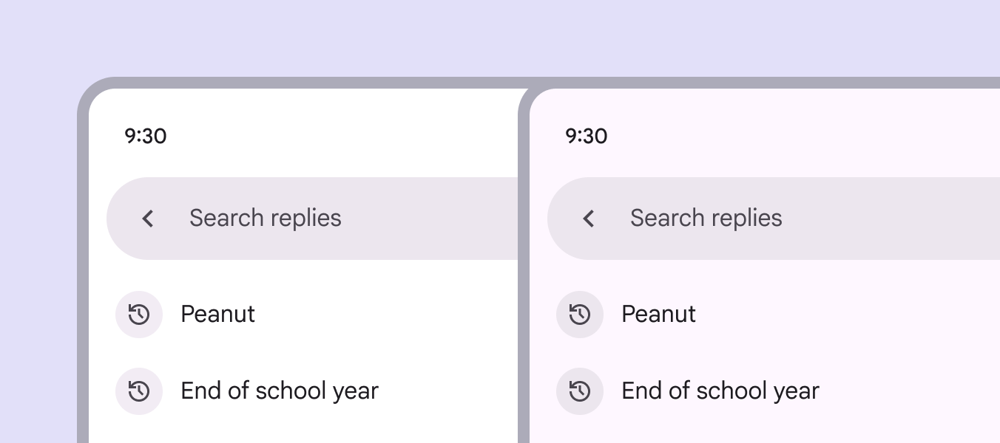

Search bars use **surface container high** to provide clear contrast

Avoid using a **surface container high** color on a **surface container** background. This can cause the search bar to blend in, making it difficult for people to find. To ensure proper contrast, use surface container roles that are more than one step apart.

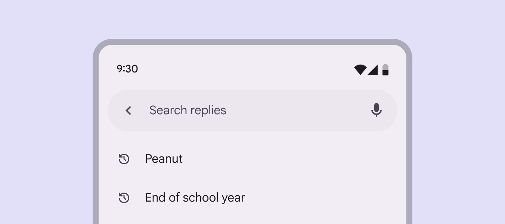

exclamation Caution

Using a **surface container high** color on a **surface container** background reduces contrast and may affect accessibility

### Icons & icon buttons

#### Leading icons

The leading side of a search bar should include either:

- A navigational icon button, such as a menu or arrow
- A non-functional search icon

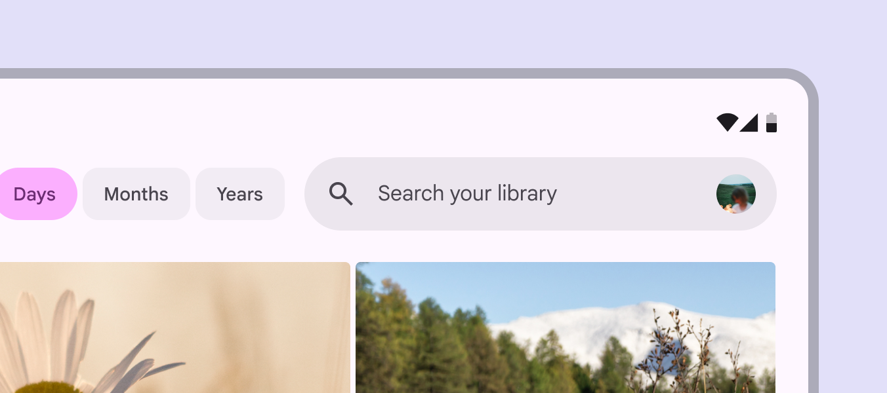

A search bar can contain a non-functional search icon

#### Trailing icons

A search bar should have one or two trailing icons or icon buttons. Trailing actions can include:

- Additional modes of searching like voice search
- A separate high-level action such as current location or profile
- An overflow menu
- A decorative search icon

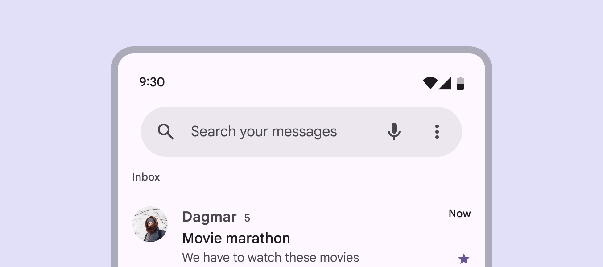

Use a maximum of two trailing icons

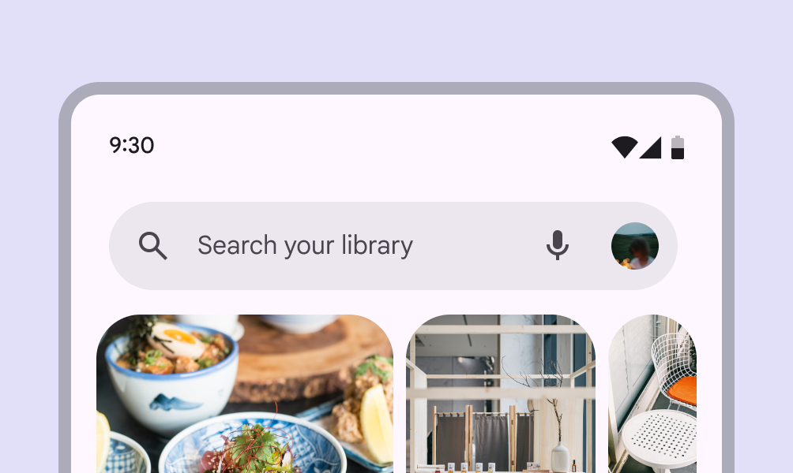

Combine an avatar with up to one other trailing icon button

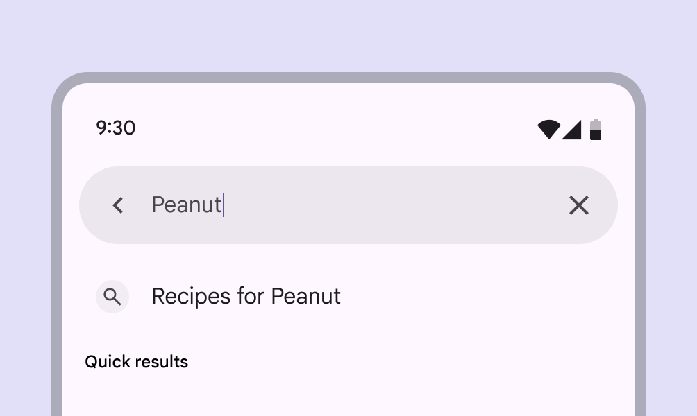

Focused search can show an optional **clear** icon to remove input text

### Text

#### Hinted search text

Provide a short description of the information people can search, like **Search replies** or **Search your messages**.

#### Input text

When a person starts typing, the hinted text is replaced with the input text. Hinted search text is replaced when a search query is entered

## Adaptive design

The search bar position and alignment should scale with the layout, and stay close to the searchable content. In most cases, a search bar should:

- Stay in its pane and scale in width accordingly
- Internal elements anchor to the left and right as the parent container scales

[More on applying layout](/m3/pages/layout-overview/)

Keep the search bar close to the content a person can search

### Focused search

When focused, search can switch between showing suggestions or results in a:

- **Docked layout**: Best for medium [More on medium window sizes](/m3/pages/breakpoints/medium) and expanded [More on expanded window sizes](/m3/pages/breakpoints/expanded) windows
- **Full-screen layout**: Default for compact window sizes [More on compact window sizes](/m3/pages/breakpoints/compact)

[More on search layouts](/m3/pages/search/specs#fc12e839-f356-4f48-9bd5-0ed210565bfe)


1. A docked layout on a large screen
2. A full-screen layout, the default for compact screens

Search suggestions or results should swap from full-screen in compact windows to docked in larger window sizes. Search suggestions and results should adapt to fit different window sizes

## Behavior

### Focused search

When a search bar is selected, search becomes focused and can:

- Show historical suggestions before typing
- Show suggestions or results as someone is typing
- Wait to show suggestions or results until a search is queried

The **back** icon releases focus, dismisses any suggestions or results, and returns the search bar to its original state. When focused, a list of search suggestions can appear

Focus is released when the back icon is selected

### Scroll

Depending on needs, a search bar can:

- Scroll away with content, then reappear when a person begins scrolling up
- Remain fixed at the top of the screen

A search bar can scroll up with content, then reappear when a person scrolls down

### Search results

To execute a search, a person can:

- Type a query and press **Enter**
- Select a suggestion or result without querying a search

Search results appear in a list [More on lists](/m3/pages/lists/overview) below the bar, and scroll beneath the bar. For accessibility, focused search needs a clear status indicator that it’s searching content, like a search icon or **Results** label. [More on search accessibility](/m3/pages/search/accessibility/)

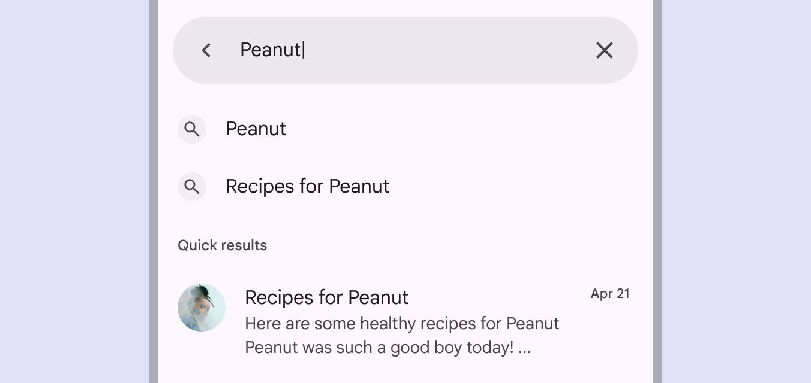

Show search results in a compact, organized list, with an indicator like **Quick results**

When search results are queried, the input text should remain visible, but not in focus. Search suggestions and results display in a list, and the input text remains visible

### Predictive back

On Android, [predictive back](https://github.com/material-components/material-components-android/blob/master/docs/foundations/PredictiveBack.md) allows a person to swipe left or right on search. 

- Search detaches from the screen edge to signal the full-screen layout will minimize
- The previous screen is revealed in a preview

[More predictive back design guidance](https://developer.android.com/guide/navigation/custom-back/predictive-back-gesture)

The search surface and content scale back in the direction of the gesture

