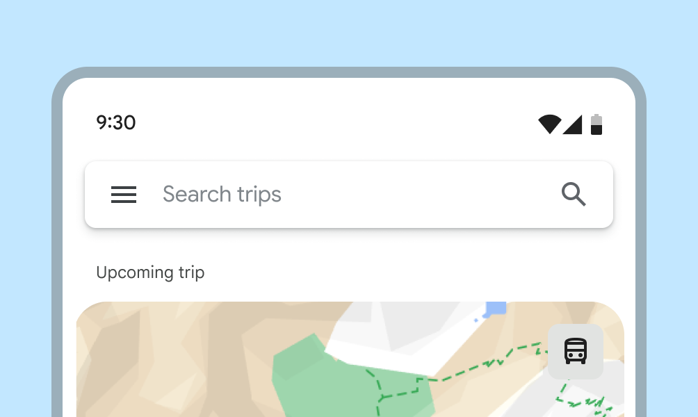
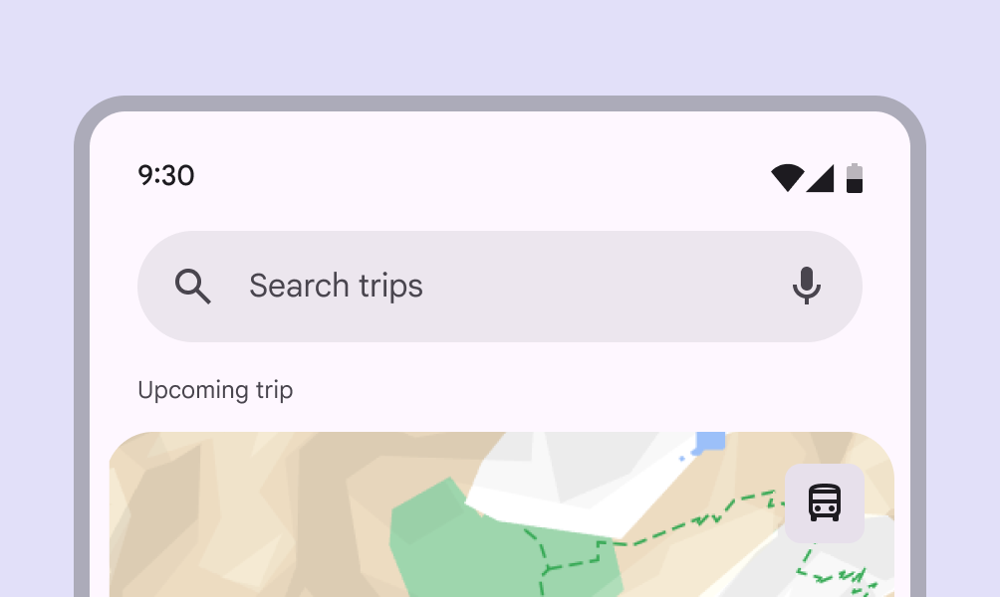

# Search

Search lets people enter a keyword or phrase to get relevant information

- Use search for navigating a product with queries
- A search bar can include a leading search icon, hinted search text, and optional trailing icons
- Search can display suggested keywords or phrases as a person types
- A search bar displays search suggestions or results in a list [More on lists](/m3/pages/lists/overview)
- Use a search app bar [More on app bars](/m3/pages/app-bars/overview) to provide an emphasized, global entry-point

When inputting text, search suggestions or results appear below the search bar

## Availability & resources

| Type | Resource | Status |
| --- | --- | --- |
| Design | [Design Kit (Figma)](https://www.figma.com/community/file/1035203688168086460) | Available |
| Implementation |  | Available |
| Implementation |  | Available |
| Implementation | [Jetpack Compose](https://developer.android.com/develop/ui/compose/components/search-bar) | Available |
| Implementation | [Jetpack Compose: Expressive](https://developer.android.com/reference/kotlin/androidx/compose/material3/package-summary#SearchBar\(androidx.compose.material3.SearchBarState,kotlin.Function0,androidx.compose.ui.Modifier,androidx.compose.ui.graphics.Shape,androidx.compose.material3.SearchBarColors,androidx.compose.ui.unit.Dp,androidx.compose.ui.unit.Dp\)) | Available |

## M3 Expressive update

Search has a new visual style, motion, and more flexibility for trailing icons. [More on M3 Expressive](https://m3.material.io/blog/building-with-m3-expressive)

**February 2025**


Naming

- Search bar and search view are now collectively named

Configurations

- Styles: Search can be contained (recommended) or divided
- Gaps can separate results into groups

Motion

- The search bar grows wider when focused

Supported platforms:

- [Jetpack Compose](https://developer.android.com/reference/kotlin/androidx/compose/material3/package-summary#SearchBar\(androidx.compose.material3.SearchBarState,kotlin.Function0,androidx.compose.ui.Modifier,androidx.compose.ui.graphics.Shape,androidx.compose.material3.SearchBarColors,androidx.compose.ui.unit.Dp,androidx.compose.ui.unit.Dp\))

The **contained** search style features a persistent, filled search container

## Differences from M2 to M3 baseline

- Color: New color mappings and compatibility with dynamic color [More on dynamic color](/m3/pages/dynamic/choosing-a-source)
- Elevation: Lower elevation and no shadow by default
- Name: Search was formerly known as open search bar
- Variants: Two official variants of search components: search bar and search view

M2 open search bars were square and elevated

M3 search bars are rounded, use tonal surface, and support dynamic color

