# Search

Search lets people enter a keyword or phrase to get relevant information

## Variants

When a person executes a , results appear in a list below the search bar

|
Variant

 |

M3

 |

M3 Expressive

 |
| --- | --- | --- |
|

Search

 |

Available

 |

Available

 |

## Configurations

### Style

Search comes in two styles:

- Contained: Has an expressive [More on M3 expressive](https://m3.material.io/blog/building-with-m3-expressive) look and feel. It uses a filled container to separate a search bar from a list [More on lists](/m3/pages/lists/overview) of suggestions or results
- Divided (baseline ): Doesn’t have the latest visual style, motion, or flexibility

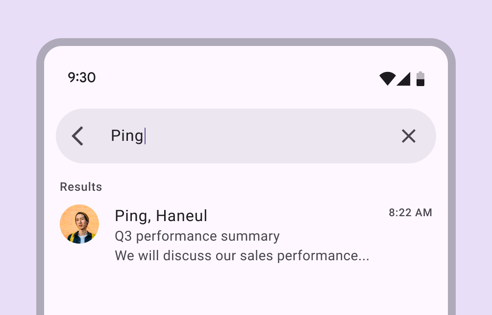

The contained style has a persistent, filled container, expressive motion, and rounded shape

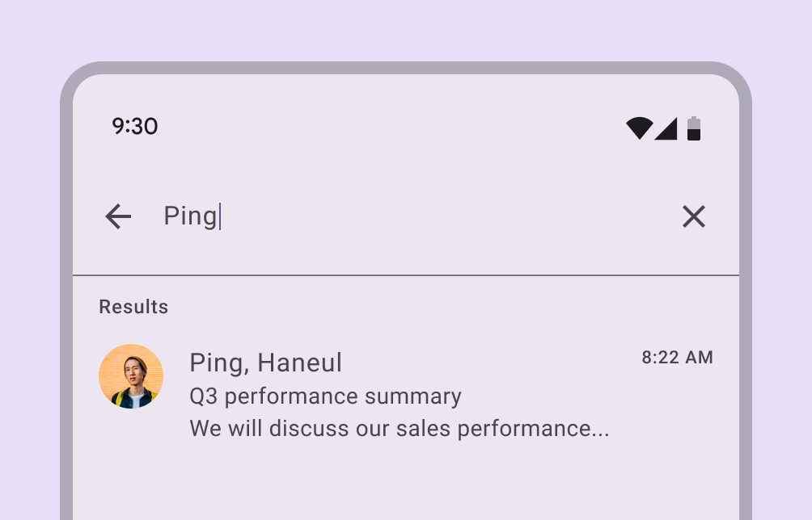

The divided (baseline) style uses a divider to separate the search bar from suggestions and results

### Layout

Search suggestions and results appear in customizable lists, with two layout options: full-screen and docked. [More on search layouts](/m3/pages/search/guidelines#4f6c921c-795f-4e06-9b12-27ae7d502adb)

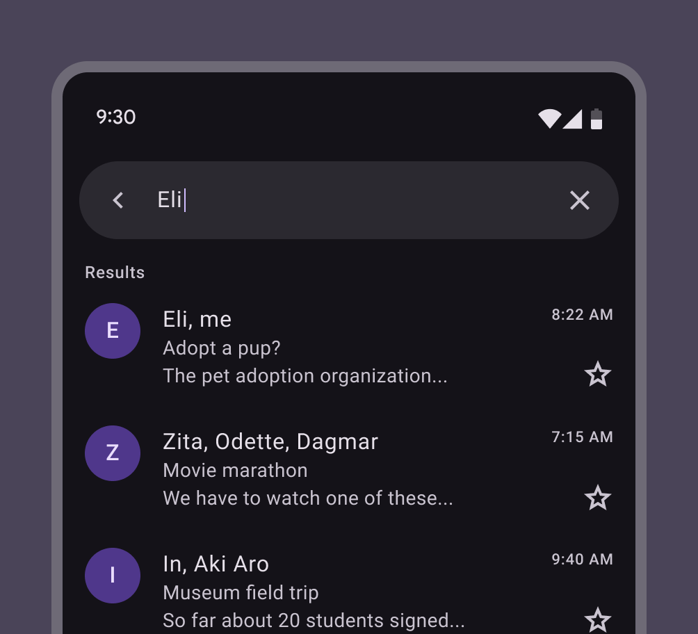

Full-screen layout in the contained style

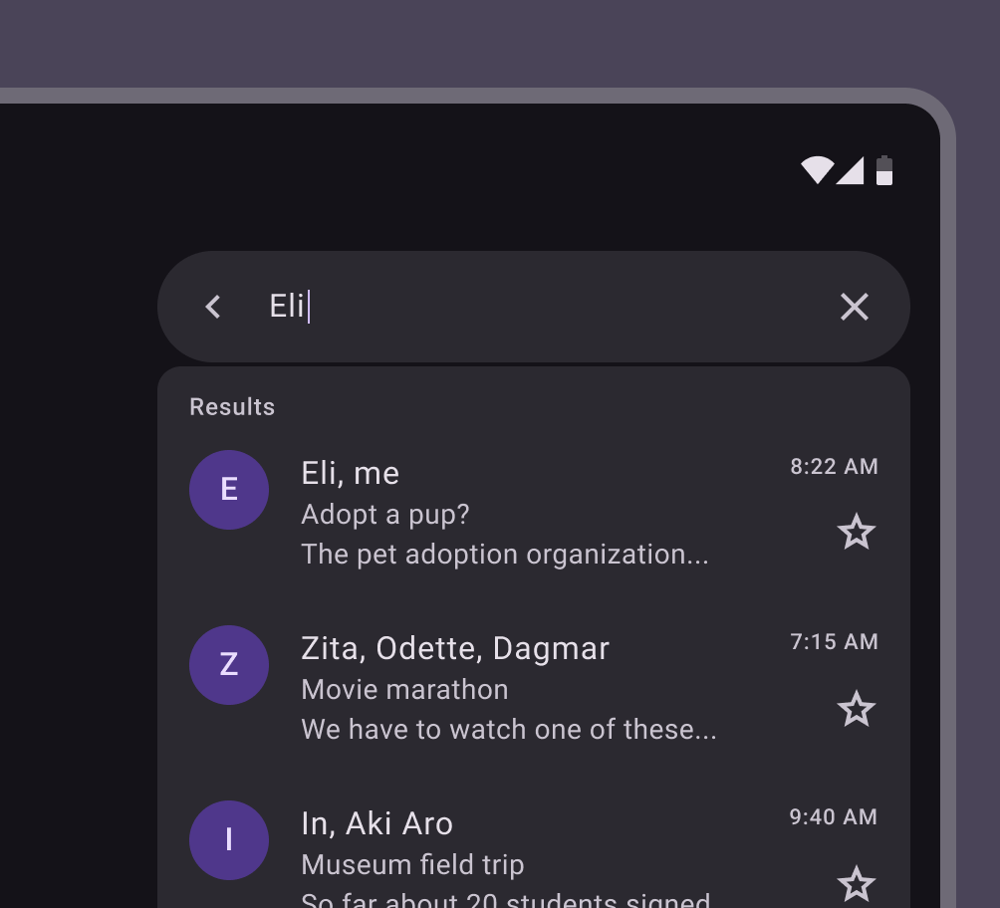

Docked layout in the contained style

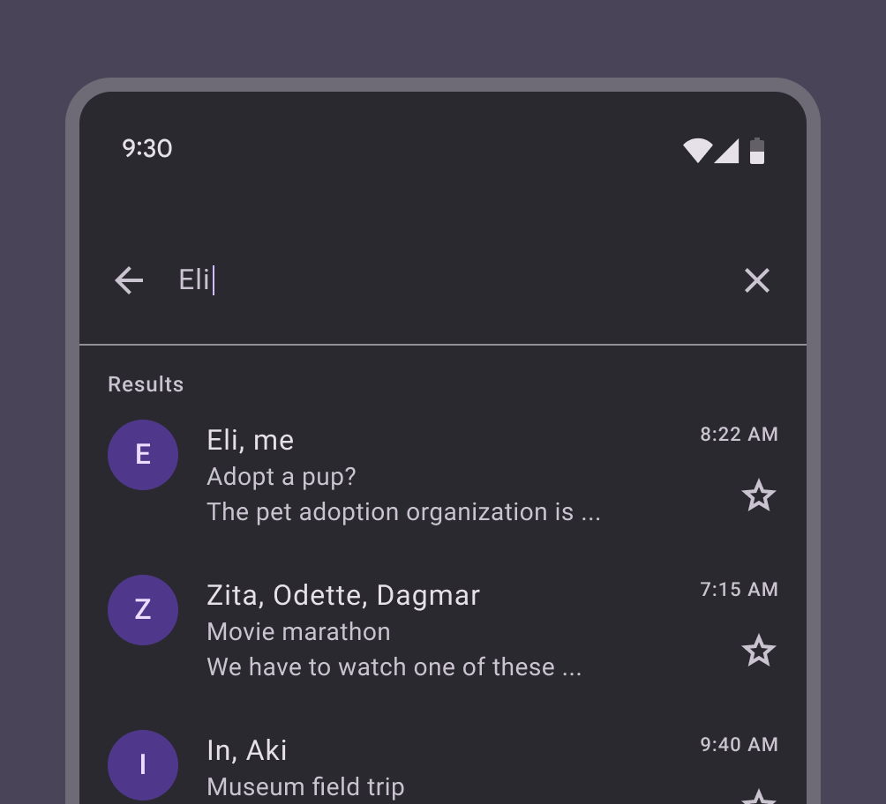

Full-screen layout in the divided style

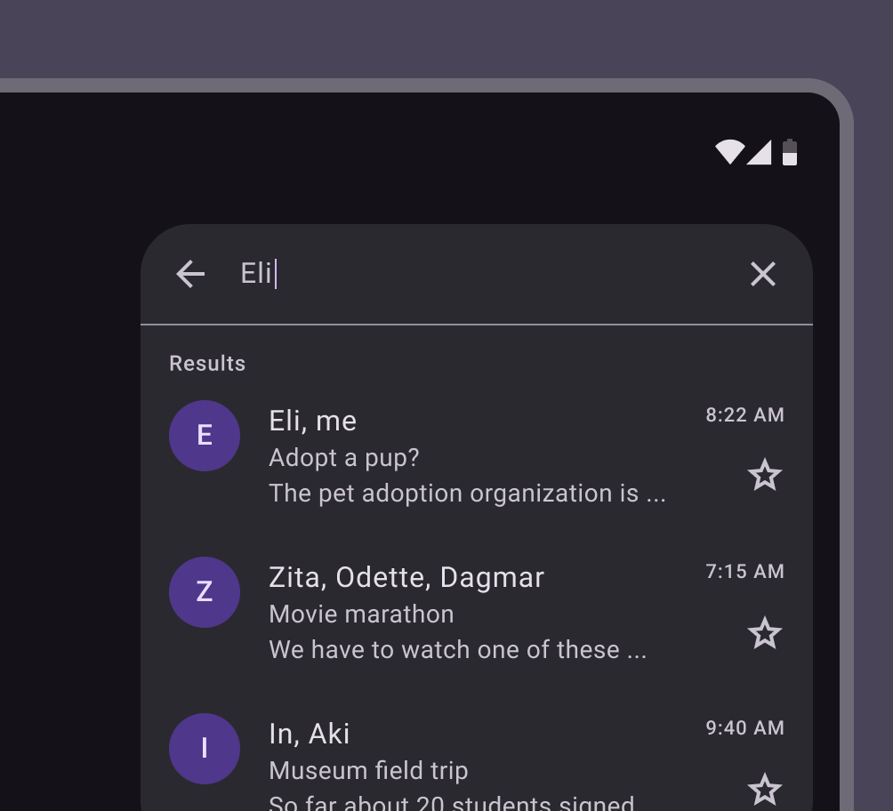

Docked layout in the divided style

|
Category

 |

Configuration

 |

M3

 |

M3 Expressive

 |
| --- | --- | --- | --- |
|

Style

 |

Contained

 |

\--

 |

Available

 |
|  |

Divided

 |

Available

 |

Not recommended.
Use contained.

 |
|

Layout

 |

Docked, full-screen

 |

Available

 |

Available

 |

## Tokens & specs

Use the table's menu to select a token set. The **search bar** set only contains tokens for the unfocused search bar. The **search view** set contains all other tokens when interacting with search, including all styles and layouts. [Learn more about design tokens](/m3/pages/design-tokens/overview)

```
Search - View
```

```
Search - View
```

```
Search - View
```

```
Search - View
```

Search - View

Token

Default, Android, Light

Search view container surface tint layer color

md.comp.search-view.container.surface-tint-layer.color

#6750A4

Color

Layout and Text

## Anatomy

Search includes a search bar and a container for suggestions and results. The container is empty by default. Use the list [More on lists](/m3/pages/lists/overview) component to add content. In the divided (baseline) style, a divider separates the search bar and results.

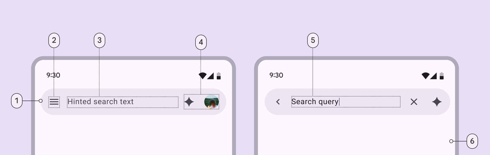

1. Search bar container
2. Leading icon
3. Supporting text
4. Trailing icon and avatar (optional)
5. Input text
6. Container for search suggestions or results

### Examples

1. With avatar
2. With one trailing icon button [More on icon buttons](/m3/pages/icon-buttons/overview)
3. With two trailing icon buttons
4. With trailing icon button and avatar

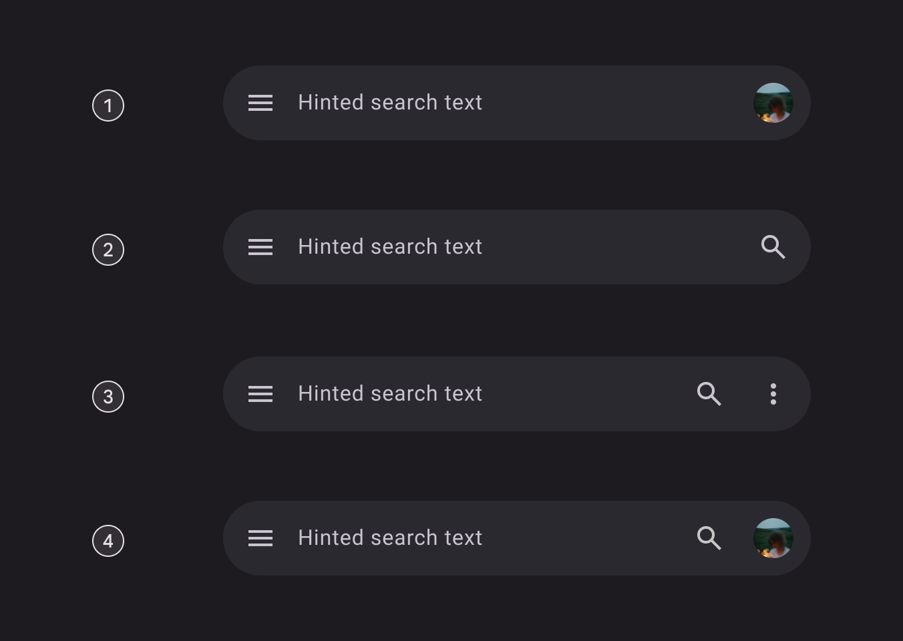

## Color

Color values are implemented through design tokens [More on tokens](/m3/pages/design-tokens/overview). For designers, this means working with color values that correspond with tokens. In implementation, a color value will be a token that references a value.

### Full-screen layout

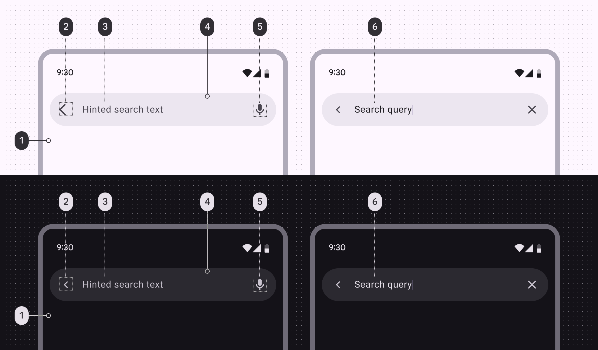

Full-screen search color roles used in light and dark themes:

1. Surface container low
2. On surface variant
3. On surface variant
4. Surface container high
5. On surface variant
6. On surface

### Docked layout

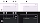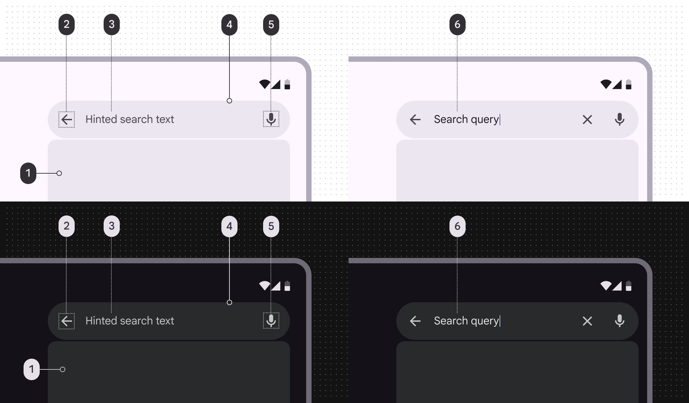

Docked search color roles used in light and dark themes:

1. Surface container high
2. On surface variant
3. On surface variant
4. Surface container high
5. On surface variant
6. On surface

## States

States are visual representations used to communicate the status of a component or an interactive element. In [focused search](/m3/pages/search/guidelines#a9b2df31-8561-4326-82cd-41ed6532b765), individual elements maintain their own interaction states. [Learn more about interaction states](/m3/pages/interaction-states/overview)

### Search bar

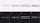

1. Enabled
2. Hovered
3. Focused
4. Pressed (ripple)

### Search suggestions & results

Search includes a container for suggestions and results. The container is empty by default. Use the list component to add content.

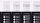

1. Enabled
2. Hovered
3. Focused
4. Pressed (ripple)

## Measurements

### Search bar


Unfocused search bar with leading and trailing icon measurements


Unfocused search bar with avatar measurements

In M3 Expressive, the search bar expands when focused. The margins change from 24dp to 12dp.

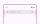

Unfocused search bar margin measurements

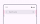

Focused search bar margin measurements

|
Element

 |

Attribute

 |

Value

 |
| --- | --- | --- |
|

Container

 |

Width

 |

Min: 360dp, max: 720dp

 |
|

Height

 |

56dp

 |
|

Label alignment

 |

Start-aligned

 |
|

Leading padding

 |

Unfocused: 24dp, focused: 12dp

 |
|

Trailing padding

 |

Unfocused: 24dp, focused: 12dp

 |
|

Leading icon and label padding (from tap target)

 |

4dp

 |
|

Label and trailing icon padding (from tap target)

 |

4dp

 |
|

Avatar

 |

Size

 |

30dp

 |

### Focused search

#### Contained style

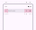

Full-screen search padding and size measurements for contained style

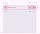

Docked search padding and size measurements for contained style

|
Element

 |

Attribute

 |

Value

 |
| --- | --- | --- |
|

Full-screen container

 |

Width

 |

Full width

 |
|

Height

 |

Full height

 |
|

Docked container

 |

Width

 |

Min: 360dp, max: 720dp

 |
|

Height

 |

Min: 240dp, max: 2/3 of screen height

 |
|

Search bar container

 |

Height

 |

56dp

 |
|

Label alignment

 |

Start-aligned

 |
|

Leading padding

 |

16dp

 |
|

Trailing padding

 |

16dp

 |
|

Leading icon and label padding (from tap target)

 |

4dp

 |
|

Leading icon and label padding (from tap target)

 |

4dp

 |

#### Divided style

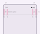

Full-screen search padding and size measurements for divided style

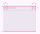

Docked search padding and size measurements for divided style

