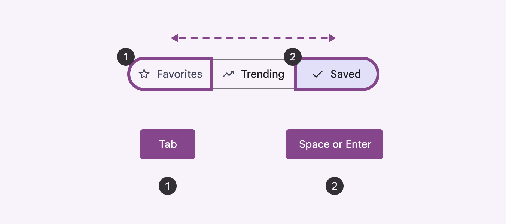
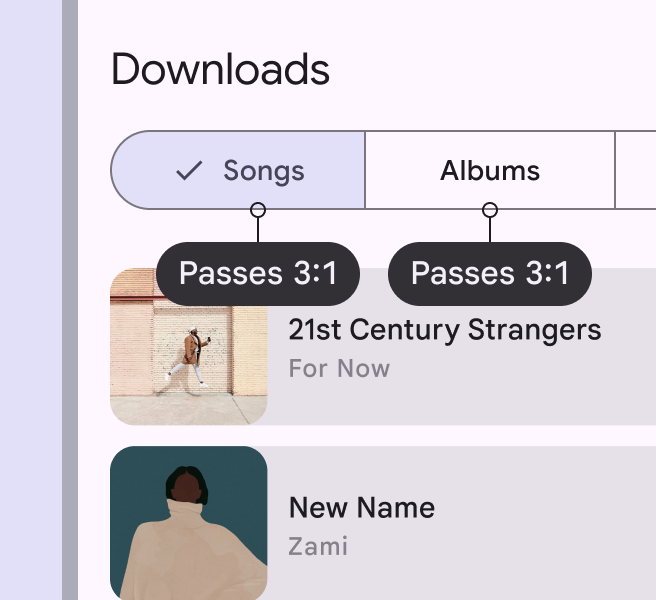
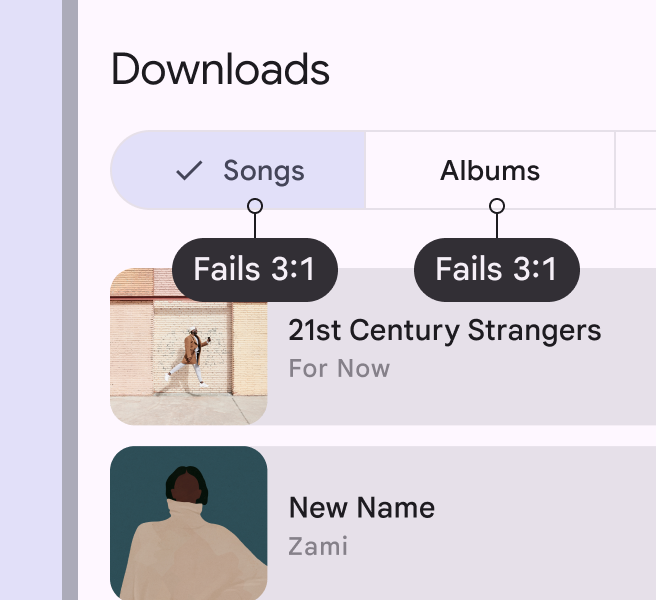
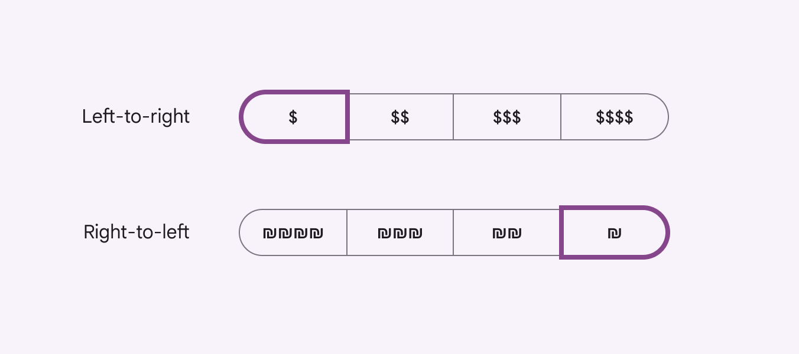
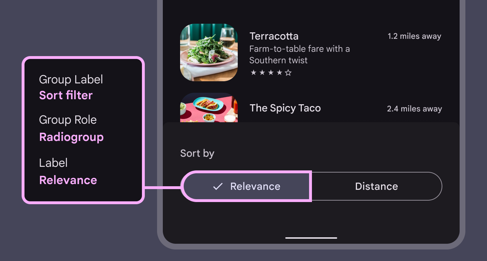
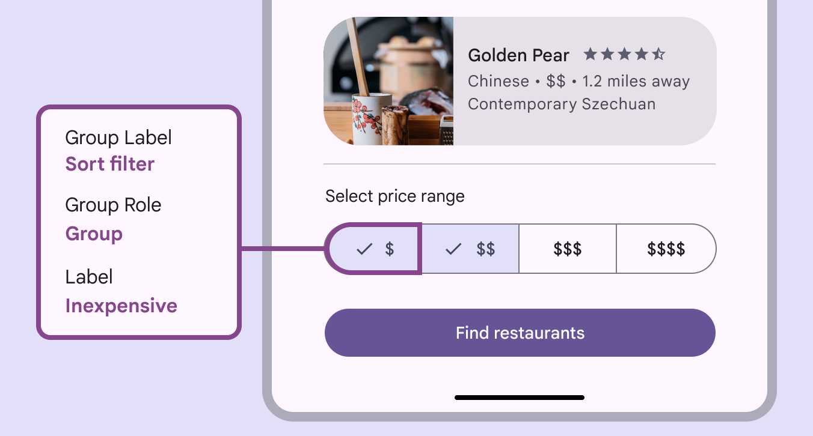

# Segmented buttons

Segmented buttons help people select options, switch views, or sort elements

star

Note:

Segmented buttons are no longer recommended in the Material 3 expressive update. For those who have updated, use the [connected button group](/m3/pages/button-groups/overview/) instead, which has mostly the same functionality but with an updated visual design.

## Use cases

Users should be able to:

- Navigate to and activate segmented buttons with assistive tech
- Understand what each segment selection will do

### Interaction & style

For keyboard navigation, **Tab** focuses on an individual segment. For single-select segments, **Space** or **Enter** will select or unselect the focused [More on focused states](/m3/pages/interaction-states/applying-states#bc6d6853-48ef-490e-8076-448e89e69f0f) segment. For multi-select segments, **Space** or **Enter** will:

- select an un-selected segment
- select all of the segments
- un-select a selected segment

Use Tab to navigate through segments and Space/Enter to select/unselect.

### Color contrast

Segmented buttons are clusters of similar components, so the outline should have at least a 3:1 contrast ratio with the background or surface. This helps distinguish each button. Both a checkmark icon and a color change are used to distinguish selection. Make sure color isn’t the only way to show selection.

check Do

Use an outline with a surface contrast of at least 3:1

close Don’t

The segmented button shouldn't have a contrast outline less than 3:1

### Initial focus

Focus will start in the first segment. Depending on the direction of the language, it is either the most left or the most right segment. For single select and multi-select, the first segment will be focused regardless of selection state.

Focus begins on the left for left-to-right languages and on the right for right-to-left languages

### Keyboard navigation

|
Keys

 |

Actions (single select)

 | Actions (multi select) |
| --- | --- | --- |
| **Tab** | Focus lands on next enabled [More on enabled state](/m3/pages/interaction-states/applying-states#39b2fc90-01db-41b5-b6f8-47be61ed1479) segment | Focus lands on next enabled segment |
| **Space** or **Enter** | Select focused [More on focused state](/m3/pages/interaction-states/applying-states#bc6d6853-48ef-490e-8076-448e89e69f0f) segment | Select and unselect focused segment |

### Labeling elements

The accessibility [More on accessibility](/m3/pages/overview/principles) label for a segmented button comes from the visible label text on such as **Relevance** and **Distance**. If the segmented button displays icons without label text, the accessibility label describes the action that the button is expressing, such as **Inexpensive** for one currency symbol.

The label for segmented button matches the text label

Single-select segmented buttons behave like radio buttons [More on radio buttons](/m3/pages/radio-button/overview): only one option can be selected at a time. The label is **Radiogroup**. Multi-select buttons behave like checkboxes [More on checkboxes](/m3/pages/checkbox/overview): more than one option can be selected. The label is **Checkbox**.

The role for the multi-select segmented button is **Checkbox**

