# Segmented buttons

Segmented buttons help people select options, switch views, or sort elements

star

Note:

Segmented buttons are no longer recommended in the Material 3 expressive update. For those who have updated, use the [connected button group](/m3/pages/button-groups/overview/) instead, which has mostly the same functionality but with an updated visual design.

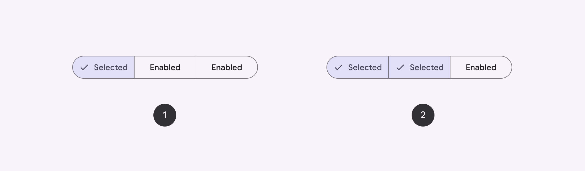

1. Single-select
2. Multi-select

## Usage

Segmented buttons help people select options, switch views, or sort elements.

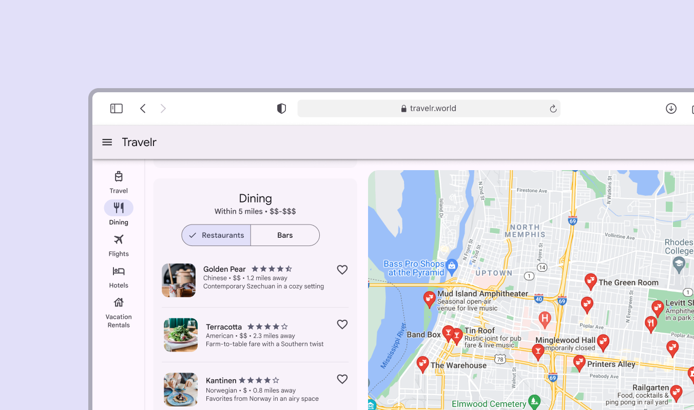

A segmented button can help switch between viewing restaurant and bar options

There are 2 variants of segmented buttons:

1. Single-select
2. Multi-select

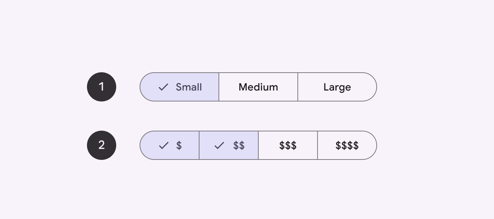

1. Single-select segmented button can only have 1 segment selected
2. Multi-select segmented button can have multiple segments selected

## Anatomy

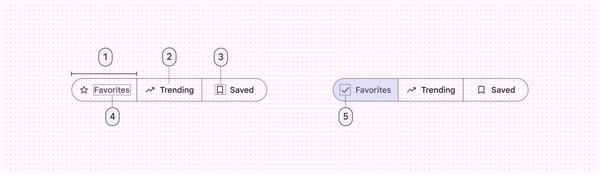

1. Segment
2. Container
3. Icon (optional)
4. Label text (optional)
5. Selected icon

### Segments

Segmented buttons can have 2-5 segments. Each segment is clearly divided and contains label text, an icon, or both.

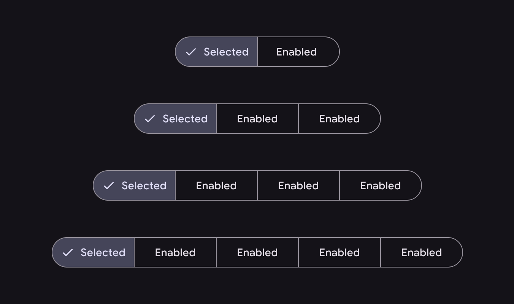

There can be anywhere from 2 to 5 segments in single-select and multi-select segmented buttons

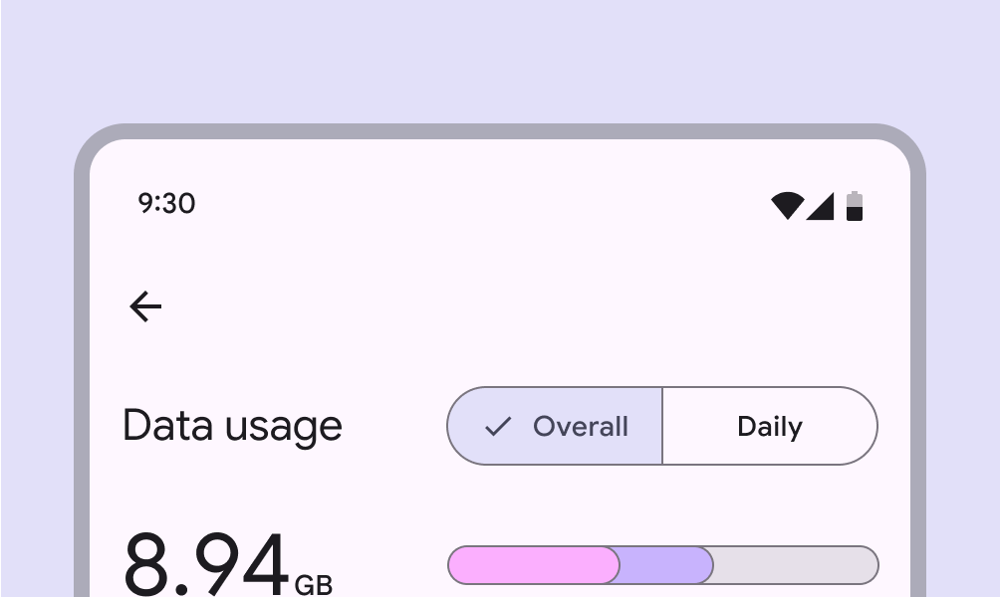

check Do

Segmented buttons are best used for selecting between 2 and 5 choices

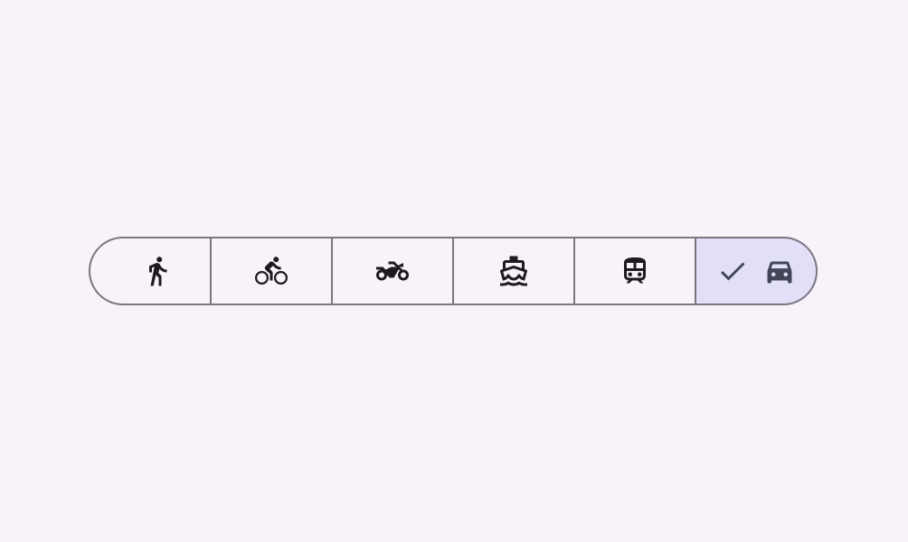

close Don’t

Don’t use more than five segments in a single segmented button. Choices should be scoped. If you have more than five choices, consider using another component, such as chips.

### Container

Like common buttons , segmented buttons have fully rounded corners by default.

Segmented buttons have fully rounded corners

### Icons

Icons may be used as labels by themselves or alongside text. If an icon is used without label text, it must clearly communicate the option it represents. 

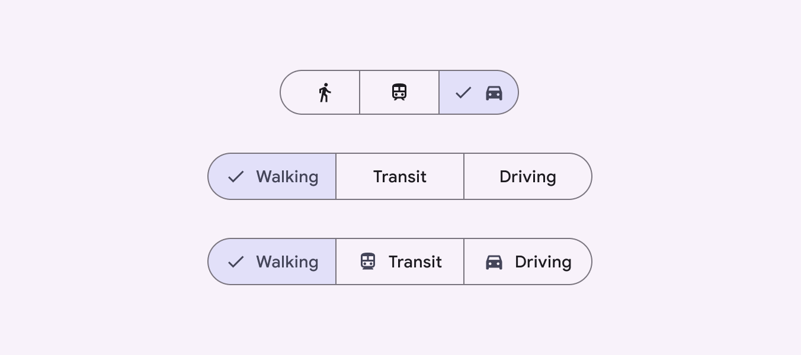

Segmented buttons can include icons

### Label text

Labels should be short and succinct. If a label is too long to fit within its segment, consider using an icon alone.

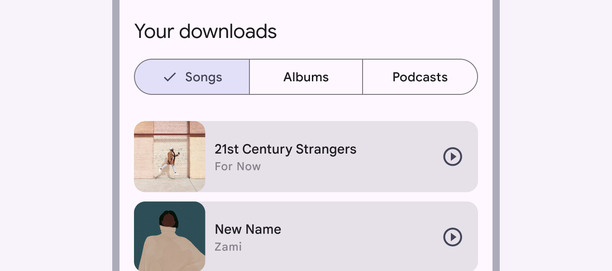

Use labels that are as clear and short as possible

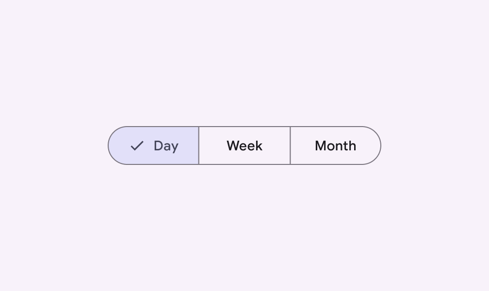

check Do

Keep labels short and consistent in length

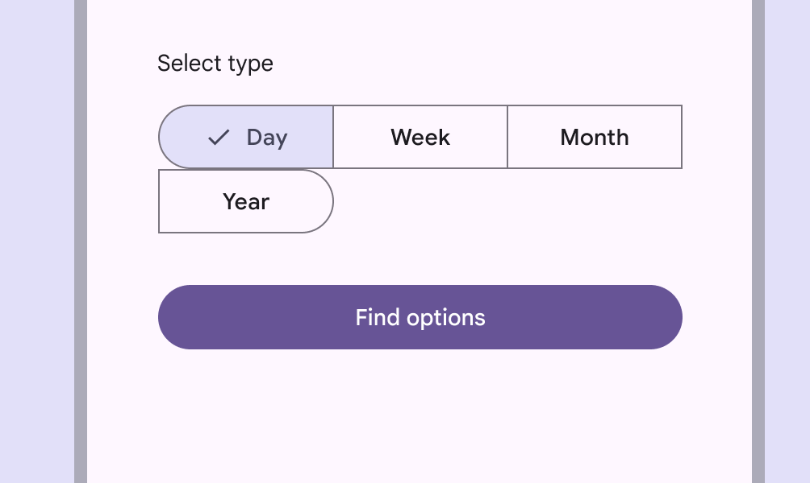

close Don’t

Don’t allow segments to wrap onto a new line

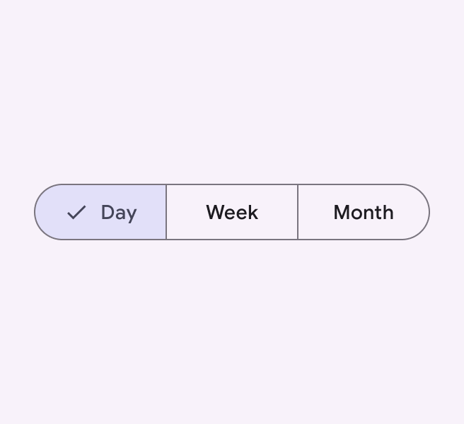

check Do

Use consistent label types

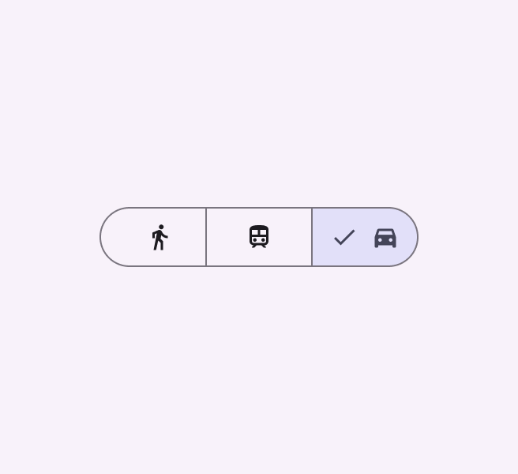

exclamation Caution

Icons can be used in place of labels, but they must clearly communicate their meaning

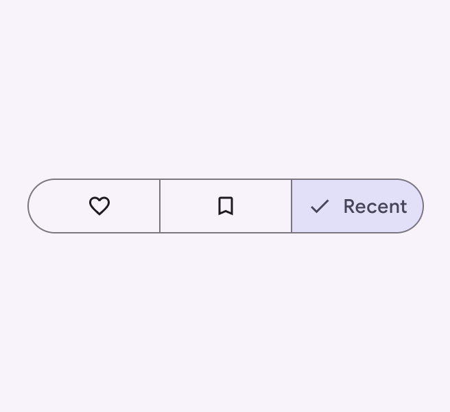

close Don’t

Avoid mixing icon-only labels with text labels. Choose one label type and use that type for all segments.

## Single-select

Use a single-select segmented button to select one option from a set, switch between views, or sort elements from up to five options. For example, use a single-select segmented button to choose one of a set of sizes, such as this beverage size selector.

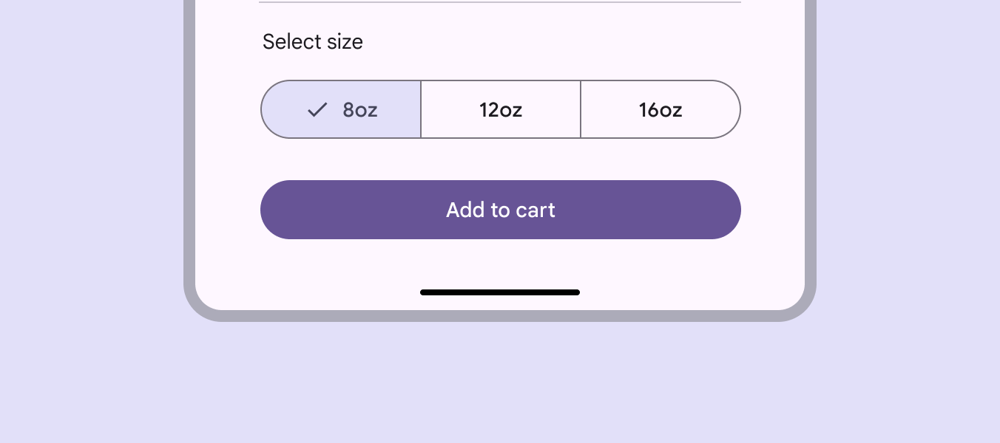

A single select segmented button for choosing beverage size

## Multi-select

Use a multi-select segmented button to select or sort from two to five options. Unlike single-select, selection is not required and a user may concurrently select anywhere from all to none of the options. For example, multi-select segmented buttons can be used to filter by price range when searching for a restaurant. 

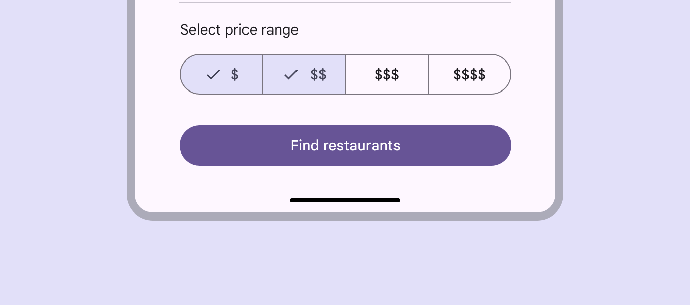

A multi-select segmented button for filtering restaurant search options

## Placement

Segmented buttons should have adequate margins [More on margins](/m3/pages/spacing/overview) from the edge of the viewport or frame. On larger screens, set a maximum padding for all button segments so the set doesn't fill the screen.

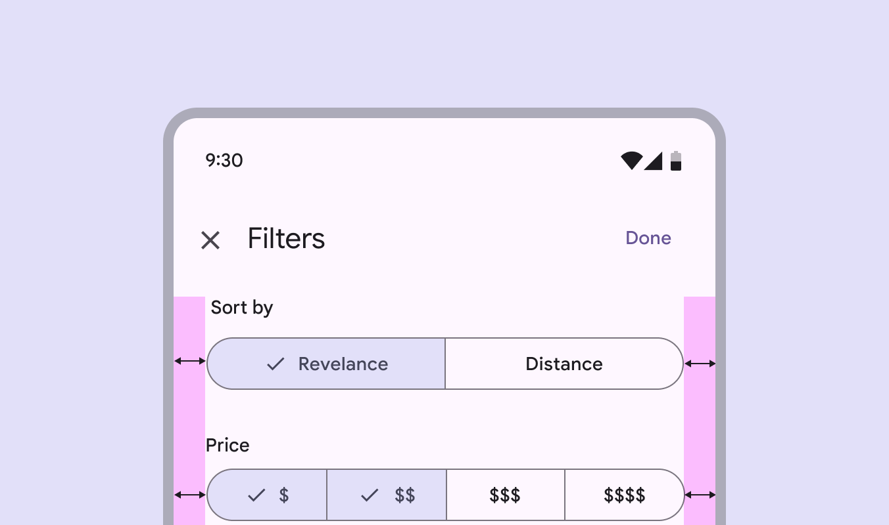

check Do

Allow adequate space for margins. The button container shouldn’t reach the edge of the viewport.

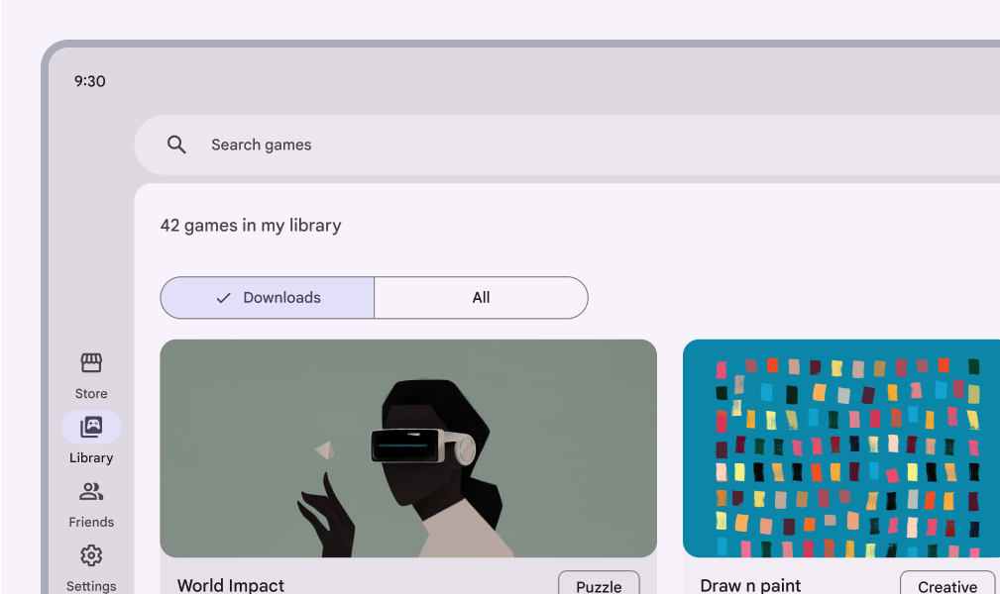

check Do

Set a maximum padding within the segments to ensure usability on larger screens

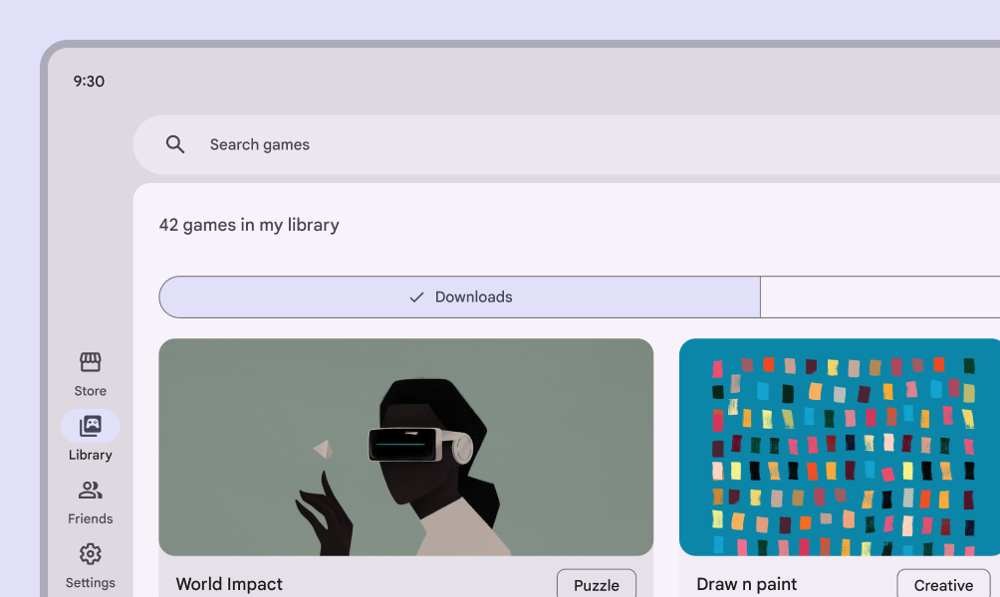

close Don’t

Don’t allow segmented buttons to span the full width of larger screens or panes. This can leave too much padding on either side of the segment label, making the button less usable. Segmented buttons can be placed on other components, such as bottom sheets [More on bottom sheets](/m3/pages/bottom-sheets/overview) or full-screen dialogs . 

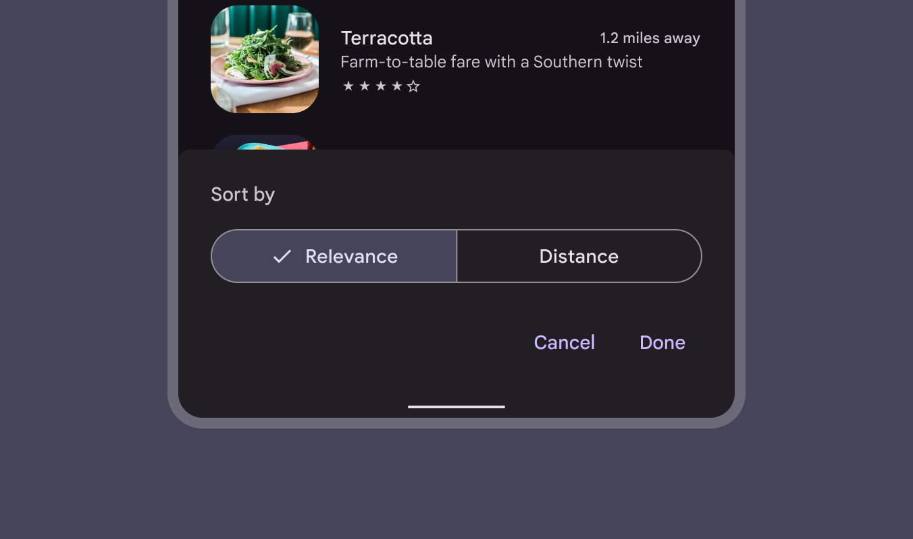

A segmented button can be placed on a bottom sheet

## Behavior

When using both icons and label text in segmented buttons, the icon label is replaced by the checkmark icon when the segment is selected. Icons become checkmarks when selected in buttons that also use label text

