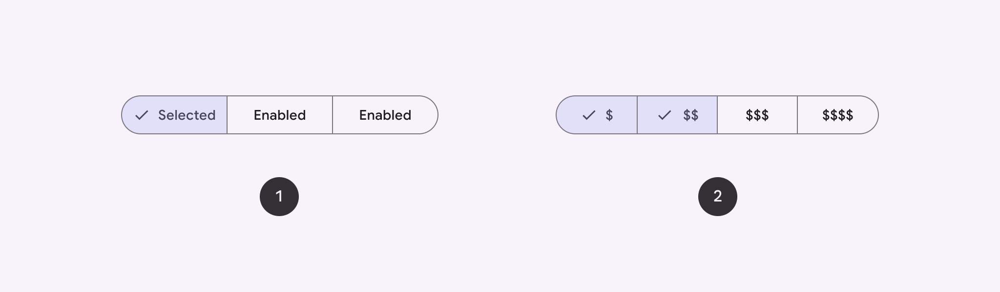
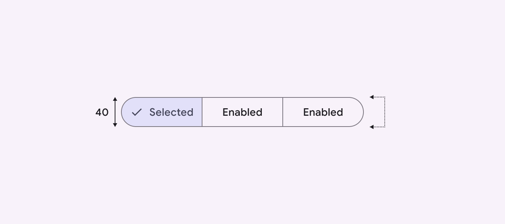
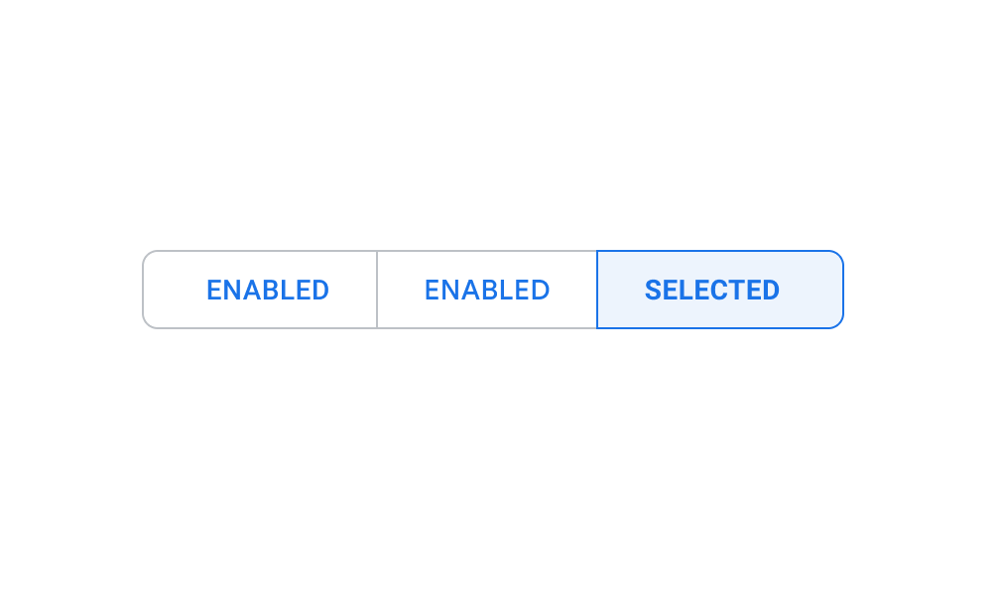
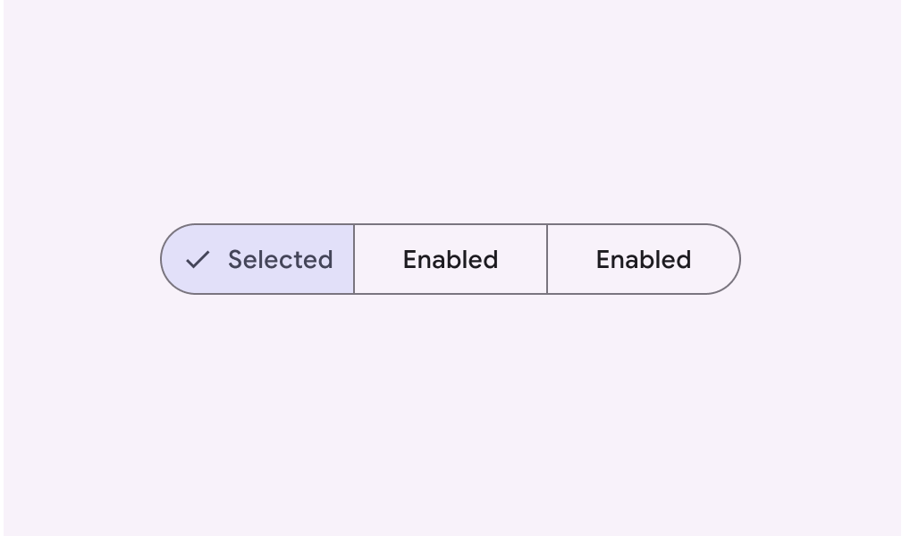

# Segmented buttons

Segmented buttons help people select options, switch views, or sort elements

star

Note:

Segmented buttons are no longer recommended in the Material 3 expressive update. For those who have updated, use the [connected button group](/m3/pages/button-groups/overview/) instead, which has mostly the same functionality but with an updated visual design.

- Segmented buttons can contain icons, label text, or both
- Two variants: single-select and multi-select
- Use for simple choices between two to five items (for more items or complex choices, use chips [More on chips](/m3/pages/chips/overview))

1. Single-select segmented button
2. Multi-select segmented button

## Availability & resources

| Type | Resource | Status |
| --- | --- | --- |
| Design | [Design Kit (Figma)](https://www.figma.com/community/file/1035203688168086460) | Available |
| Implementation |  | Available |
| Implementation | [Jetpack Compose](https://developer.android.com/develop/ui/compose/components/segmented-button) | Available |
| Implementation |  | Available |

## M3 Expressive update

**May 2025**

The segmented button is no longer recommended. Use the [connected button group](/m3/pages/button-groups/overview/) instead. [More on M3 Expressive](https://m3.material.io/blog/building-with-m3-expressive)

## Differences from M2

- **Color:** New color mappings and compatibility with dynamic color [More on dynamic color](/m3/pages/dynamic/choosing-a-source)
- **Icons:** Optional check icon to indicate selected state [More on states](/m3/pages/interaction-states/overview)
- **Layout:** Taller container height of 40dp
- **Name and variants:** Segmented buttons were previously known as toggle buttons. They now have two official variants: single-select and multi-select.
- **Shape:** Fully rounded corners
- **Typography:** Labels use sentence case instead of all caps

Segmented buttons now have a container height of 40dp

M2: Segmented buttons had a small corner radius and label text in all caps

M3: Segmented buttons have fully rounded corners, sentence-case text, different height, and new color mappings

