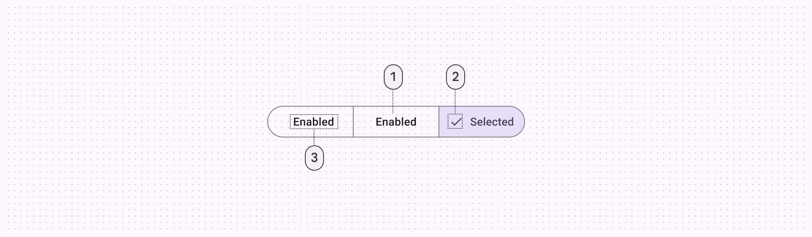
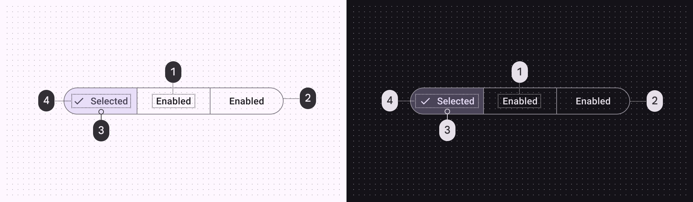
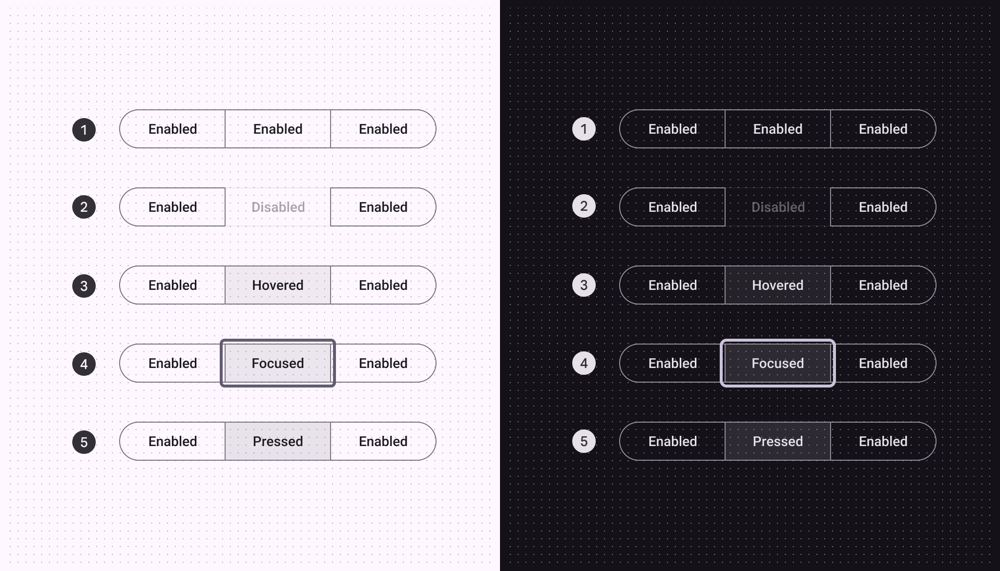
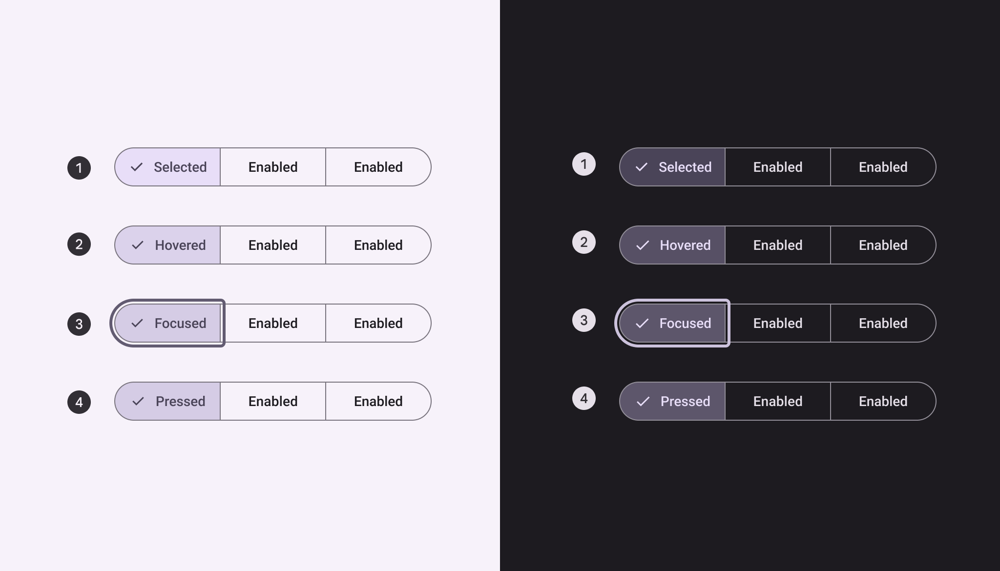
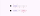
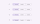

# Segmented buttons

Segmented buttons help people select options, switch views, or sort elements

star

Note:

Segmented buttons are no longer recommended in the Material 3 expressive update. For those who have updated, use the [connected button group](/m3/pages/button-groups/overview/) instead, which has mostly the same functionality but with an updated visual design.



1. Container
2. Icon (optional for unselected state)
3. Label text

## Tokens and specs

Browse the component elements, attributes, tokens, and their values. [Learn more about design tokens](/m3/pages/design-tokens/overview)

```
Segmented button - Outlined
```

```
Segmented button - Outlined
```

```
Segmented button - Outlined
```

```
Segmented button - Outlined
```

Segmented button - Outlined

Token

Default, Light

Enabled

Disabled

Hovered

Focused

Pressed (ripple)

## Color

Color values are implemented through design tokens [More on tokens](/m3/pages/design-tokens/overview). For design, this means working with color values that correspond with tokens. For implementation, a color value will be a token that references a value. [Learn more about design tokens](/m3/pages/design-tokens/overview)



Segmented button color roles used for light and dark schemes:

1. On surface
2. Outline
3. Secondary container
4. On secondary container

## States [More on states](/m3/pages/interaction-states/overview) are visual representations used to communicate the status of a component or interactive element.  [Learn more about interaction states](/m3/pages/interaction-states/overview)

### Unselected



Unselected button states:

1. Enabled
2. Disabled
3. Hovered
4. Focused
5. Pressed

### Selected



Selected button states:

1. Selected
2. Hovered on selected
3. Focused on selected
4. Pressed on selected

## Measurements



1. Padding and container size
2. Target size

| Attribute | Value |
| --- | --- |
| Container width
 | Dynamic based on labels |
| Segment width | Container width / total segments (Example: 1/3) |
| Height
 | 40dp |
| Outline width | 1dp |
| Label alignment
 | Center |
| Left/right padding
 | Min 12dp |
| Padding between elements
 | 8dp |
| Target size | 48dp |

### Density

Density can be used in denser UIs where space is limited. Density is only applied to the height. 



Each step down in density removes 4dp from the height

