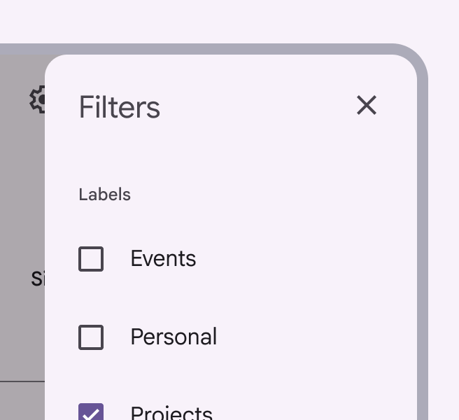
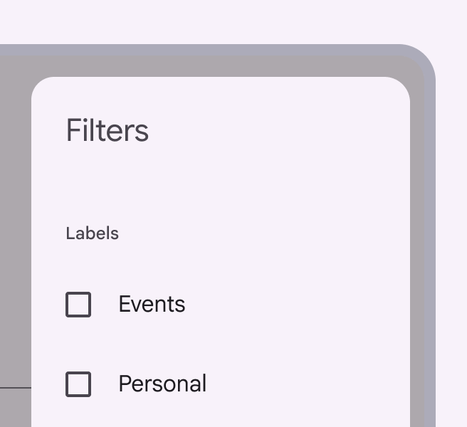
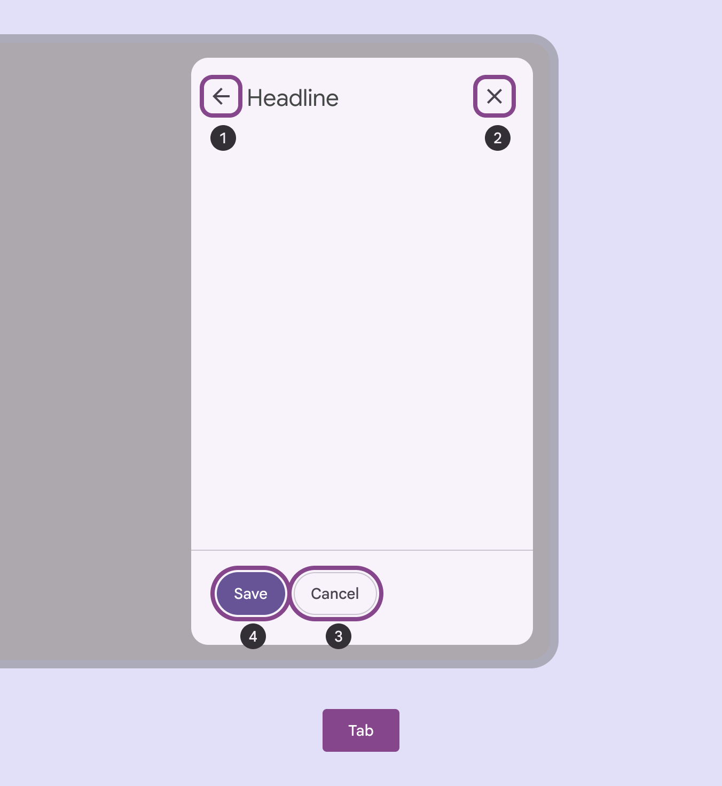
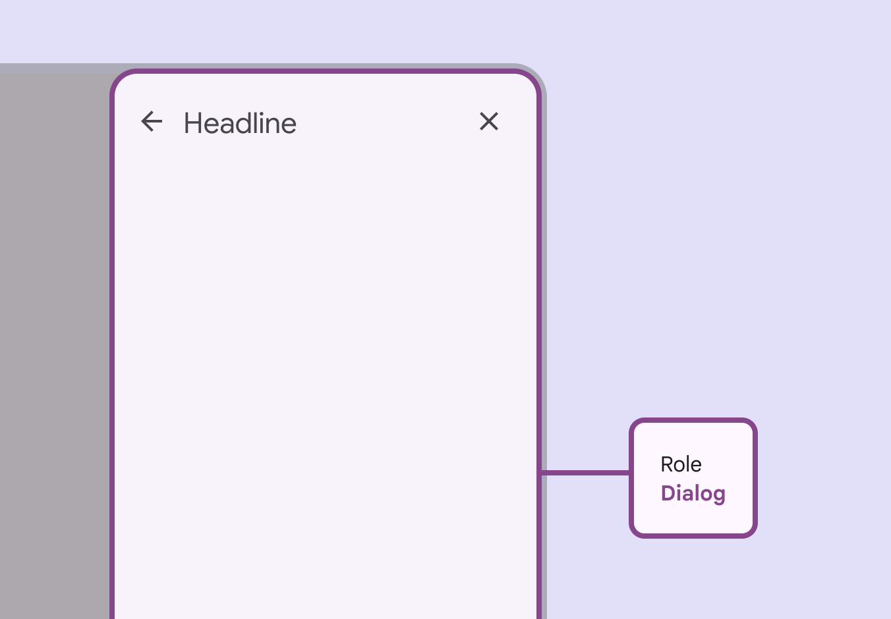

# Side sheets

Side sheets show secondary content anchored to the side of the screen

## Use cases

People should be able to dismiss the side sheet using assistive technology.

## Interaction & style

Material requires that a close affordance, such as a close icon button [More on icon buttons](/m3/pages/icon-buttons/overview), is always present within a side sheet.

check DoA close icon button makes the side sheet easy to dismiss 

close Don’t

Without a close icon button, people can’t predict the opening and closing flow of side sheets, or know if the sheet is transient or permanent

## Initial focus

Actions within a side sheet can be focused [More on focused state](/m3/pages/interaction-states/applying-states#bc6d6853-48ef-490e-8076-448e89e69f0f) by tab order using a keyboard or switch control.

Visible focus shown on the available actions within a side sheet:

1. Headline
2. Cancel
3. Save

## Keyboard navigation

|
Keys

 |

Actions

 |
| --- | --- |
|

**Tab**

 |

Focus lands on (non-disabled) icon button

 |
|

**Space** or **Enter**

 |

Activates the (non-disabled) icon button

 |

## Labeling

The accessibility role for a side sheet is **Dialog**.

The role for side sheets is **Dialog**

