# Side sheets

Side sheets show secondary content anchored to the side of the screen

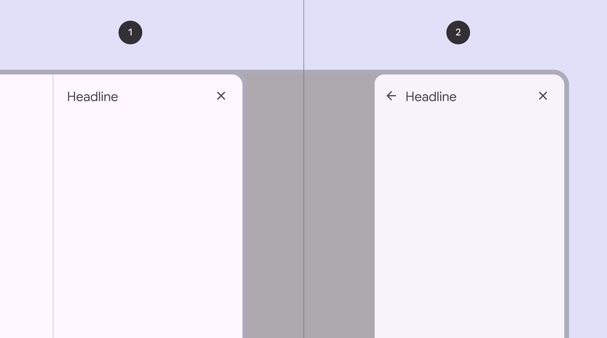

1. Standard side sheet
2. Modal side sheet

## Usage

Standard side sheets are supplementary surfaces used mostly in medium [More on medium window size class](/m3/pages/applying-layout/medium) to expanded window sizes, [More on expanded window size class](/m3/pages/applying-layout/expanded) like tablet and desktop. They provide a consistent and predictable surface for contextual actions and information. Standard side sheets display content that complements the screen’s primary content. They remain visible while people interact with primary content. Common uses include:

- Displaying a list of actions that affect the screen’s primary content, such as filters
- Displaying supplemental content and features

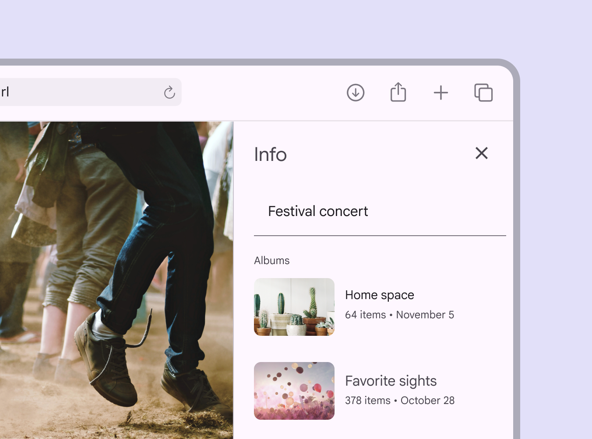

Information about a photo in a standard side sheet

Modal side sheets are preferred in compact window sizes [More on compact window size class](/m3/pages/applying-layout/compact), like mobile, due to limited screen size. They can display the same kinds of content as standard side sheets, but must be dismissed in order to interact with the underlying content.

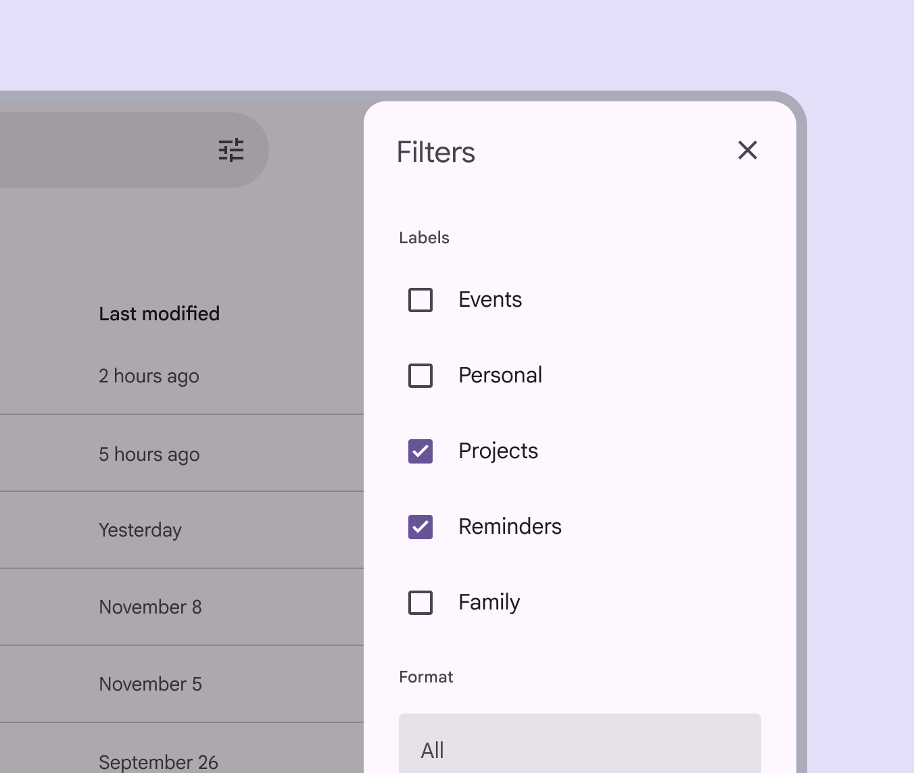

Modal side sheet with filter controls

Side sheets have a fixed width and typically span the height of the screen. Their dimensions depend on how the app’s layout [More on layout](/m3/pages/understanding-layout/overview) is subdivided into UI regions.

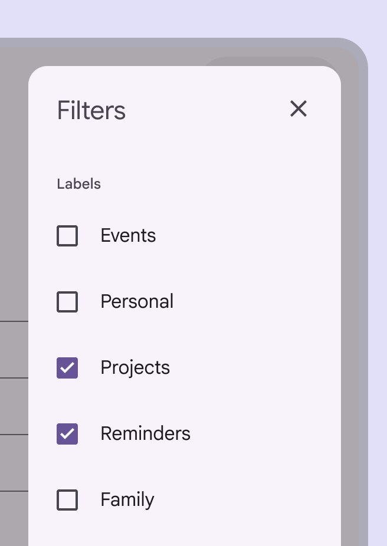

check Do

Place side sheets along the edge of the screen, usually on the right side to avoid interference with any navigational components on the left edge. They can be slightly inset by 16dp.

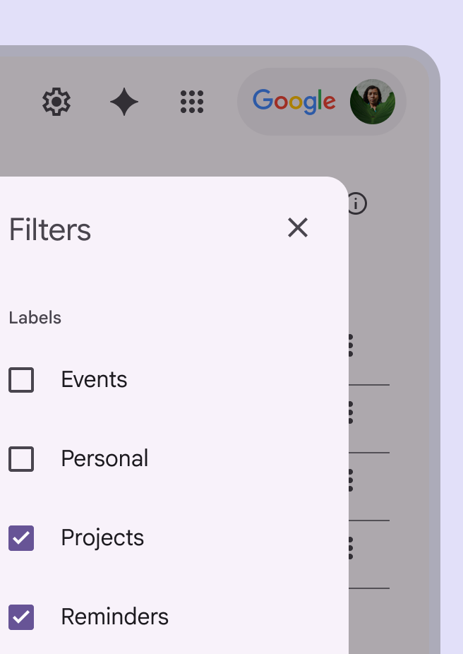

close Don’t

Don’t inset a side sheet from the screen edges far beyond the recommended margin. This makes the sheet’s position and scroll behavior unclear, while obscuring primary content.

## Anatomy

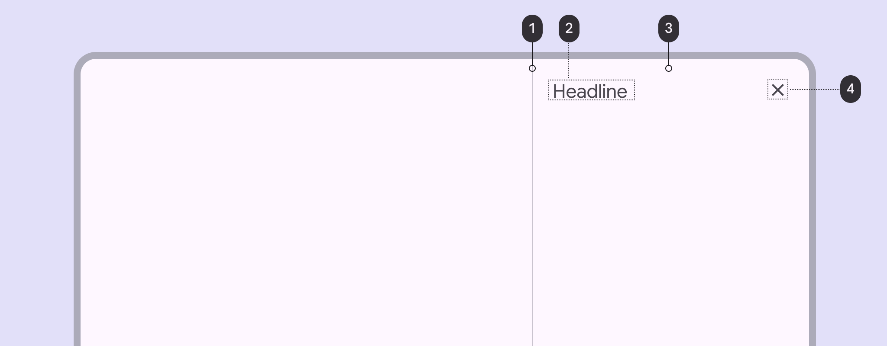

1. Divider (optional)
2. Headline
3. Container
4. Close icon button

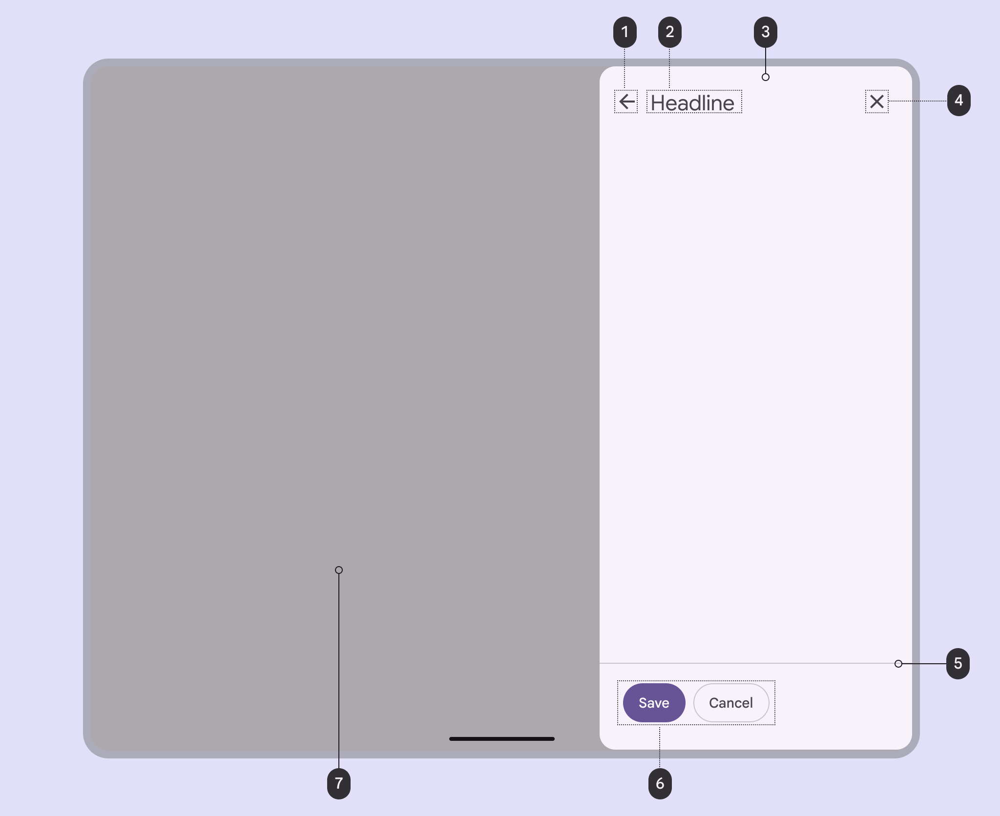

1. Back icon button (optional)
2. Headline
3. Container
4. Close icon button
5. Divider (optional)
6. Action buttons (optional)
7. Scrim

### Container

Side sheet containers hold all side sheet elements. Their size is determined by the space those elements occupy. The container is the only required element of a side sheet.

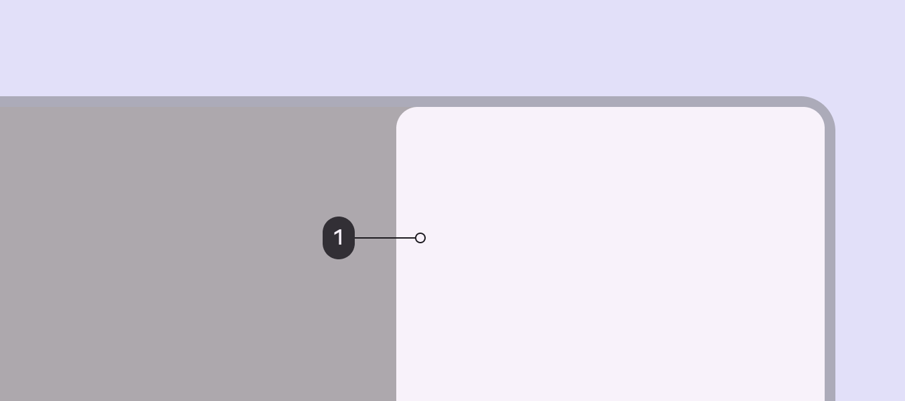

1. Container

### Back icon button (optional)

Icon buttons [More on icon buttons](/m3/pages/icon-buttons/overview) can provide ways to exit a side sheet or move to a different experience. Because the primary content behind or beside a side sheet is always visible, it’s important to provide affordances for leaving a side sheet and returning to the primary content.

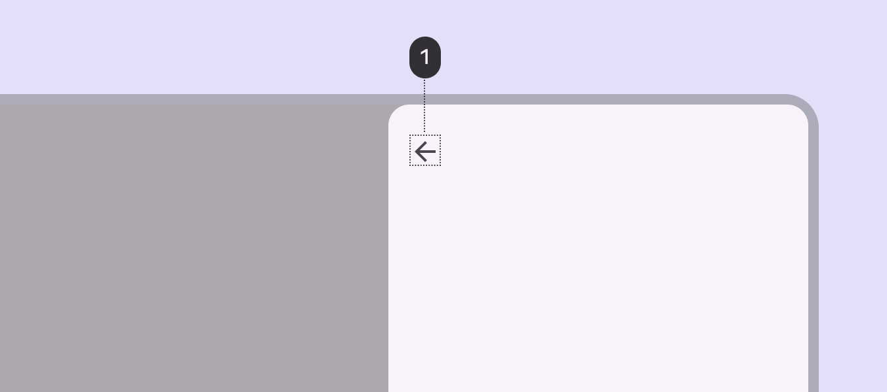

1. Back icon button

### Close icon button (optional)

A close affordance provides a consistent method for dismissing a side sheet. A close icon button is highly recommended, increases accessibility [More on accessibility](/m3/pages/overview/principles), and makes focused [More on focused state](/m3/pages/interaction-states/applying-states#bc6d6853-48ef-490e-8076-448e89e69f0f) side sheets easier to close.

1. Close icon button

### Action buttons (optional)

Buttons [More on buttons](/m3/pages/common-buttons/overview) represent actions available from a side sheet. Examples: **Save**, **Edit**, **Download**

Use elevation [More on elevation](/m3/pages/elevation/overview), fill, and tone [More on hue, chroma, and tone](/m3/pages/color/how-the-system-works#dc7848f3-b094-4f9a-9e50-bfa5a5029617) to call attention to specific actions.

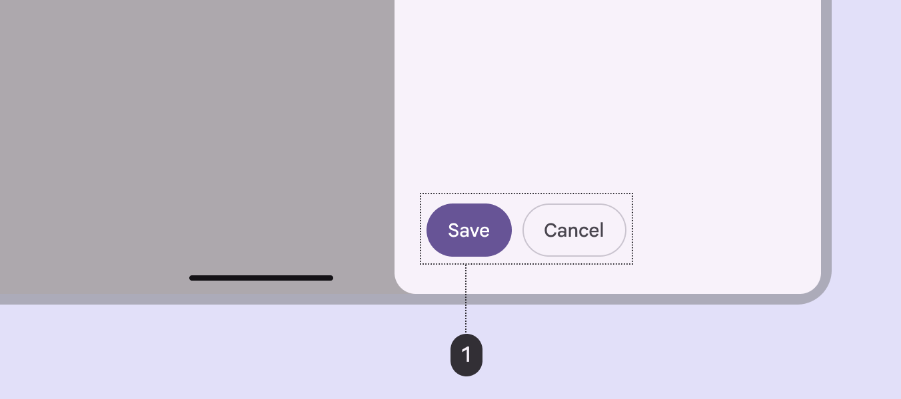

1. Action buttons

### Divider (optional)

Dividers [More on dividers](/m3/pages/divider/overview) can separate different kinds of content and create distinct regions in a side sheet. Use a divider to separate:

- Action buttons from content
- User-generated content from system-generated content

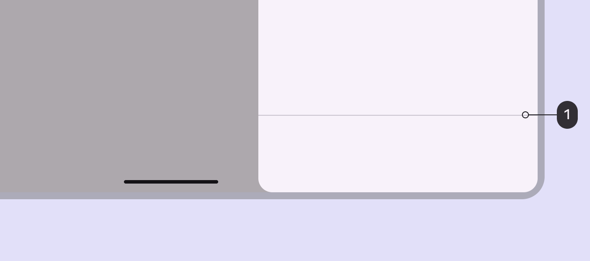

1. Divider

### Content (optional)

Side sheets can display a wide variety of content and layouts [More on layout](/m3/pages/understanding-layout/overview), ranging from a list [More on lists](/m3/pages/lists/overview) of actions to supplemental content in a tabular layout.

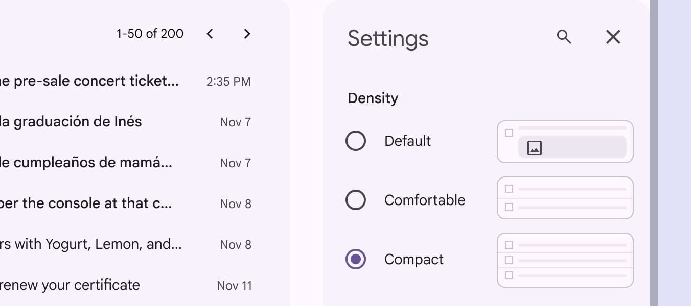

Form controls shown in a side sheet for app settings

Modal side sheets on smaller screens can transition to standard side sheets at larger screen sizes

## Adaptive design

Side sheets have a default width, but can be resized depending on the needs of the layout [More on layout](/m3/pages/understanding-layout/overview). When a standard side sheet opens, the body area shrinks to accommodate the sheet’s width while maintaining a margin [More on margins](/m3/pages/understanding-layout/spacing#38a538d7-991f-4c39-8449-195d32caf397) on the body’s trailing edge. Entrance of standard side sheets will cause the body area to adjust and accommodate the new content

### RTL language support

In right-to-left (RTL) languages, side sheets should appear on the left edge of the window with all elements reversed.

Side sheet elements are reversed in RTL languages

## Behavior

Side sheets can vertically scroll independent of the rest of the UI. This allows their scroll position and content to persist while the page is scrolled, and vice versa. Side sheets cannot scroll horizontally.

check Do

Side sheets can vertically scroll internally when their content exceeds the screen height

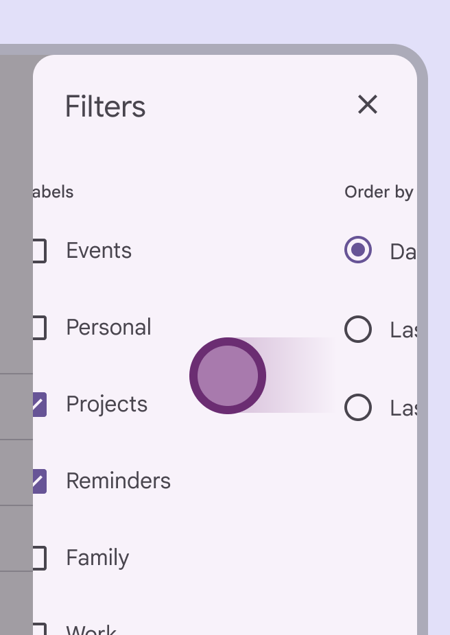

close Don’t

Don’t allow horizontal scrolling or lay out the side sheet in a way that suggests horizontal scrolling. A side sheet’s narrow width leaves limited space to fully view items.

### Predictive back

On Android, a gesture [More on gestures](/m3/pages/gestures) called [predictive back](https://github.com/material-components/material-components-android/blob/master/docs/foundations/PredictiveBack.md) allows a person to swipe left or right on the side sheet. When predictive back is used:

- The side sheet detaches from the top and bottom edges of the screen to signal it will close
- The previous screen is revealed in a preview
- The side sheet and its content always scales in the direction of the gesture

[Find a list of compatible components](/m3/pages/gestures#22462fb2-fbe8-4e0c-b3e7-9278bd18ea0d)

Preview of the result of the gestures: release to commit, fling to commit, and cancel

