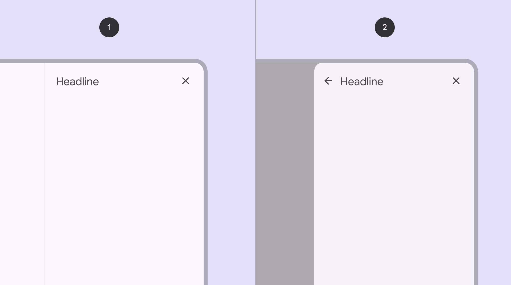
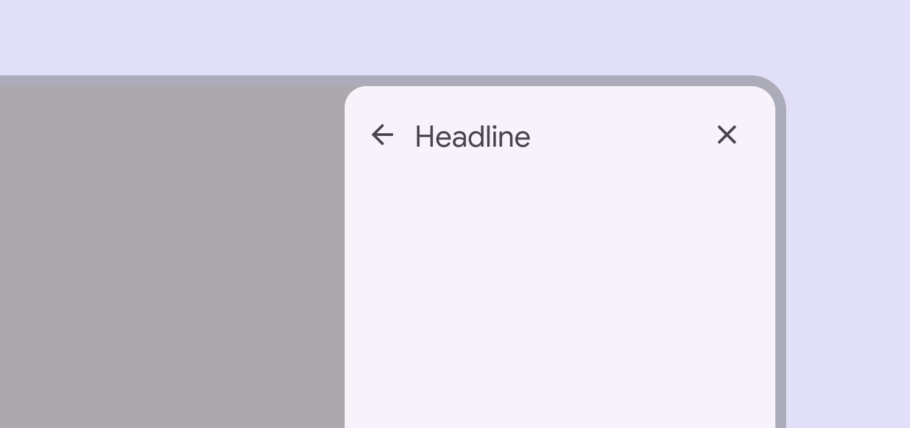

# Side sheets

Side sheets show secondary content anchored to the side of the screen

- Use side sheets to provide optional content and actions without interrupting the main content
- Two variants: standard and modal
- People can navigate to another region within the sheet
- Side sheets can contain a back icon for navigation

1. Standard side sheet
2. Modal side sheet

## Availability & resources

| Type | Resource | Status |
| --- | --- | --- |
| Design | [Design Kit (Figma)](http://goo.gle/m3-design-kit) | Available |

## Differences from M2

- Right-to-left (RTL) language support with left side sheet
- Color: New color mappings and compatibility with dynamic color [More on dynamic color](/m3/pages/dynamic/choosing-a-source)
- Shape: Modal side sheets have a 16dp corner radius

Side sheets have new color mappings to support dynamic color

