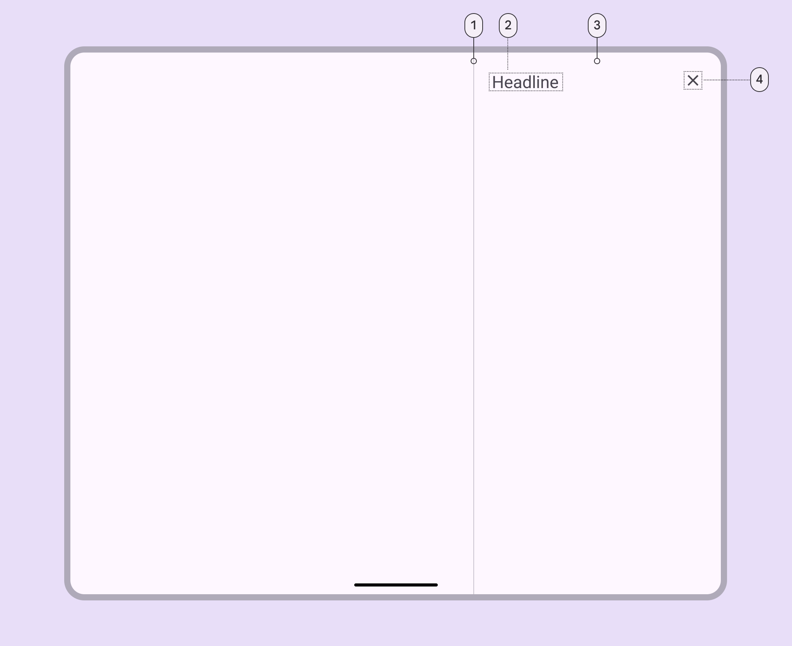
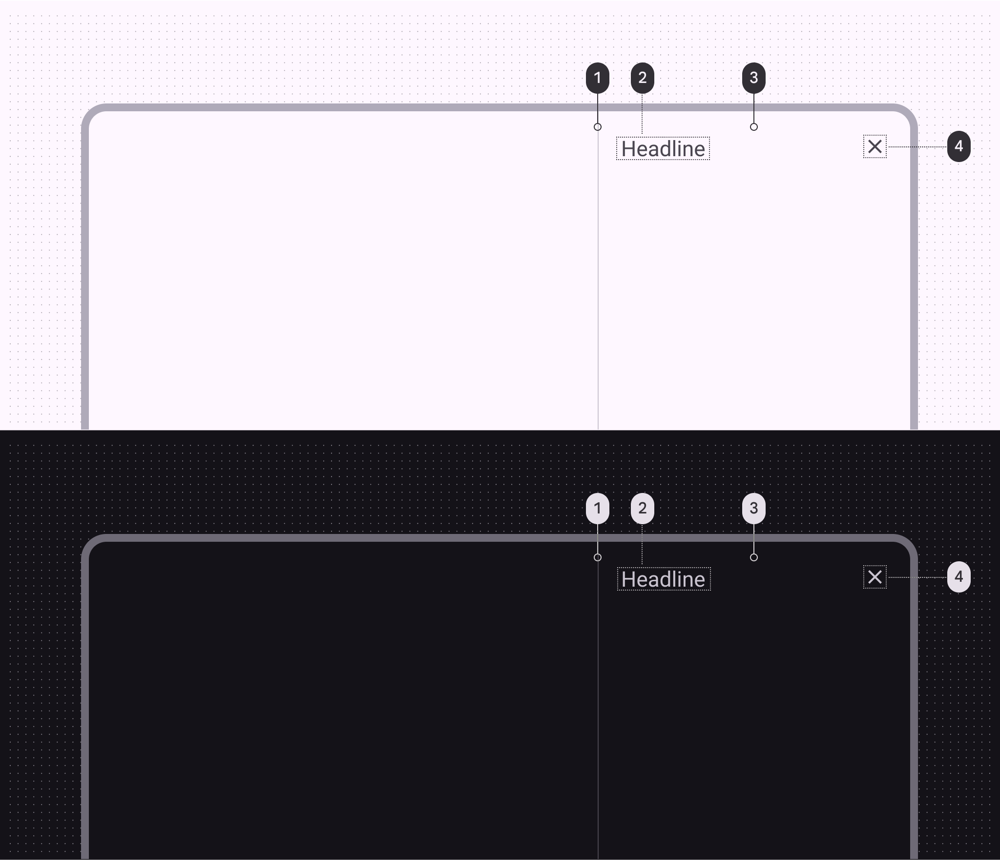
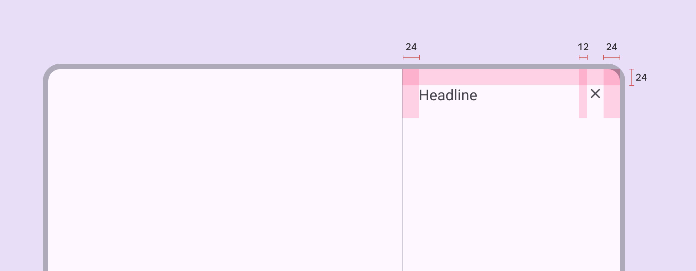
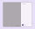
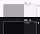

# Side sheets

Side sheets show secondary content anchored to the side of the screen

## Tokens & specs

Browse the component elements, attributes, tokens, and their values. [Learn more about design tokens](/m3/pages/design-tokens/overview)

```
Sheets - Side
```

```
Sheets - Side
```

```
Sheets - Side
```

```
Sheets - Side
```

Sheets - Side

Token

Default, Light

Enabled

Hovered

Focused

Pressed (ripple)

## Standard side sheet



1. Divider (optional)
2. Headline
3. Container
4. Close icon button

### Standard side sheet color

Color values are implemented through design tokens [More on tokens](/m3/pages/design-tokens/overview). For design, this means working with color values that correspond with tokens. For implementation, a color value will be a token that references a value. [Learn more about design tokens](/m3/pages/design-tokens/overview/)



Side sheet color roles used for light and dark themes:

1. Outline variant
2. On surface variant
3. Surface
4. On surface variant

### Standard side sheet measurements



Side sheet padding and size measurements

| Attribute
 | Value
 |
| --- | --- |
| Start/end padding
 | 24dp |
| Padding between top elements
 | 12dp |
| Bottom actions height
 | 72dp |
| Bottom actions top padding
 | 16dp |
| Bottom actions bottom padding
 | 24dp |
| Bottom actions alignment (horizontal)
 | Left |
| Max-width
 | 400dp |
| Margins (when detached)
 | 16dp |

## Modal side sheet



1. Back icon button (optional)
2. Headline
3. Container
4. Close icon button
5. Divider (optional)
6. Action buttons (optional)
7. Scrim

### Modal side sheet color

Color values are implemented through design tokens [More on tokens](/m3/pages/design-tokens/overview). For design, this means working with color values that correspond with tokens. For implementation, a color value will be a token that references a value. [Learn more about design tokens](/m3/pages/design-tokens/overview/).



Side sheet color roles used for light and dark themes:

1. On surface variant
2. On surface variant
3. Surface container low
4. On surface variant

### Modal side sheet measurements


Modal side sheet padding and size measurements

| Attribute
 | Value
 |
| --- | --- |
| Start/end padding
 | 24dp |
| Start padding with icon | 16dp |
| Padding between top elements | 12dp |
| Bottom actions height
 | 72dp |
| Bottom actions top padding
 | 16dp |
| Bottom actions bottom padding | 24dp |
| Bottom actions alignment (horizontal)
 | Left |
| Max-width
 | 400dp |
| Margins (when detached)
 | 16dp |

