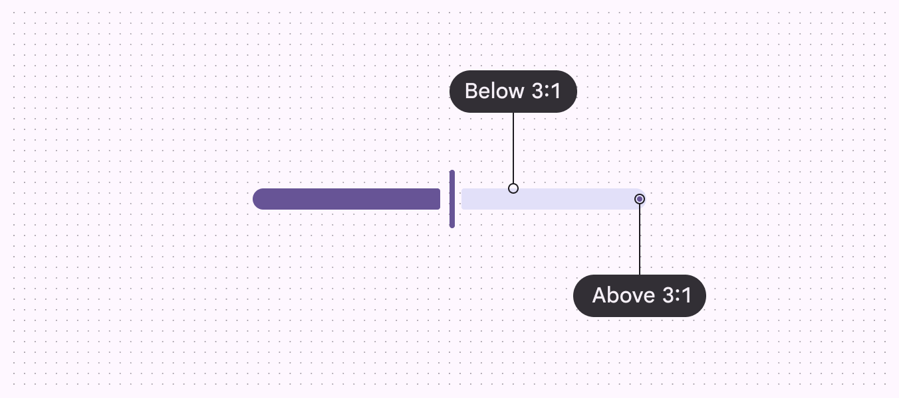
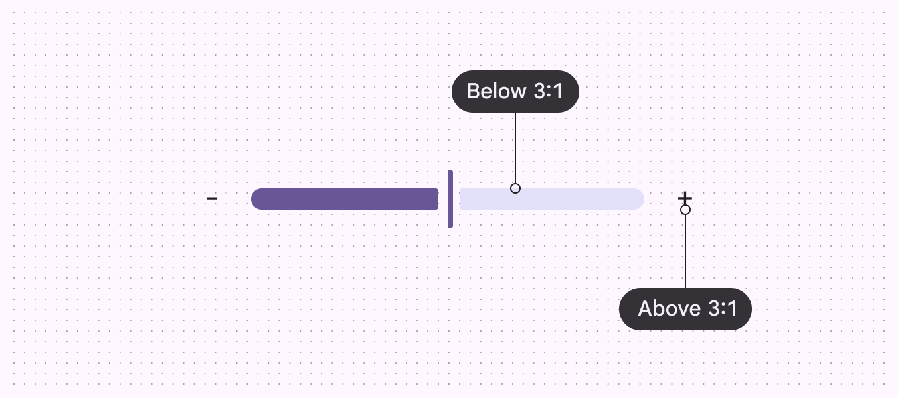
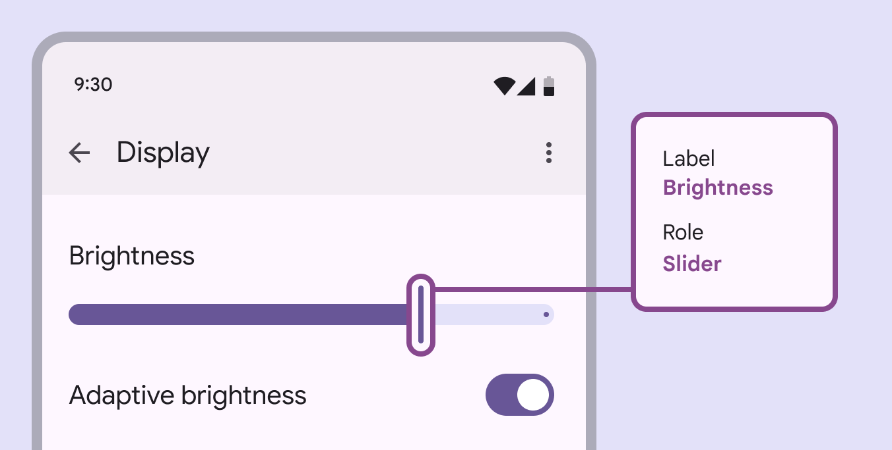
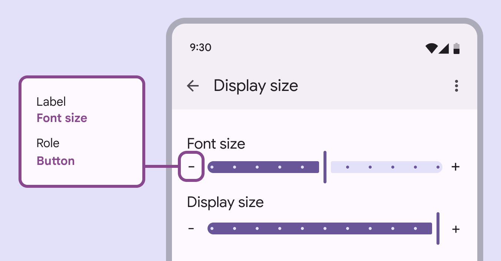

# Sliders

Sliders allow users to make selections from a range of values

## Use cases

People should be able to do the following using assistive technology:

- Navigate to a slider
- Select a range by controlling a handle along a track
- Get appropriate feedback based on input type

## Interaction & style

The slider handle shrinks in width and the value appears to provide a visual cue to the user that the handle is being pressed.

**Touch**

When tapped or dragged, the handle width shrinks to provide interaction feedback, and the value appears.

**Cursor**

When hovered, the cursor changes. When clicked and dragged, the handle width shrinks, and the value appears. The slider handle changes width during interaction

### Focus and navigation

Initial focus lands directly on the handle, since it’s the primary interactive element of
the slider. The slider value can then be adjusted using the arrow keys or other keyboard navigation options. Use arrow keys to change the slider value

## Color contrast

Use visual anchors so the end of the slider’s inactive track has at least 3:1 contrast with the background. The stop indicator makes the end easily visible on most backgrounds.

A stop indicator on the inactive track makes it easier to identify the end of the slider on a low-contrast background

Alternatively, icons or other elements that have a 3:1 contrast with the background can be used to indicate the ends of the slider’s inactive track.

Icons make it easier to identify the ends of the slider on a low-contrast background

## Keyboard navigation

| Keys
 | Actions
 |
| --- | --- |
| Tab
 | Moves focus to the slider handle |
| Arrows
 | Increase and decrease the value by one value or one stop indicator |
| Space & Arrows
 | Increase and decrease the value by one interval or one stop indicator |
| Home or End
 | Set the slider to the first and last values on the slider |

## Labeling elements

The accessibility label for a slider is typically the same as the slider's adjacent text label. It should have the **slider** role.

A slider’s accessibility label should match the adjacent UI text

If the UI text is correctly linked to the slider, assistive tech (such as a screenreader) will read the UI text followed by the component’s role.

Icon buttons placed outside the slider should have the button role

