# Sliders

Sliders allow users to make selections from a range of values

Sliders can adjust values in real time, such as image attributes

## Usage

Sliders are used to select values along a track. They’re ideal for adjusting settings such as volume and brightness, or changing the intensity of image filters. Sliders can use icons or labels to represent a numeric or relative scale. 

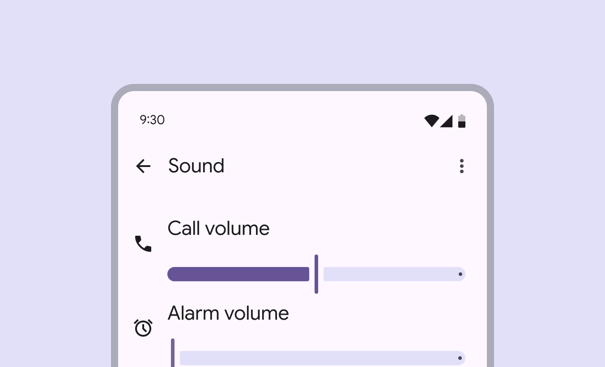

Use sliders to pick a value from a range, like volume loudness

Changes made with sliders must take effect immediately, so people can understand the effects of their selection as they're moving the slider. Selection changes are immediate

There are three different variants of sliders: **standard**, **centered**, and **range:**

Standard sliders select one value from a range of values. Use this when the slider should start from zero or the beginning of a sequence.

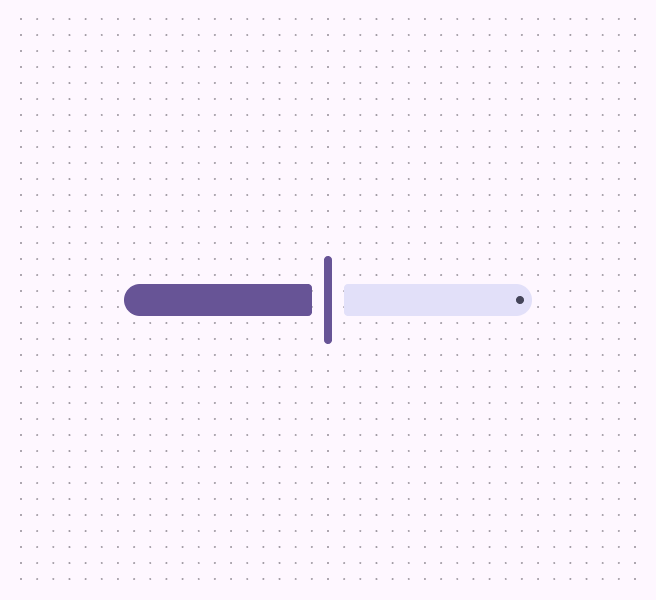

Horizontal standard slider

Vertical standard slider

Centered sliders select a value from a positive and negative value range. Use this when zero, or the default value, is in the middle of the range.

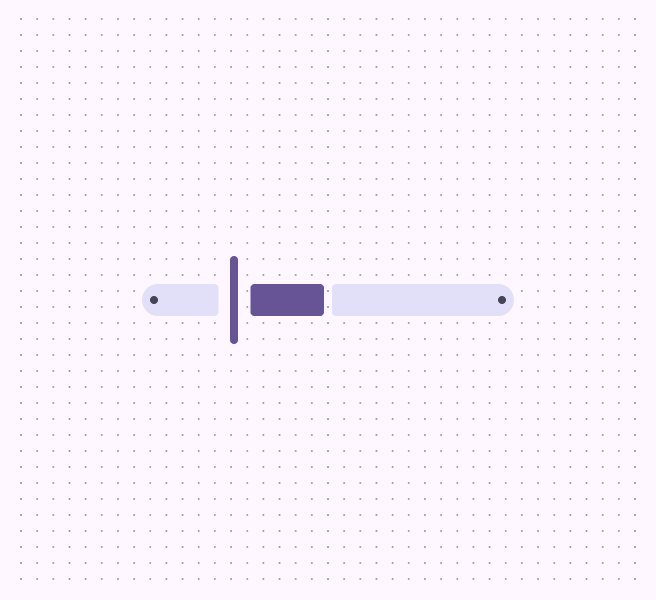

Horizontal centered slider

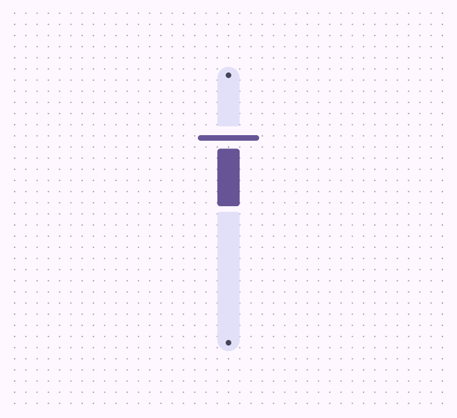

Vertical centered slider

Range sliders select two values on one slider to create a range. Use this when defining a minimum and maximum value. Avoid using range sliders vertically, as this can add too much cognitive load. People are used to most sliders being horizontal.

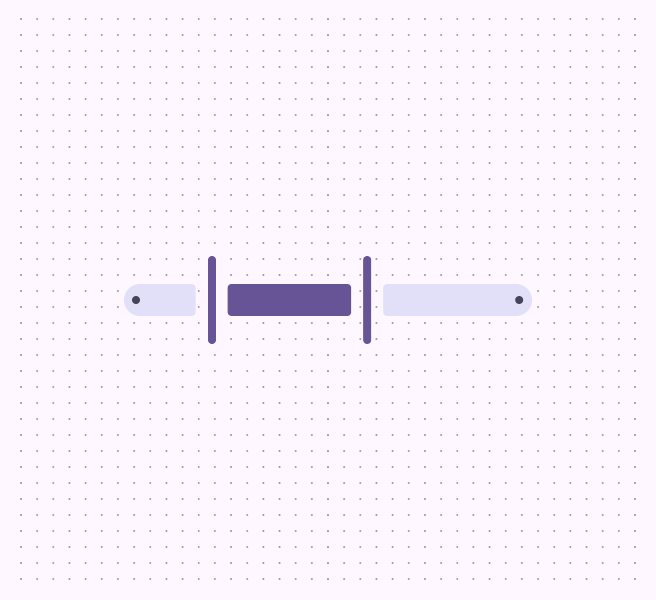

check Do

Horizontal range slider

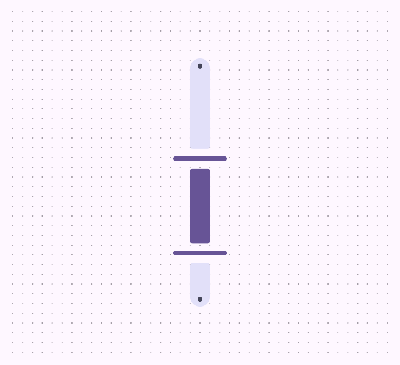

close Don’t

Because of the additional cognitive load of a range slider, avoid using it in vertical orientation.

## Anatomy

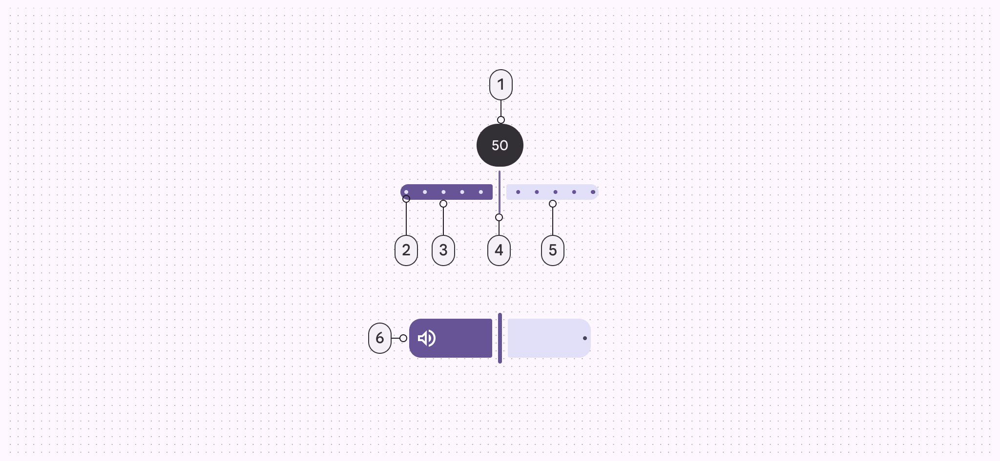

1. Value indicator (optional)
2. Stop indicators (optional)
3. Active track
4. Handle
5. Inactive track
6. Inset icon (optional)

### Track

The track shows the full range of values that can be selected on the slider. It has two sections: active and inactive.

- The **active** section of the track is from the minimum value to the handle. For range sliders, the active track is between the two handles.
- The **inactive** section of the track is from the handle to the maximum value, or outside the two handles of a range slider. For left-to-right (LTR) languages, the values increase from left to right. For right-to-left (RTL) languages, this is reversed.

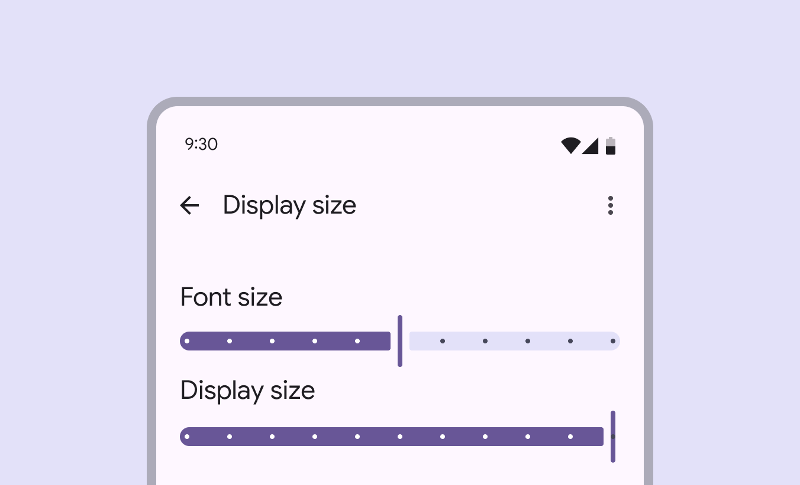

The track on a slider shows the available range

### Handle

The handle can be moved along the track to choose a value. When sliders have two handles, the handles choose the minimum and maximum values in a range. The handle changes shape to indicate when it’s pressed.

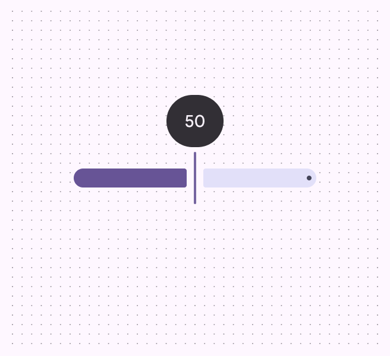

A handle changes shape when it's being pressed or dragged

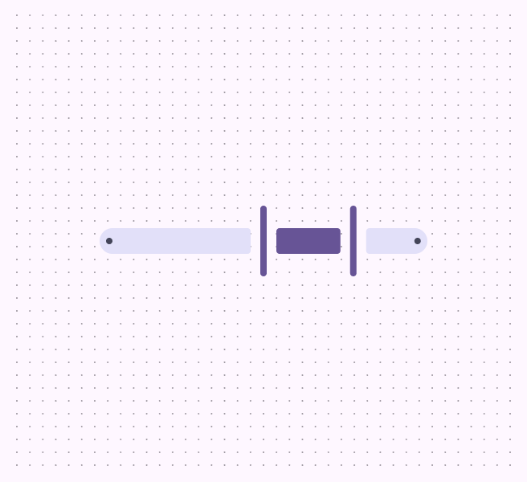

Two handles are used for sliders with range selection

## Configurations

### Value

The value displays the specific value that corresponds with the handle’s placement. A value appears when interacting with the corresponding handle. For range sliders, only one value should be shown at a time. If the value is shown elsewhere, the indicator is not required.

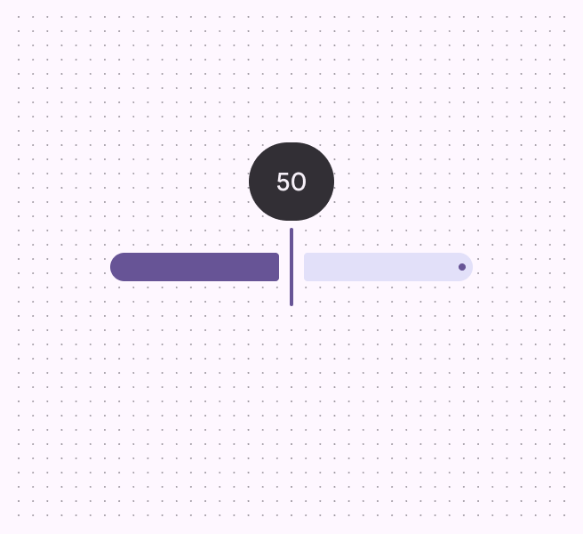

A value can appear while the handle is being pressed or dragged

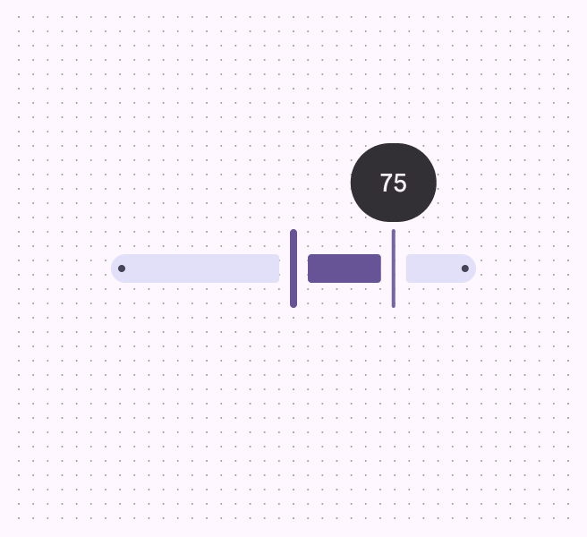

For range sliders, the value only appears on one handle at a time

Instead of showing the built-in value label, a separate text input field can be added outside of the slider. If this is added, the slider and value in this text field should automatically update to match each other. Make sure people can tab to the text field directly after the slider. Use **Tab** to navigate to values that are shown outside the slider, like a text input field

### Stop indicators

Stop indicators show which predetermined values can be chosen on the slider. The slider handle snaps to the closest stop. Avoid having too many stop indicators on a slider, because it can become visually crowded and difficult to adjust the value. All sliders have stops at the end of the inactive track to ensure at least a 3:1 contrast with the background. If the inactive track has this level of contrast already, the end stops can be removed.

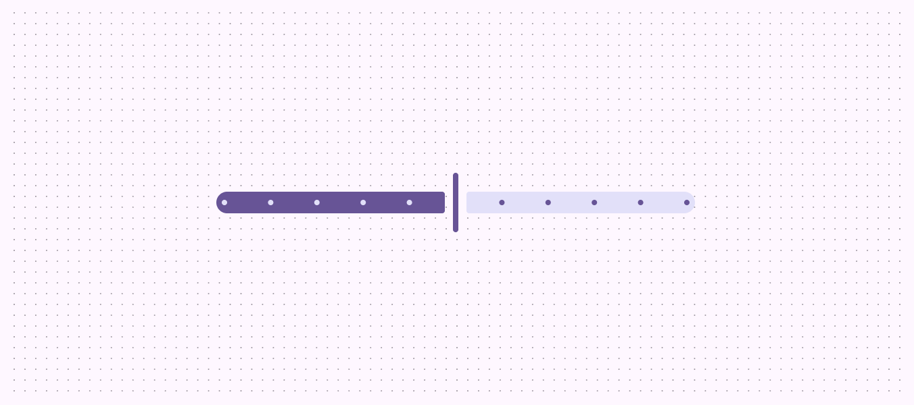

Stop indicators show each available value on a slider

Icons or text can be added outside the slider to indicate the range of values and make the slider more accessible. This can be used instead of a stop indicator.

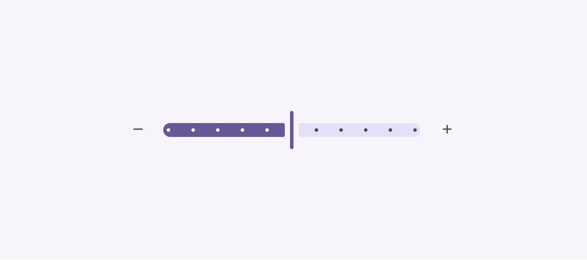

Plus and minus icons, or text, can be added to the left and right of the slider

### Orientation

Sliders can be oriented either horizontally or vertically, depending on what is best for your use case.

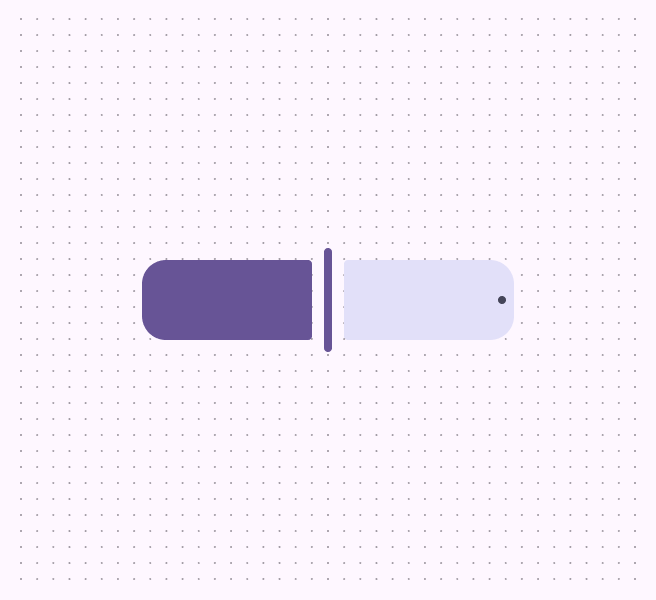

Standard slider in horizontal orientation

Standard slider in vertical orientation

### Inset icon

Standard sliders that are M, L, or XL can include an icon within the track. This icon should illustrate what the slider controls. Avoid adding inset icons to XS or S sliders. When there’s not enough space for the icon on the active track, like at a low value, the icon moves to the inactive track. Consider swapping which icon is displayed at zero, like a volume icon becoming a mute icon.

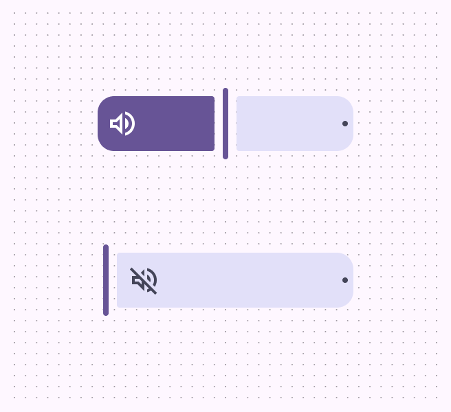

check Do

Inset icons change placement based on the handle

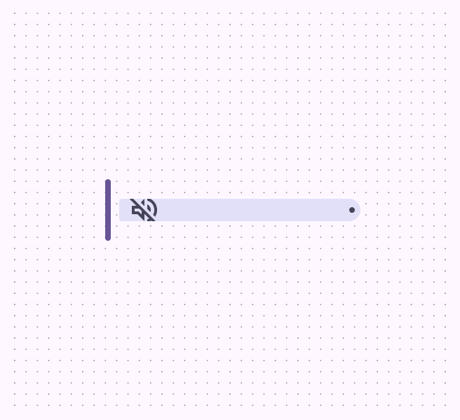

close Don’t

Don’t use an inset icon with sliders that have track thicknesses under 40dp

Don’t use inset icons on centered or range sliders. It makes it unclear where the start of the slider is.

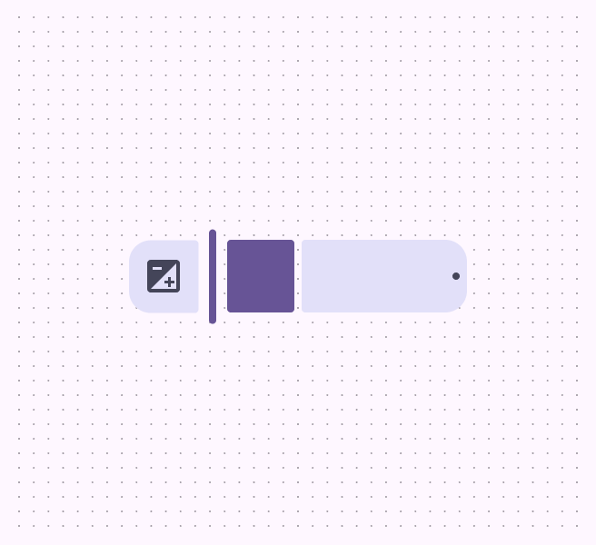

close Don’t

Don’t use an inset icon on a centered slider

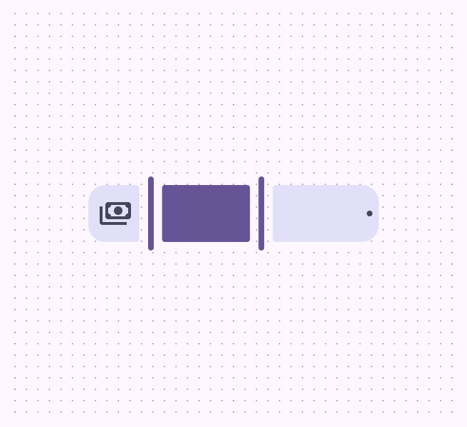

close Don’t

Don’t use an inset icon on a range slider

### Size

Sliders come in different sizes: XS, S, M, L, and XL. Use larger sizes to increase the targets and provide a larger visual emphasis. The active and inactive tracks should always be the same size.

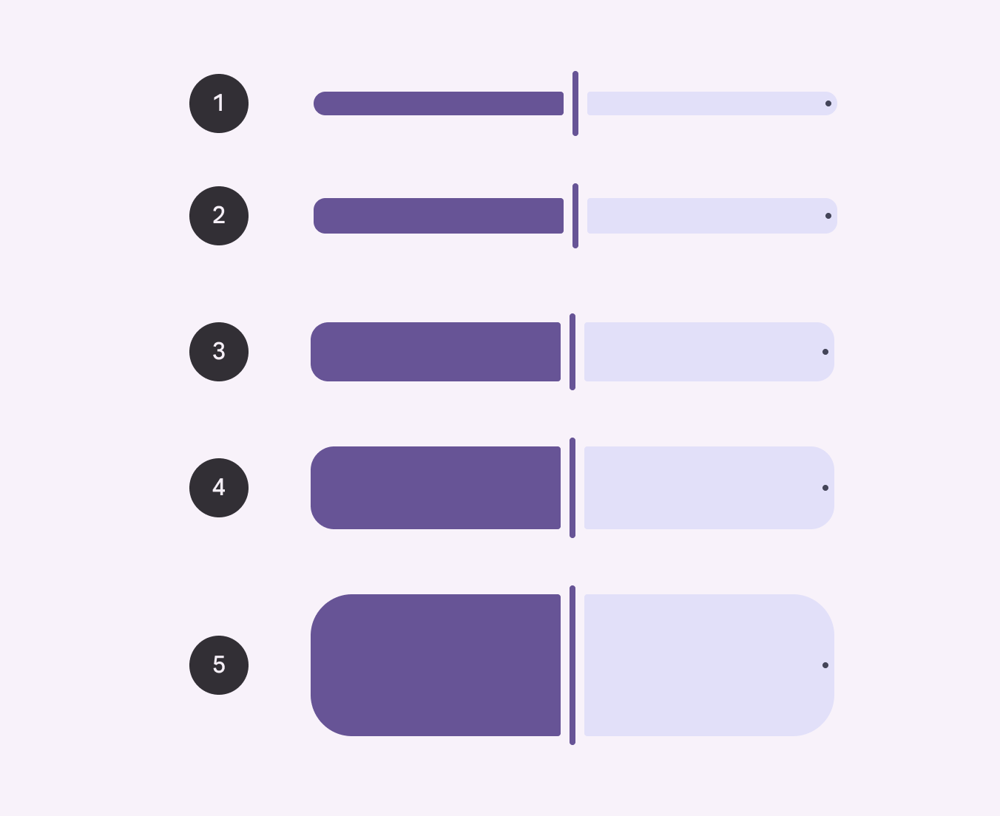

1. XS: 16dp
2. S: 24dp
3. M: 40dp
4. L: 56dp
5. XL: 96dp

XL sliders should be reserved for hero moments, where the slider itself is the most important element on the page.

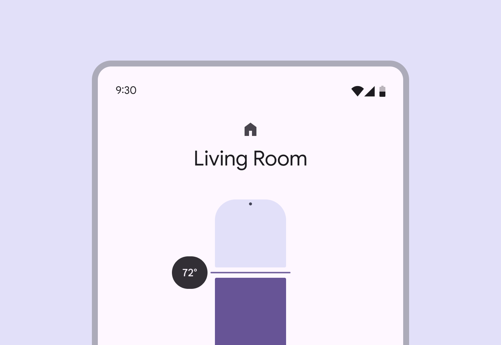

XL sliders should be the focus of the page

## Behaviors

### Select & drag

Select a value by dragging the handle.

**Standard slider**: The handle drags smoothly

**Slider with stop indicators:** The handle snaps to the closest stop indicator while dragged

### Select jump

Select a value by selecting part of the track. 

**Standard** **slider**: The handle moves to the selected location

**Slider with stop indicators:** The handle moves to the closest stop indicator

### Select & arrow

Select a value using the keyboard.

**Tab:** Focus lands on handle 

**Arrows:** Selected value increases or decreases by one value or stop indicator

**Space & arrows:** Selected value increases or decreases by a larger interval or stop indicator

**Standard** **slider**: The handle moves one value

**Slider with stop indicators:** The handle moves to the next stop indicator

