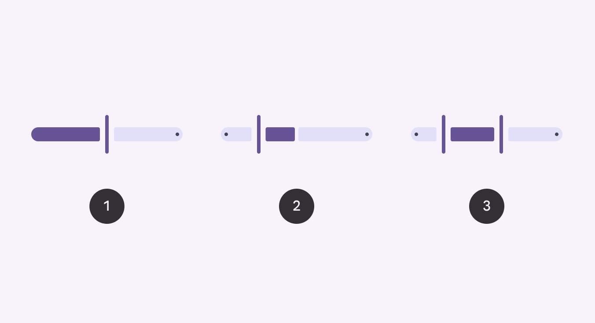
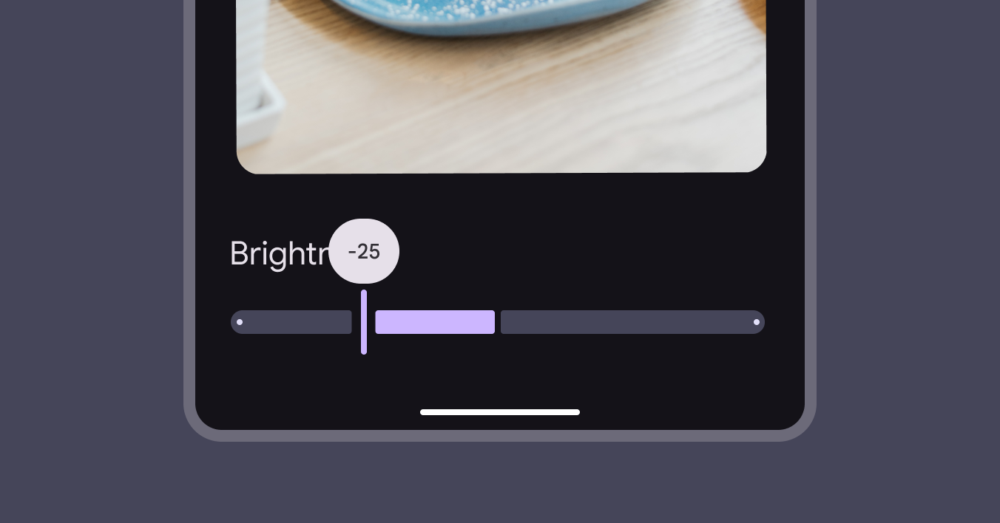
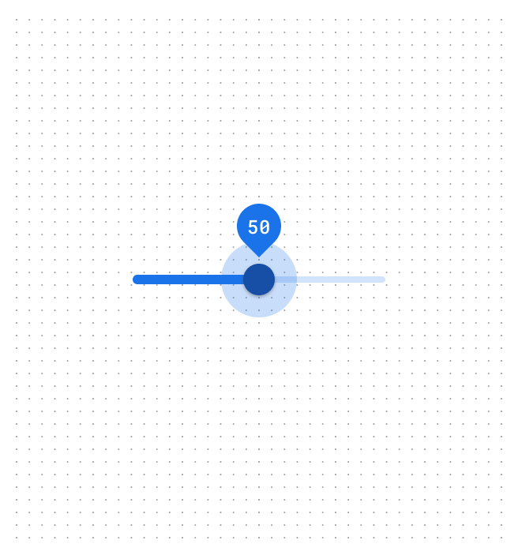
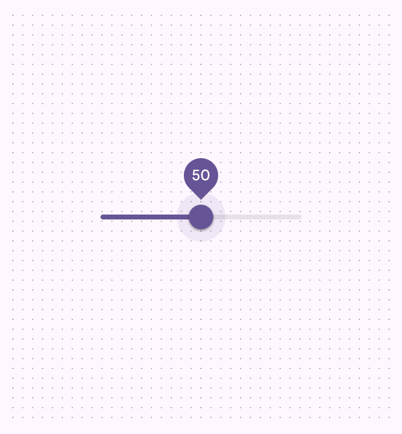

# Sliders

Sliders allow users to make selections from a range of values

- Three variants: Standard, centered, range
- Has five sizes, vertical and horizontal orientation, and an optional inset icon
- Sliders should present the full range of available values
- The slider value should take effect immediately

Sliders change values along a range

## Availability & resources

| Type | Resource | Status |
| --- | --- | --- |
| Design | [Design Kit (Figma)](https://www.figma.com/community/file/1035203688168086460) | Available |
| Implementation |  | Available |
| Implementation | [Jetpack Compose](https://developer.android.com/develop/ui/compose/components/slider) | Available |
| Implementation | [Jetpack Compose: Expressive](https://developer.android.com/reference/kotlin/androidx/compose/material3/package-summary#Slider\(androidx.compose.material3.SliderState,androidx.compose.ui.Modifier,kotlin.Boolean,androidx.compose.material3.SliderColors,androidx.compose.foundation.interaction.MutableInteractionSource,kotlin.Function1,kotlin.Function1\)) | Available |
| Implementation |  | Available |
| Implementation |  | Available |
| Implementation |  | Available |

## M3 Expressive update

**May 2025**

The slider includes expressive configurations for orientation, shape sizes, and an inset icon. [More on M3 Expressive](https://m3.material.io/blog/building-with-m3-expressive)

Updated on Android Views (MDC-Android) and Jetpack Compose. Variants and naming: 

- Changed **continuous** slider to **standard** slider
- The **discrete** slider is now the **stops** configuration

New configurations: 

- Orientation: Horizontal, vertical
- Optional inset icon (standard slider only)
- Sizes: XS (existing default), S, M, L, XL

1. Standard slider
2. Centered slider
3. Range slider

## Previous updates

### Visual refresh to improve non-text contrast

**Dec 2023:** Updated on Android Views (MDC-Android) and Jetpack Compose.

- **Configuration:** Added centered configuration and range selection
- **Shape:** New shape for slider tracks and handles. Slider elements change shape when selected.
- **Motion:** Slider handle adjusts width upon selection. Slider tracks adjust in shape when sliding to the edge.
- **Color:** Refreshed color mappings

M3 visual refresh: Sliders have a stop indicator, larger label text, and a vertical handle that narrows when pressed. Centered sliders start from the middle instead of the leading edge.

## Differences from M2

- **Color**: New color mappings and compatibility with dynamic color [More on dynamic color](/m3/pages/dynamic/choosing-a-source)

M2: Sliders have a circular handle and a small label when pressed

M3: Sliders have new color mappings and support dynamic color

