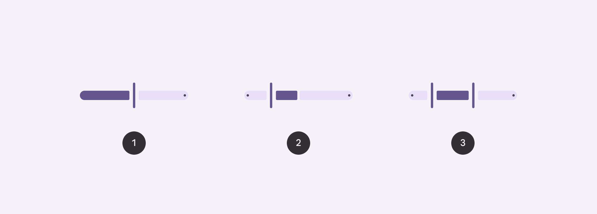
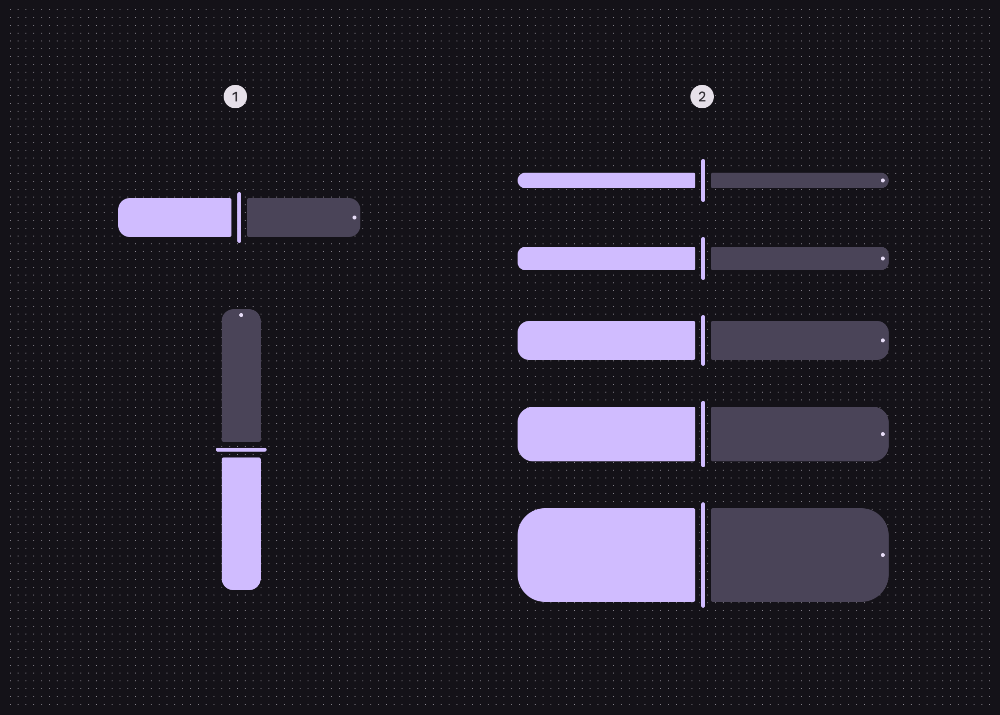
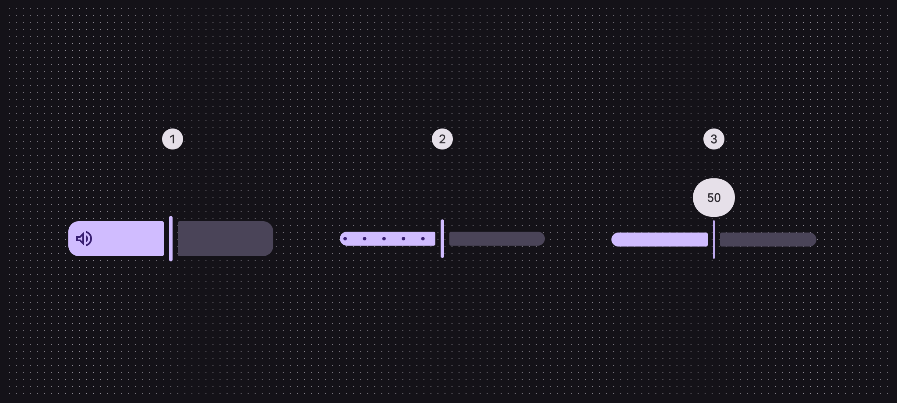
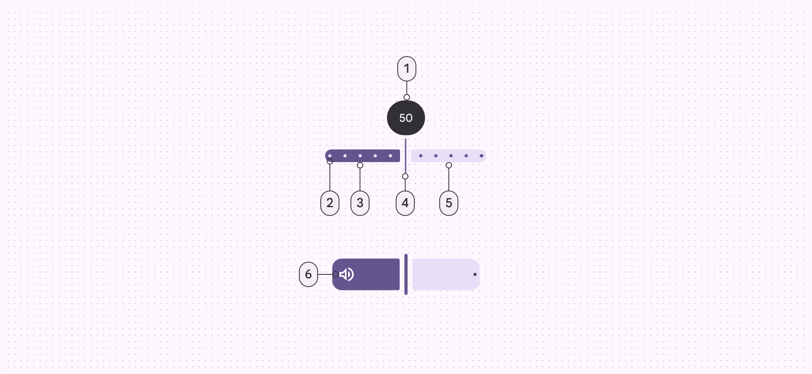
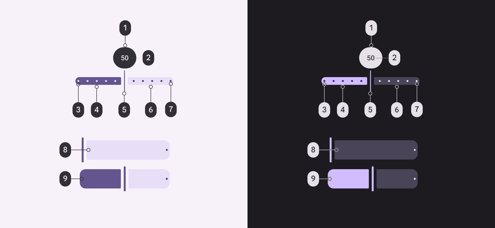
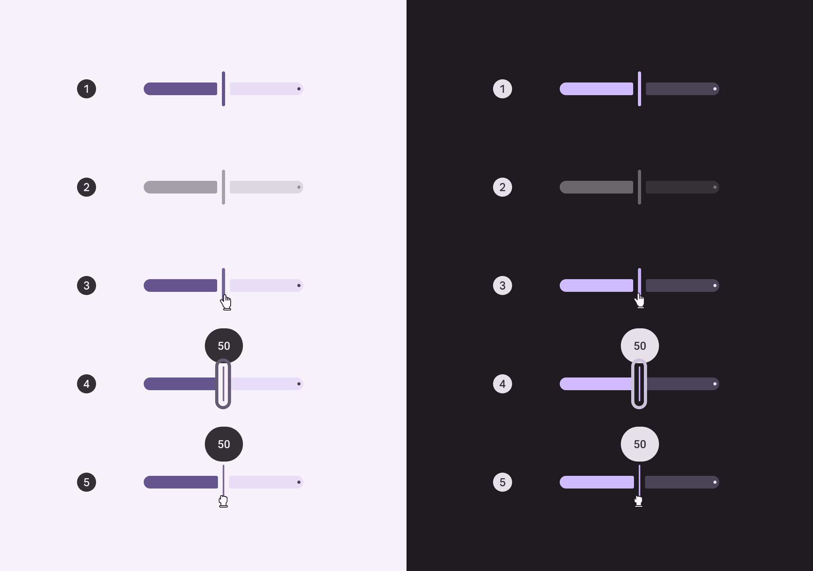
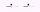
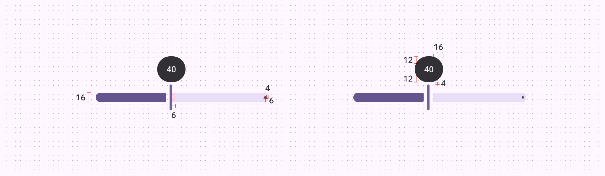
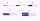
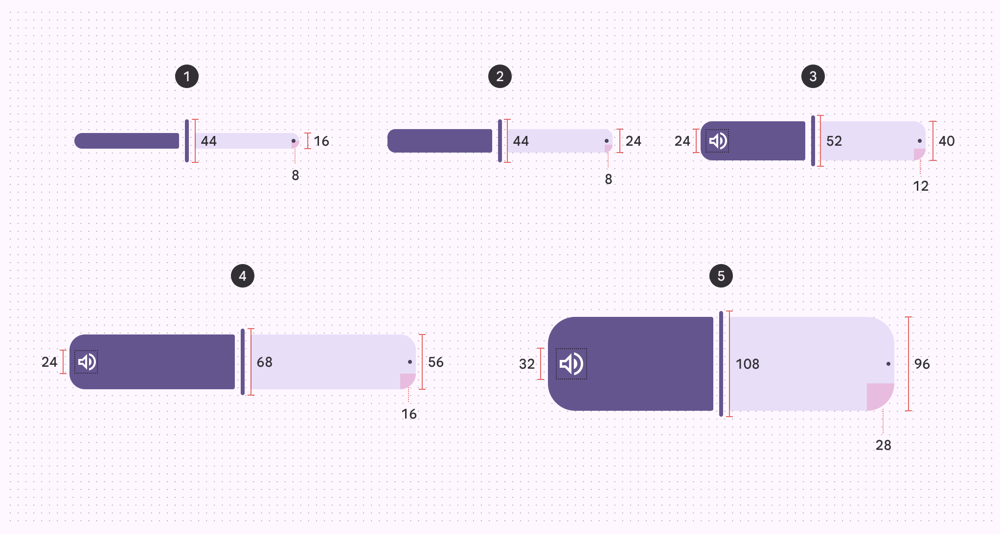

# Sliders

Sliders allow users to make selections from a range of values

## Variants

1. Standard
2. Centered
3. Range

|
Variant

 |

M3

 |

M3 Expressive

 |
| --- | --- | --- |
|

Standard

 |

Available as “continuous” slider

 |

Available

 |
|

Centered

 |

Available (web only)

 |

Available

 |
|

Range

 |

Available

 |

Available

 |
|

Discrete

 |

Available

 |

Available as “stops” configuration

 |

## Configurations

1. Orientation: Horizontal, vertical
2. Size: XS, S, M, L, XL

1. Inset icon
2. Stops
3. Value indicator

|
Category

 |

Configuration

 |

M3

 |

M3 Expressive

 |
| --- | --- | --- | --- |
|

Inset icon

 |

No (default)

 |

Available

 |

Available

 |
|

Yes

 |

\--

 |

Available

 |
|

Orientation

 |

Horizontal (default)

 |

Available

 |

Available

 |
|

Vertical

 |

\--

 |

Available

 |
|

Size

 |

XS (default)

 |

Available

 |

Available

 |
|

S, M, L, XL

 |

\--

 |

Available on Android Views (MDC-Android). Available as tokens on other platforms.\*

 |
|

Stop indicators

 |

No (default), Yes

 |

Available as “discrete” slider

 |

Available

 |
|

Value Indicator

 |

No (default), Yes

 |

Available

 |

Available

 |

> \*Configurations only available using tokens don’t have implemented presets in code. To change the size, swap the default size tokens md.comp.slider.**xsmall**.\[...\] with those of the desired size.

## Tokens & specs

Slider tokens are organized into a common token set, and token sets for each size. Switch token sets from the table’s menu. [Learn more about design tokens](/m3/pages/design-tokens/overview)

Slider

Token

Default, Light

Enabled

Disabled

Hovered

Focused

Pressed (ripple)

## Anatomy

1. Value indicator (optional)
2. Stop indicators (optional)
3. Active track
4. Handle
5. Inactive track
6. Inset icon (optional)

## Color

Slider color roles used for light and dark schemes:

1. Inverse surface
2. Inverse on surface
3. Primary
4. On primary
5. Primary
6. Secondary container
7. On secondary container
8. On secondary container
9. On primary

## States

1. Enabled
2. Disabled
3. Hovered
4. Focused
5. Pressed

## Measurements

Padding and size measurements for common sliders

Padding and size measurements for XS, S, M, L, and XL sliders

| Attribute | XS | S | M
 | L | XL |
| --- | --- | --- | --- | --- | --- |
| Track height | 16dp | 24dp | 40dp | 56dp | 96dp |
| Label container height
 | 44dp |
| Label container width | 48dp |
| Handle height
 | 44dp | 44dp | 52dp | 68dp | 108dp |
| Handle width
 | 4dp |
| Track shape | 8dp | 8dp | 12dp | 16dp | 28dp |
| Inset icon size | \-- | \-- | 24dp | 24dp | 32dp |

