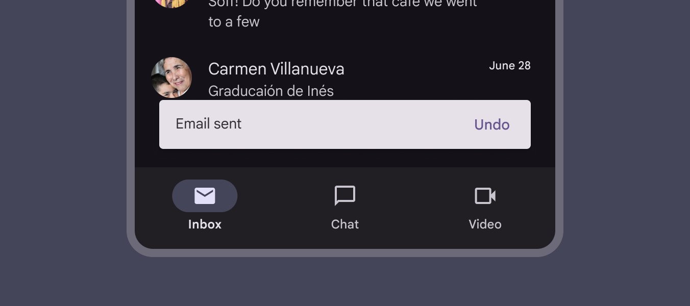
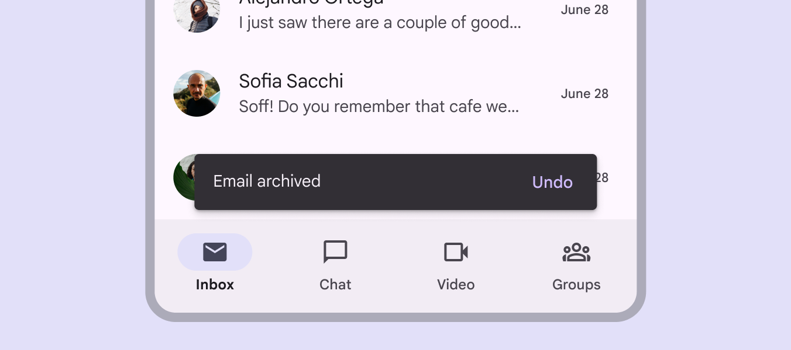
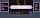

# Snackbar

Snackbars show short updates about app processes at the bottom of the screen

### Use cases

Users should be able to:

- Be alerted, but not disrupted, when a snackbar appears
- Move focus to an actionable snackbar
- Take action on a snackbar using assistive technology

### Interaction & style

Snackbars with actions shouldn't auto-dismiss. This way, users can read and interact with it at their own pace. Snackbars without actions can auto-dismiss after a sufficient amount of time, however this can still present difficulties on web without additional feedback. Each platform has its own requirements for auto-dismiss durations, however common acceptable durations are 4–10 seconds.

Auto-dismissing snackbars should remain on screen long enough to read the information

Snackbars use a color intended to stand out against UI elements. Use the default color mapping to avoid color conflict issues.

Snackbar should visually stand out

### Accessibility requirements on web

On web, auto-dismissing snackbars can be difficult to navigate for people with low vision or who require additional time to perceive information. This information can be made clearer for all users in two ways:

#### 1\. Add inline feedback

Information in auto-dismissing snackbars must also be communicated inline or near the action that triggered the snackbar. For example, update the label on a "Save" button to “Saved”, and trigger an auto-dismissing snackbar that communicates the same message.

#### 2\. Make the snackbar actionable

Alternatively, add actions to the snackbar so it doesn't dismiss until acted on. Actionable snackbars shouldn't auto-dismiss.

Communicate snackbar information near the action that triggered the snackbar

**Note: Material Web doesn't yet include the snackbar component. This guidance still applies to custom-made snackbars.**

### Focus

Snackbars have the following focus requirements:

- When a snackbar appears, announce the message but don't move focus.
- Don't automatically move focus.
- Don't trap focus in the snackbar. Users should be able to freely navigate in and out.
- On web, a shortcut should exist for users to move focus to snackbars with actions (like Alt+G). Ensure that this shortcut is clearly documented, like in a help article. Focus returns from the snackbar (1) to the previously focused element (2)

Focus exits the snackbar differently per platform:

- Ideally, focus should either return to the element that triggered the snackbar, or go to the next most logical element on the page.
- On Android Compose, focus may move to the nearest visible element, or to the first actionable item on the page. If the previously focused element is no longer on the page, focus should move from the snackbar (1) to the next most logical element (2)

### Keyboard navigation

|
Keys

 |

Actions

 |
| --- | --- |
| Tab | Moves focus between interactive elements |
| Esc | Dismisses the snackbar when in focus |

### Labeling elements

Snackbars should be announced once they appear on the screen, but shouldn’t grab focus or prevent people from completing their current task. 

- On Android and web, use a live region with a polite (queued) announcement instead of an assertive announcement.
- On iOS 17+, snackbars use polite announcements by default. If a snackbar appears when the app is launched, it should be announced after the page’s title, but not receive focus. 

Snackbars are announced when they appear, but don't trap focus

