# Snackbar

Snackbars show short updates about app processes at the bottom of the screen

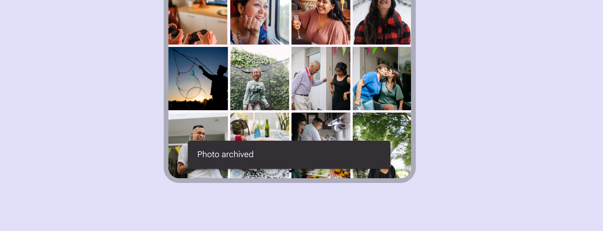

## Usage

Snackbars inform users of a process that an app has performed or will perform. They appear temporarily, towards the bottom of the screen. They shouldn't interrupt the user experience. People can browse the page content without being required to interact with the snackbar.

**Frequency**
Only one snackbar may be displayed at a time.

**Actions**
A snackbar can contain a single action. "Dismiss" or "cancel" actions are optional.

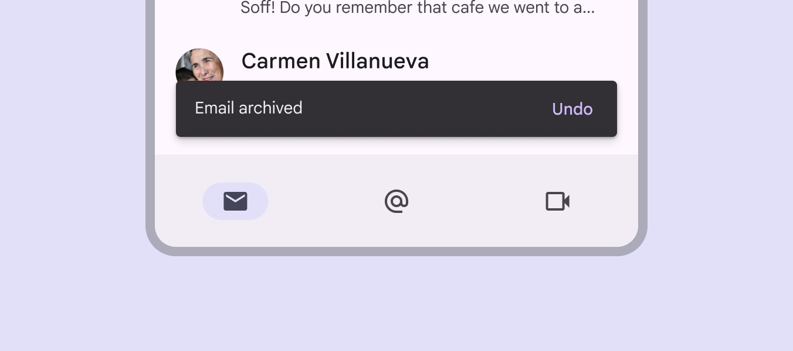

### Similar components

Dialogs [More on dialogs](/m3/pages/dialogs/overview) are also designed to show important messages. Choose the right component based on the importance of the message. This component messaging strategy can help avoid overusing snackbars.

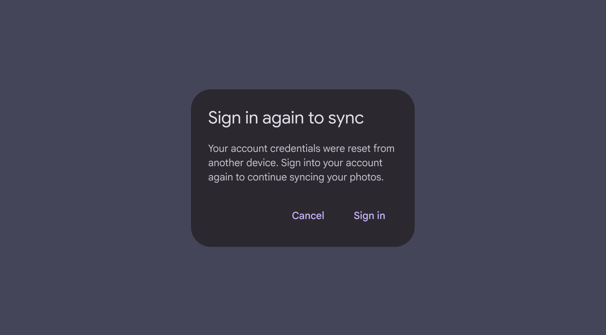

Dialogs require immediate action

**When to use snackbars**
Snackbars communicate messages that are minimally interruptive and don’t require user action.

| Component | Priority | User action |
| --- | --- | --- |
| Snackbar | Low priority | Optional: Snackbars disappear automatically |
| Dialog | High priority | Required: Dialogs block app usage until the user takes a dialog action or exits the dialog (if available) |

### Accessibility requirements for web

On web, auto-dismissing snackbars are inaccessible for people with low vision or who require additional time to perceive information. This can be solved in 2 ways:

#### 1\. Add inline feedback

Information in auto-dismissing snackbars must also be communicated using another accessible method inline or near the action that triggered the snackbar. For example, update the label on a "Save" button [More on buttons](/m3/pages/common-buttons/overview) to “Saved”, and trigger an auto-dismissing snackbar that communicates the same message. 

#### 2\. Make the snackbar actionable

Alternatively, add actions to the snackbar so it doesn't dismiss until acted on.

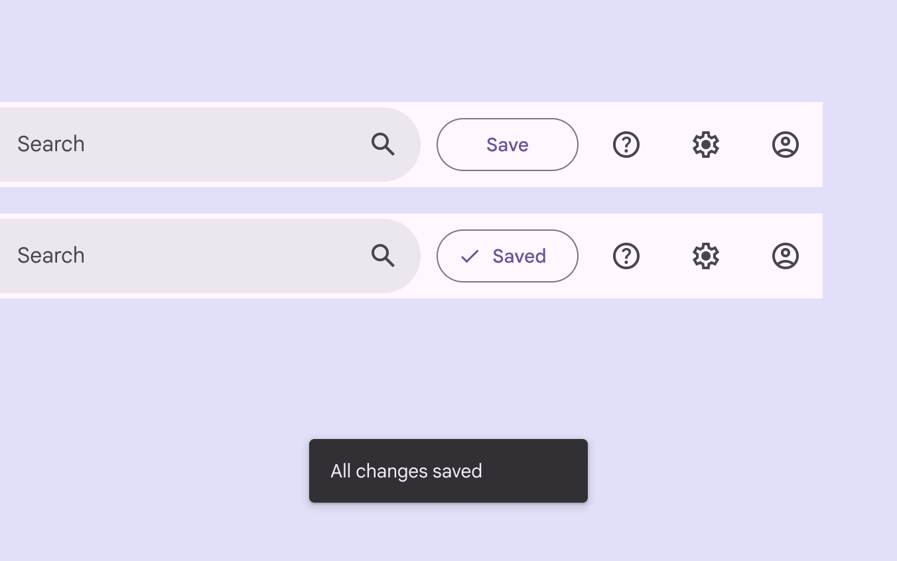

Also communicate snackbar information near the action that triggered the snackbar

## Anatomy

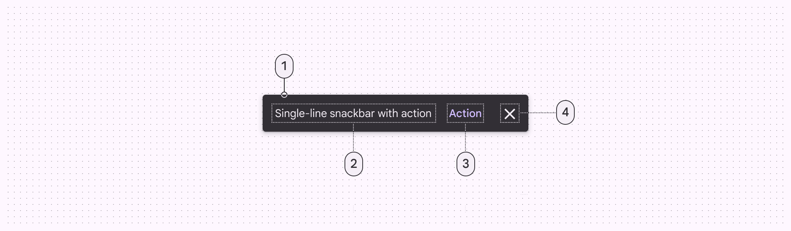

1. Container
2. Supporting text
3. Action (optional)
4. Close button (optional)

### Text label

Snackbars contain a text label that directly relates to the process being performed. In compact window sizes [More on compact window size class](/m3/pages/breakpoints/compact), the text label can contain up to two lines of text.

Text labels are short, clear updates on processes that have been performed

check Do

Keep the snackbar text label to one line long when possible

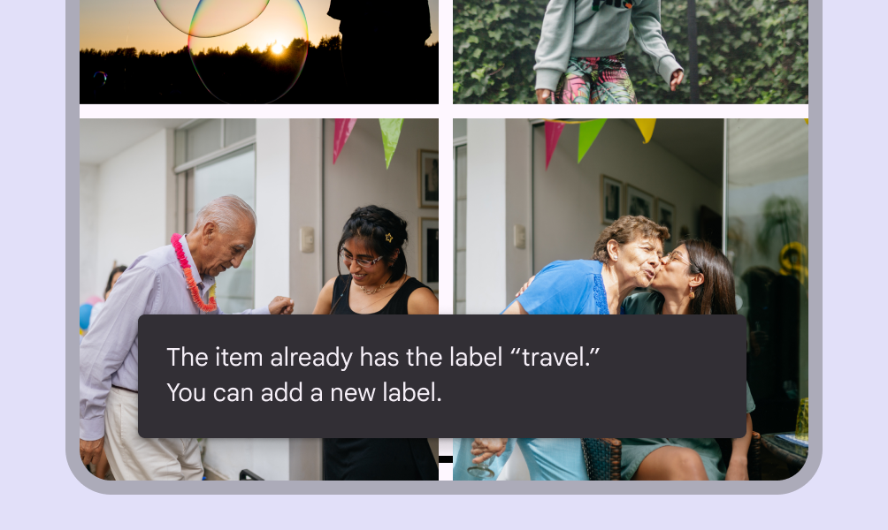

check Do

On mobile, the text label can be up to two lines long

exclamation Caution

Avoid adding icons to snackbars. If your message needs an icon, consider using a different component such as a dialog.

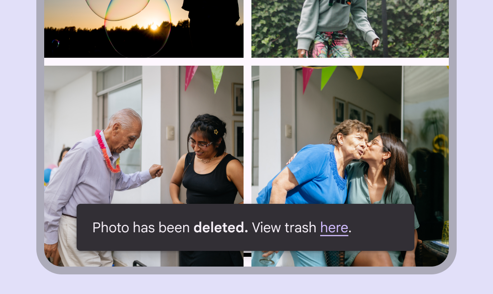

close Don’t

Avoid using stylized text or inline links in snackbars; they can add unwanted complexity. If your message needs a link, add a button instead, or use a different component.

### Container

Snackbars are displayed in rectangular containers with a grey background. Containers should be completely opaque, so that text labels remain legible.

Snackbar containers use a solid background color with a shadow to stand out against content

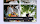

close Don’t

The text label shouldn’t share the same color as the text button

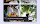

close Don’t

Don’t use a filled or elevated button in a snackbar, as it draws too much attention

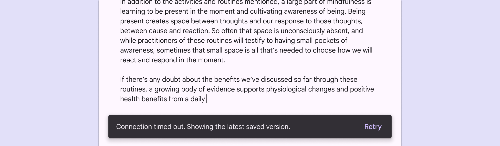

check Do

In wide layouts, extend the container width to accommodate longer text labels

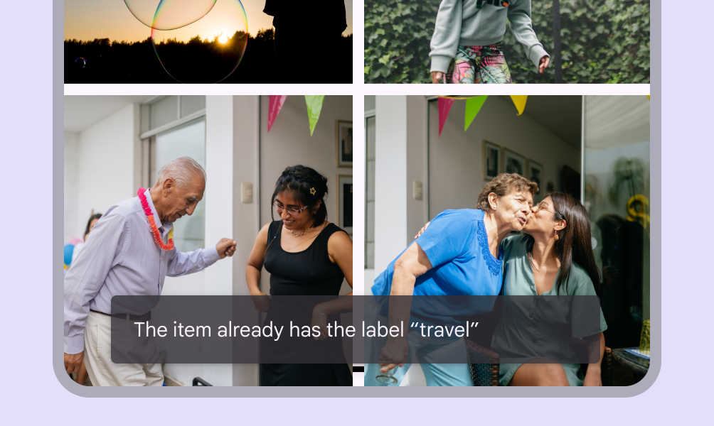

exclamation Caution

An app can apply slight transparency to the container background, as long as text remains clearly legible

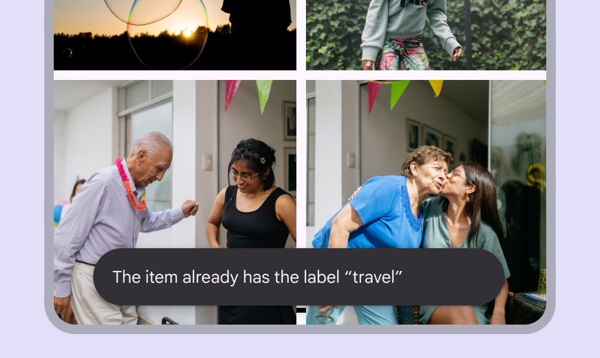

close Don’t

Avoid significantly altering the shape of a snackbar container

### Action

Snackbars can display a single text button that lets users take action on a process performed by the app. Snackbars shouldn’t be the only way to access a core use case, to make an app usable.

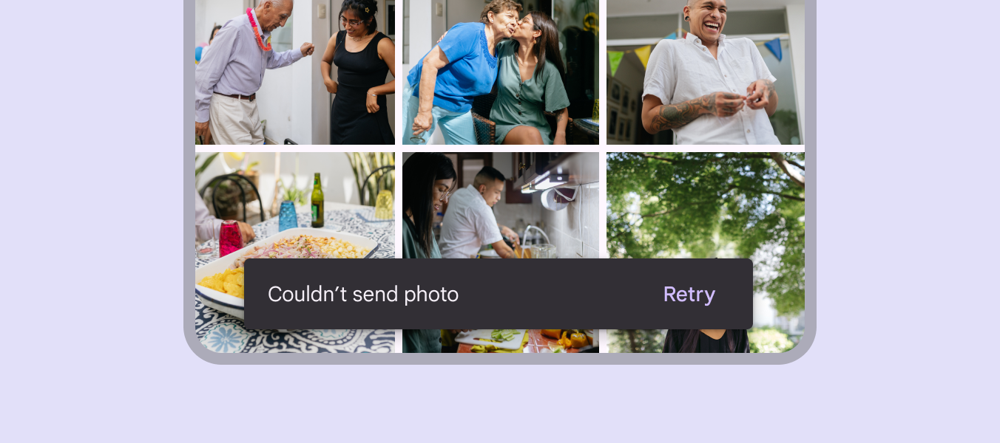

To distinguish the action from the text label, text buttons should display colored text

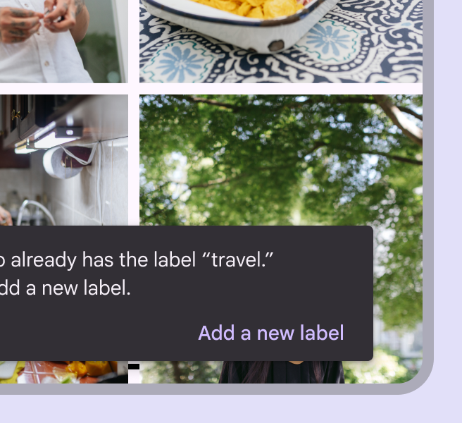

check Do

If an action is long, it can be displayed on a third line

check Do

To allow users to amend choices, display an "Undo" action

exclamation Caution

A dismiss action is unnecessary, as snackbar disappears on their own by default

## Placement

### At the bottom of a UI

Snackbars should be placed at the bottom of a UI, in front of the main content. In some cases, snackbars can be nudged upwards to avoid overlapping with other UI elements near the bottom, such as FABs [More on FABs](/m3/pages/fab/overview) or docked toolbars . Avoid placing a snackbar in front of frequently used touch targets or navigation.

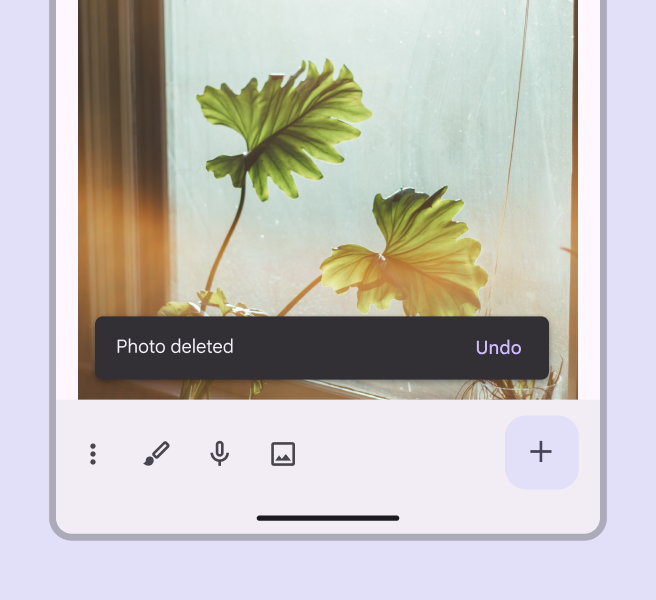

check Do

Place a snackbar in front of the main content

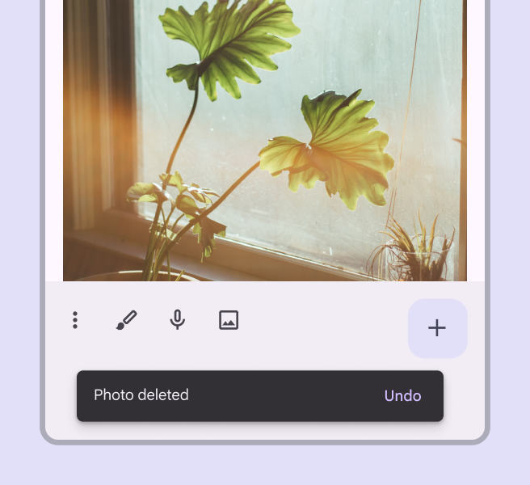

close Don’t

Avoid placing snackbars in front of navigation components

To ensure accessibility for keyboard users on the web, avoid positioning the snackbar in a way that completely obscures actionable elements. Blocking elements makes it difficult to know what is being focused and selected.

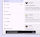

check Do

Adjust the size of the snackbar to avoid blocking elements in focus

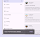

close Don’t

Don’t let the snackbar fully cover elements in focus

Snackbars can span the entire width of the screen only when a UI does not use persistent navigation components like app bars or navigation bars [More on navigation bars](/m3/pages/navigation-bar/overview). Snackbars that span the entire width of a UI can push up FABs [More on FABs](/m3/pages/fab/overview) when they appear.

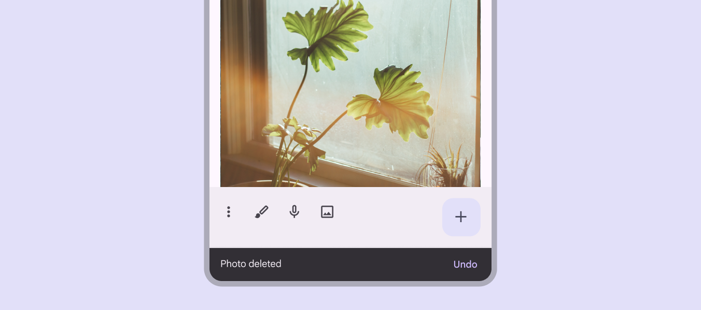

exclamation Caution Snackbars can span the entire width of a UI. However, they should not appear in front of navigation or other important UI elements like floating action buttons.

**Snackbars and floating action buttons (FABs)**

Snackbars should appear above FABs [More on FABs](/m3/pages/fab/overview).

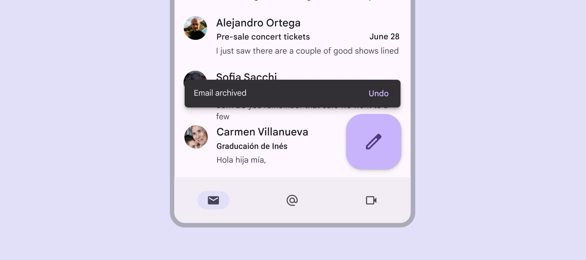

Snackbar above a FAB

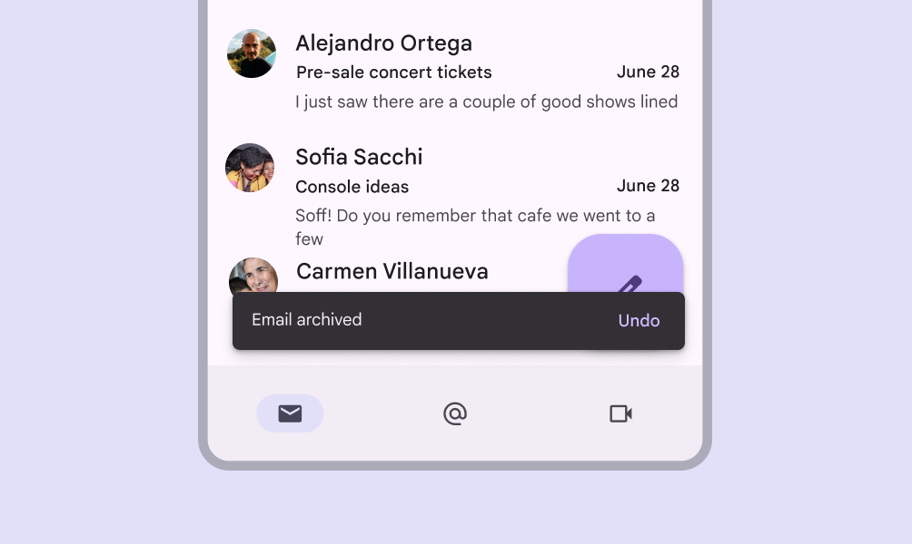

close Don’t

Don’t place a snackbar in front of a FAB

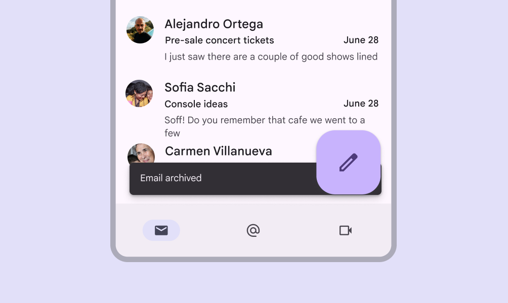

close Don’t

Don’t place a snackbar behind a FAB

## Responsive layout

### Compact window size

In compact window sizes [More on compact window size class](/m3/pages/breakpoints/compact), snackbars should expand vertically from 48dp to 64dp to accommodate one or two lines of text, while maintaining a  fixed distance from the leading, trailing, and bottom edges of the screen.

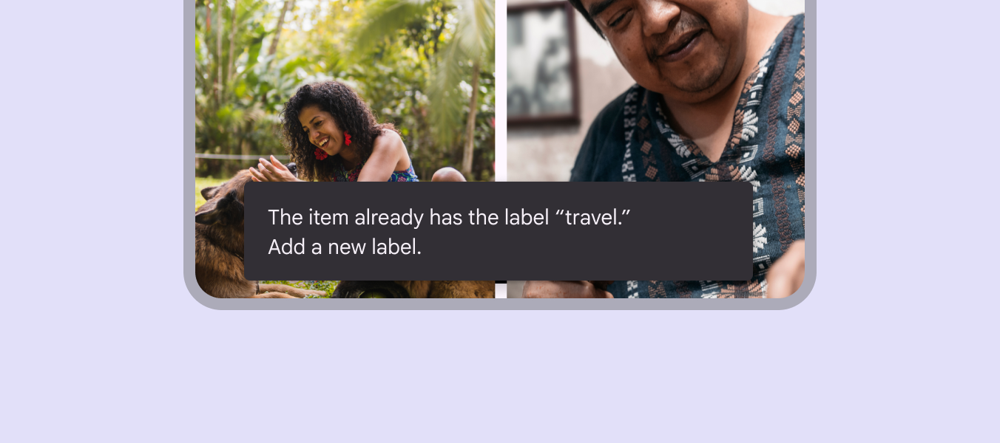

### Medium & expanded window sizes

On medium [More on medium window size class](/m3/pages/breakpoints/medium) and expanded window sizes [More on expanded window size class](/m3/pages/breakpoints/expanded), like tablet and desktop, snackbars should scale horizontally to accommodate longer text strings, keeping in mind that the ideal line length for text is typically between 40-60 characters. Snackbars use a flexible distance from the trailing edge of the screen. Whenever possible, snackbars on medium and large displays should aim for a single line of text with an  optional button [More on buttons](/m3/pages/common-buttons/overview).

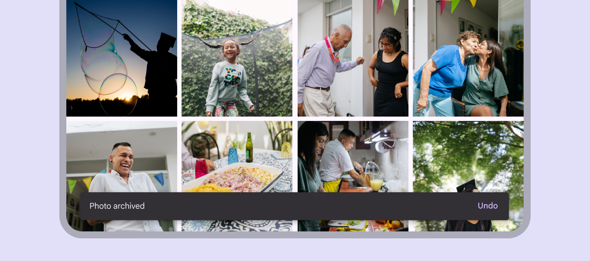

In wider layouts [More on layout](/m3/pages/understanding-layout/overview), snackbars can be left-aligned or center-aligned if they are consistently placed on the same spot at the bottom of the screen.

Left-aligned snackbar

Center-aligned snackbar

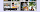

close Don’t

Don’t place snackbars flush to one edge of the layout

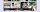

close Don’t

Don’t place consecutive snackbars side by side or next to one another

## Behavior

### Appearing and disappearing

Snackbars appear without warning, but they don’t block users from interacting with page content. Snackbars without actions can auto-dismiss after 4–10 seconds, depending on platform. Avoid using auto-dismissing snackbars on web unless there's also inline feedback. Snackbars with actions should remain on the screen until the user takes an action on the snackbar, or dismisses it.

### Consecutive snackbars

Consecutive snackbars must appear one at a time. Snackbars without actions appear and disappear automatically, while those with actions remain on screen until dismissed. However, a snackbar with updated information can immediately replace an outdated snackbar.

close Don’t

Don’t stack snackbars on top of one another

close Don’t

Don’t animate other components along with snackbar animations, such as the floating action button

