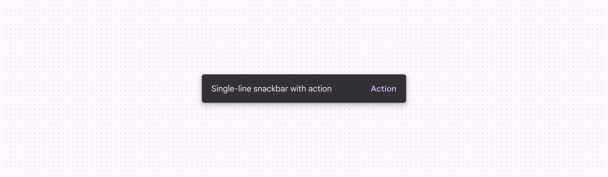

# Snackbar

Snackbars show short updates about app processes at the bottom of the screen

- Snackbars shouldn’t interrupt the user’s experience
- Usually appear at the bottom of the UI
- Can disappear on their own or remain on screen until the user takes action

## Availability & resources

| Type | Resource | Status |
| --- | --- | --- |
| Design | [Design Kit (Figma)](https://www.figma.com/community/file/1035203688168086460) | Available |
| Implementation |  | Available |
| Implementation | [Jetpack Compose](https://developer.android.com/develop/ui/compose/components/snackbar) | Available |
| Implementation |  | Available |

## Differences from M2

- Color: New color mappings and compatibility with dynamic color [More on dynamic color](/m3/pages/dynamic/choosing-a-source)
- Behavior: Clarified that snackbars can either appear temporarily (dismissive) or persist until the user takes an action (non-dismissive)

Snackbars have new color mappings

