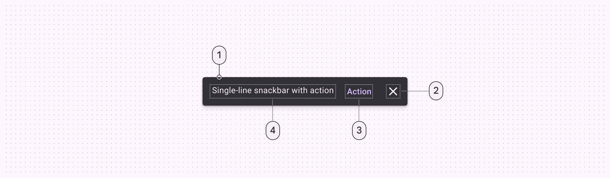
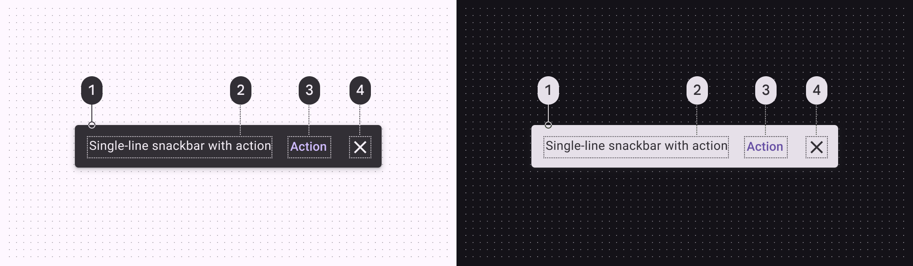
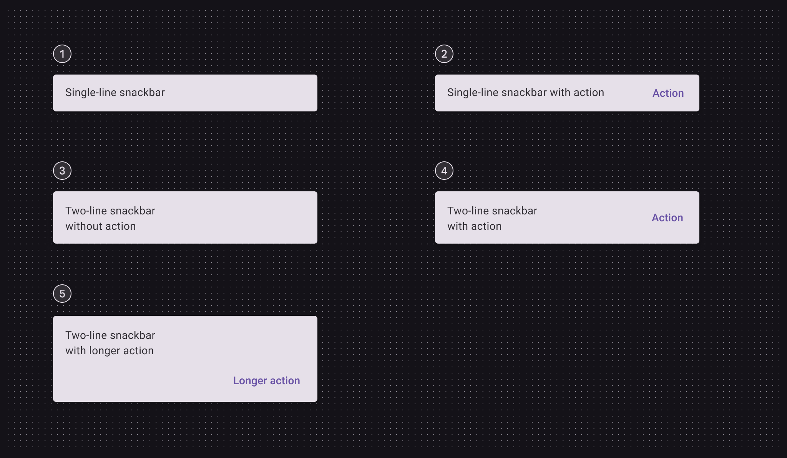

# Snackbar

Snackbars show short updates about app processes at the bottom of the screen

1. Container
2. Icon (optional close affordance)
3. Action (optional)
4. Supporting text

## Tokens and specs

Browse the component elements, attributes, tokens, and their values. [Learn more about design tokens](/m3/pages/design-tokens/overview)

Snackbars

Token

Default, Light

Enabled

Hovered

Focused

Pressed (ripple)

## Color

Color values are implemented through design tokens [More on tokens](/m3/pages/design-tokens/overview). For design, this means working with color values that correspond with tokens. For implementation, a color value will be a token that references a value. [Learn more about design tokens](/m3/pages/design-tokens/overview)

Snackbar color roles used for light and dark schemes:

1. Inverse surface
2. Inverse on surface
3. Inverse primary
4. Inverse on surface

## Measurements

Snackbar padding and size measurements

## Configurations

1. Single line
2. Single line with action
3. Two lines
4. Two lines with action
5. Two lines with longer action

